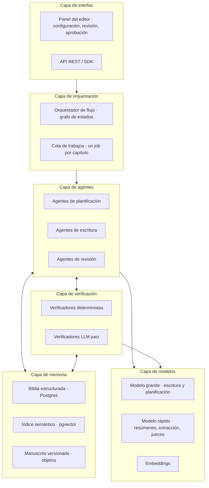
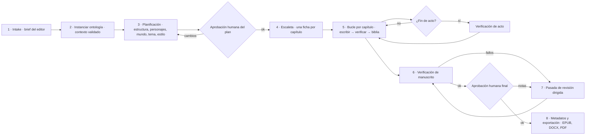
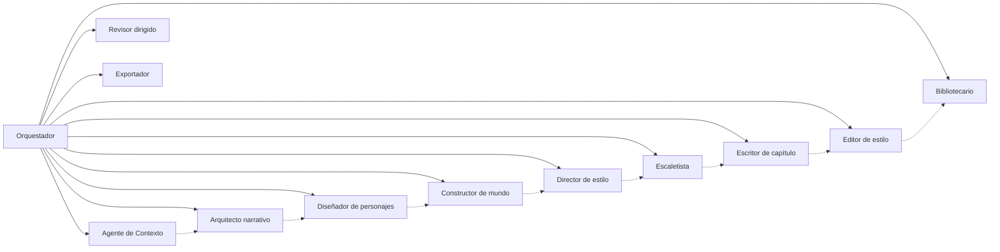
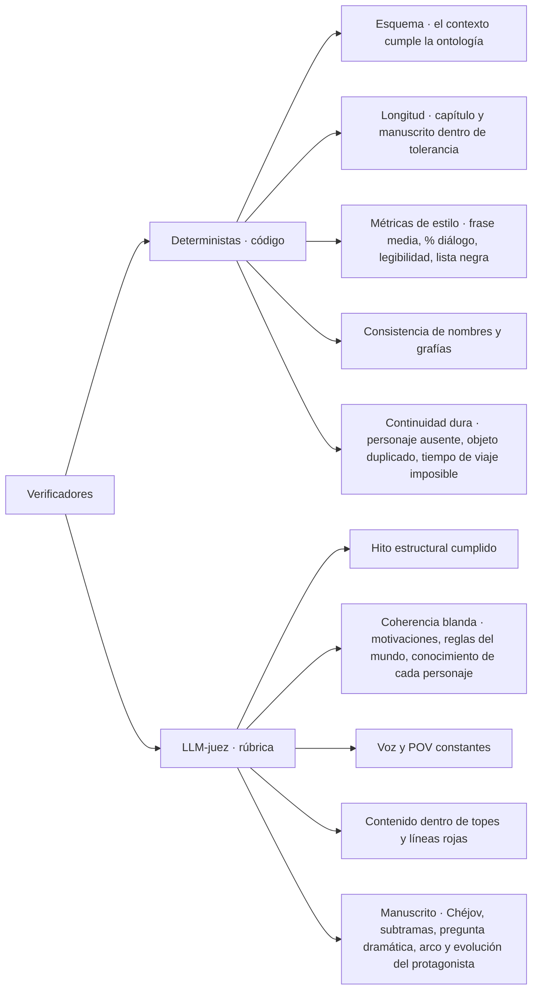
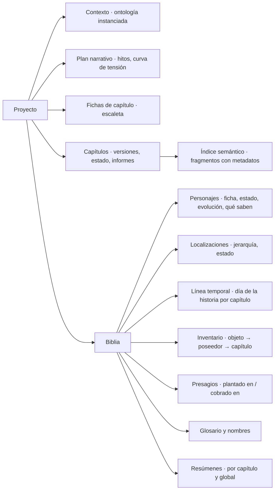
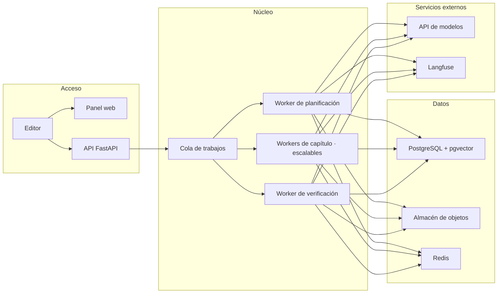
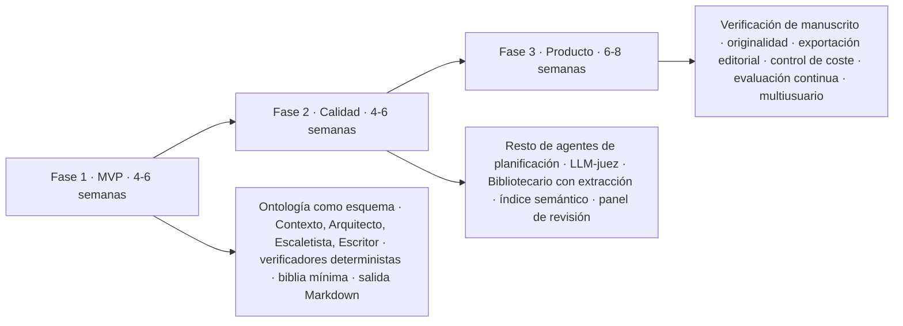

# architecture.md — Arquitectura y flujo del generador

> Propósito: describe cómo el sistema convierte el contexto (`domain-knowledge.md` + `definitions.md`) en un manuscrito: capas, agentes, verificadores, flujo de trabajo, modelo de datos, tecnología y despliegue. Las decisiones tecnológicas son una propuesta de referencia; en cada caso se indica la alternativa razonable.

---

## 1. Visión general por capas

**Idea central:** los agentes proponen, los verificadores disponen y la biblia recuerda. Ningún agente escribe en la biblia directamente; solo el Bibliotecario, y solo después de que un capítulo pase la verificación.

---

## 2. Flujo de extremo a extremo

| Fase | Entrada | Salida | Responsable |
|---|---|---|---|
| Intake | Brief libre del editor (público, género, extensión, ideas) | Brief normalizado | Panel + Agente de Contexto |
| Instanciar ontología | Brief normalizado | Objeto de contexto completo (YAML de `definitions.md`) con valores por defecto heredados | Agente de Contexto + Verificador de Esquema |
| Planificación | Objeto de contexto | Plan narrativo: hitos por capítulo, fichas, mundo y ruta, tema, guía de estilo | Agentes de planificación |
| Escaleta | Plan narrativo | N fichas de capítulo | Escaletista |
| Bucle por capítulo | Ficha + biblia | Capítulo aprobado + biblia actualizada | Escritor, Editor, verificadores, Bibliotecario |
| Verificación de manuscrito | Manuscrito completo + biblia | Informe de fallos globales | Verificadores de manuscrito |
| Revisión dirigida | Informe | Capítulos corregidos | Revisor |
| Exportación | Manuscrito aprobado | Archivos + metadatos | Exportador |

---

## 3. Agentes

| Agente | Responsabilidad | Entrada | Salida | Modelo |
|---|---|---|---|---|
| **Orquestador** | Ejecuta el grafo de estados, reintentos, límites de coste y puntos de aprobación humana. No genera texto. | Estado del proyecto | Transiciones | Código, sin LLM |
| **Agente de Contexto** | Convierte el brief en el objeto de contexto de la ontología, rellena valores por defecto según el pipeline de decisión y pregunta lo que falte. | Brief | Contexto YAML validado | Grande |
| **Arquitecto narrativo** | Elige modelo estructural, reparte hitos por capítulo, define curva de tensión, pregunta dramática y tipo de final. | Contexto | Plan estructural | Grande |
| **Diseñador de personajes** | Crea fichas, arcos, evolución y grafo de relaciones coherentes con los hitos. | Contexto + plan estructural | Fichas y grafo | Grande |
| **Constructor de mundo** | Define tipo de mundo, ruta ligada a los hitos, localizaciones clave, reglas del mundo con costes. | Contexto + plan + fichas | Biblia inicial de mundo | Grande |
| **Director de estilo** | Fija narrador, registro, métricas de prosa, léxico, lista negra y convención onomástica; produce una guía de estilo con ejemplos. | Contexto + fichas | Guía de estilo | Grande |
| **Escaletista** | Produce una ficha por capítulo: hito, escenas y secuelas, POV, localización, tensión objetivo, elementos a plantar y cobrar. | Plan completo | N fichas de capítulo | Grande |
| **Escritor de capítulo** | Redacta el borrador a partir de la ficha, el resumen acumulado y el estado de la biblia. | Ficha + contexto recuperado | Borrador | Grande |
| **Editor de estilo** | Pasada de corrección local: métricas de prosa, repeticiones, lista negra, ritmo. No cambia hechos. | Borrador + guía de estilo | Borrador editado | Rápido |
| **Bibliotecario** | Extrae del capítulo aprobado los hechos nuevos (estado de personajes, objetos, fechas, presagios) y actualiza la biblia y el resumen acumulado. | Capítulo aprobado | Biblia actualizada | Rápido |
| **Revisor dirigido** | Corrige capítulos concretos a partir de un informe de fallos, con cambios mínimos. | Capítulo + informe | Capítulo corregido | Grande |
| **Exportador** | Genera título, sinopsis, palabras clave y los archivos finales. | Manuscrito | EPUB, DOCX, PDF, metadatos | Rápido + código |

---

## 4. Verificadores

Se distinguen dos familias: los **deterministas** (código, baratos, siempre se ejecutan) y los **LLM-juez** (un modelo evalúa con rúbrica, se ejecutan después de los deterministas). Un verificador nunca corrige; devuelve un informe con severidad y localización del fallo.

| Verificador | Momento | Tipo | Severidad si falla | Acción |
|---|---|---|---|---|
| Esquema del contexto | Tras instanciar la ontología | Determinista (JSON Schema) | Bloqueante | Agente de Contexto corrige |
| Longitud | Cada capítulo y al final | Determinista | Media | Editor amplía o recorta |
| Métricas de estilo | Cada capítulo | Determinista | Baja / Media | Editor de estilo |
| Nombres y grafías | Cada capítulo | Determinista contra glosario | Media | Editor de estilo |
| Continuidad dura | Cada capítulo | Determinista contra biblia | Alta | Escritor regenera el pasaje |
| Hito estructural | Cada capítulo | LLM-juez | Alta | Escritor regenera el capítulo |
| Coherencia blanda | Cada capítulo | LLM-juez con biblia como evidencia | Alta | Escritor regenera el pasaje |
| Voz y POV | Cada capítulo | LLM-juez | Media | Editor de estilo |
| Contenido y líneas rojas | Cada capítulo | Clasificador + LLM-juez | Bloqueante | Regeneración obligatoria |
| Verificación de acto | Fin de acto | LLM-juez | Alta | Revisor dirigido |
| Verificación de manuscrito | Final | LLM-juez + deterministas | Alta | Revisor dirigido |
| Originalidad | Final | Búsqueda de similitud contra corpus | Bloqueante | Revisor dirigido |

**Política de reintentos:** máximo 3 ciclos por capítulo; si persiste el fallo, el capítulo pasa a cola de revisión humana con el informe adjunto.

---

## 5. Ciclo de un capítulo

El **Recuperador de contexto** no es un agente creativo: ensambla el prompt a partir de consultas estructuradas a la biblia y de una búsqueda semántica de pasajes anteriores relevantes (por ejemplo, la última vez que apareció un secundario), para que el Escritor no reciba toda la novela sino solo lo pertinente.

---

## 6. Modelo de datos y memoria

| Almacén | Contenido | Tecnología propuesta | Alternativa |
|---|---|---|---|
| Relacional | Proyecto, contexto, plan, fichas, biblia, informes de verificación, costes | PostgreSQL (JSONB para el contexto) | MySQL, SQLite en local |
| Vectorial | Fragmentos de capítulos con metadatos (capítulo, POV, personajes, localización) | pgvector en la misma base | Qdrant, Weaviate |
| Objetos | Versiones de capítulos, exportaciones, prompts y respuestas para auditoría | S3 o compatible (MinIO en local) | Sistema de archivos |
| Caché | Prompts repetidos, embeddings | Redis | Sin caché en fase inicial |

Cada capítulo se guarda con versión, estado (`borrador`, `editado`, `verificado`, `aprobado`, `revision_humana`) y los informes que lo produjeron, de modo que cualquier fallo es trazable hasta el prompt exacto.

---

## 7. Tecnología de referencia

| Componente | Propuesta | Por qué | Alternativa |
|---|---|---|---|
| Lenguaje | Python 3.12 | Ecosistema de IA y validación de esquemas | TypeScript (Node) |
| Orquestación de agentes | LangGraph (grafo de estados con persistencia) | Bucles, reintentos y puntos de pausa humana nativos | Temporal + código propio, CrewAI |
| Modelos | Claude Opus/Sonnet para escritura y planificación; Haiku para resúmenes, extracción y jueces | Calidad de prosa larga y coste escalonado | GPT, Gemini, modelos abiertos vía vLLM |
| Validación de esquema | Pydantic + JSON Schema derivado de la ontología | Contexto y fichas siempre tipados | Zod en TypeScript |
| Métricas de estilo | spaCy (es) + textstat | Frase media, legibilidad, léxico | Código propio |
| Cola de trabajos | Celery + Redis o RQ | Un job por capítulo, paralelismo controlado | Temporal, AWS SQS |
| API | FastAPI | Tipado, documentación automática | Flask, NestJS |
| Panel de editor | Next.js o Streamlit (MVP) | Revisión de plan, diff de capítulos, aprobación | Retool |
| Observabilidad | Langfuse (trazas de prompts, coste, latencia) + OpenTelemetry | Auditar cada decisión de los agentes | LangSmith, Arize |
| Exportación | Pandoc (EPUB, DOCX), WeasyPrint (PDF) | Formatos editoriales estándar | python-docx, ebooklib |
| Despliegue | Docker Compose en desarrollo; Kubernetes o ECS en producción | Aislar workers de agentes por coste | Serverless para API + workers en cola |

---

## 8. Despliegue

---

## 9. Transversales

| Aspecto | Decisión |
|---|---|
| **Human-in-the-loop** | Dos puntos obligatorios (plan y manuscrito final) y uno condicional (capítulo que agota reintentos). El panel muestra diff y el informe que motivó la pausa. |
| **Control de coste** | Presupuesto por proyecto en tokens; el orquestador degrada a modelo rápido en editores y jueces si se supera el 80 %; alerta al 100 %. Estimación previa: novela estándar ≈ 30 capítulos × (1 escritura + 1,5 regeneraciones medias + edición + jueces). |
| **Paralelismo** | Planificación secuencial; capítulos secuenciales por defecto (dependen de la biblia). Paralelizable solo en estructuras corales con líneas independientes hasta su convergencia. |
| **Determinismo y reproducibilidad** | Semilla, versión de prompt, versión de modelo y contexto exacto guardados por capítulo. |
| **Seguridad y privacidad** | Sin datos personales en el brief; secretos en gestor de credenciales; prompts y salidas cifrados en reposo; retención configurable. |
| **Evaluación continua** | Conjunto de briefs de prueba; se mide tasa de aprobación al primer intento, fallos por tipo de verificador, coste por capítulo y valoración humana ciega de calidad. |
| **Versionado de la ontología** | La ontología tiene versión semántica; cada proyecto fija la suya y las migraciones se validan con el verificador de esquema. |

---

## 10. Plan de construcción por fases

