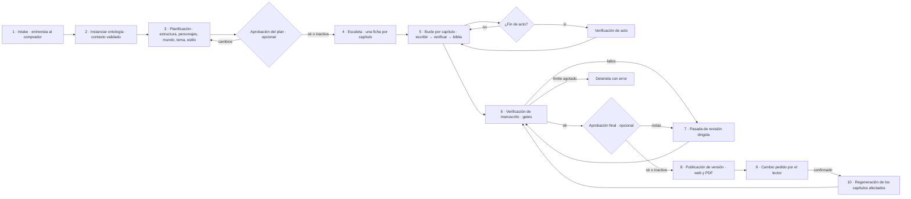
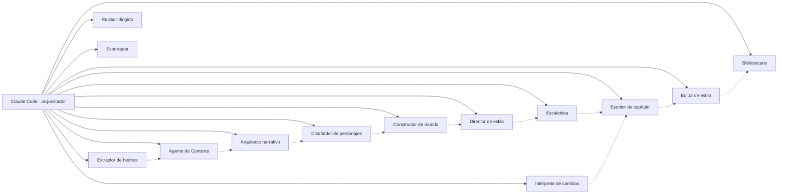
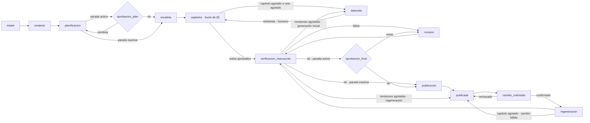
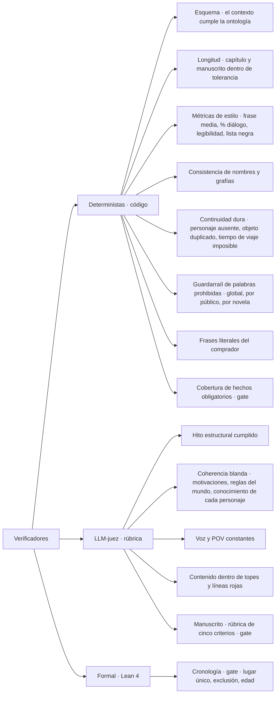
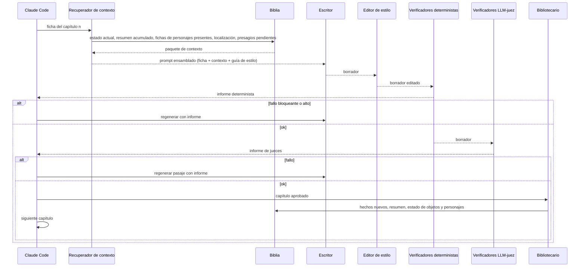
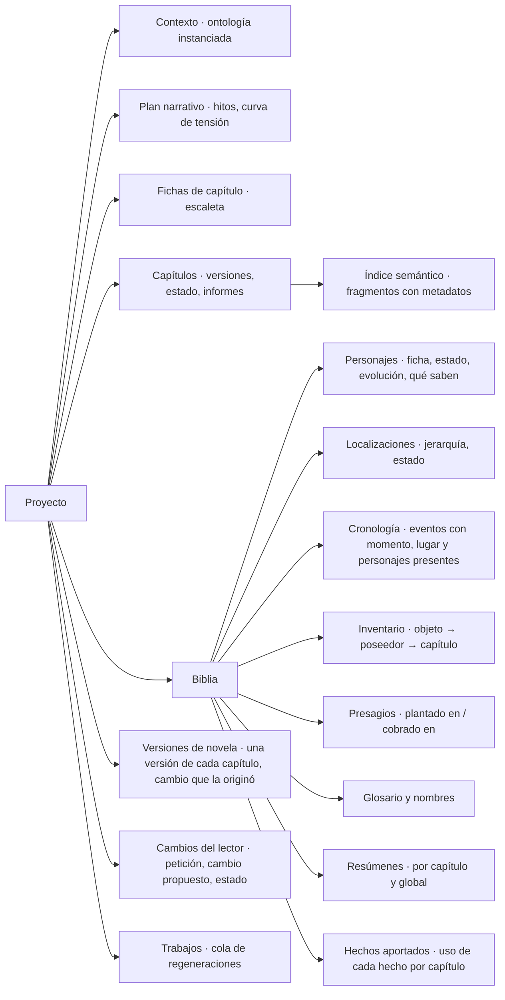
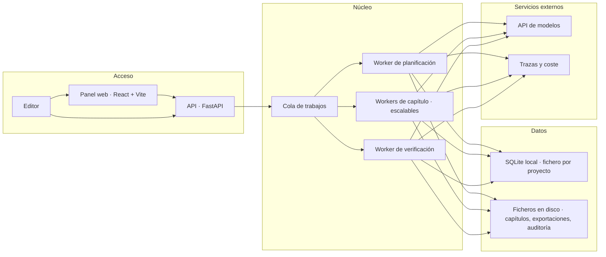
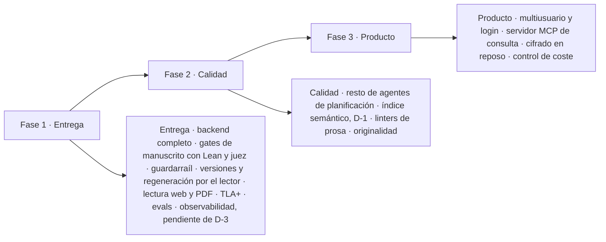

# architecture.md — Arquitectura y flujo del generador

> Propósito: describe cómo el sistema convierte el contexto (`domain-knowledge.md` + `definitions.md`) en un manuscrito: capas, agentes, verificadores, flujo de trabajo, modelo de datos, organización del código y despliegue. El documento describe **qué** hace cada pieza, no con qué se implementa: la pila está sin decidir salvo lo recogido en §7.

---

## 1. Visión general por capas


**Quién orquesta:** una sesión de Claude Code, no código propio. Recorre el grafo de estados como protocolo escrito, lanza cada agente como subagente y aplica la política de reintentos. El backend se queda con todo lo que no consume modelo: verificadores deterministas, persistencia, índice y exportación.

**El texto libre no viaja.** La anécdota o carta que pega el comprador solo la lee el Extractor de hechos. Ningún otro agente la recibe en crudo: el resto trabaja con los hechos validados y confirmados por el comprador.

**Idea central:** los agentes proponen, los verificadores disponen y la biblia recuerda. Ningún agente escribe en la biblia directamente; solo el Bibliotecario, y solo después de que un capítulo pase la verificación.

---

## 2. Flujo de extremo a extremo



| Fase | Entrada | Salida | Responsable |
|---|---|---|---|
| Intake | Respuestas de la entrevista y texto libre del comprador | Brief normalizado, con los hechos extraídos ya confirmados | Panel + Agente de Contexto + Extractor de hechos |
| Instanciar ontología | Brief normalizado | Objeto de contexto completo (YAML de `definitions.md`) con valores por defecto heredados | Agente de Contexto + Verificador de Esquema |
| Planificación | Objeto de contexto | Plan narrativo: hitos por capítulo, fichas, mundo y ruta, tema, guía de estilo | Agentes de planificación |
| Escaleta | Plan narrativo | 10 fichas de capítulo | Escaletista |
| Bucle por capítulo | Ficha + biblia | Capítulo aprobado + biblia actualizada | Escritor, Editor, verificadores, Bibliotecario |
| Verificación de manuscrito | Manuscrito completo + biblia | Informe de los gates: cobertura, cronología formal, juez | Verificadores de manuscrito |
| Revisión dirigida | Informe | Capítulos corregidos | Revisor |
| Publicación | Manuscrito verificado | Versión de novela nueva, lectura web y PDF | Exportador + código |
| Cambio del lector | Fragmento seleccionado + petición en texto libre | Cambio de un hecho, confirmado por el comprador | Panel + Intérprete de cambios |
| Regeneración | Cambio confirmado | Nuevas versiones de los capítulos que usan el hecho | Escritor, Editor, verificadores, Bibliotecario |

---

## 3. Agentes y orquestación

Cada agente de esta tabla es un **subagente de Claude Code**, con su propio contexto y el modelo de la columna *Modelo*, que es el valor del campo `model` de su definición (§8). El reparto sigue lo que produce cada agente: `opus` para la prosa, que es el producto; `sonnet` para planificar, extraer, juzgar y corregir estilo; `haiku` solo donde la salida es corta y la valida un esquema cerrado. Los jueces de §4 son también subagentes (`juez-capitulo` y `juez-manuscrito`, en `sonnet`): un juez más débil que el escritor no detecta lo que tiene que detectar.



| Agente | Responsabilidad | Entrada | Salida | Modelo |
|---|---|---|---|---|
| **Claude Code · orquestador** | Recorre el grafo de estados como protocolo, lanza los subagentes, aplica la política de reintentos y para en los puntos de aprobación humana. No genera prosa de la novela. | Estado del proyecto | Transiciones e invocaciones de subagente | Sesión de Claude Code |
| **Agente de Contexto** | Convierte el brief en el objeto de contexto de la ontología, rellena valores por defecto según el pipeline de decisión y pregunta lo que falte. | Brief | Contexto YAML validado | `sonnet` |
| **Extractor de hechos** | Lee el texto libre del comprador —contenido no confiable— y devuelve solo hechos en el esquema cerrado de `definitions.md` §9. **Sin herramientas**: no tiene acceso MCP ni nada que ejecutar, así que una instrucción inyectada en el texto no tiene efecto fuera de su salida, y una salida fuera del esquema falla la validación. Descarta los datos excluidos (§10). | Texto libre | Hechos propuestos, pendientes de confirmación | `haiku` |
| **Arquitecto narrativo** | Elige modelo estructural, reparte hitos por capítulo, define curva de tensión, pregunta dramática y tipo de final. | Contexto | Plan estructural | `sonnet` |
| **Diseñador de personajes** | Crea fichas, arcos, evolución y grafo de relaciones coherentes con los hitos. | Contexto + plan estructural | Fichas y grafo | `sonnet` |
| **Constructor de mundo** | Define tipo de mundo, ruta ligada a los hitos, localizaciones clave, reglas del mundo con costes. | Contexto + plan + fichas | Biblia inicial de mundo | `sonnet` |
| **Director de estilo** | Fija narrador, registro, métricas de prosa, léxico, lista negra y convención onomástica; produce una guía de estilo con ejemplos. | Contexto + fichas | Guía de estilo | `sonnet` |
| **Escaletista** | Produce una ficha por capítulo: hito, escenas y secuelas, POV, localización, tensión objetivo, elementos a plantar y cobrar. | Plan completo | 10 fichas de capítulo | `sonnet` |
| **Escritor de capítulo** | Redacta el borrador a partir de la ficha, el resumen acumulado y el estado de la biblia. | Ficha + contexto recuperado | Borrador | `opus` |
| **Editor de estilo** | Pasada de corrección local: métricas de prosa, repeticiones, lista negra, ritmo. No cambia hechos. | Borrador + guía de estilo | Borrador editado | `sonnet` |
| **Bibliotecario** | Extrae del capítulo aprobado los hechos nuevos (estado de personajes, objetos, fechas, presagios) y actualiza la biblia y el resumen acumulado. | Capítulo aprobado | Biblia actualizada | `sonnet` |
| **Revisor dirigido** | Corrige capítulos concretos a partir de un informe de fallos, con cambios mínimos. | Capítulo + informe | Capítulo corregido | `opus` |
| **Exportador** | Genera título, sinopsis y palabras clave; el código genera la lectura web y el PDF de la versión. | Manuscrito verificado | Metadatos, lectura web, PDF | `haiku` + código |
| **Intérprete de cambios** | Traduce la petición del lector («el perro se llama Nala») a un cambio sobre un hecho de la biblia, o a un hecho nuevo con el capítulo del fragmento como destino. Mismo patrón que el Extractor: **sin herramientas**, salida en esquema cerrado, y el texto del lector es **no confiable**. | Fragmento + petición + hechos vigentes | Cambio de hecho propuesto, pendiente de confirmación | `haiku` |

El **Recuperador de contexto** de §5 no está en esta tabla a propósito: no es un agente. Es código del backend y no consume modelo. Su sitio es §6.3.

### 3.1 El grafo de estados

La sesión de Claude Code no guarda el estado en su propia ventana. El estado del proyecto es una fila en SQLite y la sesión es un **ejecutor sin memoria propia**: lee dónde está, lanza un subagente, escribe el resultado y vuelve a leer. Un fin de ventana de contexto, un portátil cerrado y una pausa de tres días esperando una aprobación son el mismo caso, y reanudar es siempre lo mismo: leer la fila y seguir.

Esto es lo que convierte «el grafo de estados» de metáfora en tabla. Hay dos máquinas anidadas: la del **proyecto**, que recorre las fases de §2, y la del **capítulo**, que es el bucle de §5 y cuyos estados ya estaban definidos en §6 (`borrador`, `editado`, `verificado`, `aprobado`, `revision_humana`).



| Estado | Subagente que se lanza | Sale cuando | Quién decide la salida |
|---|---|---|---|
| `intake` | Agente de Contexto; Extractor de hechos si hay texto libre | El brief normalizado está completo y el comprador ha confirmado los hechos extraídos | El agente, o el comprador si falta un dato |
| `contexto` | Agente de Contexto | El Verificador de Esquema da verde | Verificador determinista |
| `planificacion` | Arquitecto, Personajes, Mundo, Estilo (secuenciales) | Existe plan estructural, fichas, biblia de mundo y guía de estilo | Los cuatro agentes, en orden |
| `aprobacion_plan` | Ninguno | El comprador aprueba o pide cambios. Solo se entra si la parada está activa en el proyecto | **Humano** |
| `escaleta` | Escaletista | Hay 10 fichas de capítulo | El agente |
| `capitulos` | Bucle de §5, capítulo a capítulo | Los 10 están en `aprobado` → `verificacion_manuscrito`; alguno en `revision_humana` al acabar el bucle, o el guardarraíl agotado → `detenida` | Verificadores |
| `verificacion_manuscrito` | Verificadores de manuscrito (gates de §4) | Los tres gates en verde; o revisiones agotadas | Verificadores |
| `revision` | Revisor dirigido | Los capítulos del informe están corregidos | El agente; vuelve siempre a verificar |
| `aprobacion_final` | Ninguno | El comprador aprueba o deja notas. Solo se entra si la parada está activa | **Humano** |
| `publicacion` | Exportador | Existe la versión de novela nueva, con su lectura web y su PDF en disco | Código |
| `publicada` | Ninguno | El lector pide un cambio | **Humano** |
| `cambio_solicitado` | Intérprete de cambios | El comprador confirma o rechaza el cambio propuesto | **Humano** |
| `regeneracion` | Bucle de §5 sobre los capítulos afectados | Todos aprobados → `verificacion_manuscrito`; alguno agotado → `publicada`, con el cambio marcado como fallido | Verificadores |
| `detenida` | Ninguno | El comprador pide reintentar, lo que reabre los capítulos en `revision_humana` con su contador a cero | **Humano** |

### 3.2 Reintentos, fallos y reanudación

El contador de intentos **no vive en la cabeza del orquestador**, vive en la fila del capítulo. Es la única forma de que el tope de 3 ciclos de §4 siga significando algo después de que la sesión se reinicie: una sesión nueva lee `intentos = 2` y sabe que le queda uno, en vez de empezar a contar desde cero y regenerar el mismo capítulo nueve veces.

Cada transición se escribe **antes** de lanzar el siguiente subagente. Si la sesión muere a mitad, lo que se pierde es como mucho el trabajo de un subagente, nunca la posición en el grafo.

Eso obliga a que cada paso sea **repetible sin daño**: las escrituras van claveadas por `(capítulo, versión, intento)`, de modo que relanzar un paso que ya se había completado produce la misma fila en vez de una duplicada. Un capítulo que agota los tres intentos no se reintenta más: pasa a `revision_humana` con los informes adjuntos y el bucle sigue con el siguiente, porque así la ejecución deja informado todo lo que falla y no solo lo primero. Pero **una versión no se publica con un capítulo en `revision_humana`**: al acabar el bucle, el proyecto pasa a `detenida`. La excepción es el guardarraíl de palabras prohibidas (§4.3), que detiene la generación en cuanto se agota, sin esperar al final del bucle.

**La revisión de manuscrito también tiene tope**: 3 ciclos entre `verificacion_manuscrito` y `revision`. Sin él, un gate que el Revisor no consigue satisfacer daría un bucle infinito. Agotado el tope, una generación inicial pasa a `detenida`, y una regeneración vuelve a `publicada` con la versión anterior vigente y el cambio marcado como fallido.

**Regenerar no es empezar de cero.** Los capítulos afectados por un cambio se rehacen en orden ascendente, cada uno con las versiones más recientes de los anteriores como contexto, y después pasan todos los gates sobre la novela entera. Si un gate falla en un capítulo que no se había tocado, el Revisor lo corrige y cuenta como cambiado en la versión nueva.

**Una invocación es un intento.** Un reintento no es decirle «vuelve a intentarlo» al mismo subagente que ya está abierto: es una invocación nueva, con el prompt reensamblado por el Recuperador y el informe del intento anterior como un bloque más. El atajo contrario es tentador —el subagente ya tiene el contexto cargado— y tiene dos costes. El primero es que los borradores descartados pasan a contar como entrada en el turno siguiente, así que el prompt real deja de parecerse a lo que describe §6.3. El segundo es peor: el intento deja de ser una unidad con estado propio, y `(capítulo, versión, intento)` pierde el sentido justo cuando hace falta, que es al reanudar.

Esto es **protocolo, no algo que el backend pueda imponer**. El backend clavea las escrituras por intento y cuenta hasta tres, pero no puede saber si dos intentos salieron de una invocación o de dos. Es la misma clase de riesgo que ya está declarado sobre el comportamiento del orquestador.

### 3.3 Lo que el orquestador no hace

Tres cosas, y conviene que estén escritas porque las tres son tentadoras cuando quien orquesta es un modelo:

- **No escribe prosa de la novela.** Ni un párrafo de relleno, ni un arreglo rápido de una frase que el Editor dejó torcida. Si hace falta texto, se lanza el agente que corresponde.
- **No escribe en la biblia.** Solo el Bibliotecario, y solo tras la verificación. La regla no depende de la buena voluntad del orquestador: la superficie de escritura se declara solo en la definición del Bibliotecario, así que la sesión principal no la ve, y el hook de policy la deniega a cualquier otro llamante (§7, §8).
- **No se salta una parada humana activa.** Las paradas `aprobacion_plan` y `aprobacion_final` son configurables por proyecto y están desactivadas por defecto: para un regalo, el punto de control natural del comprador es leer y pedir cambios. Cuando están activas, no tienen transición automática de salida, ni siquiera con todos los verificadores en verde. `publicada`, `cambio_solicitado` y `detenida` tampoco salen sin acción humana.

---

### 3.4 La especificación TLA+ del grafo

El grafo de §3.1 se especifica en TLA+ y se verifica con TLC en desarrollo (§7). Cada acción de la especificación es una fila de la tabla de transiciones; la correspondencia acción → transición del código se documenta junto a la especificación.

Modelo pequeño: 5 capítulos, 2 intentos por capítulo, 2 ciclos de revisión, 1 cambio del lector y caídas de la sesión en cualquier estado seguidas de reanudación.

Invariantes de seguridad:

1. **Nunca se publica una versión con un capítulo que no ha pasado todos los validadores.**
2. **La reanudación desde checkpoint no duplica ni pierde capítulos**: tras una caída, cada capítulo tiene exactamente una versión vigente dentro de la versión de novela en curso.
3. **La versión anterior se conserva siempre tras una regeneración**: publicar la N+1 no modifica la N.
4. **Los reintentos nunca superan el límite**: ni los intentos por capítulo ni los ciclos de revisión.
5. **Una parada humana activa no se sale sin acción humana.**

Liveness: **toda generación termina en `publicada` o en `detenida`**, y todo cambio confirmado termina en una versión nueva o en un cambio fallido. Se verifica con equidad débil sobre las acciones del sistema, y suponiendo que el humano acaba respondiendo en las paradas activas; «reintentar» desde `detenida` se acota en el modelo con una constante, porque es un humano quien lo decide.

## 4. Verificadores

Se distinguen dos familias: los **deterministas** (código, baratos, siempre se ejecutan) y los **LLM-juez** (un modelo evalúa con rúbrica, se ejecutan después de los deterministas). Un verificador nunca corrige; devuelve un informe con severidad y localización del fallo.



| Verificador | Momento | Tipo | Severidad si falla | Acción |
|---|---|---|---|---|
| Esquema del contexto | Tras instanciar la ontología | Determinista (JSON Schema) | Bloqueante | Agente de Contexto corrige |
| Longitud | Cada capítulo y al final | Determinista | Media | Editor amplía o recorta |
| Métricas de estilo | Cada capítulo | Determinista | Baja / Media | Editor de estilo |
| Nombres y grafías | Cada capítulo | Determinista contra glosario | Media | Editor de estilo |
| Continuidad dura | Cada capítulo | Determinista contra biblia | Alta | Escritor regenera el pasaje |
| Hito estructural | Cada capítulo | LLM-juez | Alta | Escritor regenera el capítulo |
| Coherencia blanda | Cada capítulo | LLM-juez con biblia como evidencia | Alta | Escritor regenera el pasaje |
| Voz y POV | Cada capítulo | LLM-juez | Media | Editor de estilo |
| Contenido y líneas rojas | Cada capítulo | Clasificador + LLM-juez | Bloqueante | Regeneración obligatoria |
| Palabras prohibidas (§4.3) | Cada capítulo | Determinista contra las tres listas | Bloqueante | Escritor reescribe; consume el contador de intentos |
| Frases literales | Cada capítulo cuya ficha usa un hecho `frase` | Determinista | Alta | Escritor regenera el pasaje |
| Cobertura de hechos | Gate de manuscrito | Determinista contra el uso de cada hecho | Bloqueante | Revisor dirigido |
| Cronología formal (§4.2) | Gate de manuscrito | Formal · Lean 4 | Bloqueante | Revisor dirigido, con los eventos implicados |
| Verificación de acto | Fin de acto | LLM-juez | Alta | Revisor dirigido |
| Verificación de manuscrito | Gate de manuscrito | LLM-juez con rúbrica (§4.1) + deterministas | Bloqueante | Revisor dirigido |
| Originalidad | Final | Búsqueda de similitud contra corpus | Bloqueante | Revisor dirigido |

**Política de reintentos:** máximo 3 ciclos por capítulo; si persiste el fallo, el capítulo pasa a cola de revisión humana con el informe adjunto. **Excepción: el guardarraíl de palabras prohibidas.** Si agota los intentos, la generación se detiene y se informa, porque un capítulo con un veto del comprador no puede quedar en la novela ni siquiera marcado.

**Gate de manuscrito.** Cobertura, cronología formal y juez de manuscrito se ejecutan sobre la novela completa, en `verificacion_manuscrito`. Ninguna versión se publica sin pasar los tres.

### 4.1 Rúbrica del juez de manuscrito

Cinco criterios, cada uno con una puntuación de 1 a 5 y una justificación: **continuidad** entre capítulos, **coherencia de personajes**, **arco y ritmo**, **tono** adecuado a la ocasión y al lector, y **personalización integrada** con naturalidad, no forzada. Pasa con ≥3 en todos y media ≥3,5. Los dos objetivos del producto pesan lo mismo: una novela con todos los hechos y mala prosa suspende, y una novela bien escrita en la que el destinatario no se reconoce, también.

La **revisión humana** de al menos una novela usa exactamente esta rúbrica, para comparar el criterio humano con el del juez.

### 4.2 Verificación formal de la cronología

A partir de la biblia se genera, por novela, un fichero Lean con los eventos (momento, lugar, personajes presentes, si excluye a alguno por muerte o partida) y las fechas de nacimiento. Sobre esa cronología concreta se comprueban tres invariantes con `decide`:

1. Un personaje no está en dos lugares en el mismo momento.
2. Nadie aparece después de un evento que lo excluye.
3. La edad de un personaje en cada evento fechado cuadra con su fecha de nacimiento.

Las invariantes viven en un proyecto Lake del repositorio; el fichero de hechos de cada novela se escribe en su directorio de proyecto, como el resto de ficheros (§6). Se ejecuta como gate y no por capítulo: las invariantes 1 y 2 ya las cubre Continuidad dura en cada capítulo, así que el gate formal es donde se ve qué atrapa Lean que los demás no atrapan —la 3 sobre todo, y cualquier incoherencia que se cuele entre capítulos—.

### 4.3 Guardarraíl de palabras prohibidas

Tres listas en SQLite: **global** (insultos y términos ofensivos), **por público** (lista adicional para infantil) y **por novela** (los vetos del comprador, `definitions.md` §9). Antes de comparar se normaliza el texto: minúsculas, sin acentos, plurales simples (-s, -es) y variantes sencillas, con código propio y sin dependencias. Cada coincidencia queda en el audit log. Las muletillas de estilo de la guía de estilo son otra cosa y siguen en Métricas de estilo, con severidad baja.

---

## 5. Ciclo de un capítulo



El **Recuperador de contexto** no es un agente creativo ni un agente en absoluto: es código del backend que ensambla el prompt con dos mecanismos de contrato distinto —recuperación estructurada sobre la biblia y recuperación por similitud sobre los capítulos anteriores (por ejemplo, la última vez que apareció un secundario)—, para que el Escritor no reciba toda la novela sino solo lo pertinente. Los dos contratos, el reparto del presupuesto de 100.000 tokens y qué se recorta cuando no cabe están en §6.3.

---

## 6. Modelo de datos y memoria



| Almacén | Contenido | Tecnología |
|---|---|---|
| Relacional | Proyecto, contexto, plan, fichas, biblia, informes de verificación, costes | **SQLite local**, un fichero por proyecto |
| Vectorial | Fragmentos de capítulos con metadatos (capítulo, POV, personajes, localización) | **SQLite local**, misma base. Lo que guarda —índice FTS5 o vectores— depende de D-1, sin decidir |
| Objetos | Versiones de capítulos, exportaciones, prompts y respuestas para auditoría | Ficheros en disco, dentro del proyecto |
| Caché | Prompts repetidos, embeddings | **SQLite local**, misma base |

Son cuatro necesidades, no cuatro servicios.

Las versiones de capítulo, las exportaciones y los prompts de auditoría son ficheros en disco y no blobs en la base, precisamente porque quien orquesta es Claude Code: un fichero se lee con grep y se compara con diff; un blob es opaco justo para quien más lo necesita.

Un único fichero SQLite cubre las tres necesidades que no son ficheros: relacional, vectorial y caché. No hay servicio de base de datos aparte ni índice vectorial separado.

SQLite funciona en modo **WAL** y admite un solo escritor a la vez, de modo que la escritura queda serializada. Ver la restricción que eso impone al paralelismo en §10.

Queda por decidir **cómo** se hace la búsqueda dentro de esa base. El eje de la decisión es **con embeddings o sin ellos**, no una lista cerrada de bibliotecas:

- **Sin embeddings**: FTS5, que es búsqueda de texto completo y viene con SQLite. Cero dependencias y cero descargas, a cambio de buscar por palabras y no por sentido — dos escenas que cuentan lo mismo con otras palabras no se encuentran.
- **Con embeddings**: hay que representar los fragmentos como vectores y compararlos, ya sea con una extensión vectorial de SQLite o a mano sobre vectores guardados como BLOB.

La restricción que acota la segunda rama no es «no usar embeddings», es que **el modelo corra en local**: un proveedor externo es gasto medido aparte de la suscripción, y eso está descartado. Un modelo local no lo es, y su coste real es otro —peso del modelo en disco y un arranque más lento—, que es lo que hay que pesar el día que se decida. Enunciarlo como «extensión vectorial o FTS5» descartaba los embeddings por un motivo que solo aplica a los de pago.

La decisión es de la fase 2 (§11), porque la v1 implementa el caso vacío del contrato de similitud y no depende de ella.

**Versión de capítulo y versión de novela no son lo mismo.** Un capítulo acumula versiones por intento y por regeneración; una **versión de novela** es una selección publicada: apunta a una versión concreta de cada uno de los 10 capítulos y guarda qué cambio del lector la originó. Publicar la N+1 copia los punteros de los capítulos que no cambiaron, y **la N no se modifica nunca**. Qué capítulos cambiaron es la diferencia entre punteros. Cada versión publicada deja en disco su lectura web, su PDF, su ficha de personajes y lugares y su fichero Lean, así que se puede leer entera sin reconstruir la biblia, que guarda solo el estado vigente.

Cada capítulo se guarda con versión, estado (`borrador`, `editado`, `verificado`, `aprobado`, `revision_humana`) y los informes que lo produjeron, de modo que cualquier fallo es trazable hasta el prompt exacto.

### 6.1 Tres niveles de memoria

Los cuatro almacenes de la tabla anterior dicen **dónde** se guarda cada cosa. Cuánto **dura** es otro eje, y es el que gobierna el diseño de los prompts:


| Nivel | Qué contiene | Cuánto dura | Quién lo escribe |
|---|---|---|---|
| **1 · Trabajo** | El prompt ensamblado: ficha, guía de estilo, contexto recuperado, capítulo anterior | Una invocación. Muere con el subagente | El Recuperador de contexto (§6.3) |
| **2 · Proyecto** | Resumen acumulado, presagios pendientes, estado actual de cada personaje, últimos capítulos | Se reescribe y se compacta sin parar | El Bibliotecario |
| **3 · Persistente** | Biblia completa, manuscrito versionado, índice semántico, informes de verificación | No se borra nada | El Bibliotecario y el código de persistencia |

**La invariante que lo sostiene:** el nivel 2 es una **vista derivada** del nivel 3, nunca una fuente de verdad. Todo lo que hay en el resumen acumulado se puede reconstruir releyendo los capítulos aprobados. Eso es lo que hace segura la compactación: se puede tirar un resumen porque lo resumido sigue estando entero. En el momento en que algo viva **solo** en el nivel 2, la compactación pasa a ser pérdida de datos.

### 6.2 Compactación: por qué el resumen no crece

Un resumen acumulado que es la concatenación de todos los resúmenes de capítulo es un problema disfrazado de solución: en el capítulo 10 son nueve resúmenes de ≈200 palabras, unas 1.800 palabras, más que el propio capítulo que se va a escribir (1.000-1.500), y el Escritor recibe mucho ruido y poca señal.

La regla es que el resumen acumulado sea **O(actos), no O(capítulos)**:

- Al aprobar un capítulo, el Bibliotecario escribe su resumen con **presupuesto fijo** (≈200 palabras). No es negociable por capítulo interesante.
- Mientras el acto está abierto, el resumen acumulado son los resúmenes de sus capítulos, uno a uno.
- Al **cerrar un acto** —el mismo punto en el que ya se dispara la verificación de acto de §4— los resúmenes de sus capítulos se destilan en un único resumen de acto y dejan de enviarse individualmente.

Así, con el reparto 2 / 6 / 2 de diez capítulos, el resumen que recibe el Escritor del capítulo 10 son dos resúmenes de acto cerrado más el resumen del capítulo 9. Los resúmenes por capítulo no se borran: siguen en el nivel 3, consultables, y simplemente dejan de viajar en el prompt.

Lo que **nunca** se compacta, porque su tamaño ya está acotado y su pérdida es un fallo de continuidad: los presagios pendientes (por definición, los no cobrados), el estado actual de los personajes presentes y el inventario de objetos vivos.

### 6.3 El Recuperador de contexto y el tope de 100.000 tokens

El tope de 100.000 tokens es **de entrada**: acota el prompt ensamblado, no lo que el Escritor devuelve. No hay presupuesto de salida ni hace falta, porque la salida no compite con la entrada por la misma ventana.

El Recuperador es **código del backend**, no un agente: no consume modelo y —lo que importa— **cuenta los tokens antes de enviar**. Si el ensamblado fuese un agente, el tope de contexto sería algo que se comprueba a posteriori, cuando ya se ha desbordado.

Dada una ficha de capítulo, arma el prompt del Escritor por bloques:

| Bloque | Tamaño esperado | Prioridad si no cabe |
|---|---|---|
| Ficha del capítulo | ~2k | 1 — nunca se recorta |
| Guía de estilo | ~5k | 2 |
| Presagios pendientes e inventario vivo | ~2k | 3 |
| Fichas de los personajes presentes | ~8k | 4 |
| Localización y reglas del mundo aplicables | ~5k | 5 |
| Resumen acumulado (§6.2) | ~3k | 6 |
| Capítulo anterior íntegro | ~3k | 7 |
| Pasajes recuperados por búsqueda | ~15k | 8 — primero en caer |

Estos números son **tamaños esperados, no asignaciones**: no son porciones repartidas de un presupuesto, son lo que cada cosa mide. Una ficha ocupa ~2k porque eso es lo que ocupa una ficha con el contenido que pide la escaleta, y no ocuparía más por darle más sitio. El único número con fuerza normativa es el techo de 100.000: **el recorte se dispara contra él**, no contra la suma de la tabla.

Cuando un capítulo con nueve personajes en escena no cabe, el Recuperador **recorta por orden de prioridad inverso y lo deja escrito en el informe**. No trunca por el final en silencio: un prompt recortado sin avisar produce un fallo de continuidad que después nadie sabe explicar.

**El recorte elimina unidades completas, nunca bytes.** La unidad es semántica, no una longitud de cadena: en el bloque de pasajes recuperados se caen fragmentos enteros desde la cola del ranking, uno a uno, hasta que cabe; en los demás bloques se cae el bloque entero. No se corta un resumen a media frase ni una ficha de personaje por la mitad. Un texto cortado a media frase es la versión sofisticada del truncado silencioso que el párrafo anterior prohíbe: el Escritor lo lee como si estuviera completo, porque nada en el prompt le dice que no lo está.

De ahí que el recorte sea **discreto y finito**: se retiran unidades en orden inverso hasta que el ensamblado cabe, y el caso límite es quedarse solo con la ficha del capítulo, que nunca se recorta. Qué hacer si ni siquiera eso cabe **está sin decidir**, y el código no lo puede inventar por su cuenta.

La prioridad está puesta así a propósito. Los pasajes recuperados son lo primero que cae porque son la ayuda, no el encargo: sin ellos el capítulo sale más pobre, pero sale. Sin la ficha, el Escritor escribe otro capítulo.

**Qué acota la salida.** Nada del lado del modelo: un capítulo de 1.500 palabras son unos 2,5k tokens, muy por debajo de lo que cualquier modelo devuelve en una respuesta. Lo que acota el capítulo son las `palabras_objetivo` de la ficha dentro del prompt y el verificador de Longitud (§4) a posteriori. Es un control blando —prompt más verificación, no un parámetro que corte—, y se acepta como tal porque quien orquesta es una sesión, no código.

Ese control no es solo editorial, y esta es la razón por la que aparece aquí y no solo en §4: **la salida de hoy es la entrada de mañana**. Un capítulo que sale al doble de su longitud objetivo no rompe nada al escribirse, pero entra inflado como «capítulo anterior íntegro» en el prompt del capítulo siguiente, y como entrada del Editor, de los jueces, del Bibliotecario y del Revisor. Los tamaños de la tabla suponen capítulos en su longitud objetivo; el verificador de Longitud es lo que mantiene cierto ese supuesto. Tiene dos clientes: el comprador, que quiere capítulos parejos, y el Recuperador, que cuenta con ello.

Además del prompt, el Recuperador devuelve un **desglose por bloque**: identificador, tokens finales, tamaño esperado y, si hubo recorte, cuánto quedó fuera; más el total de entrada y la lista ordenada de recortes aplicados. El bloque de similitud declara también de qué fragmentos salió, con capítulo y posición de cada uno. Esa es la única traza que conecta un fallo de continuidad con su causa: sin ella, cuando el capítulo 8 contradice al 3, no hay forma de saber si fue por un pasaje recuperado.

#### Cómo se cuentan los tokens

Contar tokens de Claude con exactitud exige el endpoint `count_tokens` de la API de Anthropic, y aquí no está disponible: el gasto es de suscripción y no de API medida (§10), así que no hay clave de API que usar. Aunque la hubiera, metería una llamada de red en el camino crítico del Recuperador y rompería el determinismo byte a byte que se le exige más abajo.

Lo que hay, por tanto, no es un contador sino un **estimador conservador**: `tiktoken` con la codificación `o200k_base`, multiplicado por un **factor de inflación de 1,35**.

Que `tiktoken` sea el tokenizador de OpenAI y no el de Claude no es un detalle que se pueda dejar sin escribir. Sobre texto corriente **infracuenta los tokens de Claude entre un 15 y un 20 %**, y más en código y en texto no inglés —el español cae en ese segundo caso—. Un estimador que infracuenta es justo el fallo que un tope de seguridad no admite: crees que vas por 98k y vas por 120k. El factor de inflación convierte un error sistemático de signo peligroso en uno de signo inofensivo. Se acepta `tiktoken` porque como *proxy* su varianza entre bloques de naturaleza distinta —el YAML de una ficha, la prosa de un capítulo, una lista de nombres propios— es mucho menor que la de una heurística de caracteres partidos por una constante, que obligaría a un margen bastante mayor y haría recortar capítulos que sí cabían.

El factor se aplica **dentro del estimador**, no bajando el tope. Así sigue siendo cierto lo que dice la tabla de arriba: el único número con fuerza normativa es 100.000.

El margen no cuesta nada en el caso normal. 100.000 ÷ 1,35 ≈ 74k tokens de `tiktoken` efectivos, frente a los ~43k que suman los tamaños esperados de la tabla: solo muerde en los capítulos patológicos, que son exactamente aquellos en los que el recorte debe dispararse de todos modos.

Dos consecuencias de implementación:

- El estimador vive **detrás de una interfaz estrecha** —recibe texto, devuelve un entero—, con la misma disciplina que el módulo de similitud. El día que haya acceso a `count_tokens` o a un tokenizador de Claude, se cambia ese módulo y nada más lo nota. El factor de inflación es una constante de ese módulo: medible y ajustable en un sitio único.
- El fichero BPE de la codificación se **versiona en el repositorio**, con `TIKTOKEN_CACHE_DIR` apuntando a él. `tiktoken` se lo descarga de la red la primera vez que se usa; si el estimador depende de esa descarga, se caen a la vez el determinismo y el arranque sin red.

#### Dos mecanismos, no uno

Los bloques de la tabla no se obtienen todos igual. El Recuperador usa dos mecanismos con contratos distintos, y la separación es formal, no una manera de hablar:

| | **Recuperación estructurada** | **Recuperación por similitud** |
|---|---|---|
| Qué pregunta responde | Qué es verdad ahora mismo en esta novela | Qué prosa anterior se parece a lo que voy a escribir |
| Bloques que sirve | Todos menos el último | Pasajes recuperados por búsqueda |
| Garantía | Misma entrada → mismo resultado, byte a byte | Misma entrada **y mismo estado del índice** → mismo resultado |
| Resultado vacío | Es un error: aborta el ensamblado | Es una respuesta normal |
| Mecanismo | Consultas fijas a la biblia, parametrizadas por la ficha | Búsqueda sobre el índice de fragmentos (§7, D-1) |

El criterio que los separa es el **determinismo**, no la técnica ni la obligatoriedad: es recuperación estructurada todo lo que el Recuperador puede prometer idéntico ante la misma entrada, y recuperación por similitud todo lo demás. El orden de recorte de la tabla anterior es consecuencia de ese criterio —lo que no se puede prometer no se pone en la base del encargo—, no una decisión aparte.

El determinismo de la similitud es **relativo al estado** porque el índice crece cada vez que se aprueba un capítulo: la misma consulta en el capítulo 4 y en el 9 devuelve cosas distintas, y debe hacerlo. Lo que sí se promete es que dos ejecuciones sobre el mismo índice coincidan, lo que exige un **desempate explícito y estable** cuando dos fragmentos puntúan igual: puntuación, luego número de capítulo, luego posición del fragmento. Sin esa regla el orden lo decide el motor y la promesa se cae.

La consulta se deriva de la **ficha**, que es lo único que existe en ese momento: el texto del hito y las escenas como consulta, con filtros estructurados duros —personajes presentes, localización y **solo capítulos anteriores al actual**, medidos por número de capítulo, no por orden de escritura—. Ese último filtro no es un detalle: sin él, al regenerar el capítulo 7 se podrían recuperar fragmentos del propio 7 o de capítulos posteriores ya escritos en otra pasada, y el Escritor se copiaría a sí mismo.

Que la similitud devuelva vacío es corriente —el capítulo 1 no tiene nada anterior, uno con personajes nuevos tampoco—. En ese caso no se emite el encabezado del bloque y **no se registra como recorte**, porque no se recortó nada: no había. Que la estructurada devuelva vacío es otra cosa: una ficha que no existe, o un personaje que la ficha declara presente y la biblia no conoce, son inconsistencias de datos y abortan el ensamblado con un mensaje accionable.

#### El encabezado de subordinación

Los pasajes recuperados son texto de capítulos antiguos y arrastran estado viejo: en el fragmento del capítulo 9 el capitán todavía lleva el anillo que perdió en el 15. Si el Escritor los lee con el mismo estatus que la ficha de personaje, hay una vía directa a un fallo de continuidad que ningún verificador determinista detecta, porque el pasaje es internamente coherente.

Por eso el bloque va precedido de un encabezado fijo, y cada fragmento de su procedencia:

> Pasajes de capítulos anteriores, incluidos como muestra de voz, ritmo y tratamiento de estas escenas. **No son estado vigente**: describen la situación tal como era en su capítulo. El estado actual de personajes, objetos y localizaciones es el de los bloques anteriores. Ante cualquier discrepancia, manda la ficha.

El texto es una **constante del código**, no se redacta al vuelo. Por dos razones: un encabezado variable rompe el determinismo byte a byte de la recuperación estructurada por una tontería, y una instrucción de este tipo es un parámetro de calidad que se querrá cambiar y medir, lo que exige que viva en un sitio único.

En el código, los dos mecanismos viven en `backend/capitulo/` (§8), con la similitud en su propio módulo detrás de una interfaz estrecha —recibe consulta y filtros, devuelve una lista ordenada de fragmentos—. Así D-1 se resuelve cambiando ese módulo y nada más lo nota. No se promueve a `shared/` mientras tenga un solo consumidor.

---

## 7. Tecnología

Lo decidido hasta ahora es solo esto:

| Componente | Decisión |
|---|---|
| Backend | Python + FastAPI |
| Frontend | React con Vite |
| Orquestación de agentes | Claude Code: la sesión recorre el grafo y los agentes son subagentes suyos |
| Base de datos | SQLite local, un fichero por proyecto, en modo WAL: relacional, vectorial y caché en la misma base |
| Almacén de objetos | Ficheros en disco, sin servicio aparte |
| Acceso de Claude Code a la biblia | **Servidor MCP con FastMCP, montado dentro del FastAPI**, sobre la misma base SQLite y en el mismo proceso, en **dos superficies**: `/mcp/lectura`, declarada en `.mcp.json`, y `/mcp/escritura`, declarada **solo** en el campo `mcpServers` de la definición del Bibliotecario. Herramientas tipadas, nunca SQL libre |
| Estado del orquestador | Una fila en SQLite, no la ventana de la sesión (§3.1) |
| Cola de trabajos | Una **tabla en SQLite** y un worker del backend que procesa un trabajo cada vez —el escritor único de SQLite lo exige— lanzando **`claude -p`** en modo headless con un comando propio de regeneración. El backend lanza un proceso, no llama a un modelo: sigue sin cliente LLM y el gasto sigue siendo de suscripción |
| Estimación de tokens del Recuperador | `tiktoken` con `o200k_base` × 1,35, como **estimador conservador**, con el fichero BPE versionado en el repositorio. No es el tokenizador de Claude: ver §6.3 |
| Verificación formal de la cronología | **Lean 4** con `lake`, instalado con `elan`, **sin Mathlib**: las invariantes son sobre listas finitas y basta la librería estándar (§4.2) |
| Model checking del grafo de estados | **TLA+** puro, verificado con **TLC** (`tla2tools.jar`, requiere Java). Se ejecuta en desarrollo, no en cada generación |
| Validación de la ontología | **Pydantic v2** como fuente única; el JSON Schema se genera desde los modelos |
| Entorno y dependencias | **`uv`** con `pyproject.toml` y `uv.lock`, **Python 3.12** |
| Pruebas y análisis estático | **`pytest`** con **`Hypothesis`** para las propiedades, **`mypy --strict`**, **`ruff`**, y **`mutmut`** solo sobre el validador de ontología y los verificadores |
| Legibilidad en español | Índice de **Szigriszt-Pazos** con la escala **INFLESZ**, en código propio |
| Inspección visual de la lectura web | **Playwright MCP**, declarado en `.mcp.json`. Lo usa la sesión de desarrollo, no ningún agente de la novela |

SQLite es una decisión de las **fases 1 y 2**. El multiusuario de la fase 3 (§11) obligará a revisarla; queda dicho aquí para que ese día se lea como un cambio previsto y no como una sorpresa.

El acceso por **MCP** se elige frente a endpoints de FastAPI llamados con Bash por una razón concreta: la regla de §1 de que solo el Bibliotecario escribe en la biblia deja de depender de que el agente se porte bien y pasa a ser configuración verificable. Montarlo con FastMCP dentro del FastAPI no añade ningún proceso: vive en el backend, que tiene que estar arrancado de todos modos porque el orquestador llama a su API y el worker de regeneración vive en él. Un solo proceso escribe además en SQLite, que es lo que su escritor único pide.

**Por qué dos superficies, y por qué la de escritura no va en `.mcp.json`.** MCP no transporta la identidad del agente que llama: un servidor no puede saber si quien invoca la escritura es el Bibliotecario, y preguntárselo —un campo `agente` en la llamada— sería una convención de prompt disfrazada de mecanismo. Pero separar las superficies no basta si las dos están en `.mcp.json`, porque la **sesión principal recibe las herramientas de todos los servidores de ese fichero**: el orquestador tendría la escritura igualmente. Por eso `/mcp/escritura` se declara solo en el `mcpServers` del Bibliotecario, que Claude Code no carga en la sesión principal. Y como segunda barrera, el hook de policy (§8) deniega las herramientas de escritura a cualquier llamada cuyo `agent_type` no sea `bibliotecario`. Una regla `deny` en la configuración no sirve para esto: se aplica también a los subagentes y la lista `tools` no la anula. La comprobación de que el capítulo esté verificado sigue viviendo en el backend (RF-106), porque esa no depende de quién llame.

Todo lo demás está **sin decidir**: el mecanismo de búsqueda dentro de SQLite (con embeddings locales o con FTS5, §6), la observabilidad, el mecanismo de exportación a PDF y el despliegue. El resto del documento describe esas piezas por su función, no por su implementación; cada decisión se tomará cuando la fase correspondiente la exija y se añadirá a esta tabla.

---

## 8. Organización del código

Dos criterios distintos, uno por lado, y ambos con la misma intención: que lo que cambia junto viva junto.

### Backend — vertical slices, una carpeta por tarea

Las tareas son las **fases de §2**, no los agentes de §3 ni los recursos REST. Una fase es la unidad de trabajo real y es lo que se toca entero cuando cambia algo; varios agentes comparten fase, así que una carpeta por agente dispersaría lo que se modifica a la vez.

Cada rebanada contiene **todo lo suyo**: su router de FastAPI, sus modelos Pydantic, su lógica y su acceso a SQLite. No hay `routers/`, `models/` ni `services/` transversales: esa organización obliga a abrir cuatro carpetas para entender una sola tarea.

```
backend/
  intake/            · brief → brief normalizado
  contexto/          · brief → objeto de contexto validado
  planificacion/     · contexto → plan narrativo
  escaleta/          · plan → fichas de capítulo
  capitulo/          · el bucle de §5
  verificacion/      · gates de manuscrito: cobertura, cronología formal, juez
  revision/          · revisión dirigida
  exportacion/       · publicación de versión: lectura web, PDF, metadatos
  cambio/            · petición del lector → cambio de hecho confirmado → trabajo
  shared/            · deliberadamente pequeño
  proyecto/          · no es una rebanada · grafo de estados (§3.1)
  mcp/               · no es una rebanada · servidor MCP (§7)
```

Dos carpetas están en el árbol pero **fuera del reparto por fases**, y conviene que la excepción esté escrita en vez de deducirse:

- **`proyecto/`** contiene lo transversal al proyecto entero: crearlo, su fila de estado, la tabla de transiciones permitidas, el historial y las dos aprobaciones humanas. No es una tarea de §2 porque las atraviesa todas. Las alternativas son peores: en `shared/` metería la máquina de estados entera en la carpeta que §8 quiere pequeña, y repartida entre rebanadas dispersaría una tabla de transiciones que es una sola cosa y el único sitio donde se hacen cumplir las paradas humanas.
- **`mcp/`** es un segundo canal de entrada a los mismos datos, igual que el router REST de cada rebanada. Sus herramientas delegan en la lógica de las rebanadas en vez de reimplementarla; si una herramienta necesita una consulta que no existe, la consulta se añade a su rebanada y la herramienta la llama.

Las carpetas **aparecen cuando hay código que poner dentro**, no antes: no se crean vacías por simetría con este árbol.

Fuera de `backend/`, un directorio `formal/` guarda el proyecto Lake con las invariantes de §4.2 y la especificación TLA+ con su configuración de TLC. No es una rebanada: es verificación, y la especificación TLA+ ni siquiera se ejecuta en producción.

`shared/` es solo para lo que es transversal de verdad: la conexión a SQLite con sus pragmas, el esquema de la ontología, los tipos comunes y la disposición del directorio de proyecto —la tienen que compartir las rebanadas que escriben ficheros, la API y el servidor MCP, que son más de tres sitios—. La tensión es real en las dos direcciones. Sin `shared/`, los pragmas acaban duplicados en ocho sitios y un día divergen —y un `PRAGMA foreign_keys` olvidado en una sola rebanada no da error, solo filas huérfanas—. Con un `shared/` que crece sin control, vuelves a tener capas horizontales con otro nombre. Ante la duda, duplicar dentro de la rebanada; se promueve a `shared/` cuando el tercer sitio lo necesite.

### Agentes y configuración de Claude Code

Los agentes **no viven en `backend/`**: son configuración de Claude Code, versionada en el repositorio. El backend no los ejecuta; les da datos por MCP y recibe sus resultados por la API.

```
.claude/
  agents/            · un fichero por agente de §3 y por juez: escritor.md, extractor-hechos.md, juez-manuscrito.md…
  skills/
    orquestar-novela/  · la skill reutilizable: el protocolo del grafo de §3.1
    generar/           · punto de entrada interactivo · /generar
    regenerar/         · punto de entrada headless · /regenerar <trabajo>, lo lanza el worker
  settings.json      · hooks y permisos del proyecto
.mcp.json            · /mcp/lectura y Playwright MCP
```

**Cada definición de agente es su prompt versionado.** El cuerpo del fichero es el prompt, y git es su historial. El frontmatter fija el modelo (§3) y lo que el agente puede tocar:

| Agentes | Acceso |
|---|---|
| Escritor | **Ninguna herramienta MCP.** Trabaja solo con el prompt que ensambla el Recuperador; si pudiera consultar la biblia por su cuenta, se saltaría el tope de 100.000 tokens y la selección de §6.3 |
| Extractor de hechos, Intérprete de cambios | **Ninguna herramienta.** Es su defensa frente a la inyección (§3) |
| Bibliotecario | `/mcp/lectura` y `/mcp/escritura`, esta última declarada en su propio `mcpServers` |
| El resto | `/mcp/lectura` |

**La skill reutilizable es el protocolo del grafo.** `orquestar-novela` recoge cómo se recorre §3.1: leer el estado, decidir qué subagente toca, escribir la transición antes de lanzarlo, aplicar los topes y parar donde toca. La invocan dos puntos de entrada finos: `/generar`, en la terminal, y `/regenerar`, que el worker lanza con `claude -p`. El worker **nunca** usa el modo `--bare`: en ese modo Claude Code lee una clave de API en vez de la suscripción, y además no carga hooks ni MCP.

**Dos hooks, en `.claude/settings.json`:**

- **Validación de capítulo** (`SubagentStop` del Editor de estilo y del Revisor). Registra el borrador que devuelve el subagente como versión de `(capítulo, versión, intento)` y ejecuta en el backend los verificadores deterministas y el guardarraíl. Garantiza que ningún borrador avanza sin verificar, se acuerde o no el orquestador. **No fuerza al subagente a seguir**: eso convertiría un reintento en una continuación dentro de la misma invocación, lo que §3.2 prohíbe. El informe queda en el backend, y el grafo no deja pasar el capítulo a `verificado` sin él; el reintento es una invocación nueva.
- **Policy** (`PreToolUse`). Hace cumplir las reglas de §3.3 que no cubre la configuración: deniega las herramientas de escritura de la biblia a cualquier llamada cuyo `agent_type` no sea `bibliotecario`; deniega escribir con las herramientas de fichero en los datos del proyecto —la base, `capitulos/`, `export/`—, a los que solo se entra por la API o el MCP; y deniega leer con ellas el texto libre y las peticiones del lector. Cada decisión, permitida o denegada, queda en el audit log (`auditoria`).

Se commitea todo lo anterior. `.claude/settings.local.json` no: son permisos personales.

### Frontend — package by feature, sin FSD

Una carpeta por funcionalidad, con sus componentes, sus hooks, su estado y sus llamadas a la API dentro: `entrevista/`, `lectura/` (portada con dedicatoria, índice navegable, ficha de personajes y lugares con enlaces al capítulo donde aparece cada uno, selector de versión y marca de capítulos actualizados) y `cambio/` (seleccionar un fragmento, pedir el cambio y confirmarlo). No hay `components/`, `hooks/` ni `services/` en la raíz recogiendo piezas de pantallas que no tienen nada que ver entre sí.

**Sin FSD**: no se adopta Feature-Sliced Design. Sus capas obligatorias (`shared`, `entities`, `features`, `widgets`, `pages`, `app`) y sus reglas de importación entre capas son más metodología de la que este frontend necesita, y el coste de aprenderla y respetarla no se paga con un panel de comprador.

Lo compartido entre funcionalidades vive en un `shared/` con el mismo criterio de arriba: pequeño, y se promueve cuando el tercer sitio lo pide.

---

## 9. Despliegue



Este diagrama es el **estado objetivo**, no el de la fase 1. La cola ya está decidida (§7): una tabla en SQLite y un worker que lanza `claude -p`, un trabajo cada vez. Por eso la ejecución es **secuencial**, y los tres workers del dibujo son papeles que desempeña la misma sesión. Se dibujan aparte porque la separación de papeles sí está decidida —qué corre con modelo y qué no—, no porque haya tres procesos.

---

## 10. Transversales

| Aspecto | Decisión |
|---|---|
| **Human-in-the-loop** | Dos paradas **opcionales**, desactivadas por defecto (plan y manuscrito final); la confirmación de hechos extraídos y de cambios del lector; y `detenida`, cuando un capítulo o la revisión agotan su tope. El panel muestra el informe que motivó la pausa. |
| **Control de coste** | El gasto es de suscripción, no de API medida: no hay presupuesto por token que degradar en caliente. El control se ejerce eligiendo el modelo de cada subagente por adelantado (§3): `opus` solo en Escritor y Revisor, `sonnet` en planificación, extracción, jueces y estilo, `haiku` en las tareas de esquema cerrado. Queda por confirmar que los subagentes con un modelo distinto al de la sesión descuentan de la suscripción y no de otra cosa. Estimación previa: novela ≈ 10 capítulos × (1 escritura + 1,5 regeneraciones medias + edición + jueces). |
| **Paralelismo** | Planificación secuencial; capítulos secuenciales por defecto (dependen de la biblia). Paralelizable solo en estructuras corales con líneas independientes hasta su convergencia, y **condicionado a que el almacén lo soporte**: con SQLite la escritura es serializada, así que el paralelismo coral se limita a la generación, no a la escritura en la biblia. |
| **Determinismo y reproducibilidad** | Semilla, versión de prompt, versión de modelo y contexto exacto guardados por capítulo. |
| **Seguridad y privacidad** | **Minimización, no prohibición**: los datos del destinatario son el producto, pero son de un tercero. Solo se admiten los campos de `definitions.md` §9; documento de identidad, teléfono, email, dirección exacta, datos bancarios y datos de salud se descartan siempre, aunque el comprador los aporte, y el descarte queda en el audit log con el tipo de dato y sin el valor. El texto libre es entrada no confiable (§1, Extractor de hechos en §3). Los datos viven solo en el SQLite y el directorio del proyecto; sin retención automática, y borrar el proyecto borra ambos. Secretos fuera del repositorio. **El cifrado en reposo queda fuera y está en tensión declarada con §6**: mientras capítulos, prompts y exportaciones sean ficheros planos para poder leerse con `grep` y compararse con `diff`, no están cifrados. La exclusión se sostiene mientras la ejecución sea local; el día del multiusuario se revisan las dos decisiones juntas. Todo dato que se commitea en el repositorio —briefs de ejemplo y de evaluación, novelas generadas— es ficticio. |
| **Evaluación continua** | Conjunto de briefs de prueba; se mide tasa de aprobación al primer intento, fallos por tipo de verificador, coste por capítulo y valoración humana ciega de calidad. |
| **Versionado de la ontología** | La ontología tiene versión semántica; cada proyecto fija la suya y las migraciones se validan con el verificador de esquema. |

---

## 11. Plan de construcción por fases


