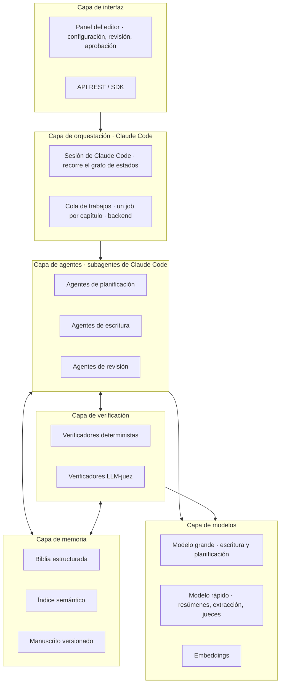
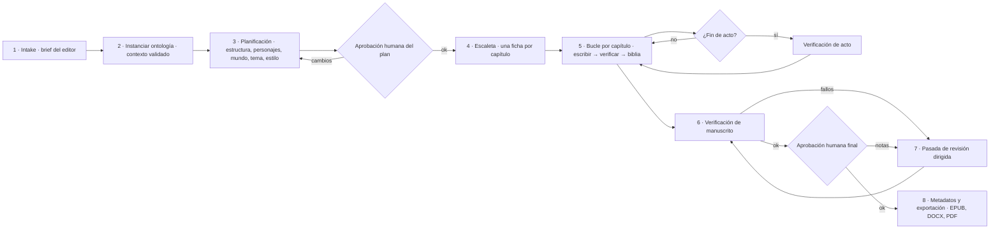
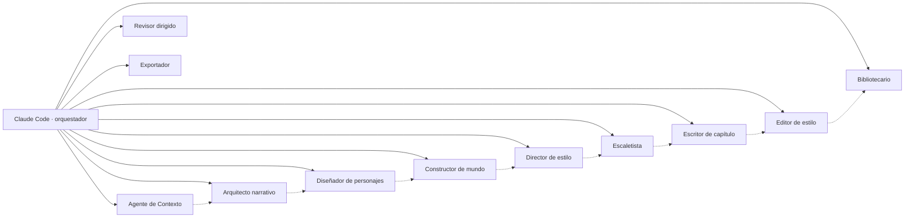
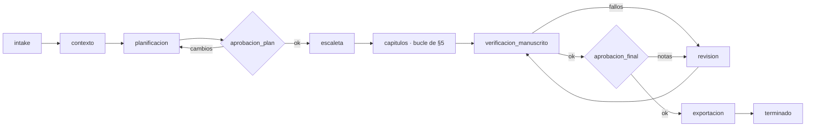
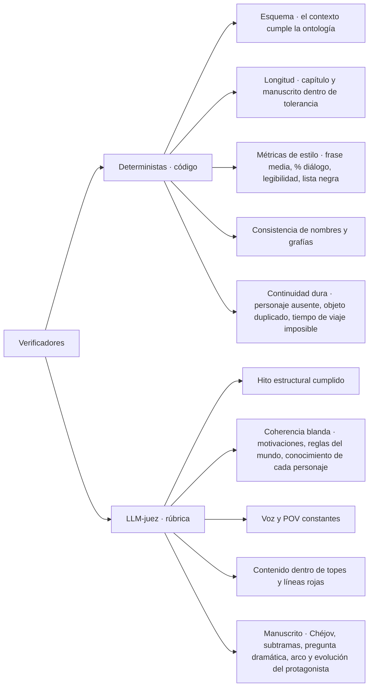
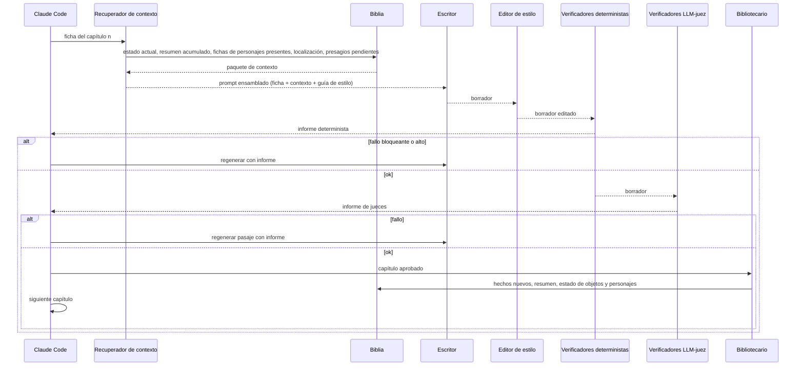
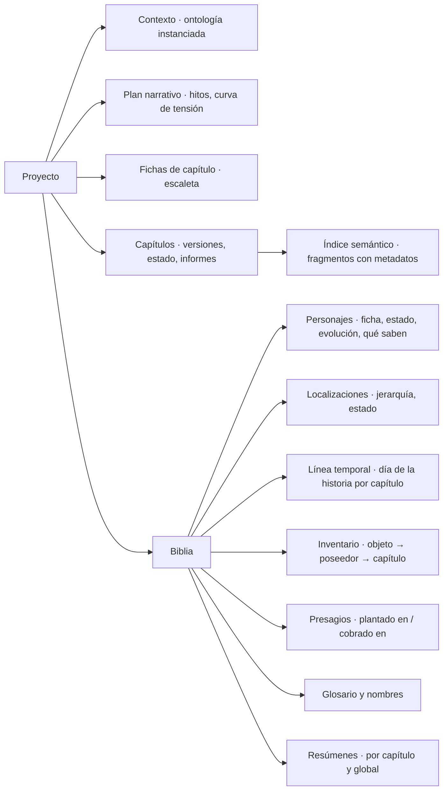
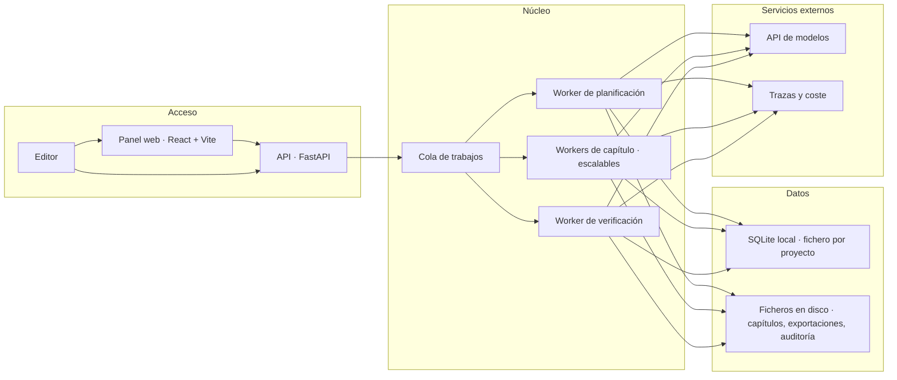
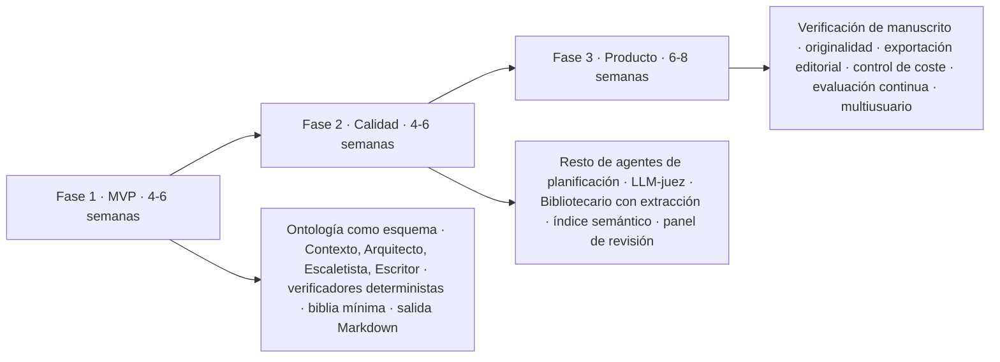

# architecture.md — Arquitectura y flujo del generador

> Propósito: describe cómo el sistema convierte el contexto (`domain-knowledge.md` + `definitions.md`) en un manuscrito: capas, agentes, verificadores, flujo de trabajo, modelo de datos, organización del código y despliegue. El documento describe **qué** hace cada pieza, no con qué se implementa: la pila está sin decidir salvo lo recogido en §7.

---

## 1. Visión general por capas



**Quién orquesta:** una sesión de Claude Code, no código propio. Recorre el grafo de estados como protocolo escrito, lanza cada agente como subagente y aplica la política de reintentos. El backend se queda con todo lo que no consume modelo: verificadores deterministas, persistencia, índice y exportación.

**Idea central:** los agentes proponen, los verificadores disponen y la biblia recuerda. Ningún agente escribe en la biblia directamente; solo el Bibliotecario, y solo después de que un capítulo pase la verificación.

---

## 2. Flujo de extremo a extremo



| Fase | Entrada | Salida | Responsable |
|---|---|---|---|
| Intake | Brief libre del editor (público, género, extensión, ideas) | Brief normalizado | Panel + Agente de Contexto |
| Instanciar ontología | Brief normalizado | Objeto de contexto completo (YAML de `definitions.md`) con valores por defecto heredados | Agente de Contexto + Verificador de Esquema |
| Planificación | Objeto de contexto | Plan narrativo: hitos por capítulo, fichas, mundo y ruta, tema, guía de estilo | Agentes de planificación |
| Escaleta | Plan narrativo | N fichas de capítulo | Escaletista |
| Bucle por capítulo | Ficha + biblia | Capítulo aprobado + biblia actualizada | Escritor, Editor, verificadores, Bibliotecario |
| Verificación de manuscrito | Manuscrito completo + biblia | Informe de fallos globales | Verificadores de manuscrito |
| Revisión dirigida | Informe | Capítulos corregidos | Revisor |
| Exportación | Manuscrito aprobado | Archivos + metadatos | Exportador |

---

## 3. Agentes y orquestación

Cada agente de esta tabla es un **subagente de Claude Code**, con su propio contexto y su modelo fijado según la columna *Modelo*. Las definiciones concretas aún no existen.



| Agente | Responsabilidad | Entrada | Salida | Modelo |
|---|---|---|---|---|
| **Claude Code · orquestador** | Recorre el grafo de estados como protocolo, lanza los subagentes, aplica la política de reintentos y para en los puntos de aprobación humana. No genera prosa de la novela. | Estado del proyecto | Transiciones e invocaciones de subagente | Sesión de Claude Code |
| **Agente de Contexto** | Convierte el brief en el objeto de contexto de la ontología, rellena valores por defecto según el pipeline de decisión y pregunta lo que falte. | Brief | Contexto YAML validado | Grande |
| **Arquitecto narrativo** | Elige modelo estructural, reparte hitos por capítulo, define curva de tensión, pregunta dramática y tipo de final. | Contexto | Plan estructural | Grande |
| **Diseñador de personajes** | Crea fichas, arcos, evolución y grafo de relaciones coherentes con los hitos. | Contexto + plan estructural | Fichas y grafo | Grande |
| **Constructor de mundo** | Define tipo de mundo, ruta ligada a los hitos, localizaciones clave, reglas del mundo con costes. | Contexto + plan + fichas | Biblia inicial de mundo | Grande |
| **Director de estilo** | Fija narrador, registro, métricas de prosa, léxico, lista negra y convención onomástica; produce una guía de estilo con ejemplos. | Contexto + fichas | Guía de estilo | Grande |
| **Escaletista** | Produce una ficha por capítulo: hito, escenas y secuelas, POV, localización, tensión objetivo, elementos a plantar y cobrar. | Plan completo | N fichas de capítulo | Grande |
| **Escritor de capítulo** | Redacta el borrador a partir de la ficha, el resumen acumulado y el estado de la biblia. | Ficha + contexto recuperado | Borrador | Grande |
| **Editor de estilo** | Pasada de corrección local: métricas de prosa, repeticiones, lista negra, ritmo. No cambia hechos. | Borrador + guía de estilo | Borrador editado | Rápido |
| **Bibliotecario** | Extrae del capítulo aprobado los hechos nuevos (estado de personajes, objetos, fechas, presagios) y actualiza la biblia y el resumen acumulado. | Capítulo aprobado | Biblia actualizada | Rápido |
| **Revisor dirigido** | Corrige capítulos concretos a partir de un informe de fallos, con cambios mínimos. | Capítulo + informe | Capítulo corregido | Grande |
| **Exportador** | Genera título, sinopsis, palabras clave y los archivos finales. | Manuscrito | EPUB, DOCX, PDF, metadatos | Rápido + código |

El **Recuperador de contexto** de §5 no está en esta tabla a propósito: no es un agente. Es código del backend y no consume modelo. Su sitio es §6.3.

### 3.1 El grafo de estados

La sesión de Claude Code no guarda el estado en su propia ventana. El estado del proyecto es una fila en SQLite y la sesión es un **ejecutor sin memoria propia**: lee dónde está, lanza un subagente, escribe el resultado y vuelve a leer. Un fin de ventana de contexto, un portátil cerrado y una pausa de tres días esperando una aprobación son el mismo caso, y reanudar es siempre lo mismo: leer la fila y seguir.

Esto es lo que convierte «el grafo de estados» de metáfora en tabla. Hay dos máquinas anidadas: la del **proyecto**, que recorre las fases de §2, y la del **capítulo**, que es el bucle de §5 y cuyos estados ya estaban definidos en §6 (`borrador`, `editado`, `verificado`, `aprobado`, `revision_humana`).



| Estado | Subagente que se lanza | Sale cuando | Quién decide la salida |
|---|---|---|---|
| `intake` | Agente de Contexto | El brief normalizado está completo | El agente, o el editor si falta un dato |
| `contexto` | Agente de Contexto | El Verificador de Esquema da verde | Verificador determinista |
| `planificacion` | Arquitecto, Personajes, Mundo, Estilo (secuenciales) | Existe plan estructural, fichas, biblia de mundo y guía de estilo | Los cuatro agentes, en orden |
| `aprobacion_plan` | Ninguno | El editor aprueba o pide cambios | **Humano** — parada obligatoria |
| `escaleta` | Escaletista | Hay N fichas de capítulo | El agente |
| `capitulos` | Bucle de §5, capítulo a capítulo | El último capítulo está en `aprobado` o en `revision_humana` | Verificadores |
| `verificacion_manuscrito` | Verificadores de manuscrito | Informe global sin fallos altos ni bloqueantes | Verificadores |
| `revision` | Revisor dirigido | Los capítulos del informe están corregidos | El agente; vuelve siempre a verificar |
| `aprobacion_final` | Ninguno | El editor aprueba o deja notas | **Humano** — parada obligatoria |
| `exportacion` | Exportador | Los archivos y metadatos existen en disco | Código |

### 3.2 Reintentos, fallos y reanudación

El contador de intentos **no vive en la cabeza del orquestador**, vive en la fila del capítulo. Es la única forma de que el tope de 3 ciclos de §4 siga significando algo después de que la sesión se reinicie: una sesión nueva lee `intentos = 2` y sabe que le queda uno, en vez de empezar a contar desde cero y regenerar el mismo capítulo nueve veces.

Cada transición se escribe **antes** de lanzar el siguiente subagente. Si la sesión muere a mitad, lo que se pierde es como mucho el trabajo de un subagente, nunca la posición en el grafo.

Eso obliga a que cada paso sea **repetible sin daño**: las escrituras van claveadas por `(capítulo, versión, intento)`, de modo que relanzar un paso que ya se había completado produce la misma fila en vez de una duplicada. Un capítulo que agota los tres intentos no se reintenta más: pasa a `revision_humana` con los informes adjuntos y el bucle sigue con el siguiente, porque bloquear la novela entera por un capítulo es peor que dejarlo marcado.

### 3.3 Lo que el orquestador no hace

Tres cosas, y conviene que estén escritas porque las tres son tentadoras cuando quien orquesta es un modelo:

- **No escribe prosa de la novela.** Ni un párrafo de relleno, ni un arreglo rápido de una frase que el Editor dejó torcida. Si hace falta texto, se lanza el agente que corresponde.
- **No escribe en la biblia.** Solo el Bibliotecario, y solo tras la verificación. Esta regla deja de depender de la buena voluntad del agente en cuanto el acceso es por herramientas MCP con permisos por agente (§7).
- **No se salta una parada humana.** `aprobacion_plan` y `aprobacion_final` no tienen transición automática de salida, ni siquiera cuando todos los verificadores están en verde.

---

## 4. Verificadores

Se distinguen dos familias: los **deterministas** (código, baratos, siempre se ejecutan) y los **LLM-juez** (un modelo evalúa con rúbrica, se ejecutan después de los deterministas). Un verificador nunca corrige; devuelve un informe con severidad y localización del fallo.



| Verificador | Momento | Tipo | Severidad si falla | Acción |
|---|---|---|---|---|
| Esquema del contexto | Tras instanciar la ontología | Determinista (JSON Schema) | Bloqueante | Agente de Contexto corrige |
| Longitud | Cada capítulo y al final | Determinista | Media | Editor amplía o recorta |
| Métricas de estilo | Cada capítulo | Determinista | Baja / Media | Editor de estilo |
| Nombres y grafías | Cada capítulo | Determinista contra glosario | Media | Editor de estilo |
| Continuidad dura | Cada capítulo | Determinista contra biblia | Alta | Escritor regenera el pasaje |
| Hito estructural | Cada capítulo | LLM-juez | Alta | Escritor regenera el capítulo |
| Coherencia blanda | Cada capítulo | LLM-juez con biblia como evidencia | Alta | Escritor regenera el pasaje |
| Voz y POV | Cada capítulo | LLM-juez | Media | Editor de estilo |
| Contenido y líneas rojas | Cada capítulo | Clasificador + LLM-juez | Bloqueante | Regeneración obligatoria |
| Verificación de acto | Fin de acto | LLM-juez | Alta | Revisor dirigido |
| Verificación de manuscrito | Final | LLM-juez + deterministas | Alta | Revisor dirigido |
| Originalidad | Final | Búsqueda de similitud contra corpus | Bloqueante | Revisor dirigido |

**Política de reintentos:** máximo 3 ciclos por capítulo; si persiste el fallo, el capítulo pasa a cola de revisión humana con el informe adjunto.

---

## 5. Ciclo de un capítulo



El **Recuperador de contexto** no es un agente creativo ni un agente en absoluto: es código del backend que ensambla el prompt a partir de consultas estructuradas a la biblia y de una búsqueda semántica de pasajes anteriores relevantes (por ejemplo, la última vez que apareció un secundario), para que el Escritor no reciba toda la novela sino solo lo pertinente. Cómo reparte el presupuesto de 100.000 tokens y qué recorta cuando no cabe está en §6.3.

---

## 6. Modelo de datos y memoria



| Almacén | Contenido | Tecnología |
|---|---|---|
| Relacional | Proyecto, contexto, plan, fichas, biblia, informes de verificación, costes | **SQLite local**, un fichero por proyecto |
| Vectorial | Fragmentos de capítulos con metadatos (capítulo, POV, personajes, localización) | **SQLite local**, misma base; extensión vectorial o FTS5, sin decidir |
| Objetos | Versiones de capítulos, exportaciones, prompts y respuestas para auditoría | Ficheros en disco, dentro del proyecto |
| Caché | Prompts repetidos, embeddings | **SQLite local**, misma base |

Son cuatro necesidades, no cuatro servicios.

Las versiones de capítulo, las exportaciones y los prompts de auditoría son ficheros en disco y no blobs en la base, precisamente porque quien orquesta es Claude Code: un fichero se lee con grep y se compara con diff; un blob es opaco justo para quien más lo necesita.

Un único fichero SQLite cubre las tres necesidades que no son ficheros: relacional, vectorial y caché. No hay servicio de base de datos aparte ni índice vectorial separado.

SQLite funciona en modo **WAL** y admite un solo escritor a la vez, de modo que la escritura queda serializada. Ver la restricción que eso impone al paralelismo en §10.

Queda por decidir **cómo** se hace la búsqueda dentro de esa base: una extensión vectorial sobre embeddings, o FTS5, que es búsqueda de texto completo y no necesita embeddings. Lo segundo evita depender de un proveedor de embeddings externo, que es gasto medido aparte de la suscripción.

Cada capítulo se guarda con versión, estado (`borrador`, `editado`, `verificado`, `aprobado`, `revision_humana`) y los informes que lo produjeron, de modo que cualquier fallo es trazable hasta el prompt exacto.

### 6.1 Tres niveles de memoria

Los cuatro almacenes de la tabla anterior dicen **dónde** se guarda cada cosa. Cuánto **dura** es otro eje, y es el que gobierna el diseño de los prompts:


| Nivel | Qué contiene | Cuánto dura | Quién lo escribe |
|---|---|---|---|
| **1 · Trabajo** | El prompt ensamblado: ficha, guía de estilo, contexto recuperado, capítulo anterior | Una invocación. Muere con el subagente | El Recuperador de contexto (§6.3) |
| **2 · Proyecto** | Resumen acumulado, presagios pendientes, estado actual de cada personaje, últimos capítulos | Se reescribe y se compacta sin parar | El Bibliotecario |
| **3 · Persistente** | Biblia completa, manuscrito versionado, índice semántico, informes de verificación | No se borra nada | El Bibliotecario y el código de persistencia |

**La invariante que lo sostiene:** el nivel 2 es una **vista derivada** del nivel 3, nunca una fuente de verdad. Todo lo que hay en el resumen acumulado se puede reconstruir releyendo los capítulos aprobados. Eso es lo que hace segura la compactación: se puede tirar un resumen porque lo resumido sigue estando entero. En el momento en que algo viva **solo** en el nivel 2, la compactación pasa a ser pérdida de datos.

### 6.2 Compactación: por qué el resumen no crece

Un resumen acumulado que es la concatenación de 30 resúmenes de capítulo es un problema disfrazado de solución: en el capítulo 28 ocupa más que el propio capítulo y el Escritor recibe mucho ruido y poca señal.

La regla es que el resumen acumulado sea **O(actos), no O(capítulos)**:

- Al aprobar un capítulo, el Bibliotecario escribe su resumen con **presupuesto fijo** (≈200 palabras). No es negociable por capítulo interesante.
- Mientras el acto está abierto, el resumen acumulado son los resúmenes de sus capítulos, uno a uno.
- Al **cerrar un acto** —el mismo punto en el que ya se dispara la verificación de acto de §4— los resúmenes de sus capítulos se destilan en un único resumen de acto y dejan de enviarse individualmente.

Así, el resumen que recibe el Escritor del capítulo 28 son tres resúmenes de acto cerrado más los capítulos del acto en curso. Los resúmenes por capítulo no se borran: siguen en el nivel 3, consultables, y simplemente dejan de viajar en el prompt.

Lo que **nunca** se compacta, porque su tamaño ya está acotado y su pérdida es un fallo de continuidad: los presagios pendientes (por definición, los no cobrados), el estado actual de los personajes presentes y el inventario de objetos vivos.

### 6.3 El Recuperador de contexto y el presupuesto de 100.000 tokens

El Recuperador es **código determinista del backend**, no un agente: no consume modelo, se comporta igual ante la misma entrada y —lo que importa— **cuenta los tokens antes de enviar**. Si el ensamblado fuese un agente, el tope de contexto sería algo que se comprueba a posteriori, cuando ya se ha desbordado.

Dada una ficha de capítulo, ejecuta consultas fijas a la biblia y una búsqueda de pasajes anteriores relevantes, y arma el prompt del Escritor por bloques con un presupuesto por bloque:

| Bloque | Presupuesto orientativo | Prioridad si no cabe |
|---|---|---|
| Ficha del capítulo | ~2k | 1 — nunca se recorta |
| Guía de estilo | ~5k | 2 |
| Presagios pendientes e inventario vivo | ~2k | 3 |
| Fichas de los personajes presentes | ~8k | 4 |
| Localización y reglas del mundo aplicables | ~5k | 5 |
| Resumen acumulado (§6.2) | ~10k | 6 |
| Capítulo anterior íntegro | ~8k | 7 |
| Pasajes recuperados por búsqueda | ~15k | 8 — primero en caer |

Suman ~55k de entrada sobre el tope de 100.000, y el margen restante es para la salida: el capítulo. Cuando un capítulo con nueve personajes en escena no cabe, el Recuperador **recorta por orden de prioridad inverso y lo deja escrito en el informe**. No trunca por el final en silencio: un prompt recortado sin avisar produce un fallo de continuidad que después nadie sabe explicar.

La prioridad está puesta así a propósito. Los pasajes recuperados son lo primero que cae porque son la ayuda, no el encargo: sin ellos el capítulo sale más pobre, pero sale. Sin la ficha, el Escritor escribe otro capítulo.

---

## 7. Tecnología

Lo decidido hasta ahora es solo esto:

| Componente | Decisión |
|---|---|
| Backend | Python + FastAPI |
| Frontend | React con Vite |
| Orquestación de agentes | Claude Code: la sesión recorre el grafo y los agentes son subagentes suyos |
| Base de datos | SQLite local, un fichero por proyecto, en modo WAL: relacional, vectorial y caché en la misma base |
| Almacén de objetos | Ficheros en disco, sin servicio aparte |
| Acceso de Claude Code a la biblia | **Servidor MCP** sobre la misma base SQLite: herramientas tipadas, de solo lectura para todos los agentes y de escritura solo para el Bibliotecario |
| Estado del orquestador | Una fila en SQLite, no la ventana de la sesión (§3.1) |

SQLite es una decisión de las **fases 1 y 2**. El multiusuario de la fase 3 (§11) obligará a revisarla; queda dicho aquí para que ese día se lea como un cambio previsto y no como una sorpresa.

El acceso por **MCP** se elige frente a endpoints de FastAPI llamados con Bash por una razón concreta: la regla de §1 de que solo el Bibliotecario escribe en la biblia deja de depender de que el agente se porte bien y pasa a ser un permiso por herramienta. El coste es un proceso más que mantener.

Todo lo demás está **sin decidir**: el mecanismo de búsqueda dentro de SQLite (extensión vectorial con embeddings o FTS5), la cola de trabajos, la observabilidad, los formatos de exportación y el despliegue. El resto del documento describe esas piezas por su función, no por su implementación; cada decisión se tomará cuando la fase correspondiente la exija y se añadirá a esta tabla.

---

## 8. Organización del código

Dos criterios distintos, uno por lado, y ambos con la misma intención: que lo que cambia junto viva junto.

### Backend — vertical slices, una carpeta por tarea

Las tareas son las **fases de §2**, no los agentes de §3 ni los recursos REST. Una fase es la unidad de trabajo real y es lo que se toca entero cuando cambia algo; varios agentes comparten fase, así que una carpeta por agente dispersaría lo que se modifica a la vez.

Cada rebanada contiene **todo lo suyo**: su router de FastAPI, sus modelos Pydantic, su lógica y su acceso a SQLite. No hay `routers/`, `models/` ni `services/` transversales: esa organización obliga a abrir cuatro carpetas para entender una sola tarea.

```
backend/
  intake/            · brief → brief normalizado
  contexto/          · brief → objeto de contexto validado
  planificacion/     · contexto → plan narrativo
  escaleta/          · plan → fichas de capítulo
  capitulo/          · el bucle de §5
  verificacion/      · verificación de manuscrito
  revision/          · revisión dirigida
  exportacion/       · manuscrito → archivos y metadatos
  shared/            · deliberadamente pequeño
```

`shared/` es solo para lo que es transversal de verdad: la conexión a SQLite con sus pragmas, el esquema de la ontología y los tipos comunes. La tensión es real en las dos direcciones. Sin `shared/`, los pragmas acaban duplicados en ocho sitios y un día divergen —y un `PRAGMA foreign_keys` olvidado en una sola rebanada no da error, solo filas huérfanas—. Con un `shared/` que crece sin control, vuelves a tener capas horizontales con otro nombre. Ante la duda, duplicar dentro de la rebanada; se promueve a `shared/` cuando el tercer sitio lo necesite.

### Frontend — package by feature, sin FSD

Una carpeta por funcionalidad, con sus componentes, sus hooks, su estado y sus llamadas a la API dentro. No hay `components/`, `hooks/` ni `services/` en la raíz recogiendo piezas de pantallas que no tienen nada que ver entre sí.

**Sin FSD**: no se adopta Feature-Sliced Design. Sus capas obligatorias (`shared`, `entities`, `features`, `widgets`, `pages`, `app`) y sus reglas de importación entre capas son más metodología de la que este frontend necesita, y el coste de aprenderla y respetarla no se paga con un panel de editor.

Lo compartido entre funcionalidades vive en un `shared/` con el mismo criterio de arriba: pequeño, y se promueve cuando el tercer sitio lo pide.

---

## 9. Despliegue



---

## 10. Transversales

| Aspecto | Decisión |
|---|---|
| **Human-in-the-loop** | Dos puntos obligatorios (plan y manuscrito final) y uno condicional (capítulo que agota reintentos). El panel muestra diff y el informe que motivó la pausa. |
| **Control de coste** | El gasto es de suscripción, no de API medida: no hay presupuesto por token que degradar en caliente. El control se ejerce eligiendo el modelo de cada subagente por adelantado (rápido en editores y jueces, grande en escritura y planificación). Estimación previa: novela estándar ≈ 30 capítulos × (1 escritura + 1,5 regeneraciones medias + edición + jueces). |
| **Paralelismo** | Planificación secuencial; capítulos secuenciales por defecto (dependen de la biblia). Paralelizable solo en estructuras corales con líneas independientes hasta su convergencia, y **condicionado a que el almacén lo soporte**: con SQLite la escritura es serializada, así que el paralelismo coral se limita a la generación, no a la escritura en la biblia. |
| **Determinismo y reproducibilidad** | Semilla, versión de prompt, versión de modelo y contexto exacto guardados por capítulo. |
| **Seguridad y privacidad** | Sin datos personales en el brief; secretos en gestor de credenciales; prompts y salidas cifrados en reposo; retención configurable. |
| **Evaluación continua** | Conjunto de briefs de prueba; se mide tasa de aprobación al primer intento, fallos por tipo de verificador, coste por capítulo y valoración humana ciega de calidad. |
| **Versionado de la ontología** | La ontología tiene versión semántica; cada proyecto fija la suya y las migraciones se validan con el verificador de esquema. |

---

## 11. Plan de construcción por fases


