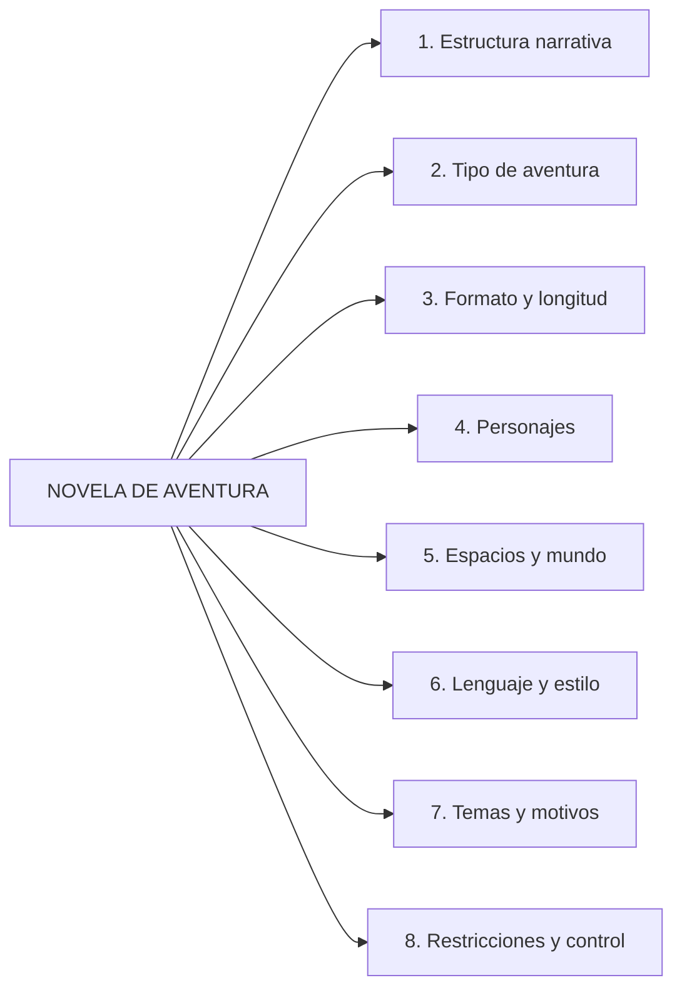
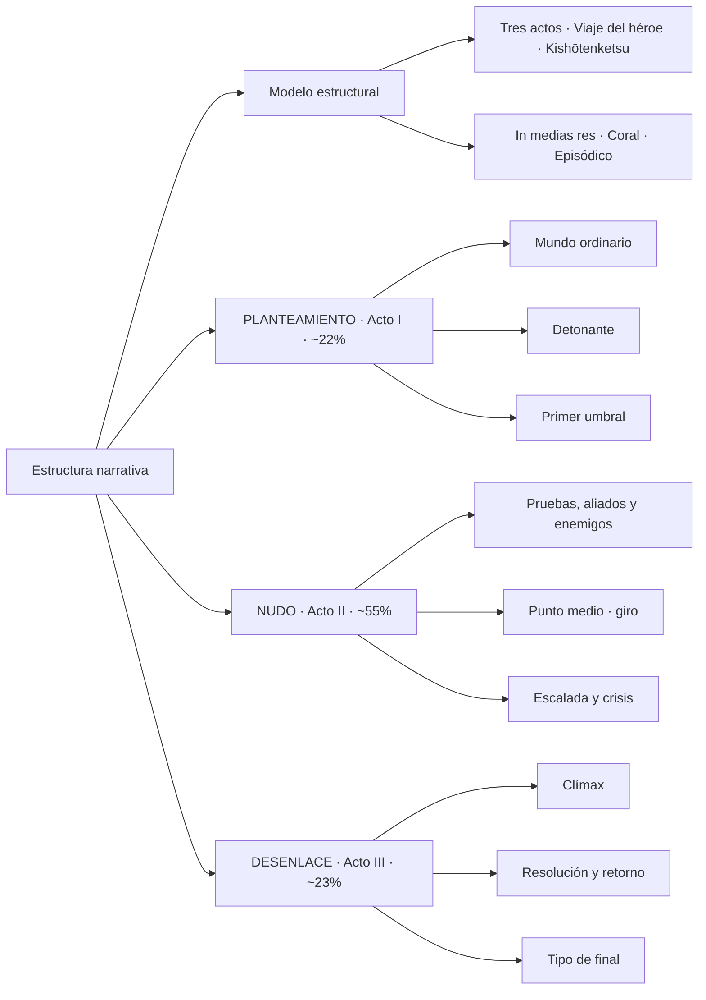
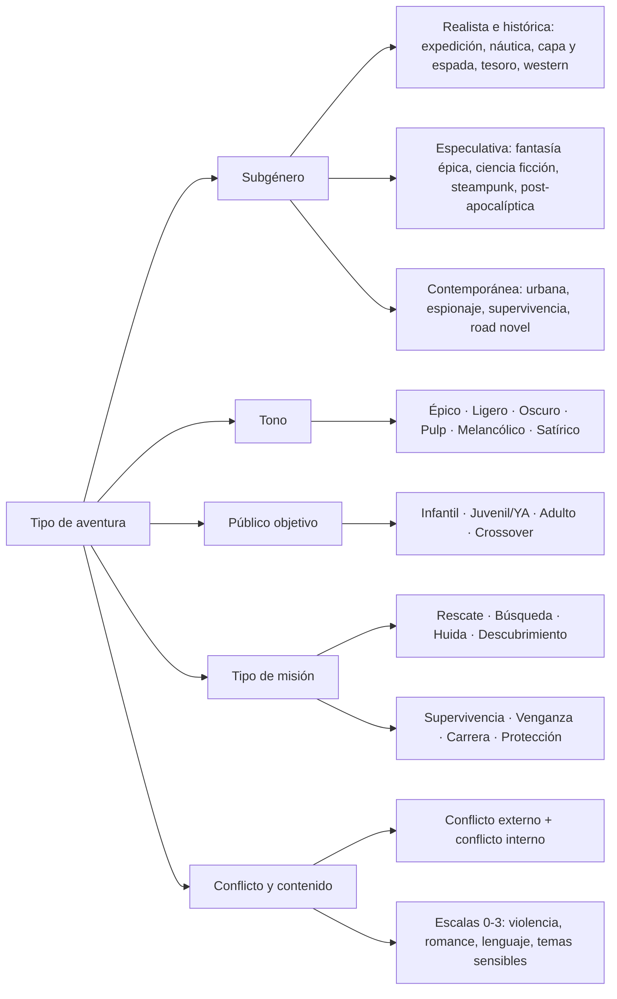
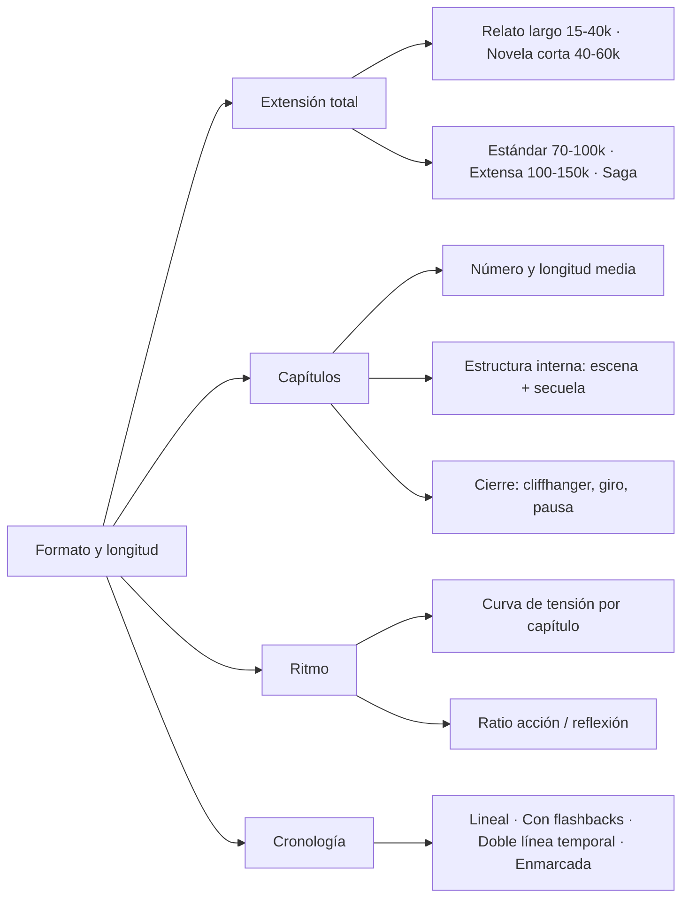
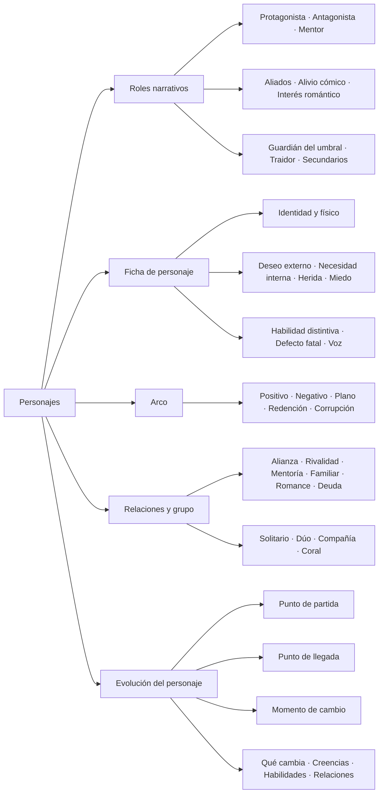
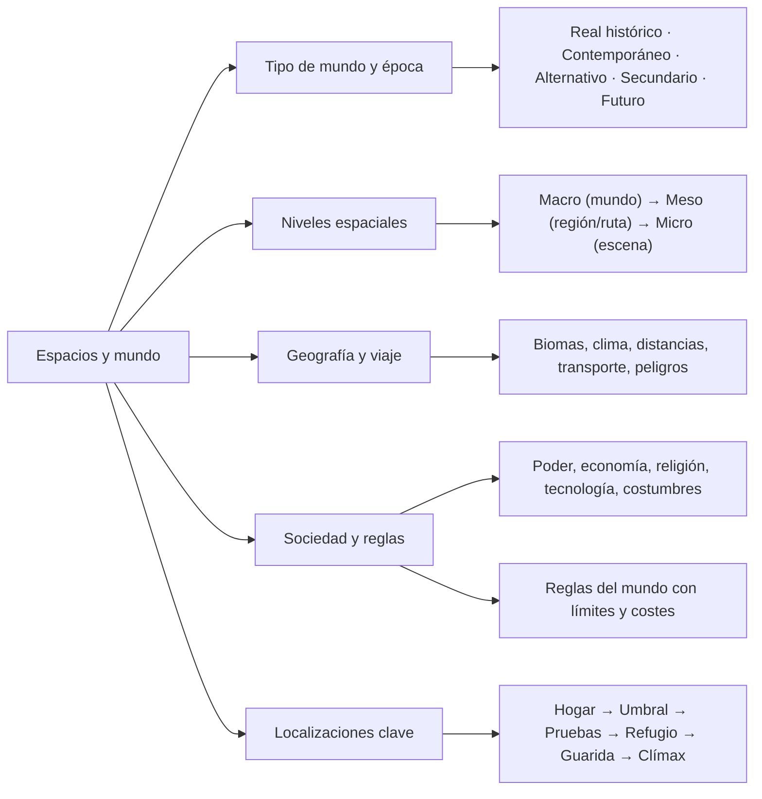
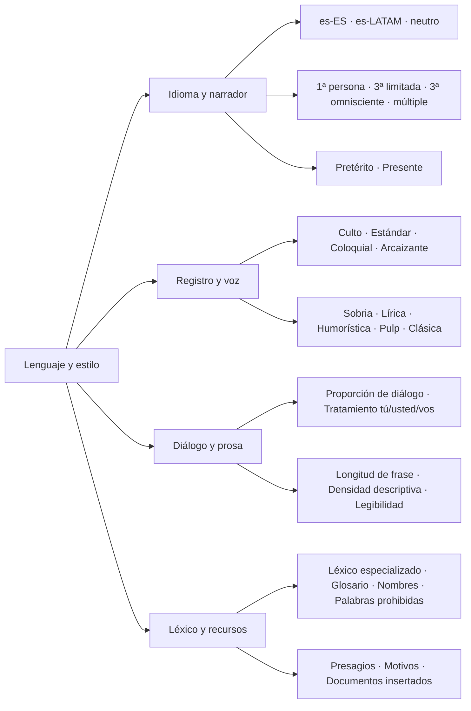
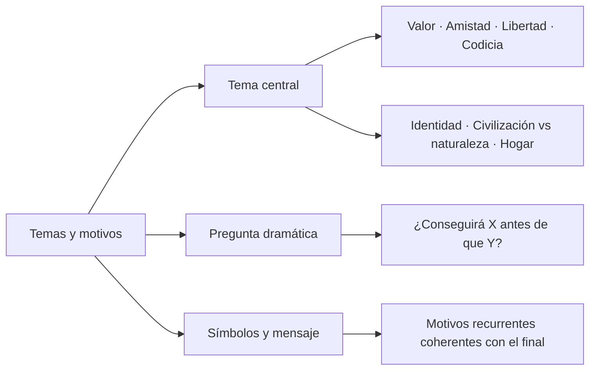
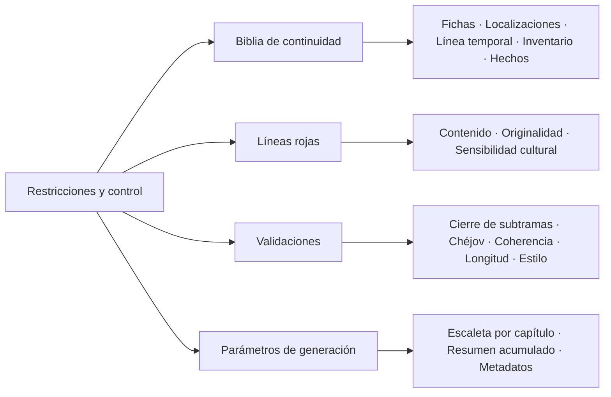
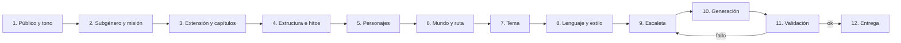

# domain-knowledge.md — Conocimiento de dominio: novelas de aventura

> Propósito: árbol de conocimiento que el sistema usa como contexto para generar novelas de aventura. Cada dimensión se representa como un árbol de decisión en Mermaid. Los nodos hoja se corresponden con claves del objeto de contexto descrito en `definitions.md`; la forma en que el sistema lo consume está en `architecture.md`.

**Cómo leer los árboles:** de izquierda a derecha, de lo general a lo particular. Los nodos intermedios agrupan; los nodos hoja deciden y deben poder expresarse como `clave: valor`.

---

## 0. Visión general

---

## 1. Estructura narrativa

---

## 2. Tipo de aventura

---

## 3. Formato y longitud

---

## 4. Personajes

---

## 5. Espacios y mundo

---

## 6. Lenguaje y estilo

---

## 7. Temas y motivos

---

## 8. Restricciones y control de generación

---

## 9. Orden de decisión recomendado (pipeline)

