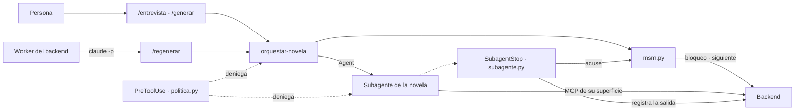

# claude-code.md — Cómo usa el repositorio Claude Code

> Claude Code cumple dos papeles en este repositorio. **En producto**, es el orquestador de la novela: cada agente es un subagente suyo, y la sesión ejecuta las órdenes que decide el backend ([architecture.md](../architecture.md) §3.1). **En desarrollo**, es la herramienta con la que se construyó el sistema: sesiones paralelas por carpeta, skills de referencia y revisiones con subagentes de solo lectura. Este documento recoge las piezas de los dos, con su propósito y lo que dieron. El contrato de cada pieza está en [plan-agentes.md](../../specs/plan-agentes.md). El uso del browser MCP tiene su propio documento, [browser-mcp.md](browser-mcp.md).

---

## 1. Cómo encajan las piezas

La sesión pide, lanza y lee el acuse; nunca decide qué agente toca, si se reintenta ni cuándo parar. Tampoco registra resultados: lo hace el hook ([plan-agentes.md](../../specs/plan-agentes.md) A-5).

---

## 2. Subagentes de la novela (`.claude/agents/`)

Doce ficheros, uno por agente. El cuerpo de cada uno es su prompt versionado; su SHA-256 es la versión de prompt. Cada lista `tools` es cerrada: ningún agente de la novela tiene `Bash`, `Write`, `Edit`, `Agent` ni `WebFetch` (A-3), y sin lista heredaría los conectores de la cuenta (S-4). Las superficies `/mcp/escritura` y `/mcp/entrada` se declaran en el `mcpServers` del frontmatter del agente que las usa, así que la sesión principal no puede llamarlas (S-1).

| Agente | Modelo | Herramientas / MCP | Rol | Resultado |
|---|---|---|---|---|
| `agente-contexto` | sonnet | `mcp__lectura` | Normaliza el brief e instancia el objeto de contexto de la ontología | Llevó E1 al contexto validado. En E5 corrigió por su cuenta dos contradicciones del comprador y el eval falló ([iteraciones.md](../iteraciones.md) I-08); el arreglo del prompt está **pendiente** |
| `extractor-hechos` | haiku | `mcp__entrada` (propio) | Extrae hechos del texto libre del comprador en esquema cerrado; lee el texto con un identificador de un solo uso | Extrajo los hechos de E1. E2 (inyección) está en curso ([evals.md](../evals.md)) |
| `planificador` | sonnet | `mcp__lectura` | En una salida: plan estructural, personajes, mundo y guía de estilo (R-1 sustituye a cuatro agentes) | Plan de E1 |
| `escaletista` | sonnet | `mcp__lectura` | Una ficha por cada uno de los 10 capítulos | Escaleta de E1 |
| `escritor` | opus | `Read`, solo en `prompts/` del proyecto (P-3) | Redacta el borrador de un capítulo a partir del prompt ensamblado por el Recuperador, con tope de entrada de 100.000 tokens | Los 10 capítulos de E1 |
| `editor-estilo` | sonnet | `mcp__lectura` | Corrección local de estilo sin cambiar hechos | Pasada sobre cada capítulo de E1 |
| `juez-capitulo` | sonnet | `mcp__lectura` | Juzga un capítulo verificado con rúbrica, usando la biblia como evidencia | Aprobó los 10 capítulos de E1 |
| `bibliotecario` | sonnet | `mcp__lectura`, `mcp__escritura` (propio) | Actualiza la biblia de continuidad con lo que establece un capítulo verificado. Único agente que escribe en ella | Biblia de E1 |
| `juez-manuscrito` | sonnet | `mcp__lectura` | Puntúa el manuscrito completo con la rúbrica de cinco criterios | En E1 encontró marcadores de anonimización en la prosa de los capítulos 2, 8 y 9 que ninguna comprobación determinista vio; de ahí salió el verificador determinista `marcadores` (commit `bf22df1`) |
| `revisor` | opus | `mcp__lectura` | Corrige un capítulo concreto a partir del informe de los gates, con cambios mínimos | Actuó en la revisión de E1 tras el juez de manuscrito; el detalle por capítulo no está registrado en `docs/` |
| `exportador` | haiku | `mcp__lectura` | Título, sinopsis y palabras clave del manuscrito verificado | Publicación de E1: [ejemplos/novela-ejemplo.pdf](../../ejemplos/novela-ejemplo.pdf), 37 páginas |
| `interprete-cambios` | haiku | `mcp__entrada` (propio) | Traduce la petición de cambio de un lector a un cambio sobre un hecho, en esquema cerrado | Sin ejecución real registrada todavía (H6) |

Las filas «de E1» salen del commit `bf22df1` («Publish the first full novel (E1)»): 10 capítulos aprobados, publicados como versión 1. Ese mismo commit trae los ajustes de prompts y del harness que la generación destapó. Las definiciones se cargan al abrir la sesión (S-12): tras editarlas, hay que generar en una sesión nueva.

---

## 3. Skills (`.claude/skills/`)

### 3.1 De la novela

| Skill | Invocación | Propósito | Dónde se usó · resultado |
|---|---|---|---|
| `orquestar-novela` | La invocan las otras tres (`user-invocable: false`) | El bucle: tomar el bloqueo, pedir la orden, lanzar el subagente con el prompt tal cual, leer el acuse, repetir hasta `esperar_humano`, `publicada`, `detenida` o `error`; soltar el bloqueo. Sin reglas de decisión | En las ejecuciones de E1 (novela completa) y E5 (hasta la entrevista) |
| `entrevista` | `/entrevista` o `/entrevista evals/eN-<nombre>/input/brief.json` | Crea el proyecto, entrevista al comprador (el texto libre va por fichero y no entra en la conversación, E-3), lanza al Extractor, enseña los hechos para confirmarlos y para con el contexto validado | E1 y E5; en E2, hasta el envío del brief, con el Extractor aún sin ejecutar ([evals.md](../evals.md)). En E5 destapó que solo vuelve a preguntar desde `intake` (pendiente en [plan-multisesion.md](../../specs/plan-multisesion.md)) |
| `generar` | `/generar <proyecto>` | Sigue o reanuda un proyecto con bloqueo de tipo `sesion` y explica cada parada a la persona | La generación completa de E1 |
| `regenerar` | `/regenerar <proyecto> <trabajo>`, lanzada por el worker con `claude -p … --permission-prompts none --output-format json`, nunca `--bare` | Entrada headless: bloqueo de tipo `worker`, orquestar hasta la próxima parada y una línea JSON final | Probada con un `claude` falso en las pruebas del worker (TC-10); la prueba real con `claude -p` sigue pendiente ([iteraciones.md](../iteraciones.md) I-07 b) |

Todas hablan con el backend solo a través de `.claude/harness/msm.py`. `plan-entrega` preveía además `inspeccionar-lectura`; no existe como skill, y la inspección visual está en [browser-mcp.md](browser-mcp.md).

### 3.2 De desarrollo

Son capas de referencia para las sesiones que construyen el sistema; ningún agente de la novela las usa.

| Skill | Propósito | Dónde se usa |
|---|---|---|
| `fastapi` | Capa sobre el plugin `fastapi@han`: corrige su error sobre async frente a sync y cubre `lifespan`, la migración a Pydantic v2 y por qué sus ejemplos de base de datos no valen aquí | Rebanadas de `backend/` (routers y `lifespan` de `backend/app.py`, que combina el de cada superficie MCP montada, I-01 c) |
| `react` | Capa sobre el plugin `react@han`: Vite y sus variables de entorno, claves de lista, StrictMode, y corrige el sesgo hacia memorizar por defecto | `frontend/` |
| `sqlite` | Pragmas obligatorios, tipado dinámico, transacciones, WAL y escritor único, FTS5 y el módulo `sqlite3` | `backend/shared/` (esquema y conexiones) y las consultas de cada rebanada |
| `verificacion` | Cómo elegir un método de verificación para una afirmación, con el marco T/A/I/D/U | Es el procedimiento que cita [validators.md](../validators.md) para cada afirmación nueva |

El historial no registra cada invocación de estas skills; la columna dice a qué parte del código se aplican. Las reglas de trabajo de [AGENTS.md](../../AGENTS.md) exigen además la skill `grilling` del plugin `mattpocock-skills` antes de tocar `docs/` o código: las decisiones que salieron de ahí están en las specs con su código (`E-n`, `A-n`, `Q-n`, `AJ-n`), por ejemplo las de [plan-agentes.md](../../specs/plan-agentes.md) §2 y las Q4 a Q8 de I-04.

---

## 4. Hooks (`.claude/settings.json`, scripts en `.claude/harness/`)

Se lanzan con `uv run --project "$CLAUDE_PROJECT_DIR" --no-sync --quiet python …` (A-1): Python con solo la biblioteca estándar.

| Hook | Evento y matcher | Script | Propósito | Resultado |
|---|---|---|---|---|
| Policy | `PreToolUse` · `Read\|Grep\|Glob\|Edit\|Write\|MultiEdit\|NotebookEdit\|Bash\|PowerShell\|mcp__.*` | `politica.py` | Decide en local, sin depender del backend: `mcp__escritura__*` solo para el Bibliotecario; `mcp__entrada__*` solo para Extractor e Intérprete; ninguna herramienta de fichero escribe bajo `proyectos/`; nadie lee `brief/`, `cambios/` ni `texto_libre*.txt`; el Escritor solo lee `prompts/`. Audita en `POST /proyectos/{id}/auditoria` o, si no puede, en `.claude/estado/auditoria.jsonl` | Con `claude -p` real, la sesión principal intentó leer el texto libre de E2, se le denegó y quedó en la auditoría ([plan-agentes.md](../../specs/plan-agentes.md), «Estado»). La revisión de solo lectura encontró tres huecos aún abiertos: `Grep` con la carpeta de un proyecto como `path`, rutas con `..` sin normalizar y un fallo abierto si la auditoría lanza algo inesperado ([plan-multisesion.md](../../specs/plan-multisesion.md)) |
| Registro y uso | `SubagentStop`, todos los agentes | `subagente.py`, con `transcript.py` y `comun.py` | Solo actúa si el prompt empieza por `orden: <sello>` (A-4), así que no toca a los subagentes de desarrollo. Elige la salida entre todo lo que escribió el subagente, suma los tokens del transcript, registra en `/resultado` y deja el acuse en `.claude/estado/`. Nunca devuelve `block`: los reintentos los decide el backend | Única vía de registro de todas las salidas de E1. La generación de E1 obligó a ajustarlo (commit `bf22df1`): un subagente en segundo plano puede entregar en `last_assistant_message`, en `SubagentHandback` o en un texto anterior (S-11) |

`.claude/harness/msm.py` es la CLI que usan las skills (`estado`, `crear`, `bloqueo`, `siguiente`, `acuse`, `brief`, `hechos`, `confirmar`, `reintentar`); nunca envía a `/resultado`. `settings.json` además da permisos a `msm.py`, `Agent`, `Skill` y las tres superficies MCP, para que el worker funcione sin preguntas.

---

## 5. MCP y plugins

| Pieza | Qué declara | Propósito | Resultado |
|---|---|---|---|
| `.mcp.json` · `lectura` | `http://127.0.0.1:8000/mcp/lectura/` | Herramientas tipadas de lectura de la biblia y del material de la novela, por proyecto y por capítulo | La usan diez de los doce agentes. Se añadió al cerrar la auditoría de cohesión previa a E1 ([plan-multisesion.md](../../specs/plan-multisesion.md), cabecera) |
| `.mcp.json` · `playwright` | `npx -y @playwright/mcp@latest --browser msedge` | Inspección visual de la lectura web | Conecta con `npx` también en Windows; sin `--browser msedge` buscaba Chrome, que no está instalado. Uso en [browser-mcp.md](browser-mcp.md) |
| `.mcp.json` · `langfuse` | `<LANGFUSE_BASE_URL>/api/public/mcp`, con `LANGFUSE_MCP_AUTH` del entorno | Versiones de prompt y consultas de métricas y scores para la tabla de evals | No escribe trazas: eso lo hace el backend ([iteraciones.md](../iteraciones.md) I-09) |
| `enabledMcpjsonServers` | `lectura`, `playwright` | Que la sesión interactiva no pida aprobarlos | — |
| Frontmatter · `escritura`, `entrada` | En `bibliotecario.md`, `extractor-hechos.md` e `interprete-cambios.md` | Superficies que la sesión principal no ve (S-1). Solo conectan si la carpeta es de confianza (S-2) | `.mcp.json` no las contiene nunca; lo comprueba `test_definiciones.py` |
| `enabledPlugins` | `langfuse-observability@langfuse-observability: false` | Desactivar en este repo el plugin de usuario, que enviaba hasta 20.000 caracteres de cada entrada y salida a Langfuse Cloud: capítulos y la anécdota del comprador (S-8, E-1 d) | Ya no se ejecuta en las sesiones nuevas del repo. Coste aceptado: las sesiones de desarrollo tampoco salen en Langfuse |

Ningún plugin se activa desde `settings.json`. Los que usan las sesiones de desarrollo (`mattpocock-skills`, `fastapi@han`, `react@han`) son de usuario.

---

## 6. Pruebas del harness (`.claude/tests/`)

`uv run pytest .claude/tests`: **84 pasan** (2026-09-24). No entran en las cuatro comprobaciones del backend.

| Fichero | Qué comprueba |
|---|---|
| `test_definiciones.py` | V-13 · A, análisis estático: los 12 agentes del enum `Agente`, cada uno con su modelo; solo el Bibliotecario declara `escritura`; solo Extractor e Intérprete, `entrada`; el Escritor sin MCP; nadie con `Bash`, `Write`, `Edit`, `Agent` ni `WebFetch`; `.mcp.json` sin `escritura` ni `entrada` |
| `test_politica.py` | V-13 · T: la policy deniega la escritura en la biblia a quien no es el Bibliotecario y la audita, deja pasar la suya, deniega leer `brief/`, `cambios/` y `texto_libre*.txt` y escribir bajo la raíz de proyectos |
| `test_transcript.py` | El lector del transcript suma cada mensaje una sola vez, con la última línea de cada `message.id` (S-6) |
| `test_comun.py` | Cabecera y sello de orden, cuerpo de `/resultado`, estado local |
| `test_subagente.py` | El hook `SubagentStop` de punta a punta contra un backend falso |
| `test_msm.py` | Bloqueo, siguiente, acuse y `brief` sin imprimir el texto libre ni pasar el oráculo |

---

## 7. Memoria del proyecto

| Fichero | Qué fija |
|---|---|
| [AGENTS.md](../../AGENTS.md) | Para cualquier agente: alcance de la rama, documentos de referencia, las tres reglas de trabajo (interrogar con `grilling` antes de escribir, no implementar sin acuerdo, actualizar `docs/` al terminar), la pila decidida y las cuatro comprobaciones del backend |
| [CLAUDE.md](../../CLAUDE.md) | Importa `AGENTS.md` y añade lo específico de Claude Code: trabajar solo sobre la rama, Mermaid en los diagramas, el tope de 100.000 tokens de entrada por subagente (y por qué es una disciplina, no el límite del modelo), y la sección del harness: cómo lanzar una novela, carpeta de confianza, hooks y pruebas |

---

## 8. Subagentes y sesiones de desarrollo

| Uso | Cómo | Resultado |
|---|---|---|
| Sesiones paralelas por carpeta | Una sesión dueña por carpeta —backend, agentes (`.claude/`), formal (`formal/`), frontend, briefs (`evals/`), documentación—, nombrada en la columna *Quién* de [plan-entrega.md](../../specs/plan-entrega.md) §3, para que dos sesiones no escriban lo mismo. Cada una deja a las demás lo que tienen que recoger (por ejemplo, [plan-agentes.md](../../specs/plan-agentes.md) §9) | Reparto fijado en el commit `04eda95` («Give .claude/ and formal/ to their own parallel sessions») e integrado en `e735f3b` («bring in the parallel sessions' work») |
| Revisión de solo lectura | Cinco revisores y un verificador que intentó refutar cada hallazgo, sin escribir en el repo (2026-09-23) | Se confirmaron 40 de 41 hallazgos, repartidos por sesión dueña en [plan-multisesion.md](../../specs/plan-multisesion.md), que cada sesión marca al cerrarlos |
| Revisión por bloque del backend | Un revisor por bloque sobre integración, conformidad y robustez | 18 hallazgos confirmados en los bloques 2 y 3, cada uno arreglado con una prueba que falla sin el arreglo (commit `2b77fa9`) |
| Workflow del bloque 2 | [specs/workflow-bloque-2.js](../../specs/workflow-bloque-2.js): base común, cinco piezas en paralelo (cerebro, planificación, Recuperador, verificadores y MCP), revisión, corrección y una pasada única de `docs/` | Bloque 2 construido (commit `2b77fa9`) |
| Sonda de Claude Code | Un subagente temporal contra un FastMCP de prueba (2026-09-23), ya borrado | Los hechos S-1 a S-12 de [plan-agentes.md](../../specs/plan-agentes.md) §3, de los que salen la declaración de MCP en el frontmatter, la condición de confianza y la espera a la notificación de fin |
| Revisión de diseño formal | La sesión formal contrastó el diseño con la especificación TLA+ | Los ajustes AJ-2 a AJ-6: gates por pasada y sello con la generación del bloqueo, entre otros ([iteraciones.md](../iteraciones.md) I-07 d) |
