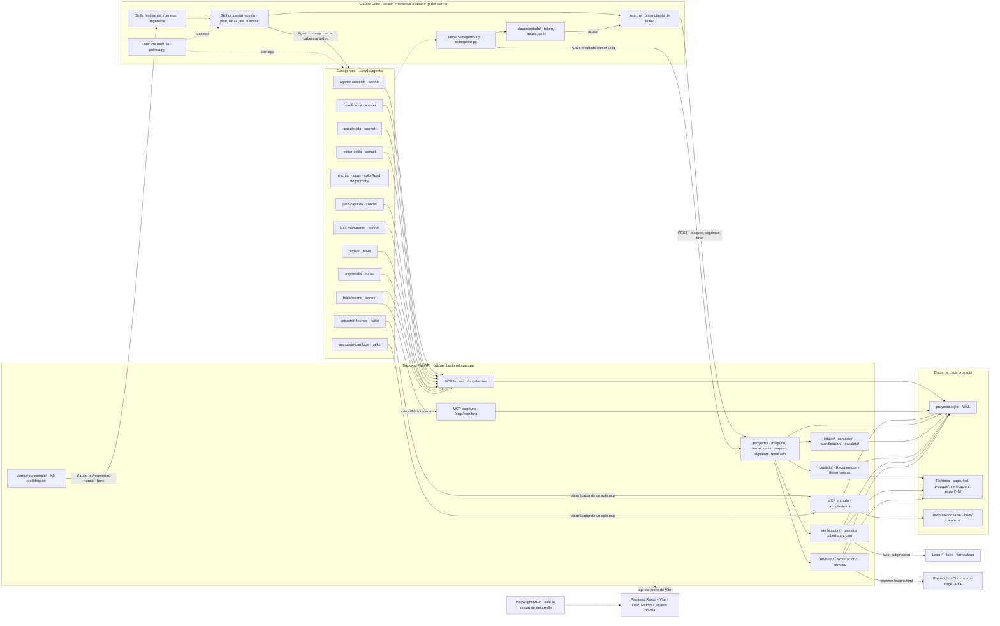
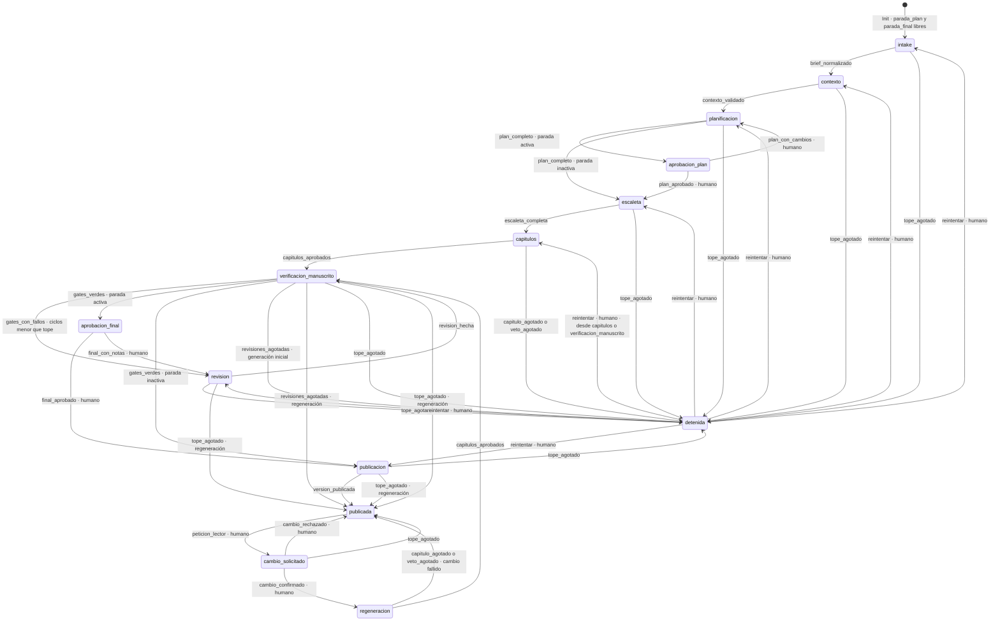
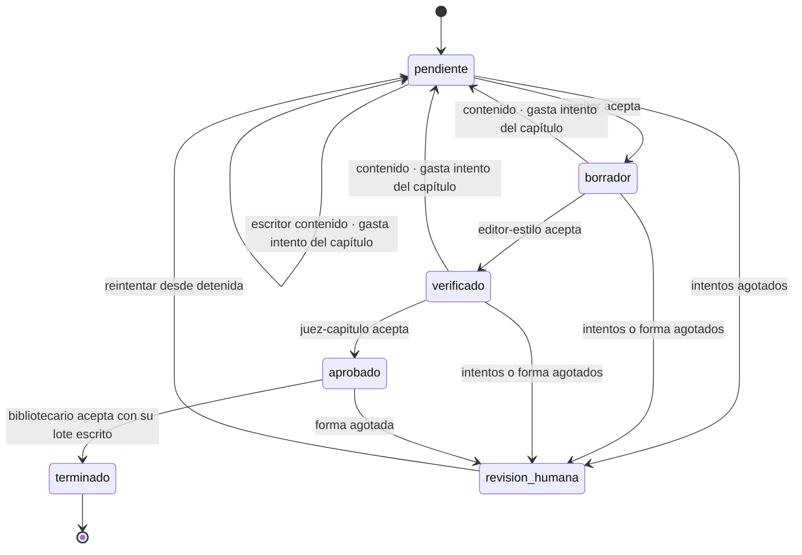

# diagramas.md — Cuatro vistas del sistema

> Propósito: reunir en un sitio cuatro diagramas que hasta ahora había que reconstruir leyendo varios ficheros: la arquitectura del harness, la máquina de estados que comprueba TLC, el esquema SQLite y dónde corre cada validador. Cada diagrama dice de dónde sale. Si no coincide con esa fuente, la que vale es la fuente, y el diagrama hay que corregirlo.

---

## 1. Arquitectura del harness

Cómo leerlo:

- La sesión de Claude Code solo ejecuta y el backend decide. `orquestar-novela` pide a `proyecto/` la siguiente orden, siempre con `msm.py`, y lanza el subagente que esa orden indica. El registro no lo hace la skill: el hook `SubagentStop` envía la salida a `/resultado` con el sello y la skill solo lee el acuse.
- Cada subagente fija su modelo en el campo `model` de su frontmatter. `/mcp/lectura` está en `.mcp.json`. `/mcp/escritura` solo la declara el `mcpServers` del Bibliotecario, y `/mcp/entrada` solo el del Extractor y el del Intérprete. El Escritor no tiene MCP: solo tiene `Read`, y la policy lo limita a `prompts/`.
- La policy (`PreToolUse`) es la segunda barrera. Deniega la escritura en la biblia a quien no sea `bibliotecario` y la entrada a quien no sea el Extractor o el Intérprete. Tampoco deja escribir con las herramientas de fichero en los proyectos ni leer `brief/`, `cambios/` o `texto_libre*`.
- Cada proyecto tiene un `proyecto.sqlite` con sus ficheros al lado. El worker es un hilo del `lifespan` que relanza Claude Code en modo headless, así que el backend nunca llama a un modelo. Lean y Playwright son subprocesos del backend, y Playwright MCP solo lo usa la sesión de desarrollo.

Fuentes: [architecture.md](../architecture.md) §1-§3 y §7-§8, [specs/plan-agentes.md](../../specs/plan-agentes.md) §1-§2, `.claude/settings.json`, `.mcp.json`, `.claude/agents/*.md` (frontmatter), `.claude/harness/politica.py`, `backend/app.py`, `backend/shared/rutas.py`, `frontend/vite.config.js`.

---

## 2. Máquina de estados de TLA+

El bucle de capítulo que el modelo recorre dentro de `capitulos` y `regeneracion` (`EnBucle` y `DesenlaceCapitulo`), con los nombres de estado de la especificación:

Cómo leerlo:

- Cada flecha es una terna `<<origen, destino, causa>>` de `Aristas`, que copia `transiciones.TRANSICIONES`, y `Transitar` aborta con `Assert` ante cualquier otra. Salen sin acción humana las flechas que no llevan «humano». De las cuatro paradas (`aprobacion_plan`, `aprobacion_final`, `publicada` y `detenida`) no sale ninguna automática.
- Cuando una orden que no es de capítulo falla, gasta `intentosPaso`. Al llegar al tope, `DestinoDeFracaso` lleva a `detenida` en la generación inicial y a `publicada` en una regeneración. En `publicada`, `Deshacer` restaura la última versión y marca el cambio `fallido`. Una caída del ejecutor no cambia el estado: reanudar es volver a `Tomar` y `Pedir`, y si ya hay una orden vigente, se vuelve a sellar (AJ-4).
- Los gates se evalúan al pedir la orden del juez de manuscrito, una vez por pasada (AJ-3). Solo con los tres en verde se publica, y cada ciclo de revisión suma `ciclos`, hasta `TopeCiclos`. `reintentar` vuelve a `detenidaDesde`, y desde `verificacion_manuscrito` vuelve a `capitulos` después de reabrir los capítulos en `revision_humana`.
- Hay un fallo que no gasta intento del capítulo: el fallo de forma de un agente posterior al Escritor. Repite ese agente y gasta `intentosPaso`. Un veto agotado (`contenido_veto`) no espera al final del bucle.
- El modelo no incluye las aristas `worker_fallido` del código (§5 de este documento) ni los `error` con causa. Tampoco modela el reloj del bloqueo.

Fuentes: `formal/tla/GrafoNovela.tla`, `formal/tla/GrafoNovela.cfg`, [specs/plan-formal.md](../../specs/plan-formal.md) §1-§2, [architecture.md](../architecture.md) §3.1-§3.4.

### Invariantes y propiedades que comprueba `GrafoNovela.cfg`

| Nombre | Clase | Qué afirma |
|---|---|---|
| `TypeOK` | Invariante | Cada variable tiene su tipo, y un token `actual` solo lo tiene el titular del bloqueo |
| `Coherencia` | Invariante | Es lo que `maquina.incoherencias()` da por supuesto: `detenida` si y solo si `detenidaDesde` tiene valor, un capítulo terminado está `aprobado`, la orden vigente es del estado actual y en `revision` hay capítulos pendientes |
| `Inv2_SinDuplicados` | Invariante | La biblia no recibe más de un lote de escritura por capítulo |
| `Inv2_ReanudarSinCoste` | Invariante | Una reanudación no gasta un intento por encontrar ya canjeado el identificador de un solo uso |
| `Inv2_NoPierde` | Invariante | Un capítulo terminado conserva los deterministas y el Bibliotecario de su versión vigente, salvo mientras lo revisa el Revisor |
| `Inv3_PublicadaCoherente` | Invariante | En `publicada` todo capítulo está aprobado y la versión vigente es la última publicada |
| `Inv4_Topes` | Invariante | `intentosPaso`, `ciclos`, los intentos de cada capítulo y el intento de la orden vigente no pasan de su tope |
| `Inv6_UnSoloEjecutor` | Invariante | Solo vale un token, y nadie escribe en el proyecto mientras otro tiene el bloqueo vigente |
| `Inv1_PublicaVerificado` | Propiedad de acción | Solo se publica con cada capítulo aprobado y verificado, y con los tres gates en verde sobre esas mismas versiones |
| `Inv3_VersionAnterior` | Propiedad de acción | Las versiones publicadas solo se añaden, nunca cambian |
| `Inv5_ParadaHumana` | Propiedad de acción | Una parada activa, o un cambio propuesto en `cambio_solicitado`, solo se deja con una acción humana |
| `Termina` | Liveness | Todo estado que no sea `publicada` ni `detenida` acaba en uno de los dos |
| `CambioTermina` | Liveness | Un cambio confirmado acaba `aplicado` o `fallido` |

### Configuración del modelo (`GrafoNovela.cfg`, la de entrega)

| Constante | Valor | Qué es |
|---|---|---|
| `NCap` | 5 | Capítulos (el código tiene 10) |
| `TopeIntentos` | 2 | Intentos por orden y por capítulo (el código admite 3) |
| `TopeCiclos` | 2 | Ciclos de revisión (el código admite 3) |
| `MaxCambios` | 1 | Cambios del lector |
| `Ejecutores` | `{sesion, worker}` | Dos ejecutores que compiten por el bloqueo |
| `MaxCaidas` | 2 | Caídas de un ejecutor en cualquier punto |
| `MaxCaducidades` | 1 | Caducidades del bloqueo con el titular vivo |
| `MaxReintentos` | 1 | «Reintentar» desde `detenida` |
| `MaxCambiosPlan` | 1 | «Cambios» en `aprobacion_plan` |
| `MaxNotasFinal` | 1 | «Notas» en `aprobacion_final` |
| `MaxAfectados` | 2 | Capítulos que toca una revisión o un cambio |
| `SelloConGeneracion` | `TRUE` | AJ-4: el sello lleva la generación del bloqueo |
| `GatesPorPasada` | `TRUE` | AJ-3: los gates se guardan por pasada |

La especificación que se comprueba es `Spec`: equidad débil en los pasos de cada ejecutor, en `CaducarTrasCaida` y en `HumanoResponde`. `GrafoNovelaRapido.cfg` baja `NCap` a 2. `GrafoNovelaAnterior.cfg` pone AJ-3 y AJ-4 a `FALSE` y **tiene que fallar**.

---

## 3. Esquema SQLite

```mermaid
erDiagram
  proyecto {
    INTEGER id PK "siempre 1"
    TEXT identificador
    TEXT etiqueta "opcional, nombre legible"
    TEXT estado "14 estados"
    TEXT detenida_desde
    INTEGER parada_plan
    INTEGER parada_final
    INTEGER ciclos_revision
    INTEGER intentos_paso
    INTEGER pasadas
    INTEGER generacion_bloqueo
    TEXT bloqueo_titular
    TEXT bloqueo_tipo
    TEXT bloqueo_caduca
  }
  orden {
    INTEGER id PK
    TEXT estado_proyecto
    TEXT agente
    INTEGER capitulo FK
    INTEGER intento
    TEXT entrada
    TEXT cerrada
    TEXT desenlace
    TEXT sello UK
    TEXT metadatos
  }
  transicion {
    INTEGER id PK
    TEXT momento
    TEXT origen
    TEXT destino
    TEXT causa
  }
  decision_humana {
    INTEGER id PK
    TEXT tipo
    TEXT decision
    TEXT notas
    TEXT capitulos
  }
  auditoria {
    INTEGER id PK
    TEXT tipo
    TEXT detalle
  }
  identificador_entrada {
    TEXT huella PK "SHA-256"
    TEXT recurso
    TEXT ruta
    TEXT caduca
    TEXT consumido
  }
  cache {
    TEXT clave PK
    TEXT valor
  }
  llamada_mcp {
    INTEGER id PK
    TEXT agente
    TEXT herramienta
    TEXT argumentos
    TEXT resultado
  }
  brief {
    INTEGER id PK "siempre 1"
    TEXT respuestas
    TEXT ruta_texto_libre
    TEXT normalizado
    INTEGER extraccion FK
  }
  hecho_propuesto {
    INTEGER id PK
    TEXT tipo
    TEXT texto
    TEXT prioridad
    TEXT estado
  }
  contexto {
    INTEGER id PK
    TEXT version_ontologia
    TEXT contenido
    TEXT validado
  }
  personalizacion {
    INTEGER id PK "siempre 1"
    TEXT destinatario
    TEXT ocasion
    TEXT relacion
    INTEGER edad_lector
    TEXT vetos
  }
  hecho {
    TEXT id PK
    TEXT tipo
    TEXT texto
    TEXT prioridad
    TEXT origen
  }
  plan {
    INTEGER id PK "siempre 1"
    TEXT modelo
    TEXT curva_tension
    TEXT tipo_final
    TEXT contenido
  }
  personaje {
    TEXT id PK
    TEXT nombre
    TEXT alias
    TEXT origen
    TEXT arco
    TEXT fecha_nacimiento
  }
  personaje_estado {
    TEXT personaje PK, FK
    INTEGER capitulo PK
    TEXT estado
  }
  personaje_sabe {
    TEXT personaje PK, FK
    INTEGER capitulo PK
    TEXT dato PK
  }
  relacion {
    INTEGER id PK
    TEXT origen FK
    TEXT destino FK
    TEXT tipo
  }
  localizacion {
    TEXT id PK
    TEXT nivel
    TEXT padre FK
    TEXT nombre
    TEXT hito
  }
  localizacion_estado {
    TEXT localizacion PK, FK
    INTEGER capitulo PK
    TEXT estado
  }
  ruta {
    INTEGER posicion PK
    TEXT localizacion FK
    INTEGER dias_viaje
  }
  regla_mundo {
    INTEGER id PK
    TEXT regla
    TEXT limites
    TEXT costes
  }
  objeto {
    TEXT id PK
    TEXT nombre
    TEXT alias
  }
  guia_estilo {
    INTEGER id PK "siempre 1"
    TEXT narrador
    TEXT registro
    TEXT metricas
    TEXT lista_negra
  }
  ficha_capitulo {
    INTEGER numero PK
    TEXT pov FK
    TEXT localizacion FK
    INTEGER dia
    INTEGER tension
    INTEGER palabras_objetivo
    TEXT cierre
    TEXT plantar
    TEXT cobrar
  }
  ficha_capitulo_hito {
    INTEGER capitulo PK, FK
    TEXT hito PK "UNIQUE"
  }
  ficha_capitulo_personaje {
    INTEGER capitulo PK, FK
    TEXT personaje PK, FK
    TEXT papel
  }
  ficha_capitulo_hecho {
    INTEGER capitulo PK, FK
    TEXT hecho PK, FK
  }
  capitulo {
    INTEGER numero PK
    TEXT estado
    INTEGER intentos
    INTEGER version_vigente "sin FK"
  }
  capitulo_version {
    INTEGER id PK
    INTEGER capitulo FK
    INTEGER version "UNIQUE con capitulo e intento"
    INTEGER intento
    TEXT estado
    TEXT ruta
    TEXT ruta_borrador
    TEXT ruta_prompt
    INTEGER dia_fin
    TEXT localizacion_fin FK
  }
  informe {
    INTEGER id PK
    INTEGER capitulo_version FK
    TEXT verificador "UNIQUE con capitulo_version"
    TEXT severidad
    TEXT hallazgos
  }
  evento {
    INTEGER id PK
    TEXT momento "recuerdo"
    INTEGER dia "historia"
    TEXT franja
    TEXT lugar FK
    INTEGER capitulo
    TEXT excluye FK
    TEXT tipo_exclusion
    TEXT hecho FK
  }
  evento_personaje {
    INTEGER evento PK, FK
    TEXT personaje PK, FK
  }
  hecho_uso {
    TEXT hecho PK, FK
    INTEGER capitulo PK
    INTEGER version PK
  }
  inventario {
    TEXT objeto PK, FK
    INTEGER capitulo PK
    TEXT poseedor FK
  }
  presagio {
    INTEGER id PK
    TEXT clave UK
    INTEGER plantar_en
    INTEGER cobrar_en
    INTEGER abierto_en
  }
  presagio_estado {
    INTEGER presagio PK, FK
    INTEGER capitulo PK
    TEXT estado
  }
  glosario {
    INTEGER id PK
    TEXT termino "UNIQUE con capitulo"
    TEXT categoria
    TEXT referencia "sin FK"
    TEXT tipo
    INTEGER capitulo
  }
  resumen {
    INTEGER id PK
    TEXT ambito
    INTEGER numero
    INTEGER capitulo
    INTEGER version
    TEXT texto
  }
  palabra_prohibida {
    INTEGER id PK
    TEXT termino
    TEXT nivel
    TEXT publico
  }
  lista_guardarrail {
    TEXT lista PK
    TEXT hash
    TEXT copiada
  }
  gate_resultado {
    INTEGER pasada PK
    TEXT gate PK "cobertura, lean, juez"
    INTEGER ok
    TEXT detalle
  }
  informe_juez {
    INTEGER id PK
    TEXT evaluacion "UNIQUE con criterio"
    INTEGER version_novela
    TEXT revisor "juez o humano"
    INTEGER ciclo
    TEXT criterio
    INTEGER puntuacion
  }
  cambio_lector {
    INTEGER id PK
    INTEGER version_novela
    INTEGER capitulo
    TEXT ruta_peticion
    TEXT hecho FK
    TEXT valor_anterior
    TEXT valor_nuevo
    TEXT estado
    INTEGER version_publicada
  }
  cambio_capitulo {
    INTEGER cambio PK, FK
    INTEGER capitulo PK
    INTEGER version
  }
  version_novela {
    INTEGER numero PK
    INTEGER cambio FK
    TEXT publicada
  }
  version_novela_capitulo {
    INTEGER version_novela PK, FK
    INTEGER capitulo PK
    INTEGER capitulo_version FK
  }
  trabajo {
    INTEGER id PK
    INTEGER cambio FK
    TEXT estado
    TEXT detalle
  }

  capitulo |o--o{ orden : "capitulo"
  orden |o--o| brief : "extraccion"
  personaje ||--o{ personaje_estado : "historia"
  personaje ||--o{ personaje_sabe : "sabe"
  personaje ||--o{ relacion : "origen"
  personaje ||--o{ relacion : "destino"
  localizacion |o--o{ localizacion : "padre"
  localizacion ||--o{ localizacion_estado : "historia"
  localizacion ||--o{ ruta : "etapa"
  personaje ||--o{ ficha_capitulo : "pov"
  localizacion ||--o{ ficha_capitulo : "localizacion"
  ficha_capitulo ||--o{ ficha_capitulo_hito : "hitos"
  ficha_capitulo ||--o{ ficha_capitulo_personaje : "personajes"
  personaje ||--o{ ficha_capitulo_personaje : "aparece"
  ficha_capitulo ||--o{ ficha_capitulo_hecho : "hechos"
  hecho ||--o{ ficha_capitulo_hecho : "asignado"
  capitulo ||--o{ capitulo_version : "versiones"
  localizacion |o--o{ capitulo_version : "localizacion_fin"
  capitulo_version ||--o{ informe : "informes"
  localizacion ||--o{ evento : "lugar"
  personaje |o--o{ evento : "excluye"
  hecho |o--o{ evento : "hecho"
  evento ||--o{ evento_personaje : "presentes"
  personaje ||--o{ evento_personaje : "presente"
  hecho ||--o{ hecho_uso : "uso"
  objeto ||--o{ inventario : "traspasos"
  personaje |o--o{ inventario : "poseedor"
  presagio ||--o{ presagio_estado : "historia"
  hecho |o--o{ cambio_lector : "hecho"
  cambio_lector ||--o{ cambio_capitulo : "reabre"
  cambio_lector |o--o{ version_novela : "origina"
  version_novela ||--o{ version_novela_capitulo : "punteros"
  capitulo_version ||--o{ version_novela_capitulo : "publicada en"
  cambio_lector |o--o{ trabajo : "regenera"
```

Cómo leerlo:

- Es la base de **un** proyecto: un fichero `proyecto.sqlite` con todas las tablas en `STRICT`. `proyecto`, `brief`, `personalizacion`, `plan` y `guia_estilo` tienen una sola fila (`CHECK (id = 1)`). Solo aparecen las columnas importantes, y los `CHECK` de listas cerradas no se dibujan.
- Las relaciones son solo las `REFERENCES` que existen en el SQL. Algunas columnas parecen claves y no lo son: `capitulo.version_vigente`, `glosario.referencia`, el `capitulo` de `evento`, `hecho_uso`, `resumen` y `cambio_capitulo`, y los números de versión de `cambio_lector` y `informe_juez`. Las tablas que aparecen sueltas no tienen ninguna FK.
- La biblia guarda historia por capítulo (B-2). `personaje_estado`, `personaje_sabe`, `localizacion_estado`, `presagio_estado` e `inventario` llevan en la clave el capítulo desde el que vale cada fila, y el capítulo 0 es el estado que siembra la planificación.
- Tres tablas no admiten cambios: `transicion`, `version_novela` y `version_novela_capitulo`, porque sus triggers abortan cualquier `UPDATE` y cualquier `DELETE`. Un índice único parcial (`orden_una_vigente`) impide que haya dos órdenes sin cerrar. Y la idempotencia de las escrituras la da `UNIQUE (capitulo, version, intento)`.
- En la base no hay texto de prosa ni texto no confiable. Capítulos, prompts y exportaciones son ficheros, y la base guarda sus rutas relativas. El texto libre y las peticiones del lector solo se guardan en `brief/` y `cambios/`.

Fuentes: `backend/shared/esquema.sql` (entero), [architecture.md](../architecture.md) §6.

---

## 4. Validadores y su punto de ejecución

```mermaid
flowchart LR
  E1["Escaleta registrada"] -->|"continuidad dura"| E2["Recuperador ensambla el prompt"]
  E2 -->|"continuidad dura · error inconsistencia"| W1["Escritor"]
  W1 -->|"hook SubagentStop · esquema"| T1["Editor de estilo"]
  T1 -->|"hook · esquema, deterministas y guardarraíl"| T2["Juez de capítulo"]
  T2 -->|"hook · esquema y citas"| T3["Bibliotecario"]
  T3 -->|"hook · esquema y biblia escrita"| T4["Capítulo aprobado"]
  T1 -.->|"alto o bloqueante"| W1
  T2 -.->|"criterio alto"| W1
  T4 --> G1["Gates de la pasada · cobertura y Lean"]
  G1 --> G2["Juez de manuscrito · umbral en el backend"]
  G2 -->|"tres en verde"| P1["Publicación"]
  G1 -.->|"rojo"| R1["Revisor · deterministas · Bibliotecario"]
  G2 -.->|"rojo"| R1
  R1 --> G1
  H1["Revisión humana · misma rúbrica"] -.-> G2
```

| Validador | Tipo | Dónde corre | Si falla | Score en Langfuse |
|---|---|---|---|---|
| Esquema de salida por agente (Pydantic, `MANEJADORES` de cada rebanada) | Programático | Al registrar cualquier salida: `SubagentStop` → `POST /resultado` → manejador del agente | Escritor: fallo de contenido, que gasta `capitulo.intentos`. Agentes posteriores del bucle: fallo de forma; repite el mismo agente y gasta `intentos_paso`. Fuera del bucle: gasta `intentos_paso`, y con el tope agotado, `detenida` o `publicada` con el cambio fallido | `esquema_salida`, uno por orden |
| Validador de contexto (`contexto/validacion.py`, verificador `esquema`) | Programático | Al registrar el Agente de Contexto en `contexto`: defectos, tipos y reglas de coherencia | Todo hallazgo es bloqueante: el proyecto no sale de `contexto` y el Agente de Contexto repite con el informe. Gasta `intentos_paso` | `validador:contexto` |
| Continuidad dura (`capitulo/biblia.py`, `continuidad_antes_de_escribir`) | Programático | Al registrar la escaleta (`escaleta/manejadores.py`) y cuando el Recuperador ensambla el prompt (`capitulo/ensamblado.py`) | Al registrar la escaleta, esta se rechaza y el Escaletista repite. Al ensamblar, la orden es `error` con causa `inconsistencia`, que no gasta intento | sin score propio: desenlace de la orden, con nivel `WARNING` |
| Guardarraíl de palabras prohibidas (`lexico.guardarrail`) | Programático | Al registrar el Editor o el Revisor, primero de `VERIFICADORES`. Deja una línea en `auditoria` sin el término | Bloqueante (`contenido_veto`). Vuelve al Escritor gastando un intento, y con los intentos agotados detiene al momento: `detenida`, o `publicada` con el cambio fallido | `validador:<verificador>`, uno por informe |
| Marcadores de anonimización (`nombres.marcadores`) | Programático | Al registrar el Editor o el Revisor | Bloqueante: vuelve al Escritor y gasta `capitulo.intentos`. Agotados, el capítulo pasa a `revision_humana` | `validador:<verificador>`, uno por informe |
| Frases literales (`nombres.frases_literales`) | Programático | Al registrar el Editor o el Revisor, si la ficha tiene hechos `frase` | Alta: igual que el anterior | `validador:<verificador>`, uno por informe |
| Longitud (`medidas.longitud`) | Programático | Al registrar el Editor o el Revisor | Media: se guarda en `informe` y viaja al siguiente intento; no corta el ciclo | `validador:<verificador>`, uno por informe |
| Métricas de estilo e INFLESZ (`medidas.metricas`) | Programático | Al registrar el Editor o el Revisor | Baja o media: igual que Longitud | `validador:<verificador>`, uno por informe |
| Lista negra de estilo (`lexico.lista_negra`) | Programático | Al registrar el Editor o el Revisor | Baja: igual que Longitud | `validador:<verificador>`, uno por informe |
| Nombres y grafías (`nombres.grafia`) | Programático | Al registrar el Editor o el Revisor, contra el glosario a fecha N−1 | Media: igual que Longitud | `validador:<verificador>`, uno por informe |
| Juez de capítulo (`juez-capitulo`, criterios hito, coherencia, voz y contenido) | Semántico | Rol del bucle, con el capítulo `editado`. El backend fija la severidad de cada criterio y comprueba que las citas estén en el texto | Hito, coherencia y contenido son altos: vuelve al Escritor y gasta un intento. Voz es medio: se registra. Una cita que no está en el texto es fallo de forma | sin score propio: desenlace de la orden, con nivel `WARNING` |
| Biblia del Bibliotecario (`pendiente_del_bibliotecario`; `/mcp/escritura` exige `verificado` y un sello vigente) | Programático | Al registrar el Bibliotecario y en cada escritura por MCP | Fallo de forma: repite el Bibliotecario. En el último intento se borra lo que escribió | sin score propio: desenlace de la orden |
| Cobertura de hechos obligatorios (`verificacion/gates.py`) | Programático | Gate de `verificacion_manuscrito`, al calcular la orden del juez de manuscrito, una vez por pasada | Rojo: `revision` con los capítulos de `detalle.capitulos` y suma un ciclo. Con el tope agotado, `detenida`, o `publicada` con el cambio fallido | `gate:cobertura` |
| Cronología en Lean 4 (`verificacion/cronologia.py`, `formal/lean`) | Formal | El mismo gate: genera `cronologia.lean` y ejecuta `lake` fuera de la transacción | Rojo: `revision` con los eventos implicados. Sin Lean, o con una salida ilegible: `error` con causa `lean_no_disponible`, `cronologia_invalida` o `contexto_incoherente`, que no gasta ciclo | `gate:lean` |
| Juez de manuscrito (`juez-manuscrito`, rúbrica de cinco criterios) | Semántico, con umbral programático | Rol en `verificacion_manuscrito`. El backend exige que sumen 18 o más y que ninguno baje de 3 | Rojo: `revision`, como la cobertura | `gate:juez` y `juez:<criterio>`, de 1 a 5 |
| Revisión humana del manuscrito (`revision/`, `POST /proyectos/{id}/manuscrito/juez`) | Semántico (humano) | Fuera del grafo, con la misma rúbrica y sobre la misma versión de novela que el juez | No cambia el estado ni los gates. Sirve para comparar el criterio humano con el del juez | `humano:<criterio>`, de 1 a 5 |
| TLC sobre `GrafoNovela.tla` | Formal | Solo en desarrollo, a mano con `tla2tools.jar` y Java. Nunca en una generación | Un contraejemplo obliga a corregir el código o la especificación. `GrafoNovelaAnterior.cfg` tiene que fallar | no: solo en desarrollo |

Cómo leerlo:

- Casi todo se valida **al registrar**. El hook `SubagentStop` entrega la salida cruda y el backend la valida, ejecuta los deterministas y escribe la transición. La sesión no valida nada.
- Solo cortan el ciclo del capítulo los hallazgos altos o bloqueantes (`corta_el_ciclo`). Los medios y bajos se guardan en `informe` y llegan al intento siguiente en el bloque «Informe del intento anterior».
- Ninguna versión se publica sin los tres gates en verde en la misma pasada: cobertura, Lean y juez de manuscrito. Cada vuelta por `revision` cuenta como un ciclo, con tope 3.
- La policy del hook `PreToolUse` y las superficies MCP separadas no aparecen en la tabla porque son controles: previenen, pero no verifican nada ([validators.md](../validators.md) §3.1). La columna de Langfuse queda pendiente hasta que se decida la observabilidad (D-3).

Fuentes: [validators.md](../validators.md) §2.6-§2.8 y §3-§4, [architecture.md](../architecture.md) §4-§5, `backend/capitulo/verificadores/`, `backend/capitulo/manejadores.py`, `backend/contexto/validacion.py`, `backend/escaleta/manejadores.py`, `backend/verificacion/gates.py`, `backend/verificacion/modelos.py`, `backend/revision/router.py`, `backend/capitulo/modelos_salida.py`.

---

## 5. Diferencias entre documentos y código vistas al dibujar

- **Nombres de estado del bucle de capítulo.** En el código (`maquina._en_bucle`), `borrador` lanza el Editor, `editado` el juez y `verificado` el Bibliotecario. En la especificación TLA+ (`EnBucle`), `borrador` y `editado` lanzan el Editor, `verificado` el juez y `aprobado` el Bibliotecario. El segundo diagrama de §2 usa los nombres de la especificación.
- **`worker_fallido`.** El código (`transiciones.py`) y [architecture.md](../architecture.md) §3.1 tienen estas aristas, pero la especificación no. [specs/plan-formal.md](../../specs/plan-formal.md) §1 lo declara fuera del modelo.
- **Marcas «pendiente» y «no está en el código».** [specs/plan-formal.md](../../specs/plan-formal.md) §2.4 y §4, y los comentarios de `GrafoNovela.tla` (`EnRevision`, `DesenlaceRevision`, `Deshacer`), dicen que AJ-2 a AJ-6 no están en el código. Pero el código ya tiene `_en_revision` por capítulo, `proyecto.pasadas`, `generacion_bloqueo` y `gate_resultado` por pasada, así que esas marcas parecen desfasadas.
- **Contenido y líneas rojas.** [validators.md](../validators.md) §4 dice que en la v1 nada comprueba el texto contra los límites de contenido. Sin embargo, el juez de capítulo tiene en el código el criterio `contenido` con severidad alta (`SEVERIDAD_DEL_CRITERIO`), como describe [architecture.md](../architecture.md) §4 (B-15).
