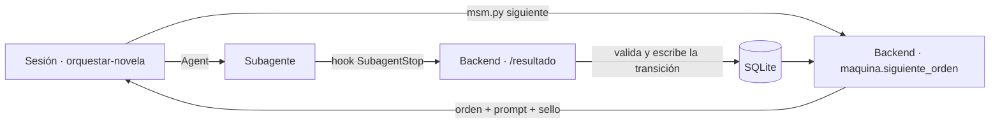

# explainers.md — Los conceptos del curso, aplicados aquí

> Un apartado por concepto: qué es en dos frases, dónde está en este repositorio y por qué se hizo así, con su límite. No repite la teoría ni sustituye a [architecture.md](../architecture.md), que es la fuente de verdad; cada apartado apunta a la sección que lo desarrolla. Lo que aún no existe se marca como **pendiente**.

## Índice

1. [Harness y orquestación determinista](#1-harness-y-orquestación-determinista)
2. [Subagentes y roles](#2-subagentes-y-roles)
3. [Skills y comandos](#3-skills-y-comandos)
4. [Hooks](#4-hooks)
5. [Herramientas tipadas y MCP](#5-herramientas-tipadas-y-mcp)
6. [Context engineering y tope de entrada](#6-context-engineering-y-tope-de-entrada)
7. [Memoria y compactación](#7-memoria-y-compactación)
8. [Checkpoint, reanudación y reintentos](#8-checkpoint-reanudación-y-reintentos)
9. [Salidas estructuradas con Pydantic](#9-salidas-estructuradas-con-pydantic)
10. [Texto no confiable y prompt injection](#10-texto-no-confiable-y-prompt-injection)
11. [Guardarraíles](#11-guardarraíles)
12. [Validadores deterministas y LLM como juez](#12-validadores-deterministas-y-llm-como-juez)
13. [Verificación formal de la historia con Lean 4](#13-verificación-formal-de-la-historia-con-lean-4)
14. [Verificación formal del sistema con TLA+](#14-verificación-formal-del-sistema-con-tla)
15. [Evals y ajuste de prompts](#15-evals-y-ajuste-de-prompts)
16. [Observabilidad](#16-observabilidad)
17. [Browser MCP y verificación visual](#17-browser-mcp-y-verificación-visual)

---

## 1. Harness y orquestación determinista

**Qué es.** El harness es todo lo que rodea al modelo para que haga un trabajo largo sin perderse: bucle, herramientas, estado y controles. Orquestación determinista quiere decir que qué paso toca lo decide código con pruebas, no el modelo.

**Dónde se aplica.** La sesión de Claude Code solo ejecuta el bucle de [orquestar-novela](../../.claude/skills/orquestar-novela/SKILL.md): pedir la orden, lanzar el subagente, leer el acuse. Habla con el backend solo por [msm.py](../../.claude/harness/msm.py). La decisión es [backend/proyecto/maquina.py](../../backend/proyecto/maquina.py): `siguiente_orden`, `aplicar_desenlace` y `aplicar_accion_humana`, funciones puras sobre una instantánea de la base, que solo mueven el proyecto por las aristas de [transiciones.py](../../backend/proyecto/transiciones.py).

**Por qué así y qué límite tiene.** Lo frágil —un modelo aplicando reglas de reintento y parada— pasa a ser código probado con Hypothesis (`backend/proyecto/tests/test_maquina.py`) y modelado en TLA+ (§14). El límite está declarado en [validators.md](../validators.md) §3 (V-18, tipo U): que la sesión ejecute la orden tal como llega no se puede verificar, solo reducir lo que depende de ella. [architecture.md](../architecture.md) §3.3 lista lo que el orquestador no hace.

## 2. Subagentes y roles

**Qué es.** Un subagente es una invocación con su propia ventana, su propio prompt y sus propias herramientas. Separar roles (planificar, escribir, editar, juzgar) evita que quien escribe se juzgue a sí mismo y que cada uno cargue el contexto de los demás.

**Dónde se aplica.** Doce definiciones en [.claude/agents/](../../.claude/agents), una por rol, con `model` y `tools` en el frontmatter: planificación (`planificador`, `escaletista`, en `sonnet`), escritura (`escritor` y `revisor`, en `opus`), edición (`editor-estilo`), crítica (`juez-capitulo`, `juez-manuscrito`), memoria (`bibliotecario`) y tareas de esquema cerrado en `haiku` (`extractor-hechos`, `interprete-cambios`, `exportador`). Reparto y modelos en [architecture.md](../architecture.md) §3.

**Por qué así y qué límite tiene.** El modelo se elige por lo que produce: `opus` solo donde la salida es la prosa, porque el gasto es de suscripción y el control de coste es elegir el modelo por adelantado (§10). El prompt es el cuerpo del fichero, así que git es su historial y el hook toma su SHA-256 como versión de prompt. Límite: las definiciones se cargan al abrir la sesión, y editar un agente exige una sesión nueva (S-12 en [CLAUDE.md](../../CLAUDE.md)).

## 3. Skills y comandos

**Qué es.** Una skill es un paquete de instrucciones que se carga cuando la tarea lo pide; un comando es una skill que la persona invoca por su nombre. Sirven para no repetir procedimiento en cada prompt.

**Dónde se aplica.** En [.claude/skills/](../../.claude/skills): `orquestar-novela` (no invocable por la persona, `user-invocable: false`) es el bucle; `/generar`, `/entrevista` y `/regenerar` son puntos de entrada finos que la llaman, con `disable-model-invocation: true` para que el modelo no los lance por su cuenta. `/regenerar` lo lanza el worker del backend con `claude -p`. Las skills `fastapi`, `react`, `sqlite` y `verificacion` son de desarrollo: corrigen o completan referencias externas.

**Por qué así y qué límite tiene.** El bucle vive en un solo sitio y los tres puntos de entrada lo comparten, así que el comportamiento interactivo y el headless no divergen. `allowed-tools` los limita a `Bash(uv run *)`, `Agent` y `Skill`. Límite: una skill sigue siendo un prompt; lo que no puede fallar no se confía a ella sino al backend o a un hook (§4).

## 4. Hooks

**Qué es.** Un hook es un comando que Claude Code ejecuta en un evento del ciclo de vida, fuera del modelo. Lo que hace un hook no depende de que el modelo se acuerde.

**Dónde se aplica.** Dos, en [.claude/settings.json](../../.claude/settings.json):
- **`PreToolUse` → [politica.py](../../.claude/harness/politica.py).** Solo el `bibliotecario` usa `mcp__escritura__*`; solo el Extractor y el Intérprete usan `mcp__entrada__*`; nadie escribe con herramientas de fichero en `proyectos/`; nadie lee `brief/`, `cambios/` ni `texto_libre*.txt`; el Escritor solo lee dentro de `prompts/`. Cada decisión va al audit log sin el texto de la llamada.
- **`SubagentStop` → [subagente.py](../../.claude/harness/subagente.py).** Es la única vía de registro: envía la salida sin tocarla a `/resultado`, con tokens y versión de prompt, y deja el acuse que lee la skill.

**Por qué así y qué límite tiene.** La policy decide en local y nunca emite `allow`: si el backend está caído, lo denegado sigue denegado. Una regla `deny` de configuración no servía porque alcanza también a los subagentes ([architecture.md](../architecture.md) §7). Límites: en Bash y PowerShell la policy mira el texto del comando, así que es una heurística y deniega también un `git mv` inocuo ([E2](../../evals/e2-injection/results/2026-09-24.md)); y el hook de registro nunca bloquea, para que un reintento sea una invocación nueva y no una continuación (§3.2).

## 5. Herramientas tipadas y MCP

**Qué es.** MCP es el protocolo con el que un agente descubre y llama herramientas de un servidor, cada una con su schema de argumentos. Tipar las herramientas en vez de dar SQL o un shell acota lo que el agente puede pedir.

**Dónde se aplica.** [backend/mcp/](../../backend/mcp), con `fastmcp` montado dentro del FastAPI ([backend/app.py](../../backend/app.py), con los `lifespan` combinados), en tres superficies: [lectura.py](../../backend/mcp/lectura.py) (`leer_ficha`, `leer_personajes`, `leer_resumen_acumulado`…, con `proyecto` y `antes_de` como argumentos), [escritura.py](../../backend/mcp/escritura.py) (solo el Bibliotecario, con el sello de su orden) y [entrada.py](../../backend/mcp/entrada.py) (una sola herramienta de canje, §10). Argumentos con `Annotated` y `Field` de Pydantic; cada llamada queda en `llamada_mcp`.

**Por qué así y qué límite tiene.** MCP no transporta la identidad de quien llama, así que la separación es de configuración: `/mcp/lectura` está en [.mcp.json](../../.mcp.json) y las otras dos solo en el `mcpServers` de su agente, y la sesión principal no las ve. La policy es la segunda barrera. Límite: el servidor sigue sin saber quién llama; lo que no depende de eso —que el capítulo esté verificado, que el sello no sea viejo— lo comprueba el backend dentro de la transacción ([architecture.md](../architecture.md) §7).

## 6. Context engineering y tope de entrada

**Qué es.** Context engineering es decidir qué entra en la ventana del modelo y en qué orden, en vez de volcarlo todo. Aquí se concreta en un tope de 100.000 tokens de entrada por agente, puesto a propósito muy por debajo de la ventana del modelo.

**Dónde se aplica.** El Recuperador de contexto no es un agente sino código: [ensamblado.py](../../backend/capitulo/ensamblado.py) arma el prompt del Escritor por bloques con `TOPE = 100_000` y recorta en `ORDEN_RECORTE` (primero los pasajes por similitud, nunca la ficha), por unidades completas y declarando cada recorte en el propio prompt. [recuperacion_estructurada.py](../../backend/capitulo/recuperacion_estructurada.py) sirve lo que es verdad ahora; [similitud.py](../../backend/capitulo/similitud.py), la prosa anterior parecida. [estimador.py](../../backend/capitulo/estimador.py) cuenta con `o200k_base` × 1,35 (`FACTOR`). Detalle en [architecture.md](../architecture.md) §6.3.

**Por qué así y qué límite tiene.** Un agente que ensamblase su propio contexto solo descubriría el desborde después; el código cuenta antes de enviar, y el Escritor no tiene herramientas MCP para no saltarse la selección. Límites: el estimador no es el tokenizador de Claude, y el factor 1,35 compensa que infracuenta en español; la similitud implementa hoy el caso vacío porque el mecanismo de búsqueda (D-1) está sin decidir; y si ni la ficha sola cabe, la orden es `error` con causa `no_cabe` (D-9, sin decidir).

## 7. Memoria y compactación

**Qué es.** La memoria de un sistema de agentes es lo que sobrevive a una invocación. Compactar es resumir lo antiguo para que el contexto no crezca con la historia.

**Dónde se aplica.** Tres niveles ([architecture.md](../architecture.md) §6.1): la ventana del subagente, un resumen vivo y la biblia persistente, en [backend/shared/esquema.sql](../../backend/shared/esquema.sql) (`personaje_estado`, `inventario`, `presagio_estado`, `evento`, `glosario`…). La biblia guarda historia por capítulo, así que cada consulta es «a fecha de N−1». La tabla `resumen` distingue `ambito` `capitulo` y `acto`: el Bibliotecario escribe cada resumen con presupuesto fijo y, al cerrar un acto, los destila en uno ([architecture.md](../architecture.md) §6.2). Solo el Bibliotecario escribe, por `/mcp/escritura`.

**Por qué así y qué límite tiene.** El resumen es O(actos) y no O(capítulos): en el capítulo 10 viajan dos resúmenes de acto y el del 9, no nueve. La compactación es segura porque el resumen es una vista derivada del nivel 3: se puede tirar y reconstruir. Límite: esa invariante se rompe en cuanto algo viva solo en el resumen; por eso presagios pendientes, inventario vivo y estado de los presentes no se compactan nunca.

## 8. Checkpoint, reanudación y reintentos

**Qué es.** Un checkpoint es un punto persistido desde el que se puede seguir tras una caída. Reintentar con límite es repetir un paso fallido un número acotado de veces y después escalar.

**Dónde se aplica.** El estado del proyecto es una fila de SQLite, y la sesión es un ejecutor sin memoria: reanudar es pedir otra vez la siguiente orden, que está persistida y se devuelve igual mientras siga vigente. La transición se escribe antes de lanzar el siguiente subagente. Escrituras claveadas por `(capitulo, version, intento)` (`UNIQUE` en `capitulo_version`), `TOPE = 3` en [maquina.py](../../backend/proyecto/maquina.py) y `CHECK (intentos BETWEEN 0 AND 3)` en el esquema. Un bloqueo por proyecto ([bloqueo.py](../../backend/proyecto/bloqueo.py), 30 minutos) y un sello con la generación del bloqueo impiden que un ejecutor caído escriba. Pruebas en `backend/proyecto/tests/test_reanudacion.py`.

**Por qué así y qué límite tiene.** El contador vive en la base y no en la ventana, así que una sesión nueva recibe el tercer intento y no empieza de cero. Agotado el tope, el capítulo va a `revision_humana` y la novela a `detenida`, salvo el guardarraíl, que detiene enseguida. Límite declarado en [architecture.md](../architecture.md) §3.2: que cada intento sea una invocación nueva es protocolo; el backend cuenta hasta tres, pero no puede saber si dos intentos salieron de una misma invocación.

## 9. Salidas estructuradas con Pydantic

**Qué es.** Pedir al modelo una salida con forma fija y validarla con un esquema antes de usarla. Una salida que no encaja es un fallo, no algo que se arregla a mano.

**Dónde se aplica.** La ontología es Pydantic v2 como fuente única ([backend/contexto/modelos.py](../../backend/contexto/modelos.py)), y el JSON Schema se genera desde los modelos. Cada rebanada tiene el modelo de salida de sus agentes (p. ej. [capitulo/modelos_salida.py](../../backend/capitulo/modelos_salida.py), con `extra="forbid"`) y un manejador en `<rebanada>/manejadores.py`. [extraccion.py](../../backend/proyecto/extraccion.py) saca el bloque JSON o el Markdown de la salida cruda, y [json_estricto.py](../../backend/proyecto/json_estricto.py) exige JSON RFC 8259.

**Por qué así y qué límite tiene.** El registro es el único punto de entrada de lo que produce un modelo, así que validar ahí cubre a los doce agentes. `extra="forbid"` hace que un campo inventado —por ejemplo, uno inyectado— invalide la salida. Límites: la validación es a posteriori, no restringe la generación, y cada fallo cuesta una invocación entera (gasta intento); y un esquema comprueba la forma, no la verdad: el caso E5 (§15) pasó el esquema con valores cambiados.

## 10. Texto no confiable y prompt injection

**Qué es.** Prompt injection es texto de un tercero que el modelo acaba obedeciendo como si fueran instrucciones. La defensa no es pedirle que no obedezca, sino limitar qué puede hacer lo que obedezca.

**Dónde se aplica.** El texto libre del comprador y las peticiones del lector no viajan en ninguna orden. La orden lleva un identificador opaco `<proyecto>.<secreto>` ([backend/intake/entrada.py](../../backend/intake/entrada.py)), de un solo uso y con caducidad, que solo el Extractor y el Intérprete canjean en [/mcp/entrada](../../backend/mcp/entrada.py). Esos dos agentes no tienen otra herramienta, y su salida es un esquema cerrado ([definitions.md](../definitions.md) §9). La policy (§4) impide leer ese texto desde cualquier otra ventana, y `msm.py brief` lo envía sin imprimirlo.

**Por qué así y qué límite tiene.** Una instrucción inyectada no puede escribir, ni leer la biblia, ni pedir el texto de otro proyecto, y lo que añada fuera del esquema invalida la salida. Límite: un contenido malicioso que cabe en un campo válido —una `frase` literal— sí pasa, y por eso los hechos extraídos los confirma el comprador. La evaluación E2 está **en curso**: la policy ya denegó las lecturas, pero el Extractor aún no se ha ejecutado ([resultado](../../evals/e2-injection/results/2026-09-24.md), [red-team.md](../red-team.md)).

## 11. Guardarraíles

**Qué es.** Un guardarraíl es un control que impide un resultado inaceptable, no uno que mide calidad. Aquí, que una palabra vetada o un término ofensivo no llegue a la novela.

**Dónde se aplica.** [backend/capitulo/verificadores/lexico.py](../../backend/capitulo/verificadores/lexico.py) contra tres listas: global y por público, versionadas en [backend/capitulo/listas/](../../backend/capitulo/listas) (`juvenil.txt` y `adulto.txt` van vacías en la v1), y por novela, los vetos del comprador. Normaliza antes de comparar: minúsculas, sin tildes conservando la ñ, variantes de género y número, palabra entera. Al copiar una lista al proyecto se guarda su hash en `lista_guardarrail`. [nombres.py](../../backend/capitulo/verificadores/nombres.py) bloquea además los marcadores de anonimización (`[NOMBRE_ANONIMIZADO]`…) que un modelo deja en la prosa. [architecture.md](../architecture.md) §4.3.

**Por qué así y qué límite tiene.** Es código propio sin dependencias, y el audit log guarda el id de la palabra y su posición, nunca el término. Agotados los intentos detiene la generación en el acto: un veto no puede quedar en la novela ni marcado. Límite: es léxico, así que una perífrasis lo esquiva; lo semántico lo mira solo el criterio `contenido` del juez de capítulo, y el clasificador de contenido es de fase 2. [validators.md](../validators.md) §3.1 lo clasifica como control, no como método de verificación.

## 12. Validadores deterministas y LLM como juez

**Qué es.** Un validador determinista es código que da siempre el mismo veredicto para la misma entrada. Un LLM como juez es un modelo que evalúa con una rúbrica lo que el código no puede medir.

**Dónde se aplica.** Deterministas en [backend/capitulo/verificadores/](../../backend/capitulo/verificadores) (longitud, métricas de estilo con Szigriszt-Pazos, nombres y grafías, lista negra, guardarraíl), todos con la firma `(cuerpo, vista) -> Informe`, y la cobertura de hechos en [backend/verificacion/](../../backend/verificacion). Jueces: [juez-capitulo](../../.claude/agents/juez-capitulo.md), con cuatro criterios (`hito`, `coherencia`, `voz`, `contenido`) y una cita literal por hallazgo, y [juez-manuscrito](../../.claude/agents/juez-manuscrito.md), cinco criterios de 1 a 5 que pasan con ≥3 en todos y suma ≥18 (`SUMA_MINIMA` en [verificacion/modelos.py](../../backend/verificacion/modelos.py)). [architecture.md](../architecture.md) §4 y §4.1.

**Por qué así y qué límite tiene.** Los deterministas corren primero porque son baratos, y el juez solo ve lo que ya los pasó. Ningún verificador corrige: devuelve severidad y localización, y el backend decide. El juez puntúa y no decide, y una cita que no está en el texto invalida su salida. Límites, en [validators.md](../validators.md) §3 y §5: un juez es inspección (I), no prueba (T), porque su veredicto no es reproducible; su acuerdo con el criterio humano se contrasta con una revisión humana de una novela completa con la misma rúbrica; y los deterministas solo detectan las reglas escritas.

## 13. Verificación formal de la historia con Lean 4

**Qué es.** Verificar formalmente es demostrar una propiedad con un asistente de pruebas, no muestrearla. Aquí se demuestra que la cronología concreta de cada novela no tiene imposibles.

**Dónde se aplica.** El proyecto Lake de [formal/lean/](../../formal/lean) define en [Cronologia/Invariantes.lean](../../formal/lean/Cronologia/Invariantes.lean) tres invariantes sobre listas finitas: `lugarUnico` (nadie en dos lugares a la vez), `sinReaparicion` (nadie aparece tras un evento que lo excluye) y `nacidoAntes` (nadie aparece antes de nacer). [backend/verificacion/cronologia.py](../../backend/verificacion/cronologia.py) genera por novela un fichero con los eventos de la biblia y tres teoremas `by decide +kernel`, y lee una línea JSON con las violaciones. [Pruebas/Casos.lean](../../formal/lean/Pruebas/Casos.lean) trae un caso que infringe cada invariante y casos de control. [specs/plan-formal.md](../../specs/plan-formal.md) §3.

**Por qué así y qué límite tiene.** Es un gate de manuscrito: si Lean falla, los ids de eventos dicen qué capítulos van al Revisor. `decide +kernel` porque `decide` a secas agota la recursión con 80 eventos, y no se usa `native_decide` para no meter el compilador en la base de confianza. Sin Mathlib: basta la librería estándar. Límites: Lean prueba la cronología que registró el Bibliotecario, no la prosa; un evento sin franja se emite como `manana` (M-14) y puede dar falsos positivos en el mismo día; y las pruebas del backend que ejecutan Lean llevan `skipif` si no hay `lake`.

## 14. Verificación formal del sistema con TLA+

**Qué es.** Model checking es recorrer todos los estados alcanzables de un modelo del sistema para comprobar propiedades. Las de seguridad dicen que nunca pasa algo malo; las de liveness, que algo bueno acaba pasando.

**Dónde se aplica.** [formal/tla/GrafoNovela.tla](../../formal/tla/GrafoNovela.tla) modela la función de siguiente orden, la tabla de transiciones, el bloqueo con dos ejecutores y las caídas con reanudación. Seis invariantes de seguridad (de `Inv1_PublicaVerificado` a `Inv6_UnSoloEjecutor`) y la liveness `Termina` / `CambioTermina`: toda generación acaba en `publicada` o `detenida`. Tres configuraciones: `GrafoNovela.cfg` (5 capítulos, 2 intentos, 2 ciclos), `GrafoNovelaRapido.cfg` y `GrafoNovelaAnterior.cfg`, que reproduce el diseño previo a AJ-3 y AJ-4 y tiene que fallar. Correspondencia rama a rama con `maquina.py` en [plan-formal.md](../../specs/plan-formal.md) §2.4.

**Por qué así y qué límite tiene.** Con reintentos, reanudación y regeneración, el grafo deja de caber en pruebas de integración; TLC verifica el diseño y pytest el código ([validators.md](../validators.md) §6). La configuración que debe fallar demuestra que el modelo ve los fallos que motivaron AJ-3 y AJ-4. Límites: el modelo es pequeño y abstrae el contenido y el reloj; la cola y el worker quedan fuera ([plan-formal.md](../../specs/plan-formal.md) §1); y **no hay en el repositorio registro de una ejecución de TLC** —§5 de plan-formal está vacío e [iteraciones.md](../iteraciones.md) I-07 lo deja pendiente—.

## 15. Evals y ajuste de prompts

**Qué es.** Una eval es una entrada fija con un resultado esperado (el oráculo), que se ejecuta contra el sistema real para medir si hace lo que debe. Sirve para ajustar prompts con evidencia en vez de por intuición.

**Dónde se aplica.** Cinco briefs ficticios en [evals/](../../evals), cada uno con `input/` (brief y contexto de referencia) y `results/<fecha>.md`: E1 referencia, E2 inyección, E3 incoherencia temporal (debe saltar Lean), E4 vetos (guardarraíl) y E5 contradicción (validador de contexto). [evals/comprobar.py](../../evals/comprobar.py) comprueba cada brief contra el validador del backend sin leer el texto libre. La tabla está en [evals.md](../evals.md).

**Por qué así y qué límite tiene.** Cada brief ataca una capa concreta, así que un fallo dice qué capa no lo paró. E5 falló y es el ejemplo de ajuste ([iteraciones.md](../iteraciones.md) I-08): el Agente de Contexto «corrigió» la edad y el tono del comprador porque su prompt le pedía a la vez respetar lo dado y que no fallase ninguna regla. El arreglo tiene dos partes: una regla determinista de conservación del brief, que ya está en [backend/contexto/conservacion.py](../../backend/contexto/conservacion.py) y se llama desde `proyecto/manejadores.py`, y el ajuste de prompt v1 → v2, **pendiente** igual que repetir E5. E2 está en curso, E3 y E4 pendientes, y E1 sin resultado registrado.

## 16. Observabilidad

**Qué es.** Observabilidad es poder saber, desde fuera y después, qué hizo el sistema: trazas, tokens, latencias y puntuaciones por paso. En un sistema de agentes es lo que conecta un mal capítulo con el prompt y el intento que lo produjo.

**Dónde se aplica.** [backend/observabilidad/](../../backend/observabilidad/) convierte lo que ya guarda cada base en trazas de Langfuse: la sesión es el proyecto, cada generación y cada cambio del lector son una traza, cada capítulo un span, cada agente una observación con el nombre de su rol y cada llamada MCP una `tool`. Los validadores, Lean y el juez van como scores. Se envía tras cada `/resultado` ([router.py](../../backend/proyecto/router.py)) y a mano con `uv run python -m backend.observabilidad`.

**Por qué así y qué límite tiene.** Envía el backend y no un plugin, porque es quien sabe qué orden, capítulo y validador hay detrás de cada dato, y porque así se envía **solo metadatos**: una prueba escribe un centinela en todos los campos con texto y comprueba que no sale. Cada span y cada score se envía una sola vez, porque Langfuse duplica lo reenviado con el mismo id; la base del proyecto guarda qué salió ya. Límites: el coste lo estima Langfuse desde el modelo y los tokens (con suscripción no hay cargo real); las llamadas MCP no tienen duración propia; y el MCP de Langfuse solo sirve para prompts y consultas, no para escribir trazas.

**Lo que ya existe.** El hook `SubagentStop` lee el transcript ([transcript.py](../../.claude/harness/transcript.py)) y envía a `/resultado` los `metadatos` de cada orden (modelo, tokens de entrada, salida y caché, duración, SHA-256 del prompt). [backend/proyecto/panel.py](../../backend/proyecto/panel.py) los agrega en `GET /proyectos/{id}/metricas`, en tokens y tiempo, nunca en dinero. El plugin de usuario `langfuse-observability` está desactivado en [settings.json](../../.claude/settings.json), porque enviaría el texto de la novela. Esos metadatos son la materia prima que `observabilidad/` envía.

## 17. Browser MCP y verificación visual

**Qué es.** Un browser MCP deja que el agente abra una página, la recorra y haga capturas. Sirve para verificar lo que ve una persona, no solo lo que devuelve la API.

**Dónde se aplica.** Playwright MCP está declarado en [.mcp.json](../../.mcp.json) y activado en `enabledMcpjsonServers` de [settings.json](../../.claude/settings.json), para inspeccionar la lectura web (`frontend/src/lectura/`). Lo usa la sesión de desarrollo, no un agente de la novela ([architecture.md](../architecture.md) §7). El procedimiento y sus resultados se documentan en [browser-mcp.md](browser-mcp.md), que escribe otra sesión y **aún no existe** en el repositorio.

**Por qué así y qué límite tiene.** Separado de los agentes de la novela porque verificar la interfaz es trabajo de desarrollo y no debe tener acceso a los datos del proyecto. Límite: es inspección (I), no prueba automatizada, y la pasada completa —portada, capítulo a 375 px y fichas, en claro y oscuro— figura como pendiente en [specs/plan-multisesion.md](../../specs/plan-multisesion.md).
