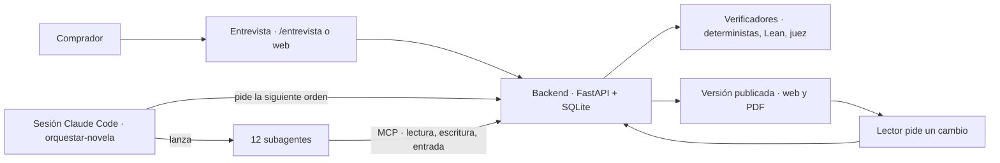

# spec-inicial.md — Qué se decidió construir y por qué

> Propósito: resumir, para quien corrige el proceso, **qué se decidió construir antes de escribir código y con qué razones**. No sustituye a nada: la especificación real es [specs/spec-backend-1.md](../../specs/spec-backend-1.md) (SRS del backend v1) y se queda donde está. Este documento la resume y enlaza las fuentes. Las decisiones una a una, con sus alternativas, están en [trade-offs.md](trade-offs.md).

---

## 1. El problema

Un comprador quiere regalar una **novela de aventura personalizada**: el destinatario, sus seres queridos, sus lugares y sus recuerdos tienen que entrar en la historia como personajes, localizaciones y hechos. El producto tiene **dos objetivos del mismo peso** ([domain-knowledge.md](../domain-knowledge.md), cabecera): que el destinatario se reconozca en la novela y que funcione como historia. Ninguno justifica sacrificar el otro, y la rúbrica del juez de manuscrito los puntúa por igual ([architecture.md](../architecture.md) §4.1).

Lo difícil no es generar prosa, sino que la prosa sea **coherente durante diez capítulos** (quién está dónde, quién sabe qué, quién tiene qué objeto), que **use todos los hechos obligatorios** del comprador, que **respete sus vetos** y que el texto del comprador, que no es de fiar, **no pueda tomar el control** del sistema.

## 2. El dominio antes que el código

Antes de la arquitectura se fijó el dominio, porque sin él no hay nada que validar:

- [domain-knowledge.md](../domain-knowledge.md): árbol de conocimiento en 9 dimensiones (estructura, tono, formato, personajes, mundo, estilo, temas, restricciones y personalización) y el pipeline de decisión (edad del lector → público → límites de contenido; ocasión → tono y final…).
- [definitions.md](../definitions.md): el diccionario de cada nodo con sus valores permitidos y una instancia de ejemplo. Es la base del **objeto de contexto**, que se valida con Pydantic v2 como fuente única (D-4).

## 3. Alcance de la v1

La v1 es la **Fase 1 · Entrega** de [architecture.md](../architecture.md) §11. El detalle, con la justificación de cada fila, está en [spec-backend-1.md](../../specs/spec-backend-1.md) §1.2.

| Dentro | Fuera, y por qué |
|---|---|
| Ontología como esquema y validador de coherencia | Índice semántico y búsqueda de pasajes: mecanismo sin decidir (D-1); la v1 implementa el caso vacío |
| Grafo de estados persistido, siguiente orden, bloqueo y reanudación | Clasificador de contenido y líneas rojas: exigiría una dependencia no acordada. En la v1 lo cubre el criterio `contenido` del juez de capítulo (B-15) |
| Recuperador de contexto con tope de entrada | EPUB y DOCX: el producto se lee en web y se descarga en PDF |
| Verificadores deterministas y guardarraíl de palabras prohibidas | Originalidad contra corpus: fase 2 |
| Biblia de continuidad y acceso por MCP | Multiusuario y autenticación: fase 3; un fichero SQLite por proyecto y un comprador |
| Gates de manuscrito: cobertura, cronología en Lean 4, umbral del juez | Control de coste por token: el gasto es de suscripción, no de API medida |
| Versiones de novela, lectura web y PDF, cambio del lector con regeneración | Cifrado en reposo: en tensión declarada con los ficheros legibles con `grep` (C-4) |
| 12 agentes como subagentes de Claude Code | Prólogo, epílogo, partes e interludios |

## 4. Las piezas principales

- **Backend** (Python, FastAPI, SQLite local, un fichero por proyecto): todo lo que no consume modelo. Estado del grafo, siguiente orden, Recuperador, verificadores, gates, publicación y cola de regeneraciones. **No contiene ningún cliente de modelo** (RNF-10, V-9). Plan: [plan-backend-v1.md](../../specs/plan-backend-v1.md).
- **Configuración de Claude Code**: 12 definiciones de agente (`opus` para la prosa, `sonnet` para planificar y juzgar, `haiku` para salidas cortas en esquema cerrado), la skill `orquestar-novela` y dos hooks (policy y registro de salidas). Plan: [plan-agentes.md](../../specs/plan-agentes.md).
- **Verificación formal**: especificación TLA+ del grafo de estados, pensada para comprobarse con TLC en desarrollo, y un proyecto Lean 4 que comprueba la cronología de cada novela. Plan: [plan-formal.md](../../specs/plan-formal.md).
- **Frontend** (React con Vite): lectura, cambio del lector, métricas y nueva novela. Plan: [plan-frontend.md](../../specs/plan-frontend.md).
- La arquitectura completa (capas, agentes, ciclo de capítulo, modelo de datos, tecnología) está en [architecture.md](../architecture.md), y los métodos de verificación, en [validators.md](../validators.md).

## 5. Principios

1. **El backend decide y la sesión ejecuta.** La sesión de Claude Code pide al backend la siguiente orden, lanza el subagente que indica y el hook registra el resultado. No decide qué paso toca, ni si se reintenta, ni cuándo parar: esa función es código determinista con pruebas, modelada en TLA+ ([architecture.md](../architecture.md) §3.1 y §3.3). Así lo más frágil (un modelo aplicando reglas) pasa a ser código.
2. **El texto del comprador y del lector no es de fiar.** Solo lo leen el Extractor de hechos y el Intérprete de cambios, a través de `/mcp/entrada` y con un identificador de un solo uso; el orquestador nunca lo recibe, y un hook deniega leerlo con las herramientas de fichero. Las salidas van en esquema cerrado, y los hechos extraídos solo entran en el contexto cuando el comprador los confirma (RF-14, RF-15).
3. **Tope de 100.000 tokens de entrada por agente, como disciplina.** No es la ventana del modelo, que es un orden de magnitud mayor: es la decisión de no usarla entera. Un Escritor con la biblia entera escribe peor y más caro; por eso existe el Recuperador, que selecciona por bloques y recorta en un orden fijo en vez de volcar ([CLAUDE.md](../../CLAUDE.md), [architecture.md](../architecture.md) §6.3). Subirlo se mide contra la calidad del capítulo.
4. **Los agentes proponen, los verificadores disponen y la biblia recuerda.** Ningún verificador corrige; solo el Bibliotecario escribe en la biblia, y solo tras la verificación ([architecture.md](../architecture.md) §1).
5. **Suscripción, nunca API de pago.** Los agentes corren en Claude Code con la suscripción; el worker lanza `claude -p`, nunca con `--bare` ([architecture.md](../architecture.md) §7 y §10).
6. **Nada que no esté decidido.** Ninguna dependencia fuera de la tabla de [architecture.md](../architecture.md) §7 (C-7, V-10), y las decisiones abiertas se enumeran en vez de rellenarse ([spec-backend-1.md](../../specs/spec-backend-1.md) §10).

## 6. Cómo se ordenó el trabajo

- [spec-backend-1.md](../../specs/spec-backend-1.md): requisitos (RF, RNF), reglas de negocio, verificación por criterio (V-n) y decisiones abiertas (D-n).
- [plan-backend-v1.md](../../specs/plan-backend-v1.md): el orden de construcción del backend, con el Recuperador antes que los verificadores porque es la pieza con la restricción más dura.
- [plan-entrega.md](../../specs/plan-entrega.md): los hitos H0 a H8 en el orden del pipeline y las decisiones E-1 a E-7.
- [spec-backend-2.md](../../specs/spec-backend-2.md): los recortes R-1 a R-6 y las decisiones de construcción (B-n, TC-n, AJ-n, M-n).
- [plan-agentes.md](../../specs/plan-agentes.md), [plan-formal.md](../../specs/plan-formal.md) y [plan-frontend.md](../../specs/plan-frontend.md): los planes de cada sesión.
- Lo que cambió al construir se registra en [iteraciones.md](../iteraciones.md); los ataques, en [red-team.md](../red-team.md); los resultados de evaluación, en [evals.md](../evals.md).
