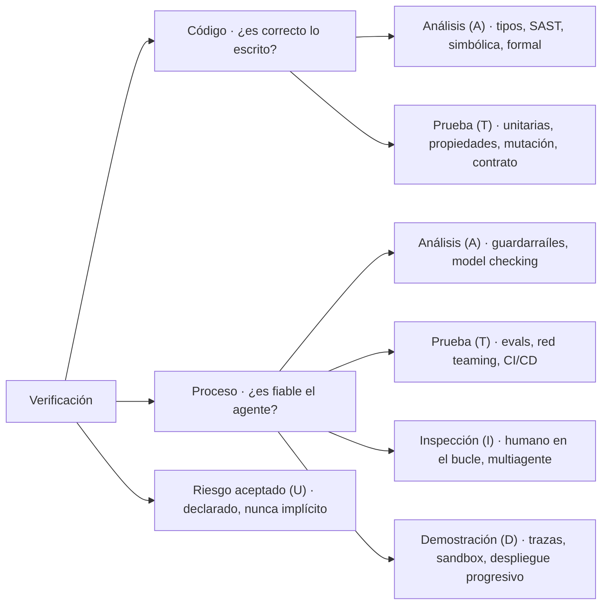

# validators.md — Verificación del código y del comportamiento de los agentes

> Propósito: catálogo de los métodos de verificación que queremos considerar para comprobar que **nuestro código es correcto y que la salida de los agentes es fiable**. No confundir con los verificadores de `architecture.md` §4, que comprueban el **manuscrito** (continuidad, estilo, hitos). Aquellos son parte del producto; estos son parte de cómo lo construimos y lo operamos.
>
> Este documento es un menú, no un compromiso: enumera métodos con su definición y su clasificación. Qué se adopta y en qué fase es una decisión posterior.

---

## 1. Marco de clasificación (Trust Spec)

Cada método se etiqueta según **cómo** obtiene su garantía. La etiqueta aparece en la columna `Tipo` de las tablas siguientes.

| Código | Nombre | Definición |
|---|---|---|
| **T** | Test · prueba | Se verifica ejecutando el sistema contra entradas concretas. |
| **A** | Análisis | Se verifica por razonamiento estático: tipos, SAST, ejecución simbólica o demostración formal. |
| **I** | Inspección | Se verifica porque una persona —o un modelo crítico— lo lee y lo juzga. |
| **D** | Demostración | Se verifica observando el funcionamiento correcto en un escenario realista (staging, sandbox). |
| **U** | No verificable / riesgo aceptado | Ningún método aplica, o no compensa su coste. Se nombra explícitamente en lugar de quedar como supuesto silencioso. |

La categoría **U** es tan importante como las demás: un riesgo declarado es gestionable; un riesgo no declarado, no.

---

## 2. Verificación a nivel de código

¿Es correcto lo que hemos escrito?

| Método | Definición | Tipo |
|---|---|---|
| **Comprobación de tipos** | Comprobación automatizada de que los valores se usan de forma coherente con lo que las operaciones esperan de ellos (p. ej. que nunca se pase una cadena donde se requiere un número). | A |
| **Análisis estático / SAST** | Escaneo del código fuente sin ejecutarlo, buscando coincidencias con patrones conocidos como problemáticos: vulnerabilidades de seguridad, *code smells*, antipatrones. | A |
| **Ejecución simbólica** | Ejecución del código con entradas marcador («simbólicas») para derivar, mediante un resolutor SMT, las condiciones exactas que lo romperían y contraejemplos concretos. | A |
| **Verificación formal / demostración de teoremas** | Demostración matemática de que el código satisface una especificación para **todas** las entradas posibles, no solo para las probadas o exploradas. | A |
| **Pruebas unitarias / de integración** | Comprobación del comportamiento contra entradas de ejemplo concretas y elegidas, con sus salidas esperadas. | T |
| **Pruebas basadas en propiedades** | Especificación de una propiedad general que debe cumplirse para cualquier entrada, y generación automática de muchas entradas para buscar una violación. | T |
| **Pruebas de mutación** | Introducción deliberada de pequeños fallos en el código para comprobar si la batería de pruebas existente los detecta realmente. | T |
| **Pruebas de contrato** | Verificación de que la interfaz (forma de la petición y de la respuesta) entre dos servicios se mantiene coherente, con independencia de los detalles internos de cada lado. | T |

---

## 3. Verificación a nivel de proceso

¿Se está comportando el agente de forma fiable?

| Método | Definición | Tipo |
|---|---|---|
| **Observabilidad / trazas en ejecución** | Instrumentación del agente para que su trayectoria real (llamadas a herramientas, tokens, latencia, errores) sea visible y consultable a posteriori. | D |
| **Evals** | Pruebas estructuradas del comportamiento de un modelo o agente contra un conjunto de datos y un método de puntuación: *golden dataset*, LLM como juez, cumplimiento de tarea, adversariales, en vivo. | T |
| **Ejecución en sandbox** | Ejecución del código del agente en un entorno aislado (contenedor, microVM) para que una acción dañina falle de forma segura en lugar de alcanzar producción. | D |
| **Guardarraíles** | Políticas o filtros que restringen qué acciones o salidas puede producir un agente, **antes** de que actúe. | A |
| **Revisión humana en el bucle** | Una persona aprueba, rechaza o edita las acciones de alta consecuencia del agente, y la decisión se reinyecta como señal de entrenamiento. | I |
| **Verificación multiagente** | Crítico/verificador (un segundo modelo revisa al primero), autoconsistencia (voto mayoritario entre ejecuciones repetidas), debate (dos modelos discuten y un juez decide), reflexión (autocrítica y revisión), ensembles (combinación de modelos distintos). | I |
| **Integración en CI/CD** | Hacer pasar los cambios generados por agentes por la misma tubería, pruebas y revisión que el código escrito por personas, más etiquetado de procedencia. | T |
| **Despliegue progresivo** | Publicar un cambio tras un *feature flag* a un porcentaje pequeño del tráfico, monitorizado antes de la liberación completa. | D |
| **Red teaming / pruebas adversariales** | Sondeo deliberado en busca de fallos bajo un modelo de amenaza adversarial (inyección de prompts, cadenas de mal uso de herramientas, deriva de objetivos, exfiltración de datos), no solo del error ordinario. | T |
| **Model checking** | Exploración exhaustiva de los estados y transiciones alcanzables por un agente para verificar invariantes (p. ej. «nunca borrar antes de hacer copia de seguridad»). Es el análogo de la ejecución simbólica para flujos multiagente. | A |

---

## 4. Resumen

