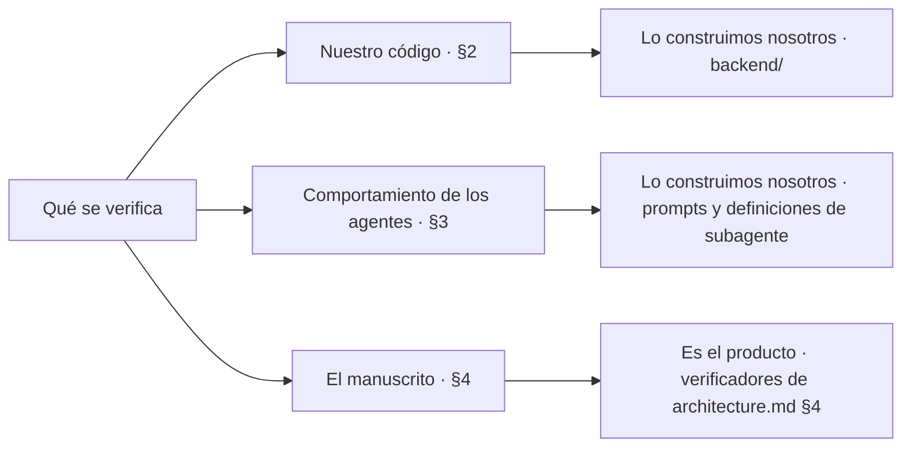
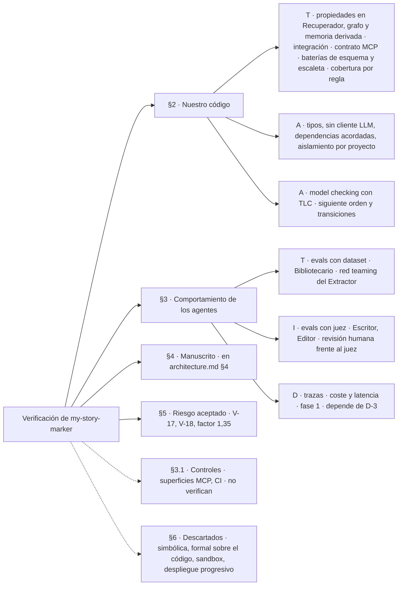

# validators.md — Cómo se verifica `my-story-marker`

> Propósito: registrar **qué método sostiene cada afirmación que hacemos sobre este sistema**, pieza por pieza. No es un catálogo de métodos de verificación en abstracto: es el reparto concreto para el generador descrito en [architecture.md](architecture.md).
>
> Tres documentos se tocan aquí y conviene saber cuál manda en qué:
>
> - La skill `verificacion` es el **procedimiento**: cómo se elige un método para una afirmación nueva. No repite este reparto.
> - Este documento es el **reparto por pieza**: qué método cubre cada pieza de la arquitectura, y qué se ha descartado y por qué.
> - [specs/spec1.md](../specs/spec1.md) §9 es el **criterio de aceptación por requisito** del backend v1: `V-1` a `V-35`. Cuando una fila de aquí tiene un `V-n`, ese es su enunciado exacto y este documento no lo reescribe.
>
> La dirección importa: si las dos vistas discrepan, manda `spec1.md`, porque un criterio de aceptación es un compromiso y esto es su mapa.

---

## 1. Marco de clasificación

Cada método obtiene su garantía de una forma distinta. La etiqueta dice **cuál**.

| Código | Nombre | Definición |
|---|---|---|
| **T** | Test · prueba | Se verifica ejecutando el sistema contra entradas concretas. |
| **A** | Análisis | Se verifica por razonamiento estático: tipos, SAST, ejecución simbólica o demostración formal. |
| **I** | Inspección | Se verifica porque una persona —o un modelo crítico— lo lee y lo juzga. |
| **D** | Demostración | Se verifica observando el funcionamiento correcto en un escenario realista. |
| **U** | No verificable / riesgo aceptado | Ningún método aplica, o no compensa su coste. Se nombra explícitamente en lugar de quedar como supuesto silencioso. |

**`U` no etiqueta métodos, etiqueta afirmaciones.** Ningún método es «no verificable»: lo que puede serlo es una afirmación concreta para la que no exista método que la sostenga. Por eso `U` no aparece como fila de ningún catálogo y sí aparece en §2, §3 y sobre todo en §5.

El orden habitual de coste creciente es **A → T → D → I**. Si los tipos ya lo garantizan, no se escribe una prueba; si una prueba lo cubre, no se monta un escenario de demostración; y no se gasta juicio —humano o de modelo— en lo que una prueba decide sola.

### 1.1 Las tres cosas que se verifican en este proyecto

Se confunden constantemente y una afirmación que las mezcla no se puede comprobar.

| Qué | Dónde se reparte | Ejemplo de afirmación |
|---|---|---|
| **Nuestro código** | §2 de este documento | «El Recuperador nunca emite un prompt que supere el tope estimado de 100.000 tokens» |
| **El comportamiento de los agentes** | §3 de este documento | «El Bibliotecario extrae de un capítulo aprobado los hechos que realmente contiene» |
| **El manuscrito** | [architecture.md](architecture.md) §4 — **no aquí** | «El capítulo 7 no contradice la biblia» |

La tercera es **parte del producto**: sus verificadores (Continuidad dura, Hito estructural, Coherencia blanda…) son funcionalidad que entregamos, con su propia política de reintentos, y no métodos de nuestro proceso de construcción. Aparecen en §2 de este documento solo en un sentido: como **código nuestro que hay que verificar** —¿detecta el verificador de inventario lo que dice detectar?—, nunca como método que verifique algo nuestro.

---

## 2. Verificación de nuestro código

Recorre las piezas de [architecture.md](architecture.md) §8 en el orden de construcción de [spec1.md](../specs/spec1.md) §12. La columna `Criterio` remite al enunciado exacto en `spec1.md` §9; `—` significa que la afirmación aún no tiene criterio escrito allí, y lo que se hace entonces está en §8, punto 2. Entre paréntesis, el fichero de pruebas que lo sostiene, relativo a `backend/`.

Tres cosas sobre el alcance de este reparto, para que ninguna quede como omisión silenciosa:

- **Cubre los requisitos de prioridad `M`.** Los `S` y los `C` de [spec1.md](../specs/spec1.md) §4 —historial de transiciones, preguntas pendientes del *intake*, Chéjov a nivel de escaleta, desviación porcentual de Longitud, auditoría de llamadas MCP— no tienen fila todavía. No es que no se verifiquen: es que aún pueden caerse del alcance, y un compromiso de verificación sobre algo que quizá no se construya es ruido.
- **`mcp/` se trata entero en §2.7**, aunque el orden de construcción parta su superficie de lectura (paso 5) de la de escritura (paso 8). Partir la sección en dos por seguir el orden dispersaría un contrato que es uno solo.
- **`verificacion/` y `revision/` están en §2.8.** Son de la v1: los gates de manuscrito los exige la entrega.

### 2.1 `shared/` — conexión, pragmas y tipos

| Afirmación | Método | Tipo | Criterio |
|---|---|---|---|
| Toda conexión a SQLite lleva `journal_mode=WAL`, `foreign_keys=ON` y `busy_timeout` | Prueba unitaria que abre una conexión por la vía pública y consulta los tres pragmas | T | — |
| Las rutas del proyecto funcionan igual en Windows y en Linux | Suite completa ejecutada en ambos sistemas | T | V-8 |
| El código es coherente en tipos | Comprobación estática de tipos | A | V-6 |

El pragma es el caso de libro de «elige la garantía más barata»: la tentación es confiar en que `shared/` lo hace bien porque está en un sitio único. No basta. Un `foreign_keys` olvidado **no da error**, solo deja filas huérfanas meses después ([architecture.md](architecture.md) §8), así que es exactamente la clase de fallo silencioso que exige una prueba y no una revisión.

### 2.2 `contexto/` — el validador de la ontología

| Afirmación | Método | Tipo | Criterio |
|---|---|---|---|
| Una instancia válida del ejemplo de [definitions.md](definitions.md) §12 pasa, y una instancia que infringe una regla concreta falla señalando esa regla | Batería de instancias válidas e inválidas, una por regla de RF-20 a RF-27, con las dos de B-18: `excluye` solo en un hecho `evento`, y a la fuente de un personaje real que exista (`contexto/tests/test_validacion.py`) | T | V-11 |
| El fallo de esquema no deja salir del estado `contexto` | Prueba de integración sobre el grafo | T | V-20 |
| La batería cubre de verdad las reglas y no solo las ejecuta | Cobertura por regla (R-5): cada regla tiene una prueba que la dispara y otra de control que no (`contexto/tests/test_validacion_limites.py`) | T | V-15 |

La mutación se retiró el 2026-09-23 por tiempo (R-5, [iteraciones.md](iteraciones.md) I-03). Lo que queda es su versión barata: una batería que pasa siempre no sobrevive a exigir, regla a regla, un caso que dispare y otro que no.

**V-11 y V-20 no son la misma prueba y conviene no fundirlas.** V-11 comprueba que el validador *detecta* la infracción; V-20, que el hallazgo *bloquea* la transición. Un validador impecable cuyo informe nadie consulta antes de avanzar deja pasar un contexto incoherente, y lo que se rompe entonces no es el estado `contexto`: es la novela siete capítulos después. Son dos piezas distintas —el validador y el grafo— y cada una puede fallar sola.

La forma de la batería la fija **D-4**, ya resuelta ([spec1.md](../specs/spec1.md) §10): Pydantic v2 como fuente única, así que cada regla es un validador de modelo y cada caso inválido, un `ValidationError` con su ruta.

### 2.3 `proyecto/` — el grafo de estados

| Afirmación | Método | Tipo | Criterio |
|---|---|---|---|
| Matar el proceso en cualquier estado y reanudar pierde como mucho el trabajo de un subagente | Prueba de integración que mata y reanuda en cada estado del grafo | T | V-1 |
| El diseño del grafo —tabla de transiciones, función de siguiente orden y bloqueo— cumple sus invariantes de seguridad y su liveness | Model checking: especificación TLA+ verificada con TLC sobre un modelo pequeño | A | V-25 |
| La siguiente orden es determinista, respeta la tabla de transiciones y nunca supera los topes | Propiedades sobre estados generados | T | V-33 |
| Dos ejecutores nunca trabajan a la vez sobre el mismo proyecto, y un bloqueo caducado se puede retomar; al retomarlo sube la generación y el sello viejo se rechaza (AJ-4) | Prueba de integración (`proyecto/tests/test_bloqueo.py`, `test_bloque2.py`) | T | V-34 |
| Repetir un paso ya completado no duplica filas ni ficheros | Prueba basada en propiedades sobre paso × número de repeticiones | T | V-2 |
| No existe secuencia de llamadas que salga de una parada humana activa, ni de `publicada`, `cambio_solicitado` o `detenida`, sin acción humana, salvo las aristas escritas del tope y del worker | Prueba de integración sobre la tabla y por la API (`proyecto/tests/test_api_grafo.py`, `test_maquina.py`, `test_persistencia.py`) | T | V-14 |
| El contador de intentos sobrevive al reinicio y el tope de 3 sigue significando algo | Las mismas pruebas de V-1 y V-2, leyendo el contador tras el reinicio | T | V-1 |

Las propiedades entran aquí porque la idempotencia **es** una propiedad —«para cualquier paso y cualquier `n`, el resultado de repetirlo `n` veces es el de ejecutarlo una»— y escribirla como ejemplos concretos es peor forma de decir lo mismo.

La última fila no necesita método propio porque el contador **es estado en la fila del capítulo** ([architecture.md](architecture.md) §3.2): si V-1 demuestra que el estado sobrevive al reinicio y V-2 que repetir un paso no lo duplica, el contador va dentro. Lo que esas pruebas no alcanzan —si dos intentos salieron de dos invocaciones o de una— es V-18, y está en §5.

### 2.4 `planificacion/`, `escaleta/` y la biblia

Es el paso 4 del orden de construcción y la sección más nueva de este reparto: lo que aquí se comprueba es que el material sobre el que después trabaja el Recuperador esté bien formado antes de que se escriba una sola línea de prosa.

| Afirmación | Método | Tipo | Criterio |
|---|---|---|---|
| El número de fichas de capítulo coincide con el del contexto y el reparto por actos respeta los porcentajes | Batería de escaletas válidas e inválidas (`escaleta/tests/test_manejador.py`) | T | V-21 |
| Cada hito obligatorio del modelo estructural aparece en **exactamente una** ficha | La misma batería, con casos de hito ausente y de hito duplicado | T | V-21 |
| Compactar un acto no pierde nada: lo compactado sigue reconstruible desde los capítulos aprobados | Propiedades sobre proyectos sintéticos con actos ya cerrados (`capitulo/tests/test_biblia.py`) | T | V-22 |
| Presagios pendientes, estado de los personajes presentes e inventario vivo nunca se compactan | Pruebas unitarias sobre el compactado | T | — |
| El intake descarta los datos excluidos sin rechazar el brief y registra el descarte sin el valor | Pruebas con entrevistas y hechos que contienen cada tipo de dato excluido | T | — |

**Las dos direcciones del hito fallan distinto, y por eso los casos son dos.** Un hito que no aparece en ninguna ficha deja la novela sin su punto de giro; un hito repartido entre dos lo cuenta dos veces y rompe la curva de tensión. Una batería que solo probase la primera daría verde a la segunda.

**V-22 es la fila que más se echaba de menos.** [architecture.md](architecture.md) §6.1 apoya toda la compactación en una invariante —el nivel 2 es vista derivada del nivel 3, nunca fuente de verdad— y la enuncia con su propia condición de fallo: «en el momento en que algo viva solo en el nivel 2, la compactación pasa a ser pérdida de datos». Es una afirmación de reconstruibilidad universal, o sea una propiedad, y sin ella el resumen acumulado es un sitio donde los hechos desaparecen en silencio al cerrar un acto. La última fila es su complemento por el otro lado: lo que la compactación tiene prohibido tocar.

Quedan fuera dos comprobaciones de prioridad `S` —cada localización clave enlazada a un hito, y la regla de Chéjov a nivel de escaleta— por la regla de alcance declarada al principio de §2.

### 2.5 `capitulo/` — el Recuperador de contexto

Es la pieza con más superficie verificable del backend, porque es la que tiene la restricción dura.

| Afirmación | Método | Tipo | Criterio |
|---|---|---|---|
| Recuperación estructurada: misma entrada → mismo resultado, byte a byte | Propiedades sobre entradas generadas + comparación exacta de salida (`capitulo/tests/test_ensamblado.py`, como V-4, V-5 y V-23) | T | V-3a |
| Recuperación por similitud: misma entrada y mismo estado del índice → mismo resultado, empates incluidos | Propiedades con el índice congelado | T | V-3b |
| Ningún ensamblado supera el tope **según el estimador**; si recorta, el informe de recorte es no vacío; todo lo recortado son unidades completas | Propiedades con biblias sintéticas grandes; ningún bloque emitido es prefijo de sí mismo | T | V-5 |
| Desde un hallazgo de un informe se llega al fichero de prompt exacto | Prueba de integración que resuelve la cadena entera | T | V-4 |
| El vacío de la similitud no emite encabezado ni registra recorte; el vacío de la estructurada aborta con mensaje accionable | Pruebas por rama, una por cada lado de la asimetría | T | V-23 |
| Si ni la ficha sola cabe, el ensamblado falla de forma ruidosa y no envía nada: la orden es `error` con causa `no_cabe` | Prueba con una ficha sintética por encima del tope | T | — |
| El estimador cuenta antes de enviar, con el factor dentro, y su respaldo en Python puro reproduce los ids de `o200k_base` | Pruebas del estimador y del BPE; la de paridad con `tiktoken` se salta donde su extensión no carga (`capitulo/tests/test_estimador.py`, `test_bpe.py`) | T | RF-52 |
| El encabezado de subordinación de los pasajes es constante y no se redacta al vuelo | Comprobación estática: el texto es una constante del módulo | A | — |
| **El factor de inflación de 1,35 basta**: el estimador nunca infracuenta los tokens reales de Claude | **Ninguno** — ver §5 | **U** | — |

**V-23 existe porque V-5 cubre la implicación contraria.** V-5 comprueba que si el Recuperador recorta, lo declara. Lo que no comprueba es que si **no** recortó nada, no declare nada: un bloque de similitud vacío que se registrase como recorte convertiría el caso más corriente de todos —el capítulo 1, que no tiene nada anterior— en un informe con una pérdida inventada. Y por el otro lado, el vacío de la recuperación estructurada es una inconsistencia de datos que debe abortar: una ficha que declara presente a un personaje que la biblia no conoce ([architecture.md](architecture.md) §6.3). La asimetría es el contrato, así que se prueba por ramas.

La fila del caso patológico es **D-9** ([spec1.md](../specs/spec1.md) §10) mirada desde aquí. La decisión de qué hacer cuando ni la ficha cabe sigue abierta, pero el comportamiento provisional no lo está: fallar ruidosamente. Eso es comprobable hoy y no tiene por qué esperar a la decisión — de hecho, la prueba es lo que impide que alguien «resuelva» D-9 sobre la marcha truncando en silencio. Cuando D-9 se cierre, esta fila cambia de método y gana criterio.

La última fila es el ejemplo más limpio del marco en este proyecto. El tope es de 100.000 tokens y lo que hay para medirlos es un tokenizador de otro proveedor con un margen encima ([architecture.md](architecture.md) §6.3). Se puede verificar con `T` que **el estimador se respeta**; no se puede verificar que **el estimador acierta**, porque no existe la verdad contra la que compararlo: `count_tokens` de la API de Anthropic exigiría una clave que no tenemos, y tenerla metería una llamada de red en el camino crítico y rompería el determinismo que V-3a exige. La promesa de RNF-05 está redactada exactamente en ese nivel —no se rebasa el tope *estimado*— y esta fila es la razón.

### 2.6 `capitulo/` — los verificadores deterministas

Aquí el objeto verificado es **nuestro código**, no el manuscrito. Lo que se comprueba es que el verificador detecte lo que dice detectar.

| Afirmación | Método | Tipo | Criterio |
|---|---|---|---|
| Continuidad dura antes de escribir (R-2: presentes excluidos a fecha N−1 y tiempo de viaje de RF-76) dispara ante cada infracción y **no** dispara en los casos de control | Fichas y biblias construidas para infringir cada regla, más casos de control (`capitulo/tests/test_ensamblado.py`, `escaleta/tests/test_manejador.py`) | T | V-12 |
| Longitud, métricas de estilo, lista negra y nombres devuelven informe con severidad y localización, y nunca corrigen | Pruebas unitarias por verificador | T | — |
| Ninguna salida de subagente mal formada se persiste, y cada una cuenta como intento | Por agente, salidas válidas y mal formadas (`capitulo/tests/test_manejadores.py`) | T | V-35 |
| El guardarraíl detecta cada nivel —global, por público, por novela— y las variantes de acento y plural, y no dispara en los casos de control | Pruebas por nivel y por variante (`capitulo/tests/test_verificadores.py`, como V-7, V-15 y las frases literales de V-28) | T | V-26 |
| Las frases literales se detectan en los capítulos que las usan | Pruebas con frases presentes y ausentes | T | V-28 |
| Los deterministas de un capítulo terminan en segundos | Prueba con capítulo de tamaño máximo y umbral de tiempo | T | V-7 |
| La batería detecta un verificador roto y no solo lo ejecuta | Cobertura por regla (R-5): cada regla de cada verificador, una prueba que la dispara y otra de control que no | T | V-15 |
| **Los deterministas detectan toda incoherencia real** | **Ninguno** — ver §5 | **U** | V-17 |

Los casos de control de V-12 no son un adorno. Un verificador de continuidad que dispara siempre pasaría cualquier batería que solo probase infracciones, y en producción convertiría los tres intentos de cada capítulo en ruido.

La latencia es `T` y no `D` porque aquí sí hay un umbral que se puede afirmar en una prueba: entrada acotada (un capítulo de tamaño máximo), sin red y sin modelo. Lo que en este proyecto sí es `D` está en §3.

La legibilidad es el índice de Szigriszt-Pazos con la escala INFLESZ (**D-6**, resuelta en [spec1.md](../specs/spec1.md) §10). Como se calcula en código propio, el conteo de sílabas es código nuestro y necesita sus propias pruebas con palabras de silabeo conocido.

### 2.7 `mcp/` y `exportacion/`

| Afirmación | Método | Tipo | Criterio |
|---|---|---|---|
| Solo el Bibliotecario puede invocar las herramientas de escritura | Análisis estático de las definiciones de agente (quién declara `/mcp/escritura`) y prueba del hook de policy con y sin `agent_type` de Bibliotecario (`.claude/tests`); del lado del backend, la escritura exige el sello de una orden vigente del Bibliotecario (`mcp/tests/test_lectura_escritura.py`) | A + T | V-13 |
| Ninguna escritura en la biblia entra antes de que el capítulo esté verificado | Prueba de integración: se rechaza si el capítulo no está `verificado` o posterior, y se acepta cuando sí lo está (`mcp/tests/test_lectura_escritura.py`) | T | V-19 |
| La exportación a Markdown respeta la titulación del contexto y la publicación solo es posible con los gates en verde | Prueba de integración (`exportacion/tests/test_publicar.py`) | T | — |
| `lectura.json` tiene la forma de plan-frontend §5 y el PDF lleva la página de novedades con enlaces internos que resuelven | Pruebas de la lectura y del PDF con `pypdf`; las que imprimen se saltan sin navegador (`exportacion/tests/test_lectura.py`, `test_pdf.py`) | T | — |
| Publicar una versión nunca modifica las anteriores | Propiedades sobre secuencias de publicaciones (`exportacion/tests/test_publicar.py`) | T | V-30 |
| Una regeneración toca exactamente los capítulos que usan el hecho, más los que corrija el Revisor | Prueba de integración (`cambio/tests/test_cambio.py`, con la parte de V-29 que toca a la petición del lector) | T | V-31 |
| El worker lanza `claude -p` una vez, respeta el bloqueo y deja el trabajo `fallido` si el proceso falla, se cuelga o muere | Prueba con un `claude` falso lanzado con `sys.executable` (`cambio/tests/test_worker.py`); la prueba con el `claude` real es manual | T | TC-10 |

La primera fila combina **análisis y prueba** porque el permiso vive en dos sitios: en la configuración —quién declara la superficie de escritura, que se lee en el repositorio sin ejecutar nada— y en el hook de policy, que es código y se prueba con llamadas con y sin el `agent_type` del Bibliotecario. Un servidor MCP no puede saber quién llama, así que una prueba de contrato contra el servidor solo no demostraría nada. Juntas son lo que hace que RN-1 deje de ser una convención de prompt.

**La segunda fila no es un caso de lo mismo, y por eso tiene criterio propio.** RN-1 dice *quién* escribe y RN-2 dice *cuándo* se puede escribir. Separarlas no es purismo: [architecture.md](architecture.md) §7 deja escrito que la comprobación de que el capítulo esté verificado «sigue viviendo en el backend de todos modos, porque esa no depende de quién llame». Es decir, la arquitectura las separa a propósito, y un reparto que las fundiera daría por cubierta con una prueba de contrato una regla que ninguna prueba de contrato puede alcanzar: el Bibliotecario tiene el permiso y aun así no debe poder escribir antes de tiempo.

### 2.8 `verificacion/` y `revision/` — gates de manuscrito

| Afirmación | Método | Tipo | Criterio |
|---|---|---|---|
| El gate de cobertura bloquea si un hecho obligatorio no se usa en ningún capítulo | Pruebas con hechos obligatorios sin uso y casos de control (`verificacion/tests/test_gates.py`) | T | V-28 |
| El fichero Lean generado es el mismo para la misma biblia, y la comprobación falla con cada invariante infringida | Cronologías construidas para infringir cada invariante, y casos de control; la que ejecuta Lean de verdad lleva `skipif` sin `lake` (`verificacion/tests/test_gates.py`) | T | V-27 |
| El umbral del juez se aplica bien en sus bordes: sumas 17 y 18, y un criterio a 2 | Informes construidos en los bordes del umbral (`verificacion/tests/test_juez.py`) | T | V-32 |
| Todo fallo de gate vuelve al Revisor y después a verificar, con el tope de ciclos | Prueba de integración sobre el grafo | T | — |

### 2.9 Transversales del repositorio

| Afirmación | Método | Tipo | Criterio |
|---|---|---|---|
| `backend/` no contiene ninguna llamada a un proveedor de modelos | Análisis estático: búsqueda de importaciones de proveedores | A | V-9 |
| El fichero de dependencias no contiene nada ausente de la tabla de [architecture.md](architecture.md) §7 | Comprobación del fichero de dependencias contra esa tabla | A | V-10 |
| Un proyecto no puede tocar los ficheros de otro | Análisis estático: toda ruta y toda conexión se derivan de la disposición de directorio de `shared/` | A | V-24 |

Las tres son `A` y no `T` a propósito: son afirmaciones sobre el **texto del repositorio**, no sobre su comportamiento en ejecución. Ejecutarlo para comprobarlas sería más caro y menos concluyente —una importación que nunca se ejecuta en la ruta probada seguiría ahí—.

**La tercera fila es nueva y venía de un agujero de este documento.** El aislamiento por proyecto era el único requisito no funcional cuyo método en `spec1.md` §7 era «por construcción», o sea ninguno, y aquí no tenía fila — mientras §6 lo usaba como argumento para descartar la ejecución en sandbox. Un método descartado apoyándose en una afirmación que nadie sostiene es exactamente el supuesto silencioso que §1 prohíbe. «Por construcción» sí tiene traducción al marco: es `A`, se lee en el repositorio y no hace falta ejecutar nada.

### 2.10 `frontend/`

Las filas de [plan-frontend.md](../specs/plan-frontend.md) §8:

| Afirmación | Método | Tipo | Criterio |
|---|---|---|---|
| El contrato de `lectura.json`, las rutas y el filtro HTML se cumplen | `node:test` | T | — |
| El frontend compila | `vite build` | A | — |
| La lectura se ve bien (portada, capítulo a 375 px, fichas, claro y oscuro) | Capturas del navegador con Playwright MCP | I | — |
| Cada `export/vN/lectura.json` que genera el backend pasa el validador del frontend | `npm run validar-lectura` sobre el fichero generado | T | — |

**Sobre V-6, V-10 y V-24: aquí se enuncian sin «en CI».** `spec1.md` §9 dice «comprobación estática de tipos en CI» y «comprobación en CI del fichero de dependencias»; este documento quita esa coletilla a propósito, y es la única vez que reformula un enunciado de §9. El motivo está en §3.1: CI **ejecuta** métodos, no es uno. Dónde corre una comprobación es logística; la garantía la da el análisis estático, corra donde corra.

---

## 3. Verificación del comportamiento de los agentes

Los agentes son subagentes de Claude Code y el backend no llama a ningún modelo, así que lo que aquí se verifica no es código del backend sino prompts y definiciones de subagente. La decisión de qué paso toca es código del backend y se verifica en §2.3.

| Afirmación | Método | Tipo | Fase | Criterio |
|---|---|---|---|---|
| El Bibliotecario extrae de un capítulo los hechos que realmente contiene | Evals con puntuación automática: capítulos con sus hechos anotados como conjunto esperado | T | 1 | — |
| El Escritor respeta la ficha de capítulo: hito, POV, localización, personajes presentes | Evals con modelo juez y rúbrica | I | 1 | — |
| El Editor de estilo no cambia hechos, solo prosa | Evals con juez sobre el diff entre borrador y borrador editado | I | 1 | — |
| Los jueces LLM coinciden con el criterio humano | Revisión humana de al menos una novela completa con la misma rúbrica del juez ([architecture.md](architecture.md) §4.1), y comparación criterio a criterio | I | 1 | — |
| El Extractor de hechos y el Intérprete de cambios no obedecen instrucciones inyectadas en el texto del comprador o del lector, ni devuelven datos de otro proyecto o datos excluidos | Red teaming: briefs adversariales con resultado esperado, y un red-team log con cada caso, qué lo detectó y cómo se resolvió | T | 1 | V-29 |
| El coste y la latencia por capítulo se mantienen en lo estimado | Observabilidad y trazas en ejecución | D | 1 | — |
| **La sesión ejecuta la orden que recibe del backend** | **Ninguno** — ver §5 | **U** | — | V-18 |

Tres notas sobre por qué el reparto queda así:

**Un juez que evalúa es `I`, no `T`.** La mecánica se parece a una prueba —conjunto de entradas, puntuación, umbral— pero la garantía no viene de ejecutar contra una salida esperada, sino de un juicio emitido con una rúbrica. Tratarlo como `T` hace creer que el resultado es determinista, y no lo es. Que el Bibliotecario sí admita `T` es la excepción que lo demuestra: «qué objetos cambian de mano en este capítulo» tiene respuesta exacta y anotable; «está bien escrito» no.

**El coste y la latencia de los agentes son `D`, no `T`.** Se observan en ejecución real, no se afirman en una prueba, porque dependen del modelo, del tamaño real del prompt y de cuántas regeneraciones haya hecho falta. Es lo contrario del caso de V-7 en §2.6, y la diferencia es si hay modelo en medio.

**Esa fila es de la entrega, pero sin vehículo todavía.** [architecture.md](architecture.md) §11 pone la observabilidad y las evals en la Fase 1. Conviene distinguir las dos cosas que se confunden aquí: **medir** coste y latencia es esta fila, un `D` sobre trazas; **controlarlos** es elegir el modelo de cada subagente por adelantado, que ya está decidido en `architecture.md` §3 y §10. Lo primero comprueba que lo segundo funciona.

**Ese `D` depende además de D-3.** La observabilidad está sin decidir en [spec1.md](../specs/spec1.md) §10. Hasta que se cierre, la fila existe como método elegido pero sin vehículo, y no se introduce nada por iniciativa propia.

### 3.1 Controles y vehículos — no son métodos de verificación

Dos piezas que este proyecto **usa** y que aun así no verifican nada. Confundirlas rompe el marco.

| Pieza | Dónde está en el proyecto | Por qué no es un método |
|---|---|---|
| **Guardarraíles** | Las superficies MCP separadas y el hook de policy ([architecture.md](architecture.md) §7, §8): la escritura solo se declara en el Bibliotecario y el hook la deniega a los demás | Un guardarraíl **previene**; no determina si una afirmación es cierta. Que el Escritor no pueda escribir en la biblia no comprueba que la biblia esté bien. Lo que verifica es V-13 |
| **Integración en CI/CD** | Donde correrán V-6, V-8, V-9, V-10 | CI/CD **ejecuta** métodos, no es uno. Un criterio no se verifica «con CI»: se verifica con una comprobación estática que además corre ahí |

Las dos siguen siendo deseables, y la primera es una decisión ya tomada de la arquitectura. Simplemente no cuentan como la garantía de una afirmación.

---

## 4. El manuscrito: aquí no

Los verificadores de [architecture.md](architecture.md) §4 **no son métodos de este documento**. Son funcionalidad del producto, con su tabla de severidades y su política de 3 reintentos. Eso vale para todos los de aquella tabla, deterministas y jueces por igual: Esquema, Longitud, Métricas de estilo, Nombres, Continuidad dura, Hito estructural, Coherencia blanda, Voz y POV, Contenido y líneas rojas, Verificación de acto, Verificación de manuscrito y Originalidad.

Los deterministas de esa lista aparecen además en §2.2 y §2.6, y eso no es una contradicción sino la doble condición que ya anunciaba §1.1: **son producto y son código nuestro a la vez**. Como producto, juzgan el manuscrito y no se discuten aquí. Como código nuestro, hay que comprobar que detectan lo que dicen detectar, y eso sí es §2. Los jueces LLM tienen una segunda cara más pequeña: su juicio es producto, pero el umbral que el backend aplica sobre su informe es código nuestro y se prueba (V-32, §2.8).

La frontera, en una frase: si falla, ¿se corrige el código o se regenera un capítulo? Lo primero es §2; lo segundo es `architecture.md` §4.

Un aviso sobre esa lista: **Contenido y líneas rojas no se construye en la v1**, aunque `architecture.md` §4 lo marque bloqueante. La exclusión y su motivo están ahora escritos en [spec1.md](../specs/spec1.md) §1.2. Hasta la fase 2, nada comprueba el texto de un capítulo contra los límites de contenido del público objetivo — RF-25 los valida en el objeto de contexto, que es otra cosa.

Lo único que este documento dice del manuscrito es lo que no se puede decir de él todavía:

| Afirmación | Método | Tipo | Criterio |
|---|---|---|---|
| Que el manuscrito sea bueno | Juez de manuscrito con la rúbrica de [architecture.md](architecture.md) §4.1, calibrado con una revisión humana con la misma rúbrica (§3) | I | V-16 |

---

## 5. Riesgos aceptados

Las tres afirmaciones marcadas `U` arriba, juntas y con su motivo. «Que el manuscrito sea bueno» (V-16) estaba aquí y salió: ahora la sostiene el juez con rúbrica, calibrado por la revisión humana. Están aquí porque un riesgo declarado es gestionable y uno no declarado, no.

| Afirmación | Por qué no se verifica | Qué lo acota mientras tanto |
|---|---|---|
| **Los deterministas detectan toda incoherencia** (V-17) | Detectan las reglas escritas, no la incoherencia en general. Los falsos negativos son consustanciales al método, no un defecto de la batería. Tras R-2, ninguna regla de continuidad mira la prosa: solo la ficha y la biblia antes de escribir | Los jueces de coherencia blanda y el de manuscrito, que atacan justo lo que un determinista no ve, y la cronología formal de Lean para lo temporal |
| **La sesión ejecuta la orden que recibe** (V-18) | Quién decide el siguiente paso ya es el backend, y eso se verifica (V-25, V-33). Lo que no se puede verificar es que la sesión ejecute la orden tal como llega, incluida la regla de que **una invocación es un intento** ([architecture.md](architecture.md) §3.2) | La skill no contiene reglas que interpretar, solo el bucle pedir-ejecutar-registrar; y el backend rechaza cualquier resultado que no corresponda a la orden vigente |
| **El factor 1,35 del estimador basta** (§2.5) | No existe la verdad contra la que comparar: el `count_tokens` de Anthropic exige una clave que no tenemos, y usarla rompería el determinismo de V-3a | El margen es amplio en el caso normal —74k efectivos frente a ~43k esperados—, el factor vive en un sitio único y es medible el día que haya con qué medirlo |

A esta lista se suma **D-9** de [spec1.md](../specs/spec1.md) §10, que no es un riesgo aceptado sino un hueco abierto: qué hace el Recuperador cuando ni la ficha sola cabe. Mientras no se decida, fallar de forma ruidosa es el comportamiento correcto — y eso sí es verificable con `T`, así que tiene su fila en §2.5 aunque todavía no tenga criterio. La prueba no espera a la decisión: es justamente lo que impide resolverla sobre la marcha truncando en silencio.

---

## 6. Métodos descartados

No se borran del mapa: se marcan, para que dentro de seis meses nadie los vuelva a proponer sin saber que ya se miraron.

| Método | Estado | Motivo |
|---|---|---|
| **Ejecución simbólica** | Descartado | El código del backend es persistencia, ensamblado y comprobaciones acotadas. No hay lógica con espacio de estados enrevesado que justifique un resolutor SMT |
| **Verificación formal** | Adoptado para el manuscrito; descartado sobre nuestro código | Sobre el manuscrito se adopta Lean 4 para la cronología ([architecture.md](architecture.md) §4.2): es producto, no un método de este documento. Sobre nuestro código sigue descartada por el motivo original: lo que tendría sentido demostrar —el tope de entrada— depende de un estimador aproximado, y la demostración no aportaría garantía por encima de V-5 |
| **Ejecución en sandbox** | Descartado en fases 1 y 2 | La ejecución es local, de un solo comprador y sobre un fichero por proyecto. El aislamiento lo da RNF-09, que desde ahora se sostiene con V-24 en §2.9 y no como supuesto. Se revisa con el multiusuario de fase 3 |
| **Despliegue progresivo** | Descartado | No hay despliegue: D-8 sigue abierta y la ejecución es local. Sin tráfico que dividir, no hay nada que liberar por porcentajes |
| **Red teaming** | Adoptado (§3) | Se descartó cuando el brief lo escribía el propio editor y no había entrada de terceros. Con el texto libre del comprador ya la hay: es contenido no confiable y el vector de inyección hacia el Extractor de hechos |
| **Model checking** | Adoptado (§2.3) | TLA+ con TLC sobre la tabla de transiciones y la función de siguiente orden de [architecture.md](architecture.md) §3.1 (V-25). Se aplazó porque las pruebas de integración (V-14, V-19) bastaban con un grafo pequeño; con reintentos, reanudación y regeneración por el lector deja de serlo, y es lo que permitió reducir V-18: la decisión la verifica TLC, y a la sesión solo le queda ejecutarla. Las pruebas de integración se mantienen: verifican el código, TLC el diseño |
| **Revisión humana en el bucle** | Adoptado, pero como producto | Las dos paradas de [architecture.md](architecture.md) §10 son funcionalidad del generador, no un método de verificación de nuestro código. Aparecen aquí para que no se cuenten dos veces. La revisión humana **de evaluación**, con la rúbrica del juez, sí es método y está en §3 |
| **Verificación multiagente** | Candidato de fase 2 | Los jueces LLM de `architecture.md` §4 son ya un caso de crítico/verificador, aplicado al manuscrito. Como método sobre **nuestro** proceso —autoconsistencia entre ejecuciones, debate— no se adopta: multiplica coste de modelo sin criterio de parada claro |

---

## 7. Resumen

---

## 8. Cómo se usa este documento

Cuando aparece una afirmación nueva que hay que sostener:

1. Se invoca la skill `verificacion`, que es el procedimiento de elección: escribir la afirmación en forma comprobable, decidir de cuál de las tres columnas de §1.1 habla, y elegir la garantía más barata que la sostenga.
2. Si la afirmación es un requisito del backend v1, su criterio se escribe en [spec1.md](../specs/spec1.md) §9 como un `V-n` nuevo, y **aquí** se añade la fila que lo mapea a su pieza.
3. Si ningún método la sostiene, se marca `U` y se añade a §5 con su motivo. Eso cierra el asunto de forma explícita, que es el objetivo.
4. Si el método elegido exige una herramienta que no está en [architecture.md](architecture.md) §7, la herramienta **no se introduce aquí**: se propone como decisión y entra en esa tabla en el mismo cambio. Las herramientas que sostienen los métodos de este documento —`pytest`, `Hypothesis`, `mypy`, `ruff`, Lean 4 y TLC— ya están en esa tabla (D-7). `cosmic-ray` salió con R-5.
