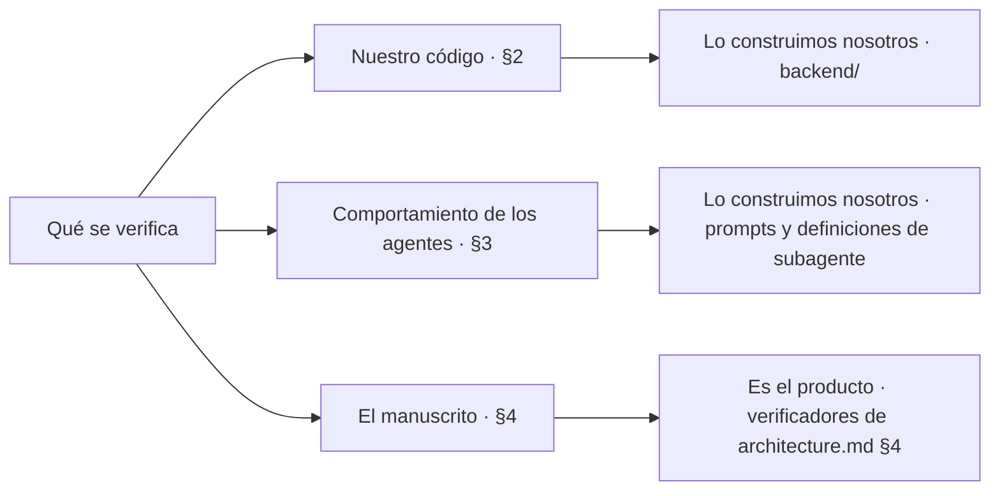
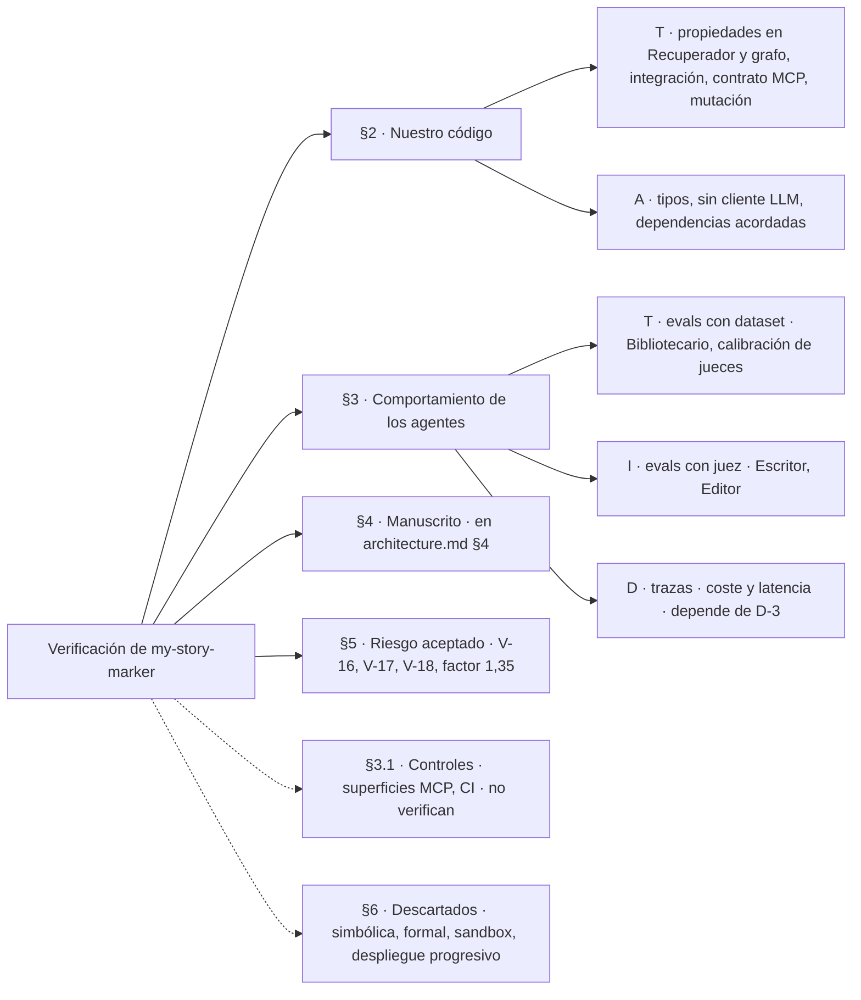

# validators.md — Cómo se verifica `my-story-marker`

> Propósito: registrar **qué método sostiene cada afirmación que hacemos sobre este sistema**, pieza por pieza. No es un catálogo de métodos de verificación en abstracto: es el reparto concreto para el generador descrito en [architecture.md](architecture.md).
>
> Tres documentos se tocan aquí y conviene saber cuál manda en qué:
>
> - La skill `verificacion` es el **procedimiento**: cómo se elige un método para una afirmación nueva. No repite este reparto.
> - Este documento es el **reparto por pieza**: qué método cubre cada pieza de la arquitectura, y qué se ha descartado y por qué.
> - [specs/spec1.md](../specs/spec1.md) §9 es el **criterio de aceptación por requisito** del backend v1: `V-1` a `V-18`. Cuando una fila de aquí tiene un `V-n`, ese es su enunciado exacto y este documento no lo reescribe.
>
> La dirección importa: si las dos vistas discrepan, manda `spec1.md`, porque un criterio de aceptación es un compromiso y esto es su mapa.

---

## 1. Marco de clasificación

Cada método obtiene su garantía de una forma distinta. La etiqueta dice **cuál**.

| Código | Nombre | Definición |
|---|---|---|
| **T** | Test · prueba | Se verifica ejecutando el sistema contra entradas concretas. |
| **A** | Análisis | Se verifica por razonamiento estático: tipos, SAST, ejecución simbólica o demostración formal. |
| **I** | Inspección | Se verifica porque una persona —o un modelo crítico— lo lee y lo juzga. |
| **D** | Demostración | Se verifica observando el funcionamiento correcto en un escenario realista. |
| **U** | No verificable / riesgo aceptado | Ningún método aplica, o no compensa su coste. Se nombra explícitamente en lugar de quedar como supuesto silencioso. |

**`U` no etiqueta métodos, etiqueta afirmaciones.** Ningún método es «no verificable»: lo que puede serlo es una afirmación concreta para la que no exista método que la sostenga. Por eso `U` no aparece como fila de ningún catálogo y sí aparece en §2, §3 y sobre todo en §5.

El orden habitual de coste creciente es **A → T → D → I**. Si los tipos ya lo garantizan, no se escribe una prueba; si una prueba lo cubre, no se monta un escenario de demostración; y no se gasta juicio —humano o de modelo— en lo que una prueba decide sola.

### 1.1 Las tres cosas que se verifican en este proyecto

Se confunden constantemente y una afirmación que las mezcla no se puede comprobar.

| Qué | Dónde se reparte | Ejemplo de afirmación |
|---|---|---|
| **Nuestro código** | §2 de este documento | «El Recuperador nunca emite un prompt que supere el tope estimado de 100.000 tokens» |
| **El comportamiento de los agentes** | §3 de este documento | «El Bibliotecario extrae de un capítulo aprobado los hechos que realmente contiene» |
| **El manuscrito** | [architecture.md](architecture.md) §4 — **no aquí** | «El capítulo 12 no contradice la biblia» |

La tercera es **parte del producto**: sus verificadores (Continuidad dura, Hito estructural, Coherencia blanda…) son funcionalidad que entregamos, con su propia política de reintentos, y no métodos de nuestro proceso de construcción. Aparecen en §2 de este documento solo en un sentido: como **código nuestro que hay que verificar** —¿detecta el verificador de inventario lo que dice detectar?—, nunca como método que verifique algo nuestro.

---

## 2. Verificación de nuestro código

Recorre las piezas de [architecture.md](architecture.md) §8 en el orden de construcción de [spec1.md](../specs/spec1.md) §12. La columna `Criterio` remite al enunciado exacto en `spec1.md` §9; `—` significa que la afirmación aún no tiene criterio escrito allí (ver §2.7).

### 2.1 `shared/` — conexión, pragmas y tipos

| Afirmación | Método | Tipo | Criterio |
|---|---|---|---|
| Toda conexión a SQLite lleva `journal_mode=WAL`, `foreign_keys=ON` y `busy_timeout` | Prueba unitaria que abre una conexión por la vía pública y consulta los tres pragmas | T | — |
| Las rutas del proyecto funcionan igual en Windows y en Linux | Suite completa ejecutada en ambos sistemas | T | V-8 |
| El código es coherente en tipos | Comprobación estática de tipos | A | V-6 |

El pragma es el caso de libro de «elige la garantía más barata»: la tentación es confiar en que `shared/` lo hace bien porque está en un sitio único. No basta. Un `foreign_keys` olvidado **no da error**, solo deja filas huérfanas meses después ([architecture.md](architecture.md) §8), así que es exactamente la clase de fallo silencioso que exige una prueba y no una revisión.

### 2.2 `contexto/` — el validador de la ontología

| Afirmación | Método | Tipo | Criterio |
|---|---|---|---|
| Una instancia válida del ejemplo de [definitions.md](definitions.md) §11 pasa, y una instancia que infringe una regla concreta falla señalando esa regla | Batería de instancias válidas e inválidas, una por regla de RF-20 a RF-27 | T | V-11 |
| El fallo de esquema no deja salir del estado `contexto` | Prueba de integración sobre el grafo | T | V-14 |
| La batería cubre de verdad las reglas y no solo las ejecuta | Pruebas de mutación sobre el validador | T | V-15 |

La mutación está aquí y no en todas partes por una razón de coste: se aplica donde una prueba verde y vacía es más probable y más cara. Un validador de 40 reglas con una batería que pasa siempre es justo ese sitio.

### 2.3 `proyecto/` — el grafo de estados

| Afirmación | Método | Tipo | Criterio |
|---|---|---|---|
| Matar el proceso en cualquier estado y reanudar pierde como mucho el trabajo de un subagente | Prueba de integración que mata y reanuda en cada estado del grafo | T | V-1 |
| Repetir un paso ya completado no duplica filas ni ficheros | Prueba basada en propiedades sobre paso × número de repeticiones | T | V-2 |
| No existe secuencia de llamadas que salga de `aprobacion_plan` o `aprobacion_final` sin acción humana | Prueba de integración sobre la tabla de transiciones | T | V-14 |
| El contador de intentos sobrevive al reinicio y el tope de 3 sigue significando algo | Cubierto por V-1 y V-2: el contador es estado en la fila | T | V-1 |

Las propiedades entran aquí porque la idempotencia **es** una propiedad —«para cualquier paso y cualquier `n`, el resultado de repetirlo `n` veces es el de ejecutarlo una»— y escribirla como ejemplos concretos es peor forma de decir lo mismo.

### 2.4 `capitulo/` — el Recuperador de contexto

Es la pieza con más superficie verificable del backend, porque es la que tiene la restricción dura.

| Afirmación | Método | Tipo | Criterio |
|---|---|---|---|
| Recuperación estructurada: misma entrada → mismo resultado, byte a byte | Propiedades sobre entradas generadas + comparación exacta de salida | T | V-3a |
| Recuperación por similitud: misma entrada y mismo estado del índice → mismo resultado, empates incluidos | Propiedades con el índice congelado | T | V-3b |
| Ningún ensamblado supera el tope **según el estimador**; si recorta, el informe de recorte es no vacío; todo lo recortado son unidades completas | Propiedades con biblias sintéticas grandes; ningún bloque emitido es prefijo de sí mismo | T | V-5 |
| Desde un hallazgo de un informe se llega al fichero de prompt exacto | Prueba de integración que resuelve la cadena entera | T | V-4 |
| El encabezado de subordinación de los pasajes es constante y no se redacta al vuelo | Comprobación estática: el texto es una constante del módulo | A | — |
| **El factor de inflación de 1,35 basta**: el estimador nunca infracuenta los tokens reales de Claude | **Ninguno** — ver §5 | **U** | — |

La última fila es el ejemplo más limpio del marco en este proyecto. El tope es de 100.000 tokens y lo que hay para medirlos es un tokenizador de otro proveedor con un margen encima ([architecture.md](architecture.md) §6.3). Se puede verificar con `T` que **el estimador se respeta**; no se puede verificar que **el estimador acierta**, porque no existe la verdad contra la que compararlo: `count_tokens` de la API de Anthropic exigiría una clave que no tenemos, y tenerla metería una llamada de red en el camino crítico y rompería el determinismo que V-3a exige. La promesa de RNF-05 está redactada exactamente en ese nivel —no se rebasa el tope *estimado*— y esta fila es la razón.

### 2.5 `capitulo/` — los verificadores deterministas

Aquí el objeto verificado es **nuestro código**, no el manuscrito. Lo que se comprueba es que el verificador detecte lo que dice detectar.

| Afirmación | Método | Tipo | Criterio |
|---|---|---|---|
| Continuidad dura (presencia, inventario, tiempo) dispara ante cada infracción y **no** dispara en los casos de control | Biblias y capítulos construidos para infringir cada regla, más casos de control | T | V-12 |
| Longitud, métricas de estilo, lista negra y nombres devuelven informe con severidad y localización, y nunca corrigen | Pruebas unitarias por verificador | T | — |
| Los deterministas de un capítulo terminan en segundos | Prueba con capítulo de tamaño máximo y umbral de tiempo | T | V-7 |
| La batería detecta un verificador roto y no solo lo ejecuta | Pruebas de mutación sobre los verificadores | T | V-15 |
| **Los deterministas detectan toda incoherencia real** | **Ninguno** — ver §5 | **U** | V-17 |

Los casos de control de V-12 no son un adorno. Un verificador de continuidad que dispara siempre pasaría cualquier batería que solo probase infracciones, y en producción convertiría los tres intentos de cada capítulo en ruido.

La latencia es `T` y no `D` porque aquí sí hay un umbral que se puede afirmar en una prueba: entrada acotada (un capítulo de tamaño máximo), sin red y sin modelo. Lo que en este proyecto sí es `D` está en §3.

### 2.6 `mcp/` y `exportacion/`

| Afirmación | Método | Tipo | Criterio |
|---|---|---|---|
| Un cliente que no es el Bibliotecario recibe error al invocar una herramienta de escritura | Prueba de contrato contra las dos superficies | T | V-13 |
| Ninguna escritura en la biblia entra antes de que el capítulo esté verificado | Prueba de integración contra RF-106 | T | V-13 |
| La exportación a Markdown respeta la macroestructura del contexto y solo es posible tras `aprobacion_final` | Prueba de integración | T | — |

La prueba de **contrato** es el método correcto para MCP y no una prueba de integración corriente: lo que se afirma es que la frontera entre dos lados —el subagente y el servidor— se comporta según su tipo, con independencia de lo que haya dentro de cada uno. Es justamente lo que hace que RN-1 deje de ser una convención de prompt.

### 2.7 Transversales del repositorio

| Afirmación | Método | Tipo | Criterio |
|---|---|---|---|
| `backend/` no contiene ninguna llamada a un proveedor de modelos | Análisis estático: búsqueda de importaciones de proveedores | A | V-9 |
| El fichero de dependencias no contiene nada ausente de la tabla de [architecture.md](architecture.md) §7 | Comprobación del fichero de dependencias contra esa tabla | A | V-10 |

Las dos son `A` y no `T` a propósito: son afirmaciones sobre el **texto del repositorio**, no sobre su comportamiento en ejecución. Ejecutarlo para comprobarlas sería más caro y menos concluyente —una importación que nunca se ejecuta en la ruta probada seguiría ahí—.

---

## 3. Verificación del comportamiento de los agentes

Todo este bloque es de **fase 2 en adelante**. La v1 no lo aborda, y eso es una decisión, no un olvido: [spec1.md](../specs/spec1.md) §1.2 deja los jueces LLM fuera de alcance y el backend no llama a ningún modelo.

| Afirmación | Método | Tipo | Fase | Criterio |
|---|---|---|---|---|
| El Bibliotecario extrae de un capítulo los hechos que realmente contiene | Evals con puntuación automática: capítulos con sus hechos anotados como conjunto esperado | T | 2 | — |
| El Escritor respeta la ficha de capítulo: hito, POV, localización, personajes presentes | Evals con modelo juez y rúbrica | I | 2 | — |
| El Editor de estilo no cambia hechos, solo prosa | Evals con juez sobre el diff entre borrador y borrador editado | I | 2 | — |
| Los jueces LLM coinciden con el criterio humano | Evals con puntuación automática: conjunto etiquetado a mano como referencia | T | 2 | — |
| El coste y la latencia por capítulo se mantienen en lo estimado | Observabilidad y trazas en ejecución | D | 2 | — |
| **La sesión de Claude Code recorre el grafo correctamente** | **Ninguno** — ver §5 | **U** | — | V-18 |

Tres notas sobre por qué el reparto queda así:

**Un juez que evalúa es `I`, no `T`.** La mecánica se parece a una prueba —conjunto de entradas, puntuación, umbral— pero la garantía no viene de ejecutar contra una salida esperada, sino de un juicio emitido con una rúbrica. Tratarlo como `T` hace creer que el resultado es determinista, y no lo es. Que el Bibliotecario sí admita `T` es la excepción que lo demuestra: «qué objetos cambian de mano en este capítulo» tiene respuesta exacta y anotable; «está bien escrito» no.

**El coste y la latencia de los agentes son `D`, no `T`.** Se observan en ejecución real, no se afirman en una prueba, porque dependen del modelo, del tamaño real del prompt y de cuántas regeneraciones haya hecho falta. Es lo contrario del caso de V-7 en §2.5, y la diferencia es si hay modelo en medio.

**Ese `D` depende de D-3.** La observabilidad está sin decidir en [spec1.md](../specs/spec1.md) §10. Hasta que se cierre, la fila existe como método elegido pero sin vehículo, y no se introduce nada por iniciativa propia.

### 3.1 Controles y vehículos — no son métodos de verificación

Dos piezas que este proyecto **usa** y que aun así no verifican nada. Confundirlas rompe el marco.

| Pieza | Dónde está en el proyecto | Por qué no es un método |
|---|---|---|
| **Guardarraíles** | Las dos superficies MCP ([architecture.md](architecture.md) §7): al Escritor no se le entrega la de escritura | Un guardarraíl **previene**; no determina si una afirmación es cierta. Que el Escritor no pueda escribir en la biblia no comprueba que la biblia esté bien. Lo que verifica es V-13, que es una prueba de contrato |
| **Integración en CI/CD** | Donde correrán V-6, V-8, V-9, V-10 | CI/CD **ejecuta** métodos, no es uno. Un criterio no se verifica «con CI»: se verifica con una comprobación estática que además corre ahí |

Las dos siguen siendo deseables, y la primera es una decisión ya tomada de la arquitectura. Simplemente no cuentan como la garantía de una afirmación.

---

## 4. El manuscrito: aquí no

Los verificadores de [architecture.md](architecture.md) §4 —Continuidad dura, Hito estructural, Coherencia blanda, Voz y POV, Originalidad— **no son métodos de este documento**. Son funcionalidad del producto, con su tabla de severidades y su política de 3 reintentos.

La frontera, en una frase: si falla, ¿se corrige el código o se regenera un capítulo? Lo primero es §2; lo segundo es `architecture.md` §4.

Lo único que este documento dice del manuscrito es lo que no se puede decir de él todavía:

| Afirmación | Método | Tipo | Criterio |
|---|---|---|---|
| **Que el manuscrito sea bueno** | **Ninguno en la v1** | **U** | V-16 |

---

## 5. Riesgos aceptados

Las cuatro afirmaciones marcadas `U` arriba, juntas y con su motivo. Están aquí porque un riesgo declarado es gestionable y uno no declarado, no.

| Afirmación | Por qué no se verifica | Qué lo acota mientras tanto |
|---|---|---|
| **El manuscrito es bueno** (V-16) | Los jueces son fase 2 y la valoración humana ciega es fase 3. La v1 verifica que la maquinaria funciona, no que la novela valga | Nada. Se asume, y la fase 2 es lo que lo levanta |
| **Los deterministas detectan toda incoherencia** (V-17) | Detectan las reglas escritas, no la incoherencia en general. Los falsos negativos son consustanciales al método, no un defecto de la batería | Los jueces de coherencia blanda de fase 2, que atacan justo lo que un determinista no ve |
| **La sesión recorre el grafo correctamente** (V-18) | El backend rechaza transiciones inválidas pero no puede garantizar que la sesión intente las correctas. Incluye la regla de que **una invocación es un intento** ([architecture.md](architecture.md) §3.2): el backend clavea por `(capítulo, versión, intento)` y cuenta hasta tres, pero no puede distinguir dos intentos en dos invocaciones de dos dentro de la misma | La tabla de transiciones permitidas y las paradas humanas, que acotan el daño sin verificar la intención. `Model checking` sobre el grafo queda como candidato de fase 2 |
| **El factor 1,35 del estimador basta** (§2.4) | No existe la verdad contra la que comparar: el `count_tokens` de Anthropic exige una clave que no tenemos, y usarla rompería el determinismo de V-3a | El margen es amplio en el caso normal —74k efectivos frente a ~55k esperados—, el factor vive en un sitio único y es medible el día que haya con qué medirlo |

A esta lista se suma **D-9** de [spec1.md](../specs/spec1.md) §10, que no es un riesgo aceptado sino un hueco abierto: qué hace el Recuperador cuando ni la ficha sola cabe. Mientras no se decida, fallar de forma ruidosa es el comportamiento correcto — y eso sí es verificable con `T`.

---

## 6. Métodos descartados

No se borran del mapa: se marcan, para que dentro de seis meses nadie los vuelva a proponer sin saber que ya se miraron.

| Método | Estado | Motivo |
|---|---|---|
| **Ejecución simbólica** | Descartado | El código del backend es persistencia, ensamblado y comprobaciones acotadas. No hay lógica con espacio de estados enrevesado que justifique un resolutor SMT |
| **Verificación formal** | Descartado | El coste no se paga en un generador de novelas. Lo que tendría más sentido demostrar —el tope de entrada— depende de un estimador que ya es aproximado, así que la demostración no aportaría garantía por encima de V-5 |
| **Ejecución en sandbox** | Descartado en fases 1 y 2 | La ejecución es local, de un solo editor y sobre un fichero por proyecto. El aislamiento ya lo da RNF-09. Se revisa con el multiusuario de fase 3 |
| **Despliegue progresivo** | Descartado | No hay despliegue: D-8 sigue abierta y la ejecución es local. Sin tráfico que dividir, no hay nada que liberar por porcentajes |
| **Red teaming** | Candidato de fase 3 | El brief lo escribe el propio editor y no hay entrada de terceros, así que el modelo de amenaza de la v1 es casi vacío. Cambia el día del multiusuario, y entonces el vector concreto es el brief como inyección hacia los subagentes |
| **Model checking** | Candidato de fase 2 | Es el único método que atacaría V-18 de frente: invariantes sobre el grafo de [architecture.md](architecture.md) §3.1, como «no se sale de una parada humana» o «nunca se escribe en la biblia antes de verificar». Hoy esas dos están cubiertas por pruebas de integración (V-13, V-14), que son más baratas y bastan mientras el grafo sea pequeño |
| **Revisión humana en el bucle** | Adoptado, pero como producto | Las dos paradas de [architecture.md](architecture.md) §10 son funcionalidad del generador, no un método de verificación de nuestro código. Aparecen aquí para que no se cuenten dos veces |
| **Verificación multiagente** | Candidato de fase 2 | Los jueces LLM de `architecture.md` §4 son ya un caso de crítico/verificador, aplicado al manuscrito. Como método sobre **nuestro** proceso —autoconsistencia entre ejecuciones, debate— no se adopta: multiplica coste de modelo sin criterio de parada claro |

---

## 7. Resumen

---

## 8. Cómo se usa este documento

Cuando aparece una afirmación nueva que hay que sostener:

1. Se invoca la skill `verificacion`, que es el procedimiento de elección: escribir la afirmación en forma comprobable, decidir de cuál de las tres columnas de §1.1 habla, y elegir la garantía más barata que la sostenga.
2. Si la afirmación es un requisito del backend v1, su criterio se escribe en [spec1.md](../specs/spec1.md) §9 como un `V-n` nuevo, y **aquí** se añade la fila que lo mapea a su pieza.
3. Si ningún método la sostiene, se marca `U` y se añade a §5 con su motivo. Eso cierra el asunto de forma explícita, que es el objetivo.
4. Si el método elegido exige una herramienta que no está en [architecture.md](architecture.md) §7, la herramienta **no se introduce aquí**: se propone como decisión y entra en esa tabla en el mismo cambio. D-7 de [spec1.md](../specs/spec1.md) §10 —marco de pruebas y comprobación estática de tipos— sigue abierto y es la razón por la que en este documento no aparece el nombre de ninguna biblioteca.
