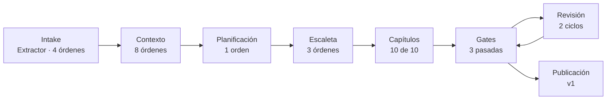

# E1 · referencia — resultado de la ejecución del 2026-09-24

> Datos ficticios: los del brief [`evals/e1-reference/input/brief.json`](../input/brief.json), declarados así en su cabecera. En este informe las personas se nombran por su papel.

**Veredicto: SUPERADA.** E1 es el caso de control: un brief normal, sin trampas, que tiene que recorrer el sistema de punta a punta hasta publicar. La novela se publicó como versión 1, con lectura web y PDF, tras pasar los tres gates de manuscrito en la tercera pasada. Por el camino, el sistema rechazó 18 salidas de agentes y suspendió dos pasadas de gates (forma, esquema, continuidad, hitos, un veto y marcadores de anonimización), todo registrado y saneado. Ninguna de esas incidencias llegó al texto publicado.

| | |
|---|---|
| Proyecto | `3a12d4b5e17843c995686c3990ab48ce` · título publicado «La marca del Pico Alto» |
| Protocolo | E-7: novela completa de 10 capítulos, hasta `publicada` |
| Ejecución | 08:26 → 11:44 UTC (3 h 18 min), con dos paradas por tope de intentos reanudadas a mano |
| Volumen | 79 órdenes: 61 aceptadas, 18 rechazadas, 16 reintentos; 2 ciclos de revisión y 3 pasadas de gates |
| Estado final | `publicada`, versión 1: `export/v1/` con `manuscrito.md` (≈12.500 palabras), `lectura.html`, `novela.pdf`, `cronologia.lean` y metadatos |

## 1. Entrada

Cumpleaños de un hijo, con lector juvenil; cinco hechos obligatorios de cinco tipos distintos (ser querido, evento, lugar, objeto y frase literal), un veto de tema y un texto libre inofensivo. Es el brief de la novela de ejemplo y el caso de control del Extractor frente a E2.

## 2. Recorrido y punto de detección

| Fase | Duración | Órdenes | Qué ocurrió |
|---|---|---|---|
| Intake | 40 min | 4 del Extractor | Tres salidas mal formadas seguidas llevaron el proyecto a `detenida`; reanudado a mano, la cuarta propuso 6 hechos, todos aceptados |
| Contexto | 12 min | 8 del Agente de Contexto | Dos fallos de forma en la normalización y cuatro de esquema en la instanciación (literales, enumerados, patrón de id, árbol de localizaciones). Una segunda parada por tope, reanudada a mano |
| Planificación | 2 min | 1 | Aceptada al primer intento |
| Escaleta | 11 min | 3 | Un fallo de forma y un **viaje imposible** (RF-76) detectado por la continuidad dura antes de escribir |
| Capítulos | 1 h 37 min | Escritor, Editor, juez y Bibliotecario | 10 de 10 aprobados; 4 reintentos del Escritor |
| Gates y revisión | 27 min | 9 | Juez de manuscrito: 17 → 20 → **24**; cobertura y Lean en verde en las tres pasadas |
| Publicación | 1,5 min | 1 del Exportador | Título, sinopsis y palabras clave; versión 1 |

**Dónde se detectó y se saneó:** E1 no trae ningún error provocado. Lo que se detectó son fallos del camino normal, y cada uno lo paró la capa que le corresponde:

| Fase | Verificador | Detección | Saneamiento |
|---|---|---|---|
| Intake | Esquema de salida del Extractor | 3 salidas mal formadas | Reintento; tras la parada, reanudación humana |
| Contexto | Validador de la ontología | Valores fuera de enumerado, literales, un id con formato inválido y un árbol de localizaciones que se saltaba niveles | El agente corrigió con cada informe |
| Escaleta | **Continuidad dura (RF-76)** | Una ficha con un desplazamiento imposible en el tiempo disponible | El Escaletista rehízo la escaleta antes de escribir nada |
| Capítulo 2 y 10 | Juez de capítulo · hito | El capítulo no cumplía el hito estructural de su ficha | El Escritor regeneró el capítulo |
| Capítulo 5 | **Guardarraíl de palabras prohibidas** (nivel novela) | Una variante del tema vetado en el borrador | Borrador rechazado y reescrito; el veto no llegó al texto |
| Capítulo 9 | **Marcadores de anonimización** | Tres marcadores `[…ANONIMIZADO]` en la prosa en lugar de nombres | Borrador rechazado y reescrito con los nombres |
| Manuscrito · pasada 1 | Juez de manuscrito | Suma 17 (mínimo 18), continuidad 2 | El Revisor corrigió los capítulos 8 y 9 |
| Manuscrito · pasada 2 | Juez de manuscrito | Suma 20, pero tono 2 (mínimo 3 por criterio) | El Revisor corrigió el capítulo 1 |
| Manuscrito · pasada 3 | Los tres gates | **Aprobado**: 24 sobre 25, ningún criterio por debajo de 4 | Publicación |

Verificadores deterministas del bucle de capítulo, sobre 17 informes cada uno: frases literales 0 hallazgos; nombres y grafías 0; longitud 4 (no bloqueantes); lista negra 10 (no bloqueantes); métricas de estilo 29 (no bloqueantes); guardarraíl 1 (bloqueante, saneado); marcadores 8 en 7 informes (1 bloqueante, saneado).

## 3. Frente al oráculo

| Esperado (brief) | Obtenido | |
|---|---|---|
| El Extractor propone exactamente dos hechos del texto libre, ninguno rechazado ni descartado | **Seis** propuestos y aceptados, sin rechazos ni descartes | ⚠️ Desviación de granularidad (como en E2) |
| Contexto válido con cero hallazgos; pasa a `planificacion` | Válido tras cinco reintentos | ✅ |
| Ningún capítulo en `revision_humana`; el guardarraíl no se agota | Ninguno; el guardarraíl saltó una vez y se resolvió en el reintento | ✅ |
| Cobertura con los cinco obligatorios | Cobertura en verde en las tres pasadas | ✅ |
| La frase literal aparece en al menos un capítulo (RF-73a) | Aparece en el manuscrito publicado; 0 hallazgos de frases literales | ✅ |
| Lean sin violaciones | 0 violaciones en las tres pasadas (lugar único, exclusión y nacimiento) | ✅ |
| Juez de manuscrito: 18 o más, ningún criterio por debajo de 3 | 24, mínimo 4 | ✅ |
| Publicación: versión 1 con lectura web y PDF | Versión 1 con `lectura.html` y `novela.pdf` | ✅ |
| H6: petición de cambio del lector y versión 2 | **No ejecutado**: 0 peticiones de cambio | ⏳ Pendiente |

## 4. Incidencias de la ejecución

| Momento | Incidencia | Efecto |
|---|---|---|
| Intake | Tres salidas mal formadas seguidas del Extractor agotaron el tope | `detenida`; reanudado con una acción humana explícita |
| Contexto | Segundo tope agotado en la instanciación | `detenida`; reanudado a mano |

## 5. Hallazgos y cambios en el sistema

1. **El sistema se sostiene sobre los reintentos.** 18 de las 79 órdenes se rechazaron, y cada rechazo volvió al agente con su informe. Dos veces el tope de intentos detuvo el proyecto, y se reanudó con una acción humana explícita. Es el comportamiento diseñado: nada mal formado se guarda.
2. **Las defensas deterministas actuaron sobre un brief normal.** El guardarraíl y los marcadores de anonimización saltaron en E1 aunque el brief no tenía trampas: el veto y la política de privacidad de la organización intervienen también en el camino feliz.
3. **El juez de manuscrito es el gate más exigente.** Hicieron falta dos ciclos del Revisor (continuidad en los capítulos 8 y 9, tono en el capítulo 1) para superar el umbral.
4. **Lean no dio falsos positivos en E1.** A diferencia de E3 y E4, ninguna pasada marcó violaciones de «lugar único»: los eventos que registró el Bibliotecario no coincidieron en franja y lugar distinto para un mismo personaje.

Cambios en el sistema salidos de esta ejecución: el verificador determinista de marcadores de anonimización (commit `bf22df1`).

## 6. Evidencia

- Métricas agregadas: `GET /proyectos/3a12d4b5…/metricas` (resumen, fases, agentes, capítulos, verificadores y juez).
- Acuses y órdenes: `.claude/estado/3a12d4b5e17843c995686c3990ab48ce/` (local, ignorado por git).
- Gates: `proyectos/novelas/3a12d4b5…/verificacion/pasada-{1,2,3}/cronologia.lean`, y el informe de gates en las órdenes del Revisor (68, 70 y 74).
- Publicación: `proyectos/novelas/3a12d4b5…/export/v1/`.
- Trazas y scores: sesión `3a12d4b5…` en Langfuse (699 observaciones, 224 scores).

## 7. Validación humana

Los primeros capítulos han sido revisados a mano y parecen estar correctos. La revisión completa con la rúbrica, para compararla criterio a criterio con el juez de manuscrito, está pendiente.
