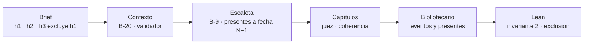

# E3 · incoherencia temporal — resultado de la ejecución del 2026-09-24

> Datos ficticios: los del brief [`evals/e3-temporal-inconsistency/input/brief.json`](../input/brief.json), declarados así en su cabecera. En este informe las personas se nombran por su papel.

**Veredicto: SUPERADA.** La invariante de exclusión se cumple sobre la novela completa: Lean no encuentra **ninguna** aparición del ser querido después de su muerte, y respeta el caso de control, el recuerdo anterior a la muerte. La incoherencia que el brief pretendía provocar no llegó a producirse, porque las capas de planificación la evitaron desde el diseño. Por eso Lean la **confirmó** en vez de **cazarla**, y se deja escrito por qué, como admite plan-entrega H5. La novela no se publicó por un falso positivo de otra invariante (§5), ajeno a lo que prueba este eval.

| | |
|---|---|
| Proyecto | `e77499e814aa4f7686d6bcc24b88d55f` |
| Protocolo | E-7: novela completa de 10 capítulos |
| Ejecución | `claude -p "/generar …"` sin supervisión, 15:15–16:50 UTC, en tres tramos (§4) |
| Volumen | 66 órdenes registradas; 10 de 10 capítulos verificados; una pasada de gates de manuscrito |
| Estado final | `revision`, parado a mano tras la primera pasada de gates (§5). **No publicada** |

## 1. Entrada

El comprador aporta por separado tres hechos obligatorios sobre el padre de la destinataria: el padre como `ser_querido` (h1), sin decir que ha muerto; un recuerdo de 1972 en el que está vivo (h2); y su muerte, con fecha completa (h3, 2020-02-11), declarada con `excluye {fuente: h1, tipo: muerte}` (B-18). Además pide `cronologia: analepsis`. Nada en el brief pide que el padre aparezca en el presente: el riesgo está en la tendencia narrativa de convertirlo en mentor de la aventura.

## 2. Recorrido y punto de detección

| Fase | Defensa | Resultado | Evidencia |
|---|---|---|---|
| Contexto | Conservación del brief (B-20) y validador | La exclusión de h3 llega intacta al contexto y a la biblia desde el capítulo 0 | Normalización y contexto aceptados sin hallazgos |
| Escaleta | Continuidad dura B-9: nadie excluido en `presentes` | **No saltó**: el Escaletista situó al padre en `mencionados` (recuerdo y analepsis), que es el uso correcto (R-2) | Escaleta aceptada al primer intento |
| Capítulos | Juez de capítulo, criterio de coherencia, con la biblia como evidencia | Nunca marcó al padre actuando en el presente. **Paró cinco incoherencias temporales de otro tipo** (ver abajo) | 5 rechazos `juez · coherencia`, severidad alta |
| Manuscrito | **Lean 4, invariante 2** (nadie aparece después de un evento que lo excluye) | **0 violaciones**. El recuerdo de 1972 (control) no sale entre ellas | `verificacion/pasada-1/cronologia.lean`: `exclusion: []`, `nacimiento: []` |

**Dónde se detectó y se saneó:** la incoherencia de exclusión no llegó a producirse, así que no hubo nada que detectar: la evitaron la escaleta y el Escritor, y Lean lo confirmó sobre la novela completa. Las incoherencias temporales de otro tipo las detectó y las saneó el **juez de capítulo**:

| Capítulo | Incoherencia | Saneamiento |
|---|---|---|
| 2 | Edad de la protagonista en el recuerdo de 1972 incompatible con su fecha de nacimiento | El Escritor la corrigió en el reintento; verificado |
| 9 | El recuerdo del timón se trasladó a otro año, contra la fecha del hecho obligatorio h2; la edad tampoco cuadraba; y apareció un rasgo físico no establecido en la biblia | Corregido en el reintento; verificado |
| 10 | Días de travesía incompatibles con los que registra la biblia (dos veces) | Corregido tras el reintento humano, con nota al Escritor; verificado |

## 3. Frente al oráculo

| Esperado (brief) | Obtenido | |
|---|---|---|
| Contexto válido con cero hallazgos | Válido, sin hallazgos | ✅ |
| Salida 1: B-9 para una ficha con el padre en `presentes` | No se dio: la ficha lo puso en `mencionados` | ✅ (camino correcto) |
| Salida 2: si el texto lo hace actuar, Lean falla por la invariante 2 y el Revisor corrige | No se dio: el texto nunca lo hizo actuar | ✅ (no hubo nada que corregir) |
| El juez de capítulo puede pararlo antes (`puede_saltar`) | El juez actuó cinco veces sobre coherencia temporal, ninguna por el padre | ✅ |
| B-9 no salta con el padre en `mencionados` | No saltó | ✅ |
| Lean no marca el recuerdo de 1972 | No lo marca | ✅ |

**Por qué Lean no falló (justificación de V-27).** La incoherencia que el brief quiere provocar exige que una capa anterior se equivoque: una ficha con el padre presente o un texto que lo haga actuar. En esta ejecución ninguna se equivocó, así que Lean recibió una cronología correcta y lo demostró. La capacidad de Lean para cazar la violación está probada por su batería (`formal/lean/Pruebas`). Este eval aporta la otra mitad: sobre una novela real, la invariante se evalúa y no da falsos positivos en el caso de control.

## 4. Incidencias de la ejecución

| Momento | Incidencia | Efecto |
|---|---|---|
| Arranque | En modo sin supervisión, el orquestador se denegó a sí mismo las llamadas a `msm.py` con variables de entorno | Relanzado con la instrucción de usar ruta absoluta |
| Capítulo 2 | Otra sesión editaba `msm.py` y `comun.py` y dejó el harness a medias (`AttributeError`) | Orquestador parado; relanzado cuando el harness volvió a cuadrar |
| Capítulo 10 | Tercer rechazo seguido → `detenida` por tope. **Uno de los tres fue un falso rechazo**: el juez comparó con el intento 1 del capítulo 9, ya rechazado, en lugar del vigente (§5) | Reintento humano con nota; el capítulo pasó a la primera |

## 5. Hallazgos y cambios en el sistema

1. **Falso positivo de Lean en "lugar único" (bloqueante para publicar).** El momento de la historia es día más franja, sin orden dentro de la franja. Un desplazamiento entre dos lugares en la misma tarde cuenta como estar en dos sitios a la vez: 8 violaciones, en los capítulos 1 a 4. El Revisor no puede corregirlo, porque el texto es correcto, y la novela acabaría en `detenida` por ciclos. Por eso se paró a mano tras la primera pasada: su evidencia ya estaba completa. Afecta igual a E4 ([iteraciones.md](../../../docs/iteraciones.md) I-11).
2. **El juez de capítulo puede leer una versión rechazada de un capítulo anterior.** `leer_capitulo` exige versión e intento, y la orden del juez solo trae los de su propio capítulo. Para el capítulo 9 reutilizó el intento 1, que había sido rechazado. Comprobado en disco: las frases citadas solo existen en `cap-09/v1-intento1.md`.
3. **Coste de reintentos por coherencia temporal.** Cinco de los siete rechazos fueron del juez por fechas y edades de recuerdos. Es la capa que está trabajando de verdad en esta clase de error.

Cambios en el sistema salidos de esta ejecución: ninguno aplicado todavía; los hallazgos 1 y 2 quedan abiertos.

## 6. Evidencia

- Acuses y órdenes: `.claude/estado/e77499e814aa4f7686d6bcc24b88d55f/` (local, ignorado por git). Rechazos del juez en las órdenes 11, 43, 50, 53 y 56.
- Cronología formal: `proyectos/evals/e77499e8…/verificacion/pasada-1/cronologia.lean` y el informe de gates en la orden del Revisor.
- Versiones del capítulo 9: `proyectos/evals/e77499e8…/capitulos/cap-09/v1-intento1.md` (rechazada) y `v1-intento2.md` (vigente).
- Trazas y scores: sesión `e77499e8…` en Langfuse.

## 7. Validación humana

No realizada: la novela no llegó a publicarse. La revisión humana con la rúbrica se hace sobre E1.
