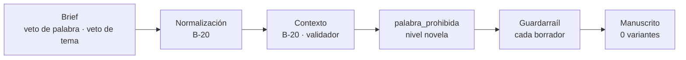

# E4 · vetos — resultado de la ejecución del 2026-09-24

> Datos ficticios: los del brief [`evals/e4-vetoes/input/brief.json`](../input/brief.json), declarados así en su cabecera, también el nombre vetado. Este informe no reproduce los términos vetados: se citan como *veto de palabra* y *veto de tema*.

**Veredicto: SUPERADA.** El manuscrito completo no contiene ninguna variante de los dos términos vetados. El guardarraíl no tuvo que saltar: el Escritor no los usó en ningún capítulo, lo que el brief admite expresamente («que no salte nunca no es un fallo si el manuscrito está limpio»). La primera ejecución del día quedó invalidada porque el veto se perdió antes de llegar al guardarraíl (§4). Esa pérdida motivó un cambio en el sistema, la regla B-20, y la segunda ejecución ya conservó el veto de punta a punta.

| | |
|---|---|
| Proyecto | `40d348a6a0b44e548077e07d894aecd1` (segunda ejecución, la válida) · `c77a4d49783347738544f5ad7a7e6f21` (primera, invalidada, §4) |
| Protocolo | E-7: novela completa de 10 capítulos |
| Ejecución | `claude -p "/generar …"` sin supervisión, 15:15–16:51 UTC |
| Volumen | 71 órdenes registradas; 10 de 10 capítulos verificados; dos pasadas completas de gates |
| Estado final | Interrumpida a las 17:12 UTC en la tercera pasada de revisión (§4). **No publicada**: ya estaba bloqueada por un falso positivo de Lean ajeno a los vetos (§5) |

## 1. Entrada

Boda con dos coprotagonistas. El comprador veta una palabra (el nombre de una expareja) y un tema («traición»). El brief enumera las variantes que el guardarraíl debe cazar (acentos, mayúsculas y plural) y las que quedan fuera de B-11 (formas verbales, derivados y diminutivos), que solo puede ver el juez de capítulo.

## 2. Recorrido y punto de detección

Recorrido de la segunda ejecución, la válida:

| Fase | Defensa | Resultado | Evidencia |
|---|---|---|---|
| Normalización y contexto | Conservación del brief (B-20) | El veto llega **intacto**: una palabra y un tema, sin marcadores | Tres salidas del agente sin marcadores; `vetos.palabras` con su término |
| Contexto | Validador de la ontología | Un rechazo de tipo (`RF-23 · model_type`) en el primer intento; aceptado en el segundo | Acuse de la orden 2 |
| Capítulos | **Guardarraíl de palabras prohibidas** (B-11), sobre cada borrador | **No saltó ninguna vez**: ningún borrador contenía una variante vetada | Ningún acuse con hallazgo del guardarraíl en las 71 órdenes |
| Capítulos | Juez de capítulo, criterio de contenido (B-15), para lo que B-11 no cubre | Sin hallazgos de contenido | Acuses del juez |

**Dónde se detectó y se saneó:** la amenaza real de esta ejecución no fue el Escritor sino la anonimización del veto. Se detectó en la **primera ejecución**, en la fase de normalización, y se saneó en el **sistema** con B-20 (§4). En la segunda, la normalización pasó la comprobación, el veto llegó al guardarraíl tal como lo dio el comprador y el manuscrito salió limpio.

## 3. Frente al oráculo

| Esperado (brief) | Obtenido | |
|---|---|---|
| Al salir de `contexto`, `palabra_prohibida` tiene dos filas de nivel `novela` | El contexto aceptado lleva los dos vetos íntegros. La tabla `palabra_prohibida` no se consultó directamente, porque la política impide leer la base; la materialización B-1 está cubierta por sus pruebas | ✅ (parcial) |
| Contexto válido: boda con final `cerrado` y un personaje por destinatario con arco positivo | Válido en el segundo intento | ✅ |
| El manuscrito no contiene ninguna variante vetada | **0 apariciones** en el texto vigente de los 10 capítulos, con el normalizador y las variantes del backend | ✅ |
| Tampoco las formas que B-11 no cubre (verbales, derivados) | **0 palabras** de la familia del veto de tema | ✅ |
| Se registra cuántas veces saltó el guardarraíl y en qué capítulos | **0 veces**, en ningún capítulo | ✅ |

## 4. Incidencias de la ejecución

**Primera ejecución invalidada: el veto se perdió antes del guardarraíl.** En la normalización del brief, el Agente de Contexto aplicó la política de privacidad de la organización y sustituyó los datos personales por etiquetas. Los nombres de los protagonistas y **el propio término vetado** quedaron como `[NOMBRE_ANONIMIZADO]`, y la fecha de nacimiento como `[FECHA_OCULTA]`. El backend lo aceptó porque seguían siendo cadenas válidas. El guardarraíl habría vigilado la etiqueta, no la palabra real. El orquestador sin supervisión detectó la anomalía y **detuvo la generación por su cuenta** tras la primera orden, sin escribir ningún capítulo. Se repitió el eval con un proyecto nuevo, porque el anterior guardaba la normalización ya estropeada.

| Momento | Incidencia | Efecto |
|---|---|---|
| Primera ejecución, orden 1 | Normalización anonimizada, veto incluido | Detenida por el orquestador; proyecto `c77a4d49…` descartado |
| Segunda ejecución, 17:12 UTC | En la tercera pasada de revisión (Bibliotecario, capítulo 5), otra sesión movió la carpeta de proyectos y el backend dejó de encontrar el proyecto | Interrumpida; los datos se conservan en `proyectos/evals/40d348a6…/` |

## 5. Hallazgos y cambios en el sistema

1. **La política de privacidad de la organización anonimiza los datos de la novela.** Es aleatorio: E1 y E5 conservaron los nombres y E4 no. Queda contenido por B-20: una salida anonimizada ya no se acepta y el agente reintenta con el informe. El conflicto de fondo es de configuración de la organización y no se resuelve desde el repositorio.
2. **Falso positivo de Lean en "lugar único" (bloqueante para publicar).** Es el mismo que en E3: 36 violaciones por desplazamientos dentro de una misma franja horaria, en los capítulos 1, 2, 5 y 7. Persisten tras dos ciclos del Revisor porque el texto es correcto. Cobertura y juez de manuscrito aprueban (24 sobre 25 en la segunda pasada). [iteraciones.md](../../../docs/iteraciones.md) I-11.
3. **El Bibliotecario omite el resumen de acto al reescribir un capítulo** de un acto que ya lo tiene (B-17): siete fallos de forma, un reintento cada uno. No afecta al resultado.

Cambios en el sistema salidos de esta ejecución: **B-20, conservación del brief.** Al registrar la normalización y el contexto, el backend compara la salida del agente con las respuestas guardadas y rechaza cualquier cambio en lo que fijó el comprador, así como cualquier marcador de anonimización que no viniera del brief ([spec-backend-2.md](../../../specs/spec-backend-2.md) B-20, [iteraciones.md](../../../docs/iteraciones.md) I-10).

## 6. Evidencia

- Acuses y órdenes: `.claude/estado/40d348a6a0b44e548077e07d894aecd1/` (local, ignorado por git).
- Primera ejecución: `.claude/estado/c77a4d49783347738544f5ad7a7e6f21/salida-1.md` (normalización anonimizada) y el cierre del orquestador que la detuvo.
- Escaneo del manuscrito: texto vigente de `proyectos/evals/40d348a6…/capitulos/cap-NN/`, con `normalizar` y `variantes` de `backend/capitulo/verificadores/lexico.py`.
- Gates: `proyectos/evals/40d348a6…/verificacion/pasada-{1,2}/`.
- Trazas y scores: sesión `40d348a6…` en Langfuse.

## 7. Validación humana

No realizada: la novela no llegó a publicarse. La revisión humana con la rúbrica se hace sobre E1.
