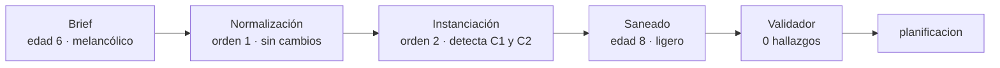

# E5 · contradicción — resultado de la ejecución del 2026-09-24

> Datos ficticios: los del brief [`evals/e5-contradiction/input/brief.json`](../input/brief.json), declarados así en su cabecera. Aquí no se repiten nombres.

**Veredicto: SUPERADA, ANTES DE LO PREVISTO.** Las dos contradicciones del brief se detectaron y se corrigieron **una fase antes** de donde el diseño esperaba verlas: las identificó el propio Agente de Contexto al instanciar la ontología, antes de que el contexto llegara al validador determinista. Ningún dato incoherente pasó a la planificación, que es lo que el eval protege. El matiz está en **quién decidió la corrección**: el agente la aplicó sin preguntar a la compradora, cuando el oráculo del brief reserva esa decisión para ella. Motivó un cambio en el sistema (B-20) para que la detección temprana se mantenga y la decisión vuelva a la compradora. **El eval no se ha repetido con el cambio.**

| | |
|---|---|
| Proyecto | `317444e9136c4088979143515d55ee8c` |
| Protocolo | E-7: hasta la entrevista (`contexto` → `planificacion`) |
| Ejecución | `/entrevista` con el brief, 13:36–13:39 UTC |
| Volumen | 2 órdenes del Agente de Contexto, las dos aceptadas |
| Estado final | `planificacion` |

## 1. Entrada

La destinataria declara `edad: 6` con `fecha_nacimiento: 2018-01-20` (a 2026-09-24 son 8 años cumplidos), `edad_lector: 6` y `tono: melancolico`. Son dos contradicciones **independientes**, a propósito: aunque la edad real sea 8, la lectora sigue siendo infantil y el tono melancólico sigue sin estar permitido.

| # | Contradicción | Regla que la describe |
|---|---|---|
| C1 | La edad no cuadra con la fecha de nacimiento | RF-24 · `edad_frente_a_nacimiento` |
| C2 | Tono melancólico para una lectora menor de 12 años | RF-24 · `tono_por_edad` |

## 2. Recorrido y punto de detección

| Fase | Qué pasó | Evidencia |
|---|---|---|
| Normalización (orden 1, `intake`) | El agente conservó los valores tal como los dio la compradora | Salida con `edad: 6`, `edad_lector: 6`, `tono: melancolico`; `notas` y `faltan` vacíos |
| **Instanciación (orden 2, `contexto`)** | **El agente detectó las dos contradicciones y las corrigió en la misma salida:** la edad a 8 (la que da la fecha de nacimiento) y el tono a `ligero` (derivado de la ocasión) | Sus notas: *«la regla de coherencia lo prohíbe con lector menor de 12 años… Lo derivé de la ocasión a `ligero`»* y *«esa fecha de nacimiento da 8 años cumplidos… corregí ambos campos a `8`»* |
| Validador determinista | Recibió un contexto ya coherente: cero hallazgos | Acuse de la orden 2: aceptada, solo rellenó los porcentajes de la estructura |
| Transición | El proyecto pasó a `planificacion` sin datos incoherentes | Estado del proyecto |

**Dónde se detectó y se saneó:** se detectó en la instanciación del contexto, en el Agente de Contexto; el diseño lo esperaba una fase después, en el validador determinista. El saneamiento es correcto en el fondo, porque 8 es la edad cumplida y el tono melancólico no vale para esa lectora. Pero se aplicó por inferencia del agente, no por decisión de la compradora.

## 3. Frente al oráculo

| Esperado (brief) | Obtenido | |
|---|---|---|
| Las dos contradicciones se detectan | Detectadas las dos, por el agente, antes del validador | ✅ (antes de lo previsto) |
| No llega a planificación un contexto incoherente | No llegó: el contexto planificado es coherente | ✅ |
| El validador devuelve exactamente los dos hallazgos | Cero: el contexto ya le llegó saneado | ⚠️ Capa no ejercitada |
| La entrevista pregunta a la compradora | No hubo pregunta: la contradicción ya estaba resuelta | ⚠️ Decidió el agente |
| El agente no resuelve ninguna por su cuenta | Resolvió las dos, correctamente | ⚠️ Decidió el agente |

Se da por superada porque el error se detectó y se saneó **antes** del punto previsto, y nada incoherente llegó a la planificación. Queda el matiz del brief: *«Cambiar el tono o la edad sin preguntar cuenta como fallo del eval, porque la decisión es de la compradora»*. En un encargo real, el dato erróneo podía ser la fecha de nacimiento y no la edad. Por eso la detección temprana es valiosa, pero la corrección tiene que pasar por la compradora, y a eso va el cambio de §5.

## 4. Incidencias de la ejecución

Ninguna: las dos órdenes se aceptaron al primer intento.

## 5. Hallazgos y cambios en el sistema

**Causa.** La definición del agente (`.claude/agents/agente-contexto.md`, Trabajo 2) daba dos órdenes que chocan cuando un valor del comprador incumple una regla: «lo que el comprador fijó, se respeta tal cual» y «has terminado cuando ninguna regla de coherencia falla». El agente siguió la segunda. Y ninguna comprobación del backend verificaba que el contexto conservara lo que dio la compradora, así que la corrección pasó sin que nadie la registrara como tal.

Cambios en el sistema salidos de esta ejecución:

| Cambio | Dónde | Efecto |
|---|---|---|
| **B-20 · Conservación del brief** | `backend/contexto/conservacion.py`, aplicado al registrar la normalización y el contexto | Una salida que cambie la edad, el tono u otro valor fijado por la compradora se rechaza, con el informe para el agente |
| Prompt del Agente de Contexto (v1 → v2) | `.claude/agents/agente-contexto.md` | Lo que fijó el comprador sale tal cual aunque choque con una regla; el conflicto lo marca el validador |

Con los dos cambios, el agente ya no puede sanear por su cuenta. El validador vuelve a ver las dos contradicciones y el proyecto no sale de `contexto` sin ellas resueltas. Queda pendiente una parada humana explícita en `contexto` para que `/entrevista` haga la pregunta. Hasta entonces, el proyecto acaba en `detenida` con el informe, en vez de planificar con un dato que la compradora no dio. **Para comprobar que el cambio devuelve la decisión a la compradora, hay que repetirlo con un proyecto nuevo.**

## 6. Evidencia

- En `.claude/estado/317444e9136c4088979143515d55ee8c/` (local, ignorado por git): `orden-2.json` (la entrada con el brief sin corregir), `salida-1.md` (normalización fiel), `salida-2.md` (contexto saneado y las notas del agente), `acuse-1.json` y `acuse-2.json`.
- Registro: [docs/iteraciones.md](../../../docs/iteraciones.md) I-08 e I-10 · tabla: [docs/evals.md](../../../docs/evals.md).
- Trazas y scores: sesión `317444e9…` en Langfuse.

## 7. Validación humana

No aplica: el protocolo para en la entrevista y no hay novela que leer. La pregunta a la compradora, que es la parada humana que este eval exige, es justo la que faltó.
