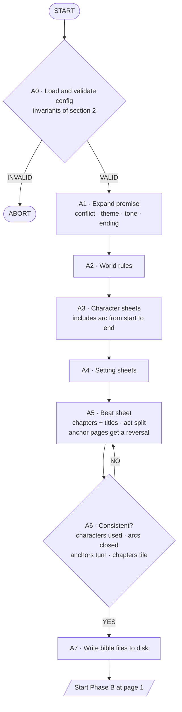
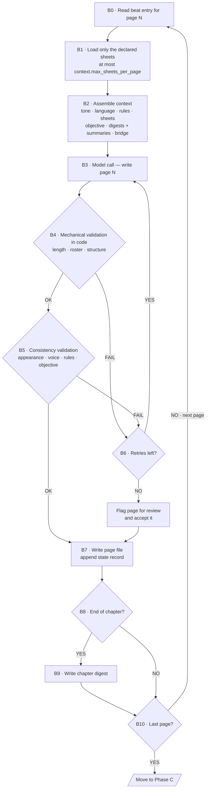
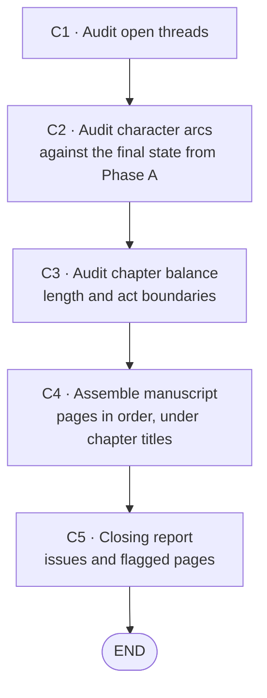
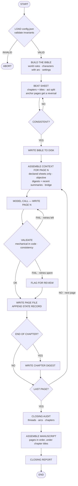

# Functional specification
## Adventure story generator agent — file-backed, config-driven solution

| | |
|---|---|
| **Version** | 2.1 |
| **Date** | 15 September 2026 |
| **Solution type** | Orchestrated agent, one model call per page, state on disk |
| **System deliverable** | Adventure story of `organization.pages_total` pages |
| **Configuration** | `config.json` |
| **Status** | Draft for review |

---

## 1. Purpose and scope

The system generates a complete adventure story from a short premise, maintaining consistency of characters, settings and plot throughout the text, organised into chapters and following a setup, development and resolution structure.

The solution is implemented as **a sequence of model calls driven by an orchestrator, with all durable state held as files on disk**. Each page is written in its own call, against a context assembled specifically for that page. Loop, counters, retry and stop condition belong to the orchestrator, not to the prompt.

**Out of scope:** illustration, layout, translation and any user interaction after launch.

### 1.1 Change from version 1.x

Version 1.x specified a single-prompt solution in which the transcript itself served as memory. That design was retired for three reasons, all recorded in the technical specification: the whole run had to fit in one response (≈25 000 output tokens, a ceiling that blocked approval), a failed run could not be resumed, and validation could only ever be the model reporting on its own work. The file-backed design removes all three. It gives up the property that made version 1.x interesting — proving that a single prompt can sustain loop and state without code — in exchange for a system that can be operated.

---

## 2. Configuration

All control and organization parameters live in **`config.json`**. This document references them by path (`organization.pages_total`, `page.target_words`) and deliberately restates no literal value. A parameter that appears in a requirement below and not in the config file is a defect in one of the two.

| Group | Contains |
|---|---|
| `organization` | Pages, chapters, pages per chapter, act split, anchor pages |
| `page` | Target length and tolerance |
| `story` | Tone, audience, language |
| `context` | Sheets per page, verbatim summary window, bridging paragraph |
| `bible` | Bounds on world rules, characters and settings |
| `control` | Retries, flag ceiling, gate attempts, resume |
| `model` | Model id, temperature, output ceiling |
| `paths` | Location of every artefact the system reads or writes |

**Invariants.** The configuration is invalid, and the run does not start, unless all of these hold:

1. `organization.chapters × organization.pages_per_chapter = organization.pages_total`
2. `sum(organization.acts) = organization.pages_total`
3. every value in `organization.anchor_pages` lies in `[1, organization.pages_total]`
4. `bible.world_rules_min ≤ bible.world_rules_max`
5. `page.length_tolerance` lies in `(0, 1)`

---

## 3. Inputs and outputs

**Input**

| Item | Mandatory | Source |
|---|---|---|
| Premise (1-2 sentences) | Yes | Run argument |
| Tone | No | `story.tone` |
| Target audience | No | `story.audience` |
| Structure (pages, chapters) | No | `organization` |

**Output**

| Artefact | Location | Written in |
|---|---|---|
| Configuration copy | `paths.runs_dir` | Start-up, before the first call |
| Premise expansion | `paths.premise` | Phase A |
| World rules | `paths.world_rules` | Phase A |
| Character sheets, one file each | `paths.characters_dir` | Phase A |
| Setting sheets, one file each | `paths.settings_dir` | Phase A |
| Beat sheet | `paths.beats` | Phase A |
| Pages, one file each | `paths.pages_dir` | Phase B |
| State log | `paths.state_log` | Phase B |
| Chapter digests | `paths.chapter_digests_dir` | Phase B, at each chapter close |
| Context traces | `paths.runs_dir` | Phase B, diagnostic only |
| Assembled manuscript | `paths.manuscript` | Phase C |
| Closing report | `paths.report` | Phase C |

The manuscript is the reader-facing deliverable. Everything else is either input to it, a record of how it was made, or an audit of it.

---

## 4. State model

State is held in files, in three categories that behave differently and must not be confused.

### 4.1 Fixed state — the story bible

Written once in Phase A, immutable thereafter except through the procedure in FR-18. Human-readable and human-editable, because an author will want to revise a character before the pages are written.

**Premise expansion** (`paths.premise`): the central conflict, the theme, the tone as interpreted for this story, and the tentative ending. It is the material from which the rules, the cast and the beat sheet are derived, so it is persisted rather than discarded: without it, a later reader of the bible cannot tell why the story was shaped as it was.

**Character sheet** (`paths.characters_dir`, one Markdown file per character, structured header plus prose body):

| Field | Type | Location in file |
|---|---|---|
| id, name | text | header |
| role | protagonist / ally / antagonist | header |
| arc | initial state → final state | header |
| desire, fear | short text | header |
| appearance, costume | prose | body |
| voice | 2-3 speech traits | body |

**Setting sheet** (`paths.settings_dir`, one file per setting): id and name in the header; appearance, atmosphere and narrative function in the body.

**World rules** (`paths.world_rules`): a closed list of between `bible.world_rules_min` and `bible.world_rules_max` statements about what is possible and what is forbidden.

**Beat sheet** (`paths.beats`, structured data rather than prose, because it is looked up by page number on every call): one entry per page, each carrying page number, chapter, chapter title, act, anchor flag, objective, closing hook, and the ids of the characters and settings that take part.

**Anchor pages.** The pages listed in `organization.anchor_pages` carry a reversal: on an anchor page the story changes direction and cannot return to its previous course. An ordinary page advances the situation; an anchor page turns it. The distinction is enforced on the objective, not on the prose: the objective of an anchor page shall state what changes direction, and the A6 gate rejects a beat sheet whose anchor pages are given objectives that merely continue the preceding action. With the default configuration, pages 5, 10 and 16 carry the entry into the complication, the central reversal and the crisis before the resolution.

**Chapter titles.** Each chapter receives a title in Phase A, stored on every beat entry of that chapter. Titles head their sections in the assembled manuscript and give each chapter digest a subject.

### 4.2 Mutable state

**State log** (`paths.state_log`): one record appended per completed page, carrying the page summary line, the updated current state of each character that appeared, and threads opened or closed. Append-only, so the history of the run is auditable and an interrupted write costs at most the last record.

**Thread register.** Threads are narrative promises, and unlike characters and settings they come into existence during Phase B, not Phase A. A thread identifier is minted by the orchestrator at the moment the thread opens, and the record that opens it is therefore also the record of its opening page. The register is not a separate file: it is the projection obtained by replaying the state log, which is what keeps the opening page and the identifier from ever disagreeing.

**Chapter digests** (`paths.chapter_digests_dir`): one paragraph per completed chapter, written when the chapter closes. Digests replace individual page summaries for chapters outside the verbatim window (see section 6).

### 4.3 Derived state

**The page context** is assembled fresh for each page from the fixed and mutable state, used for one call, and discarded. It is never a source of truth: storing it would create a second copy of data that goes stale as soon as a sheet is edited. A copy is written to `paths.runs_dir` as a diagnostic trace, and can be deleted without loss.

---

## 5. Functional flow

### Phase A — Preparation (once per run)

| Step | Action |
|---|---|
| A0 | Load `config.json` and check the invariants of section 2. When `control.abort_on_invalid_config`, an invalid configuration stops the run before any model call. |
| A1 | Expand the premise into central conflict, theme, tone and tentative ending, and persist it to `paths.premise`. |
| A2 | Generate the world rules, within the bounds in `bible`. |
| A3 | Generate the character sheets, including the arc, up to `bible.max_characters`. |
| A4 | Generate the setting sheets, up to `bible.max_settings`. |
| A5 | Generate the beat sheet for `organization.pages_total` pages: group them into `organization.chapters` chapters of `organization.pages_per_chapter` pages, title each chapter, honour the act split, and give every page in `organization.anchor_pages` an objective that states a reversal. |
| A6 | Check consistency, including that each anchor page turns the story rather than continuing it. On failure, redo A5, up to `control.consistency_gate_max_attempts`. |
| A7 | Persist the bible to the locations in `paths`. |

**Phase A is atomic.** The bible is written only once A6 passes, and a run that stops before A7 leaves nothing behind to resume from: the phase is repeated in full. This costs one call to redo and removes the possibility of building pages on a partially written bible.

### Phase B — Writing cycle (one call per page)

| Step | Action |
|---|---|
| B0 | Read the beat entry for page N from `paths.beats`. |
| B1 | Load only the character and setting sheets that entry declares. |
| B2 | Assemble the context: `story.tone`, `story.audience` and `story.language`, the world rules, the loaded sheets, the objective of N, chapter digests for closed chapters, page summaries for the last `context.verbatim_summary_window` pages, and the final paragraph of page N-1. |
| B3 | Issue the model call for page N. |
| B4 | Validate mechanically, in code. |
| B5 | Validate consistency. |
| B6 | On failure, retry up to `control.max_retries_per_page`, then flag and accept. |
| B7 | Write the page file and append the state record. |
| B8 | If N closes a chapter, write its digest. |
| B9 | Build the chapter digest from that chapter's page summaries. |
| B10 | If pages remain, advance to the next page. Otherwise move to Phase C. |

**Resume.** When `control.resume_enabled`, a run that stops part-way restarts at the first page with no page file, rebuilding its context from the bible and the state log. No completed work is regenerated.

### Phase C — Closing

| Step | Action |
|---|---|
| C1 | Audit open threads by replaying the state log. |
| C2 | Audit character arcs against the final state declared in Phase A. |
| C3 | Audit chapter balance: length per chapter, act boundaries, flag ratio. |
| C4 | Assemble the pages in order into `paths.manuscript`, each chapter introduced by its title. The manuscript is derived: it is rebuilt from `paths.pages_dir` and never edited in place. |
| C5 | Write the closing report to `paths.report`. |

---

## 6. Context strategy

What the design bounds is **the amount of information the model must consult in order to write each page**, and under the file-backed architecture it also bounds what is actually sent. Two mechanisms do the work:

- **Selective loading (FR-08).** Only the sheets the beat entry declares are read from disk, at most `context.max_sheets_per_page`. Cost does not grow with the size of the cast.
- **Two-level compression (FR-15, FR-23).** Recent pages contribute one summary line each, within `context.verbatim_summary_window`. Everything older collapses into one digest per chapter. The summary therefore stops growing with the number of pages and grows with the number of chapters instead.

Unlike version 1.x, the context does not accumulate: each call is assembled from scratch, and the previous page's prose is not carried forward beyond one bridging paragraph. The per-call payload is bounded and roughly constant, and degradation from a long window disappears as a concern.

---

## 7. Functional requirements

Requirements reference configuration by path. None restates a literal.

| ID | Requirement |
|---|---|
| FR-01 | The system shall generate the world rules before characters and settings. |
| FR-02 | Every character shall have a declared arc with an initial state and a final state. |
| FR-03 | Every setting shall have a description of appearance and atmosphere before its first appearance in the text. |
| FR-04 | The beat sheet shall assign each page a unique one-line objective and a closing hook. |
| FR-05 | The beat sheet shall declare, per page, which characters and settings take part. |
| FR-06 | The system shall not start Phase B if A6 detects inconsistencies within `control.consistency_gate_max_attempts`. |
| FR-07 | The system shall assemble the context of each page from the bible and state files immediately before its call. |
| FR-08 | The context shall include only the sheets declared in FR-05, and no more than `context.max_sheets_per_page`. |
| FR-09 | The context shall not include the full text of previous pages beyond the bridging paragraph. |
| FR-10 | Each page shall respect `page.target_words` within `page.length_tolerance`. |
| FR-11 | No page shall introduce characters absent from the sheets. |
| FR-12 | No page shall contradict the declared appearance, voice or arc. |
| FR-13 | No page shall violate the world rules. |
| FR-14 | Each page shall fulfil its assigned objective and end with its hook. |
| FR-15 | After each page, the system shall append its state record before starting the next page. |
| FR-16 | The system shall maintain the register of open threads with each thread's opening page. |
| FR-17 | The system shall stop on completing page `organization.pages_total` and not before. |
| FR-18 | If a deviation from the beat sheet arises during Phase B, the system shall update the remaining entries in `paths.beats` before continuing. |
| FR-19 | The closing report shall list unclosed threads, incomplete arcs, chapter imbalances and flagged pages. |
| FR-20 | All control and organization parameters shall be read from `config.json`. No such value shall be written literally in a prompt or in code. |
| FR-21 | The system shall validate the configuration invariants of section 2 before the first model call, and shall abort on failure when `control.abort_on_invalid_config`. |
| FR-22 | The system shall group pages into `organization.chapters` chapters of `organization.pages_per_chapter` pages, and each beat entry shall declare its chapter. |
| FR-23 | On closing a chapter, the system shall write its digest, which replaces that chapter's individual page summaries in later contexts. |
| FR-24 | Each page shall be persisted in its own file before the next page begins, and a run shall be resumable from the first page without one when `control.resume_enabled`. |
| FR-25 | Mechanical validation (FR-10, FR-11) shall be executed deterministically by the orchestrator, not reported by the model. |
| FR-26 | The assembled context of each page shall be written to `paths.runs_dir` as a diagnostic trace, and shall never be read back as state. |
| FR-27 | Every page listed in `organization.anchor_pages` shall be assigned an objective that states a reversal, and A6 shall reject a beat sheet in which an anchor page merely continues the preceding action. |
| FR-28 | Each chapter shall receive a title in Phase A, recorded on every beat entry of that chapter. |
| FR-29 | On closing, the system shall assemble the pages in order into `paths.manuscript`, under their chapter titles. The manuscript shall be derived from `paths.pages_dir` on every assembly and never edited in place. |
| FR-30 | The prose of every page shall be written in `story.language`. |
| FR-31 | The context of every page shall carry `story.tone` and `story.audience`. |
| FR-32 | The premise expansion shall be persisted to `paths.premise` before the world rules are generated. |
| FR-33 | Failures of the model endpoint shall be retried independently and shall not count against `control.max_retries_per_page`, which governs rejected content only. |
| FR-34 | Phase A shall be atomic: the bible shall be written only once A6 passes, and an interrupted Phase A shall be repeated in full. |
| FR-35 | Thread identifiers shall be minted when a thread opens in Phase B, and the record that opens a thread shall be the record of its opening page. |

---

## 8. Validation and error handling

**Mechanical (FR-10, FR-11, FR-25).** Executed in code over the returned page: word count against `page.target_words` within `page.length_tolerance`, and character ids mentioned against the ids the beat entry declares. Objective, repeatable, and not subject to the model's opinion of its own work.

**Consistency (FR-12 to FR-14).** The page is checked against the loaded sheets, the world rules and its objective. Where this check is delegated to a model it shall be a separate call taking the page as input, never the same call that wrote it.

**Failure branch.** The page is rewritten with the same assembled context. After `control.max_retries_per_page` failures the page is accepted, flagged in the state log, and the run continues. Halting on a local failure produces an unusable deliverable; flagging produces a correctable one.

**Endpoint failure (FR-33).** A timeout, a rate limit or a transport error is not a rejected page: nothing was judged and nothing was wrong with the content. These are retried on their own budget, and never consume `control.max_retries_per_page`. Conflating the two would let a network outage exhaust a page's content retries and get an unread page flagged for review.

**Configuration failure.** Invalid configuration aborts before any model call, and therefore before any cost is incurred.

---

## 9. Acceptance criteria

A run is accepted if it meets all of the following:

- It produces `organization.pages_total` pages, grouped into `organization.chapters` chapters, honouring the act split in `organization.acts`.
- No character changes name, appearance or voice without narrative justification.
- Every setting is described on its first appearance.
- The closing report reports no open threads and no incomplete arcs.
- Flagged pages do not exceed `control.max_flagged_ratio` of the total.
- Reading the pages in order reveals no causal gaps, and chapter boundaries fall at narratively sensible points.
- Each anchor page turns the story: the situation after it cannot return to what it was before.
- `paths.manuscript` exists, is written in `story.language`, and contains every page in order under its chapter title.
- Re-running with a changed `organization` block produces a story of the new shape, with no change to prompts or code.

---

## 10. Limitations and risks

**Continuity across calls.** Each page is written by a call that has never seen the previous pages in full. Voice and rhythm can drift between pages in a way that did not occur when the whole story was written in one pass. Mitigation: the bridging paragraph, and voice traits carried in every character sheet.

**Compression loss.** A chapter digest is lossy by construction. A detail introduced in chapter 1 and needed in chapter 5 survives only if it reached a character sheet, a thread or the digest. Mitigation: threads are the designated carrier for anything that must be paid off later.

**Configuration drift.** Because the specifications defer to `config.json`, a change there silently changes the system's behaviour and its acceptance criteria. Mitigation: the config file is versioned with the run, and the invariants of section 2 are checked on every run.

**Orchestration surface.** The retired design had no code and therefore no code defects. This one has file I/O, resume logic and validation code, each of which can fail on its own. That cost is accepted in exchange for determinism where determinism matters.

**Cost per run.** The number of calls now scales with `organization.pages_total`, and retries add calls rather than tokens. A larger structure costs proportionally more.

---

## 11. Review and change control

### 11.1 Version history

| Version | Date | Changes | Status |
|---|---|---|---|
| 1.0 | 2026-09-15 | Initial version: single-prompt solution, scope, state model, flow, FR-01 to FR-19, acceptance criteria and limitations. | Superseded |
| 1.1 | 2026-09-15 | Functional flow and general diagram converted to Mermaid. Review and change control chapter added. | Superseded |
| 2.0 | 2026-09-15 | Architecture changed from single prompt to orchestrated calls with state on disk. Control and organization parameters extracted to `config.json`; all requirements now reference it. Chapters introduced as an organizational level. FR-20 to FR-26 added. Context strategy rewritten around two-level compression. Limitations rewritten. | Superseded |
| 2.1 | 2026-09-15 | Completeness review applied. Anchor pages defined as reversals and enforced at A6. Chapter titles adopted, closing OI-06. Manuscript assembly added as the reader-facing deliverable. Premise expansion and configuration copy added to the output inventory. Tone, audience and language carried into every page context. Endpoint failures separated from content retries. Phase A declared atomic. Thread identifiers moved to Phase B. FR-27 to FR-35 added. | Draft for review |

### 11.2 Review roles

| Role | Responsibility | Assigned to |
|---|---|---|
| Author | Drafts and maintains the document | [PENDING] |
| Technical reviewer | Verifies that the requirements are implementable as specified | [PENDING] |
| Functional reviewer | Verifies that the acceptance criteria reflect what is expected of the generated story | [PENDING] |
| Approver | Authorises the move from draft to approved version | [PENDING] |

### 11.3 Review checklist

| # | Control point | Result |
|---|---|---|
| V-01 | Every element of the Annex A diagram is covered by at least one numbered requirement | |
| V-02 | Every requirement is atomic, verifiable and written in the imperative | |
| V-03 | No requirement restates a value that belongs in `config.json` | |
| V-04 | Every acceptance criterion in section 9 admits a yes or no answer | |
| V-05 | The state model in section 4 covers all data the flow reads or writes | |
| V-06 | The limitations in section 10 do not contradict any requirement in section 7 | |
| V-07 | No [PENDING] markers remain unresolved or without an associated open issue | |
| V-08 | Every configuration path referenced in this document exists in `config.json` | |

### 11.4 Change procedure

Every change after approval is recorded as an open issue in 11.5, assessed for impact on the affected requirements, applied, versioned in 11.1, and re-checked against 11.3.

Changes affecting FR-07, FR-08, FR-09, FR-15 or FR-23 additionally require an explicit review of section 6, because those are the requirements that sustain the context strategy. Changes to the `organization` block of `config.json` require re-validation of the invariants in section 2.

### 11.5 Open issues

| ID | Issue | Impact | Status |
|---|---|---|---|
| OI-01 | Non-functional requirements undefined: latency per page, cost per run and token limit | Prevents any estimate of operational viability | Open |
| OI-02 | `page.target_words` set to 350 provisionally | FR-10 is verifiable, but the value is unvalidated | Open |
| OI-03 | Assignment of the roles in table 11.2 | Blocks approval of the document | Open |
| OI-04 | Expected behaviour if the premise is insufficient for `organization.pages_total` pages | Branch not covered by the Phase A flow | Open |
| OI-05 | Whether consistency validation (FR-12 to FR-14) runs as a separate model call or stays with the writing call | Determines cost per page and the reliability of the check | Open |
| OI-06 | Whether chapters carry titles, and whether those titles appear in the deliverable | Affects the beat sheet schema and the page files | **Closed in 2.1** — titles generated in Phase A (FR-28), used as manuscript headings (FR-29) |
| OI-07 | Anchor pages are defined as reversals (FR-27), but A6 has no objective measure of what counts as one | The gate depends on a model judgement that nothing calibrates | Open |

---

## Annex A — General flow diagram

