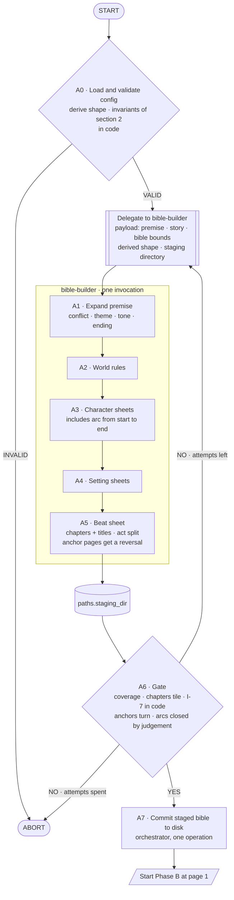
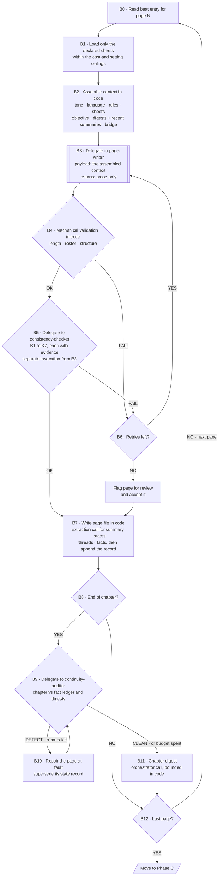
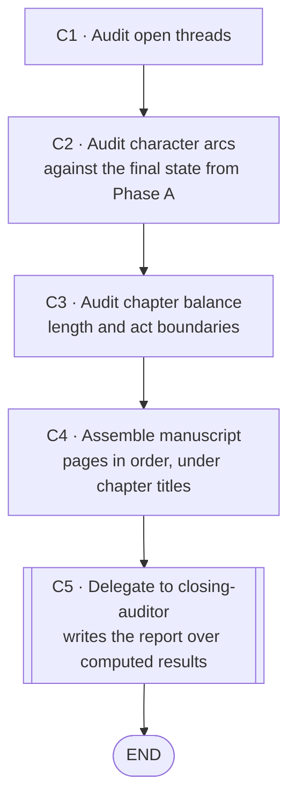
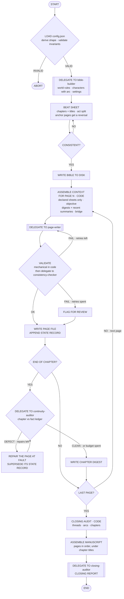

# Functional specification
## Adventure story generator agent — file-backed, config-driven solution

| | |
|---|---|
| **Version** | 2.4 |
| **Date** | 18 September 2026 |
| **Solution type** | Orchestrator delegating to five declared agents, one page call per page, state on disk |
| **System deliverable** | Adventure story of `organization.pages_total` pages |
| **Configuration** | `config.json` |
| **Status** | Draft for review |

---

## 1. Purpose and scope

The system generates a complete adventure story from a short premise, maintaining consistency of characters, settings and plot throughout the text, organised into chapters and following a setup, development and resolution structure.

The solution is implemented as **an orchestrator that delegates to five declared agents, with all durable state held as files on disk**. Each page is written by its own invocation, against a context the orchestrator assembled specifically for that page. Loop, counters, retry and stop condition belong to the orchestrator, not to any agent.

**Out of scope:** illustration, layout, translation and any user interaction after launch.

### 1.1 Change from version 1.x

Version 1.x specified a single-prompt solution in which the transcript itself served as memory. That design was retired for three reasons, all recorded in the technical specification: the whole run had to fit in one response (≈25 000 output tokens, a ceiling that blocked approval), a failed run could not be resumed, and validation could only ever be the model reporting on its own work. The file-backed design removes all three. It gives up the property that made version 1.x interesting — proving that a single prompt can sustain loop and state without code — in exchange for a system that can be operated.

### 1.2 Change from version 2.3

Version 2.4 changes who issues a model call, and nothing else about what the system produces. The
five call types that version 2.3 described as prompt templates are now five **declared agents**, each
defined in its own file under `.claude/agents/`, and the orchestrator issues a call by delegating to
one of them (FR-46).

The phases, the artefacts, the state model and the acceptance criteria are unchanged. What the change
buys is that the boundary between the orchestrator and a model call becomes real: an agent receives a
payload and can reach nothing else, so the context ceilings of FR-08 stop being an instruction the
writing call is trusted to honour, and the separation of the page call from the consistency call
(technical specification TR-09) stops being a procedure and becomes two processes. It also makes each
call individually observable, which is what turns the cost and retry figures of a run from something
reconstructed by hand into something recorded.

Section 5 gains a table of who performs each step, because that is the question the phase diagrams
could not answer before: every step was drawn the same whether it was arithmetic or judgement.

---

## 2. Configuration

All control and organization parameters live in **`config.json`**. This document references them by path (`organization.pages_total`, `page.target_words`) and deliberately restates no literal value. A parameter that appears in a requirement below and not in the config file is a defect in one of the two.

| Group | Contains |
|---|---|
| `organization` | Pages, chapter grouping, act proportions, anchor pages |
| `page` | Target length and tolerance |
| `story` | Tone, audience, language |
| `context` | Cast and setting ceilings, verbatim summary window, digest bound, bridging paragraph |
| `bible` | Bounds on world rules, characters and settings |
| `control` | Retries, continuity repairs, flag ceiling, gate attempts, resume |
| `model` | Model id, temperature, output ceiling |
| `paths` | `stories_root`, plus the location of every artefact within a story workspace, including `staging_dir` |

### 2.1 Authoritative and derived values

The shape of a story has two degrees of freedom: how many pages it has, and how those pages are grouped. Version 2.1 expressed that shape with five interdependent values — `pages_total`, `chapters`, `pages_per_chapter`, an absolute `acts` split and an explicit `anchor_pages` list — and required the author to keep all five consistent by hand. Editing any one of them alone left the configuration invalid, and with `control.abort_on_invalid_config` the run stopped before the first call. A configuration that cannot be edited one value at a time is not a configuration.

From version 2.2 the file holds authoritative inputs only. Everything dependent on them is derived at load time, is never stored, and therefore cannot go stale.

| Authoritative | Derived from it |
|---|---|
| `organization.pages_total` | Total length, and the upper bound of every page range |
| `organization.chapters` *or* `organization.pages_per_chapter` | `derived.chapter_sizes` |
| `organization.act_proportions` | `derived.acts`, `derived.act_spans` |
| `organization.anchor_pages` set to `"auto"` | `derived.anchor_pages` |
| The story id, a run argument | `derived.story_root` |

Requirements and prompts reference a derived name exactly as they reference a configuration path.

The story id is the one authoritative value that does not live in `config.json`, and deliberately so. It identifies a single novel, and `config.json` is shared by all of them: a per-story value written into the shared file would have to be edited before every run, which is the same class of defect as a literal in a prompt.

### 2.2 Derivation rules

**Chapter grouping.** If `organization.chapters` is given it is used. Otherwise, if `organization.pages_per_chapter` is given, the chapter count is `ceil(pages_total / pages_per_chapter)`. Chapters are then made as equal as possible: the first `pages_total mod chapters` chapters take one page more than the rest. Chapter lengths never differ by more than one page, and no configuration is rejected for failing to divide evenly.

**Acts.** `act_proportions` are apportioned over `pages_total` by largest remainder, ties resolved in declaration order, with every act receiving at least one page. Acts occupy consecutive spans in declaration order.

**Anchor pages.** When `anchor_pages` is `"auto"`, the anchors are the first, middle and last page of the development act: the entry into the complication, the central reversal, and the crisis before the resolution. An explicit list may be given instead, and is used unchanged.

**Story workspace.** `derived.story_root` is `paths.stories_root` joined with the story id. Every other path under `paths` is resolved relative to it, so `paths.pages_dir` of the story `the-cold-lamp` means `stories/the-cold-lamp/pages/`. The story id is given as a run argument; when it is omitted it is derived by slugifying the premise. If the workspace that results already holds a different premise, the run does not start and asks for an explicit id rather than choosing a name of its own (FR-44).

**Precedence.** When both `chapters` and `pages_per_chapter` are given and they disagree, `chapters` wins. The superseded value is reported and never silently discarded (FR-37).

At the default configuration these rules yield five chapters of four pages, acts of 4 / 12 / 4 and anchors on pages 5, 10 and 16 — the shape of the validated run, reproduced by derivation rather than restated as literals.

### 2.3 Invariants

The configuration is invalid, and the run does not start, unless all of these hold:

1. `organization.pages_total ≥ 1`, and the derived chapter count lies in `[1, organization.pages_total]`
2. every value in `organization.act_proportions` is positive, they sum to 1, and `organization.pages_total` is at least the number of acts
3. an explicit `organization.anchor_pages` list, where given, lies within `[1, organization.pages_total]`
4. `bible.world_rules_min ≤ bible.world_rules_max`
5. `page.length_tolerance` lies in `(0, 1)`
6. `bible.max_characters ≥ context.max_characters_per_page`, and `bible.max_settings ≥ context.max_settings_per_page`
7. `derived.story_root` resolves inside `paths.stories_root`, and every other path under `paths` resolves inside `derived.story_root`

A value superseded by derivation is not an invalid configuration: it is reported, and the run proceeds (FR-37).

Invariant 7 is what makes the workspace a boundary rather than a convention. A path that escapes it — by being absolute, or by traversing upwards — would let one story write into another, which is the failure the workspace exists to prevent.

---

## 3. Inputs and outputs

**Input**

| Item | Mandatory | Source |
|---|---|---|
| Premise (1-2 sentences) | Yes | Run argument |
| Story id | No | Run argument, else derived from the premise (section 2.2) |
| Tone | No | `story.tone` |
| Target audience | No | `story.audience` |
| Structure (pages, chapters, acts) | No | `organization`, section 2.2 |

**Output**

| Artefact | Location | Written in |
|---|---|---|
| Configuration copy | `paths.runs_dir` | Start-up, before the first call |
| Staged bible | `paths.staging_dir` | Phase A, discarded at A7 |
| Premise expansion | `paths.premise` | Phase A |
| World rules | `paths.world_rules` | Phase A |
| Character sheets, one file each | `paths.characters_dir` | Phase A |
| Setting sheets, one file each | `paths.settings_dir` | Phase A |
| Beat sheet | `paths.beats` | Phase A |
| Pages, one file each | `paths.pages_dir` | Phase B |
| State log | `paths.state_log` | Phase B |
| Chapter digests | `paths.chapter_digests_dir` | Phase B, at each chapter close |
| Context traces | `paths.runs_dir` | Phase B, diagnostic only |
| Assembled manuscript | `paths.manuscript` | Phase C |
| Closing report | `paths.report` | Phase C |

The manuscript is the reader-facing deliverable. Everything else is either input to it, a record of how it was made, or an audit of it.

### 3.1 The story workspace

Every location in the table above is relative to `derived.story_root`. A story owns everything it produces, and owns nothing else:

```
config.json                      shared by every story, read-only to a run
specs/
stories/
  the-cold-lamp/                 one novel, complete in itself
    bible/  pages/  state/
    story.md  report.md
    runs/2026-09-16T10-00/       one invocation against this story
  the-salt-road/
    ...
```

This is what makes a second novel safe. Writing `the-salt-road` cannot touch `the-cold-lamp`, because no path a run resolves lies outside its own workspace (invariant 7). Each workspace holds the bible its story was written from, the pages, the state log, the manuscript, the report and the traces of every invocation — enough to read it, audit it, or resume it, with no reference to any other story.

The only thing shared is `config.json`, which a run reads and never writes. The copy it takes at start-up goes inside the workspace, so a story also records the parameters that produced it even after the shared file has moved on.

---

## 4. State model

State is held in files, in three categories that behave differently and must not be confused.

### 4.1 Fixed state — the story bible

Written once in Phase A, immutable thereafter except through the procedure in FR-18. Human-readable and human-editable, because an author will want to revise a character before the pages are written.

**Premise expansion** (`paths.premise`): the central conflict, the theme, the tone as interpreted for this story, and the tentative ending. It is the material from which the rules, the cast and the beat sheet are derived, so it is persisted rather than discarded: without it, a later reader of the bible cannot tell why the story was shaped as it was.

**Character sheet** (`paths.characters_dir`, one Markdown file per character, structured header plus prose body):

| Field | Type | Location in file |
|---|---|---|
| id, name | text | header |
| role | protagonist / ally / antagonist | header |
| arc | initial state → final state | header |
| desire, fear | short text | header |
| appearance, costume | prose | body |
| voice | 2-3 speech traits | body |

**Setting sheet** (`paths.settings_dir`, one file per setting): id and name in the header; appearance, atmosphere and narrative function in the body.

**World rules** (`paths.world_rules`): a closed list of between `bible.world_rules_min` and `bible.world_rules_max` statements about what is possible and what is forbidden.

**Beat sheet** (`paths.beats`, structured data rather than prose, because it is looked up by page number on every call): one entry per page, each carrying page number, chapter, chapter title, act, anchor flag, objective, closing hook, and the ids of the characters and settings that take part.

**Anchor pages.** The pages in `derived.anchor_pages` carry a reversal: on an anchor page the story changes direction and cannot return to its previous course. An ordinary page advances the situation; an anchor page turns it. The distinction is enforced on the objective, not on the prose: the objective of an anchor page shall state what changes direction, and the A6 gate rejects a beat sheet whose anchor pages are given objectives that merely continue the preceding action. Under `"auto"` the three anchors are the entry into the complication, the central reversal and the crisis before the resolution, at whatever pages the derivation of section 2.2 places them.

**Chapter titles.** Each chapter receives a title in Phase A, stored on every beat entry of that chapter. Titles head their sections in the assembled manuscript and give each chapter digest a subject.

### 4.2 Mutable state

**State log** (`paths.state_log`): one record appended per completed page, carrying the page summary line, the updated current state of each character that appeared, threads opened or closed, and the concrete facts the page asserts — dates, counts, quantities, the names of places and objects. Those facts, replayed across pages, are the **fact ledger** the continuity audit reads (FR-38). Append-only, so the history of the run is auditable and an interrupted write costs at most the last record.

**Thread register.** Threads are narrative promises, and unlike characters and settings they come into existence during Phase B, not Phase A. A thread identifier is minted by the orchestrator at the moment the thread opens, and the record that opens it is therefore also the record of its opening page. The register is not a separate file: it is the projection obtained by replaying the state log, which is what keeps the opening page and the identifier from ever disagreeing.

**Chapter digests** (`paths.chapter_digests_dir`): one paragraph per completed chapter, of at most `context.chapter_digest_max_words` words, written when the chapter closes. A digest carries the chapter's events and the facts later chapters depend on. Digests cover every page outside the verbatim window; a page inside the window keeps its own summary whatever chapter it belongs to (see section 6).

### 4.3 Derived state

**The page context** is assembled fresh for each page from the fixed and mutable state, used for one call, and discarded. It is never a source of truth: storing it would create a second copy of data that goes stale as soon as a sheet is edited. A copy is written to `paths.runs_dir` as a diagnostic trace, and can be deleted without loss.

---

## 5. Functional flow

### 5.0 Who performs each step

Every step below is performed either **in code by the orchestrator** or **by a delegated agent**, and
the distinction is not cosmetic: a requirement asserted by an agent carries no evidence, while one
executed by the orchestrator can be measured and replayed. The first run's numbers are trustworthy
because the second column of this table was code.

| Step | Performed by | Why there |
|---|---|---|
| A0 — load, derive, validate | Orchestrator, in code | Arithmetic and invariants (FR-21, FR-36) |
| A1 to A5 — the bible | `bible-builder`, in **one** invocation | The bible is one act of design; splitting it into five calls would let the beat sheet be planned without the rules it rests on |
| A6 — the gate | Split: coverage, chapter tiling and I-7 in code; the anchor-reversal judgement by a delegated call | The arithmetic half is decidable, the reversal half is not (FR-27, OI-07) |
| A7 — commit the bible | Orchestrator, in code | Atomicity is a file operation, not a judgement (FR-34) |
| B0 to B2 — beat, sheets, context | Orchestrator, in code | `assemble(N)` is deterministic and is what enforces the FR-08 ceilings |
| B3 — write page N | `page-writer` | Prose |
| B4 — mechanical validation | Orchestrator, in code | Length and roster must be measured, never reported (FR-25) |
| B5 — consistency validation | `consistency-checker`, a separate invocation from B3 | Judgement, and it must not be made by whatever wrote the page (TR-09) |
| B6 — retry or flag | Orchestrator, in code | Counters and budgets |
| B7 — page file and state record | Orchestrator, in code, with one extraction call for the summary, states, threads and facts | The write is code; reading facts out of prose is judgement |
| B9 — continuity audit | `continuity-auditor` | The only judgement that reads across pages (FR-39) |
| B10 — repair | Orchestrator, through B3 to B7 | A repair is an ordinary page call plus a superseding record (FR-40) |
| B11 — chapter digest | One orchestrator-owned call, bounded in code | Compression, and the bound is arithmetic (FR-23) |
| C1 to C3 — closing audits | Orchestrator, in code | Thread replay, arc comparison, chapter balance and the flag ratio are all replay (FR-19) |
| C4 — assemble manuscript | Orchestrator, in code | Concatenation (FR-29) |
| C5 — closing report | `closing-auditor`, over results it does not recompute | Judgement about what the measurements mean |

The five agents are defined in `.claude/agents/`, and **each file is where its agent's behaviour is
defined** — what it judges, what it refuses, what it may not touch. This document does not restate
any of it; technical specification §5 holds the wiring, and §12.2 the inventory.

### Phase A — Preparation (once per run)



| Step | Action |
|---|---|
| A0 | Load `config.json`, derive the story workspace from the story id, and check the invariants of section 2.3. If the workspace already holds a premise, it must match the premise of this run: if it does not, the run stops here (FR-44). When `control.abort_on_invalid_config`, an invalid configuration also stops the run before any model call. |
| A1 | Expand the premise into central conflict, theme, tone and tentative ending. The expansion is the input to A2 to A5, and is staged rather than written (FR-32, FR-34). A1 to A5 are one invocation of `bible-builder`, which receives every bound as a value and resolves no configuration path of its own (FR-47). |
| A2 | Generate the world rules, within the bounds in `bible`. |
| A3 | Generate the character sheets, including the arc, up to `bible.max_characters`. |
| A4 | Generate the setting sheets, up to `bible.max_settings`. |
| A5 | Generate the beat sheet for `organization.pages_total` pages: group them according to `derived.chapter_sizes`, title each chapter, honour `derived.act_spans`, and give every page in `derived.anchor_pages` an objective that states a reversal. |
| A6 | Check consistency. Beat coverage, chapter tiling and invariant 7 are computed in code; that each anchor page turns the story rather than continuing it is a judgement and is put to a separate call. On failure, re-invoke `bible-builder` with the gate's reasons, up to `control.consistency_gate_max_attempts`. |
| A7 | Commit the staged bible from `paths.staging_dir` to the locations in `paths`, in one operation, and discard the staging directory. Performed by the orchestrator: no agent writes into the bible. |

**Phase A is atomic.** Every artefact of A1 to A5, the premise expansion included, is written by `bible-builder` into `paths.staging_dir` and committed to the bible in one operation at A7. Generation order and write order are therefore independent, which is what reconciles two requirements that read as contradictory: the expansion is produced before the world rules because they derive from it (FR-32), and nothing whatever is written until the gate passes (FR-34). A run that stops before A7 leaves nothing behind to resume from and repeats the phase in full. This costs one call to redo and removes the possibility of building pages on a partially written bible.

### Phase B — Writing cycle (one call per page)



| Step | Action |
|---|---|
| B0 | Read the beat entry for page N from `paths.beats`. |
| B1 | Load only the character and setting sheets that entry declares, within `context.max_characters_per_page` and `context.max_settings_per_page`. |
| B2 | Assemble the context: `story.tone`, `story.audience` and `story.language`, the world rules, the loaded sheets, the objective of N, the digest of each closed chapter, the page summaries inside `context.verbatim_summary_window`, and the final paragraph of page N-1. |
| B3 | Delegate page N to `page-writer`, handing it the assembled context and, on a retry, the reasons the previous attempt was rejected. It returns prose and nothing else. |
| B4 | Validate mechanically, in code. |
| B5 | Delegate the finished page to `consistency-checker`, in an invocation separate from B3. It answers K1 to K7 with evidence; the orchestrator computes the verdict from the answers. |
| B6 | On failure, retry up to `control.max_retries_per_page`, then flag and accept. |
| B7 | Write the page file, then append the state record, including the facts the page asserts. The record's summary line, character states, threads and facts are read out of the prose by a single orchestrator-owned call; the write itself is code. |
| B8 | If N does not close a chapter, go to B12. |
| B9 | Delegate the closing chapter to `continuity-auditor`, with the fact ledger and the preceding digests. It names exactly one page at fault per contradiction. |
| B10 | On a defect, rewrite the page at fault through B3 to B7 and append a superseding state record, up to `control.max_continuity_repairs`. Re-audit. |
| B11 | Write the chapter digest, of at most `context.chapter_digest_max_words` words. |
| B12 | If pages remain, advance to the next page. Otherwise move to Phase C. |

**Per-attempt record.** Each page attempt is appended to `attempts.jsonl` in the run directory as its validation is decided, with the page, the attempt number, the word count and the checks that rejected it. The state record carries `retries` but not what each attempt was rejected *for*, and that distinction is not recoverable afterwards. It is written by the same code that performs the validation, never reported, and nothing in a run reads it back (TR-06). It is the input to the calibration loop of the self-improvement specification, SR-01.

**Resume.** When `control.resume_enabled`, a run that stops part-way restarts at the first page with no page file, rebuilding its context from the bible and the state log. No completed work is regenerated.

### Phase C — Closing



| Step | Action |
|---|---|
| C1 | Audit open threads by replaying the state log, in code. |
| C2 | Audit character arcs against the final state declared in Phase A. |
| C3 | Audit chapter balance in code: length per chapter, act boundaries, flag ratio. |
| C4 | Assemble the pages in order into `paths.manuscript`, each chapter introduced by its title. The manuscript is derived: it is rebuilt from `paths.pages_dir` and never edited in place. |
| C5 | Delegate to `closing-auditor`, handing it the results of C1 to C3 and the superseded configuration values, and write what it returns to `paths.report`. It judges what the measurements mean and never recomputes them. |

---

## 6. Context strategy

What the design bounds is **the amount of information the model must consult in order to write each page**, and under the file-backed architecture it also bounds what is actually sent. Two mechanisms do the work:

- **Selective loading (FR-08).** Only the sheets the beat entry declares are read from disk: at most `context.max_characters_per_page` character sheets and at most `context.max_settings_per_page` setting sheets. Cost does not grow with the size of the cast.
- **Two-level compression (FR-15, FR-23, FR-41).** The pages inside `context.verbatim_summary_window` contribute one summary line each. Everything older collapses into one digest per chapter, bounded by `context.chapter_digest_max_words`. The summary therefore stops growing with the number of pages and grows with the number of chapters instead.

**The cast ceiling is a scene ceiling.** `context.max_characters_per_page` does not only bound the payload. A character whose sheet is not loaded cannot be written with appearance, voice or arc, so the parameter decides how many characters can hold a scene. Until version 2.2 characters and settings shared a single budget of three, which left room for two characters on any page that also declared a setting: the validated run came out written entirely in two-handers, and nothing in this document had said that it would. Separating the two ceilings makes cast size an explicit decision rather than a side effect of a payload budget.

**Recency wins over compression.** A page inside the verbatim window keeps its individual summary even when its chapter has already been digested. Without that rule the window is inert whenever chapters are shorter than it: at four-page chapters it could never hold more than three summaries, whatever value it was given. The cost is that a page can appear both in a digest and as a summary line, and at roughly fifteen tokens a line the duplication is worth the continuity it buys.

Unlike version 1.x, the context does not accumulate: each call is assembled from scratch, and the previous page's prose is not carried forward beyond one bridging paragraph. The per-call payload is bounded, and grows with `organization.chapters` and `context.verbatim_summary_window` — never with `organization.pages_total`.

---

## 7. Functional requirements

Requirements reference configuration by path. None restates a literal.

| ID | Requirement |
|---|---|
| FR-01 | The system shall generate the world rules before characters and settings. |
| FR-02 | Every character shall have a declared arc with an initial state and a final state. |
| FR-03 | Every setting shall have a description of appearance and atmosphere before its first appearance in the text. |
| FR-04 | The beat sheet shall assign each page a unique one-line objective and a closing hook. |
| FR-05 | The beat sheet shall declare, per page, which characters and settings take part. |
| FR-06 | The system shall not start Phase B if A6 detects inconsistencies within `control.consistency_gate_max_attempts`. |
| FR-07 | The system shall assemble the context of each page from the bible and state files immediately before its call. |
| FR-08 | The context shall include only the sheets declared in FR-05, and no more than `context.max_characters_per_page` character sheets and `context.max_settings_per_page` setting sheets. |
| FR-09 | The context shall not include the full text of previous pages beyond the bridging paragraph. |
| FR-10 | Each page shall respect `page.target_words` within `page.length_tolerance`. |
| FR-11 | No page shall name a character absent from the bible. A character the bible declares but the page's beat entry does not may be referred to, but shall not act or speak. |
| FR-12 | No page shall contradict the declared appearance, voice or arc. |
| FR-13 | No page shall violate the world rules. |
| FR-14 | Each page shall fulfil its assigned objective and end with its hook. |
| FR-15 | After each page, the system shall append its state record before starting the next page. |
| FR-16 | The system shall maintain the register of open threads with each thread's opening page. |
| FR-17 | The system shall stop on completing page `organization.pages_total` and not before. |
| FR-18 | If a deviation from the beat sheet arises during Phase B, the system shall update the remaining entries in `paths.beats` before continuing. |
| FR-19 | The closing report shall list unclosed threads, incomplete arcs, chapter imbalances and flagged pages. |
| FR-20 | All control and organization parameters shall be read from `config.json`. No such value shall be written literally in a prompt or in code. |
| FR-21 | The system shall validate the configuration invariants of section 2 before the first model call, and shall abort on failure when `control.abort_on_invalid_config`. |
| FR-22 | The system shall group pages into chapters according to `derived.chapter_sizes`, and each beat entry shall declare its chapter. |
| FR-23 | On closing a chapter, the system shall write its digest, of at most `context.chapter_digest_max_words` words, which replaces that chapter's individual page summaries in later contexts subject to FR-41. |
| FR-24 | Each page shall be persisted in its own file before the next page begins, and a run shall be resumable from the first page without one when `control.resume_enabled`. |
| FR-25 | Mechanical validation (FR-10, FR-11) shall be executed deterministically by the orchestrator, not reported by the model. |
| FR-26 | The assembled context of each page shall be written to `paths.runs_dir` as a diagnostic trace, and shall never be read back as state. |
| FR-27 | Every page in `derived.anchor_pages` shall be assigned an objective that states a reversal, and A6 shall reject a beat sheet in which an anchor page merely continues the preceding action. |
| FR-28 | Each chapter shall receive a title in Phase A, recorded on every beat entry of that chapter. |
| FR-29 | On closing, the system shall assemble the pages in order into `paths.manuscript`, under their chapter titles. The manuscript shall be derived from `paths.pages_dir` on every assembly and never edited in place. |
| FR-30 | The prose of every page shall be written in `story.language`. |
| FR-31 | The context of every page shall carry `story.tone` and `story.audience`. |
| FR-32 | The premise expansion shall be generated before the world rules, and shall be committed to `paths.premise` with the rest of the bible at A7. |
| FR-33 | Failures of the model endpoint shall be retried independently and shall not count against `control.max_retries_per_page`, which governs rejected content only. |
| FR-34 | Phase A shall be atomic: the bible shall be written only once A6 passes, and an interrupted Phase A shall be repeated in full. |
| FR-35 | Thread identifiers shall be minted when a thread opens in Phase B, and the record that opens a thread shall be the record of its opening page. |
| FR-36 | The system shall derive `derived.chapter_sizes`, `derived.acts`, `derived.act_spans` and `derived.anchor_pages` from `organization` by the rules of section 2.2, and shall require no dependent value to be kept consistent by hand. |
| FR-37 | No value supplied in `config.json` shall be silently ignored. A value superseded by derivation or by precedence shall be reported at start-up and in the closing report. |
| FR-38 | Each state record shall carry the concrete facts its page asserts, and those records, replayed, shall constitute the fact ledger. |
| FR-39 | On closing a chapter, and before writing its digest, the system shall audit that chapter's pages against the fact ledger and the preceding digests for contradictions. |
| FR-40 | A continuity defect found by FR-39 shall be repaired by rewriting the page at fault and appending a superseding state record, up to `control.max_continuity_repairs` per run, and every repair shall be reported. |
| FR-41 | A page inside `context.verbatim_summary_window` shall keep its individual summary in the assembled context even when its chapter has been digested. |
| FR-42 | Each story shall occupy its own workspace at `derived.story_root`, and every path under `paths` other than `stories_root` shall be resolved relative to that workspace. |
| FR-43 | The story id shall be taken from the run argument, and derived from the premise when that argument is absent. |
| FR-44 | The system shall not write into a workspace whose persisted premise differs from the premise of the current run. It shall stop before the first model call and report the conflict. |
| FR-45 | A run shall write nothing outside its own workspace, and shall leave every other workspace byte-for-byte unchanged. |
| FR-46 | Each of the five call types shall be defined in exactly one agent definition under `.claude/agents/`, and shall be issued as one delegation to that agent per call. No two call types shall share an invocation. |
| FR-47 | Every value an agent needs from `config.json` or from derivation shall reach it as a value in its invocation payload. No agent shall read `config.json`, and no payload shall supply a parameter name in place of a parameter value. |
| FR-48 | Every delegation shall be labelled with its call type and its subject — page, chapter or run — and a retry shall additionally carry its attempt number. |
| FR-49 | No agent shall write outside `paths.staging_dir`, and no agent shall delegate to another agent. Every file in the workspace other than the staged bible shall be written by the orchestrator. |

---

## 8. Validation and error handling

**Mechanical (FR-10, FR-11, FR-25).** Executed in code over the returned page: word count against `page.target_words` within `page.length_tolerance`, and every character name found in the page against the ids the **bible** declares. Checking names against the ids of the *beat entry* instead, as version 2.1 did, forbids a page from so much as mentioning a character who is not on stage, which is a strong constraint on the prose that no requirement had stated. Whether an undeclared character acts or speaks is a judgement, and belongs to the consistency check rather than to a word matcher. Objective, repeatable, and not subject to the model's opinion of its own work.

**Consistency (FR-12 to FR-14).** The page is checked against the loaded sheets, the world rules and its objective. This check is delegated to `consistency-checker`, in an invocation separate from the one that wrote the page, and the agent answers the seven enumerated checks with evidence rather than giving an opinion. The orchestrator computes the verdict from the answers. Under FR-46 the separation is structural: two agents, two invocations, and no payload that merges them. In the measured run the check ran as a separate pass inside the same session, so the form was satisfied and the substance was not.

**Failure branch.** The page is rewritten with the same assembled context. After `control.max_retries_per_page` failures the page is accepted, flagged in the state log, and the run continues. Halting on a local failure produces an unusable deliverable; flagging produces a correctable one.

**Continuity (FR-38 to FR-40).** Per-page validation cannot see a contradiction between page 3 and page 11, because it never sees both, and two-level compression makes such a contradiction likelier rather than less likely: by page 11, chapter 1 exists only as a digest. The first run produced exactly this failure, an inconsistent calendar across four pages that were already committed, and the specified flow had no branch for it. The chapter-close audit is that branch. It runs at the last moment when a chapter's pages are still cheap to revisit, and it has the fact ledger to compare against. A defect is repaired by rewriting the page at fault through the ordinary page path and appending a superseding state record; the budget is `control.max_continuity_repairs`, because a rewrite invalidates whatever later pages assumed, and an unbounded repair loop trades a known defect for an unseen one.

**Endpoint failure (FR-33).** A timeout, a rate limit or a transport error is not a rejected page: nothing was judged and nothing was wrong with the content. These are retried on their own budget, and never consume `control.max_retries_per_page`. Conflating the two would let a network outage exhaust a page's content retries and get an unread page flagged for review.

**Configuration failure.** Invalid configuration aborts before any model call, and therefore before any cost is incurred.

---

## 9. Acceptance criteria

A run is accepted if it meets all of the following:

- It produces `organization.pages_total` pages, grouped into chapters according to `derived.chapter_sizes`, honouring `derived.act_spans`.
- No character changes name, appearance or voice without narrative justification.
- Every setting is described on its first appearance.
- The closing report reports no open threads and no incomplete arcs.
- Flagged pages do not exceed `control.max_flagged_ratio` of the total.
- Reading the pages in order reveals no causal gaps, and chapter boundaries fall at narratively sensible points.
- Each anchor page turns the story: the situation after it cannot return to what it was before.
- `paths.manuscript` exists, is written in `story.language`, and contains every page in order under its chapter title.
- Changing any single value in `organization` — page count, chapter count, chapter length or act proportions — produces a story of the new shape, with no other edit to the configuration, to prompts or to code.
- No value supplied in `config.json` is ignored without being reported.
- Continuity repairs do not exceed `control.max_continuity_repairs`, and every one is recorded in the closing report.
- Writing a second story leaves every file of every earlier story unchanged, and the earlier manuscripts still read exactly as they did.
- A workspace, taken on its own, contains everything needed to read, audit or resume its story.
- Every page was written by one invocation and judged by another, and the record of the run shows both.
- No agent definition contains a value that belongs in `config.json`.

---

## 10. Limitations and risks

**Continuity across calls.** Each page is written by a call that has never seen the previous pages in full. Voice and rhythm can drift between pages in a way that did not occur when the whole story was written in one pass. Mitigation: the bridging paragraph, and voice traits carried in every character sheet.

**Compression loss.** A chapter digest is lossy by construction. A detail introduced in chapter 1 and needed in chapter 5 survives only if it reached a character sheet, a thread or the digest. Mitigation: threads are the designated carrier for anything that must be paid off later.

**Configuration drift.** Because the specifications defer to `config.json`, a change there silently changes the system's behaviour and its acceptance criteria. Mitigation: the config file is versioned with the run, and the invariants of section 2 are checked on every run.

**A derived shape is a shape nobody chose.** Chapter sizes, act spans and anchor pages are computed from proportions, so an author who wants a particular structure — a deliberately short opening chapter, an anchor on one specific page — must override rather than edit, and an explicit override is the one path by which the old hand-maintained inconsistency can return. Mitigation: overrides are validated against `pages_total` and reported, never silently accepted.

**Orchestration surface.** The retired design had no code and therefore no code defects. This one has file I/O, resume logic and validation code, each of which can fail on its own. That cost is accepted in exchange for determinism where determinism matters.

**Delegation surface.** Each of the five agents is a separate prompt that can drift from the requirement it implements, and nothing in the specifications is checked against an agent file automatically: V-12 to V-14 are review controls, performed by a person. The failure mode is quiet — an agent whose definition has drifted still returns something of the right shape — and it is the cost of moving behaviour out of the specifications and into five files. Mitigation: the definitions are checked into the repository, so a change to one is reviewable as a diff.

**Cost per run.** The number of calls now scales with `organization.pages_total`, and retries add calls rather than tokens. A larger structure costs proportionally more.

**Workspaces accumulate and nothing collects them.** Every story keeps its bible, its pages, its state log, its manuscript and the traces of every invocation, for as long as the directory exists. That is the point — no story is destroyed by the next one — but there is no retention rule, no archive step and no way to discard a story through the system. Deleting one is a manual act, and the specification says nothing about when it is appropriate (OI-09).

**A shared configuration outlives the stories written under it.** Each workspace keeps the copy of `config.json` that produced it, so an old story remains explicable. But the shared file will have moved on, and re-running an old story under the current configuration may produce a different shape from the one on disk. Mitigation: FR-44 stops a run whose premise does not match, and TR-19 refuses to resume across a changed derived shape.

---

## 11. Review and change control

### 11.1 Version history

| Version | Date | Changes | Status |
|---|---|---|---|
| 1.0 | 2026-09-15 | Initial version: single-prompt solution, scope, state model, flow, FR-01 to FR-19, acceptance criteria and limitations. | Superseded |
| 1.1 | 2026-09-15 | Functional flow and general diagram converted to Mermaid. Review and change control chapter added. | Superseded |
| 2.0 | 2026-09-15 | Architecture changed from single prompt to orchestrated calls with state on disk. Control and organization parameters extracted to `config.json`; all requirements now reference it. Chapters introduced as an organizational level. FR-20 to FR-26 added. Context strategy rewritten around two-level compression. Limitations rewritten. | Superseded |
| 2.1 | 2026-09-15 | Completeness review applied. Anchor pages defined as reversals and enforced at A6. Chapter titles adopted, closing OI-06. Manuscript assembly added as the reader-facing deliverable. Premise expansion and configuration copy added to the output inventory. Tone, audience and language carried into every page context. Endpoint failures separated from content retries. Phase A declared atomic. Thread identifiers moved to Phase B. FR-27 to FR-35 added. | Superseded |
| 2.2 | 2026-09-16 | Applied from the findings of the first full run (`report.md`, D3 to D8). Configuration reworked from five interdependent values to authoritative inputs plus derivation (2.1 to 2.3), so that any single value can be edited without invalidating the file. Character and setting context ceilings separated. The verbatim summary window given precedence over digests. Chapter digests bounded. Chapter-close continuity audit and bounded repair path added for defects in committed pages. FR-32 and FR-34 reconciled through staged Phase A writes. FR-08, FR-11, FR-22, FR-23 and FR-27 reworded; FR-36 to FR-41 added. | Superseded |
| 2.4 | 2026-09-18 | Delegated form. The five call types become five declared agents under `.claude/agents/`, one definition per call type, and the orchestrator issues a call by delegating to one (FR-46). Agent behaviour moves out of the specifications and into the agent files, which are now the single place each call type's prompt is written; the `prompts/*.md` templates of the build inventory are folded into them. Section 5.0 added, stating for every step whether it is executed in code or delegated. Phase A clarified: A1 to A5 are one invocation, the bible is staged under the new `paths.staging_dir` and committed by the orchestrator at A7, and the A6 gate is split into its arithmetic and judgement halves. The state-record extraction call and the digest call named as orchestrator-owned calls for the first time. FR-46 to FR-49 added. Nothing about the artefacts, the state model or the acceptance criteria changes. | Draft for review |
| 2.3 | 2026-09-16 | Story isolation. Until this version every path was a fixed single-story path, so a second novel overwrote the first, appended to its state log, and — with resume enabled and the previous pages still present — could be skipped entirely in favour of reassembling the old manuscript. Each story now owns a workspace at `derived.story_root`, and all paths resolve inside it. Story id added as a run argument, invariant 7 and FR-42 to FR-45 added, section 3.1 added. Specifications moved to `specs/`. | Draft for review |

### 11.2 Review roles

| Role | Responsibility | Assigned to |
|---|---|---|
| Author | Drafts and maintains the document | [PENDING] |
| Technical reviewer | Verifies that the requirements are implementable as specified | [PENDING] |
| Functional reviewer | Verifies that the acceptance criteria reflect what is expected of the generated story | [PENDING] |
| Approver | Authorises the move from draft to approved version | [PENDING] |

### 11.3 Review checklist

| # | Control point | Result |
|---|---|---|
| V-01 | Every element of the Annex A diagram is covered by at least one numbered requirement | |
| V-02 | Every requirement is atomic, verifiable and written in the imperative | |
| V-03 | No requirement restates a value that belongs in `config.json` | |
| V-04 | Every acceptance criterion in section 9 admits a yes or no answer | |
| V-05 | The state model in section 4 covers all data the flow reads or writes | |
| V-06 | The limitations in section 10 do not contradict any requirement in section 7 | |
| V-07 | No [PENDING] markers remain unresolved or without an associated open issue | |
| V-08 | Every configuration path referenced in this document exists in `config.json` | |
| V-09 | Every value in `config.json` is authoritative, derived, or reported as superseded; none is silently ignored | |
| V-10 | Editing any single `organization` value on its own leaves the configuration valid | |
| V-11 | Every path a run resolves lies inside `derived.story_root`, and no requirement names a location outside it | |
| V-12 | Every call type in technical specification §5 has exactly one agent definition under `.claude/agents/`, and no agent definition exists that no call type names | |
| V-13 | No agent definition contains a configuration literal, and every value an agent needs is listed in its input section as arriving in the payload | |
| V-14 | Every step of section 5 appears in the table of 5.0, assigned either to code or to a named agent | |

### 11.4 Change procedure

Every change after approval is recorded as an open issue in 11.5, assessed for impact on the affected requirements, applied, versioned in 11.1, and re-checked against 11.3.

Changes affecting FR-07, FR-08, FR-09, FR-15 or FR-23 additionally require an explicit review of section 6, because those are the requirements that sustain the context strategy. Changes to the `organization` block of `config.json` require re-validation of the invariants in section 2.

A change to what an agent judges or refuses is made in its file under `.claude/agents/` and is not recorded here, because this document does not hold that content. A change to **what an agent is handed or what it returns** changes both the agent file and technical specification §5, and follows the procedure above like any other.

### 11.5 Open issues

| ID | Issue | Impact | Status |
|---|---|---|---|
| OI-01 | Non-functional requirements undefined: latency per page, cost per run and token limit | Prevents any estimate of operational viability | Open |
| OI-02 | `page.target_words` set to 350 provisionally | Now measured: six of the first run's seven retries were length failures, all from above. A target of 380 to 400 would have produced the same prose with no retries | Open, with evidence |
| OI-03 | Assignment of the roles in table 11.2 | Blocks approval of the document | Open |
| OI-04 | Expected behaviour if the premise is insufficient for `organization.pages_total` pages | Branch not covered by the Phase A flow | Open |
| OI-05 | Whether consistency validation (FR-12 to FR-14) runs as a separate model call or stays with the writing call | Determines cost per page and the reliability of the check. In the first run the check ran as a separate pass but not against an independent endpoint, so the form was satisfied and the substance was not | Open |
| OI-06 | Whether chapters carry titles, and whether those titles appear in the deliverable | Affects the beat sheet schema and the page files | **Closed in 2.1** — titles generated in Phase A (FR-28), used as manuscript headings (FR-29) |
| OI-07 | Anchor pages are defined as reversals (FR-27), but A6 has no objective measure of what counts as one | The gate depends on a model judgement that nothing calibrates. In the first run it was implemented as a lexical test for reversal vocabulary, which would pass an objective that merely used the words | **Open — blocking for any unattended run**, because it is the one gate whose failure is silent |
| OI-08 | What counts as a fact asserted by a page (FR-38) is undefined | An over-broad ledger costs tokens on every audit; an over-narrow one misses the contradictions the audit exists to catch | Open |
| OI-09 | No way to discard or regenerate a story through the system, and no retention rule for workspaces | FR-44 stops a run whose premise conflicts, which is correct but leaves rewriting a premise from scratch with no path other than deleting files by hand | Open |
| OI-10 | A declared agent definition cannot carry a temperature, so the requirement that judgement calls run at 0 has no mechanism in the delegated form | Consistency, continuity and audit are judgements being made at a composition temperature. Mirrors TI-14 | **Open — introduced by 2.4** |
| OI-11 | An agent's tool allowlist cannot express no file access, so `page-writer` and `consistency-checker` are instructed rather than prevented from reading around their payload | The FR-08 ceilings rest on instruction for the two most frequent call types, and a page written from unauthorised context is indistinguishable in the prose. Mirrors TI-15 | **Open — introduced by 2.4** |
| OI-12 | Whether the A6 anchor judgement is a sixth call type or a second use of an existing agent is unresolved | It is the one judgement in 5.0 with no agent of its own, which leaves FR-27's enforcement outside the inventory of technical §12.2. Compounds OI-07 | Open |

---

## Annex A — General flow diagram


