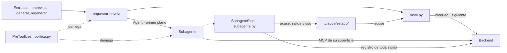

# plan-agentes.md — Configuración de Claude Code

> **Estado: en construcción (2026-09-23).** Es el plan que piden [plan-entrega.md](plan-entrega.md) §5 y [plan-backend-v1.md](plan-backend-v1.md) §2. Cubre el inventario de plan-entrega §4: definiciones de agente, skills, hooks, `.claude/settings.json`, `.mcp.json` y la sección del harness en `CLAUDE.md`, ordenado por hitos (H1 a H6).
>
> **Dueña:** la sesión de agentes, que escribe en `.claude/` (salvo `settings.local.json`), `.mcp.json`, este fichero y la sección del harness de `CLAUDE.md`. No escribe en `backend/`, `docs/`, `formal/` ni en las demás specs: lo que esas carpetas tengan que cambiar por este plan está en §9, para que lo recoja su dueña.
>
> Lo marcado **PENDIENTE** no lo cierra esta sesión: lo decide la persona con la sesión de backend.

---

## 1. Qué hace la configuración

La sesión de Claude Code ejecuta y el backend decide ([architecture.md](../docs/architecture.md) §3.1). Esta configuración es la parte que ejecuta: cómo se pide una orden, cómo se lanza el subagente que indica, cómo vuelve su resultado al backend y qué no se le deja hacer a nadie por el camino.



La skill no contiene reglas de decisión: pide, lanza, registra y vuelve a pedir. Qué agente toca, si se reintenta y cuándo parar lo dice la orden.

---

## 2. Decisiones

Tomadas con `grilling` el 2026-09-23, con la recomendación de la sesión en todas.

| # | Decisión | Por qué |
|---|---|---|
| **E-3** | **La entrevista se hace en Claude Code**, con la skill `/entrevista` en la sesión principal, que conversa solo las respuestas estructuradas. **El texto libre llega por fichero**: el comprador lo guarda como `texto_libre*.txt`, `msm.py brief` lo lee y lo envía a `POST /brief` sin imprimirlo, y el hook de policy deniega leerlo con las herramientas de fichero. Los hechos extraídos sí se muestran, porque ya vienen en esquema cerrado y el comprador tiene que confirmarlos. La web queda para la lectura y los cambios | Si la anécdota se pega en el chat, entra en la ventana del orquestador, que [architecture.md](../docs/architecture.md) §1 prohíbe, y E2 deja de probar nada: la sesión principal lee la inyección antes que el Extractor. La entrevista web costaría una funcionalidad de frontend entera |
| **E-1** | **a)** Langfuse Cloud, con **solo metadatos**: tokens, modelo, latencia, scores y versión de prompt; nunca texto de prompts ni de capítulos. **b)** Un solo hook `SubagentStop` para todos los agentes lee `agent_transcript_path`, suma los tokens por mensaje y calcula el hash del fichero del agente; el **backend es el único que envía a Langfuse**. **c)** La versión de prompt es el SHA-256 del fichero del agente; la sincronización con la gestión de prompts de Langfuse, si se hace, es un comando del backend, que tiene el cliente y las claves. **d)** El plugin de usuario `langfuse-observability` se **desactiva en este proyecto** (`enabledPlugins` en `.claude/settings.json`) | El plugin envía hasta 20.000 caracteres de cada entrada y salida de cada sesión del repo (§3, S-8): capítulos y la anécdota, que el Extractor recibe como resultado de una herramienta. Eso contradice a) y [architecture.md](../docs/architecture.md) §10. Coste aceptado: las sesiones de desarrollo de este repo tampoco salen en Langfuse |
| **A-1** | **Código del harness en Python, solo biblioteca estándar**, en `.claude/harness/`, lanzado con `uv run --project "$CLAUDE_PROJECT_DIR" --no-sync --quiet python`. Un script, `msm.py`, es la única forma en que la skill habla con la API. Estado local en `.claude/estado/`, ignorado por su propio `.gitignore`. Pruebas en `.claude/tests/` con `uv run pytest .claude/tests` | El hook `SubagentStop` corre en otro proceso y necesita el token `X-Bloqueo` para registrar: el token tiene que vivir en un fichero que `msm.py` escribe al tomar el bloqueo. Además, el modelo no escapa JSON en Bash ni recibe en su ventana respuestas largas. Sin dependencias nuevas: V-10 no cambia |
| **A-2** | **Hook de policy que decide en local** y nunca depende del backend. Reglas en §5.3. Audita solo las decisiones que tocan un proyecto o una herramienta de biblia o de entrada | Si el backend está caído, lo denegado sigue denegado. Auditar cada `Read` del repo sería ruido y una petición por llamada |
| **A-3** | **Lista `tools` cerrada en cada agente.** Las herramientas MCP se nombran por servidor (`mcp__lectura`), no una a una. Ningún agente de la novela tiene Bash, Write, Edit, Agent, WebFetch ni los conectores de claude.ai | Sin lista, un subagente hereda los conectores de la cuenta (S-4). Una lista de exclusión dejaría entrar por defecto todo lo que se instale después. Nombrar el servidor entero funciona (S-3) y no obliga a esperar los nombres de herramienta del backend |
| **A-4** | **Cabecera de orden en el prompt.** La primera línea del prompt de cada subagente es `orden: <sello>`, con el sello de la orden tal cual (AJ-4, §4.2). El hook la lee de la primera entrada del transcript: del sello solo toma el proyecto, y la orden la busca por el sello en el estado local. Si la cabecera no está, no hace nada, y así no toca a los subagentes de las sesiones de desarrollo | Es el lado de la sesión de B-7 §4.1.2. El sello sale del prompt que envió el harness, no de lo que devuelve el modelo |
| **A-5** | **El hook registra toda salida; la skill solo lee el acuse.** El hook `SubagentStop` registra en el backend la salida de cada subagente de la novela y deja en `.claude/estado/` el acuse, la salida y el uso. `msm.py acuse` enseña lo registrado; ningún camino de la skill envía a `/resultado`. El campo `registro` de la orden no se usa | P-2 está cerrada (decisiones-backend.md §4.1.5): una sola vía de registro para todo. El modelo nunca copia una salida larga a un comando |

[decisiones-backend.md](decisiones-backend.md) §0 deja Langfuse pendiente de la persona, y recortable si el enunciado no lo exige. Si se recorta, se cae el envío del backend (E-1 a y c), pero no el lado de esta sesión: el uso se sigue anotando en local (b) y el plugin sigue desactivado (d), porque enviaría texto de la novela con o sin integración propia.

---

## 3. Hechos comprobados

Sonda del 2026-09-23 con Claude Code 2.1.274, un servidor FastMCP 4.0.5 por HTTP y un subagente temporal, ya borrado. Cierra el riesgo de [plan-backend-v1.md](plan-backend-v1.md) §8.

| # | Hecho | Consecuencia |
|---|---|---|
| **S-1** | Un servidor HTTP declarado en el `mcpServers` del frontmatter de un subagente **se conecta y el subagente usa sus herramientas**. La sesión principal **no puede llamarlas**: lo intentó y respondió que no estaban disponibles. Sí ve su nombre en la descripción del subagente | `/mcp/escritura` y `/mcp/entrada` pueden ir en el frontmatter, como dice [architecture.md](../docs/architecture.md) §7. El hook de policy sigue siendo la segunda barrera |
| **S-2** | **Claude Code salta los servidores del frontmatter si la carpeta no es de confianza** («Skipping frontmatter MCP servers… the folder its definition file came from is not trusted») | Un clon nuevo tiene que abrir Claude Code una vez en el repo y aceptar el diálogo de confianza antes de generar. Vale también para el `claude -p` del worker. Está en la sección del harness de `CLAUDE.md` |
| **S-3** | La lista `tools` se resuelve al lanzar el subagente. `mcp__<servidor>` admite el servidor entero. **Un subagente cuya lista queda vacía no arranca** («would be spawned with zero tools — refusing») | Toda definición declara al menos una herramienta que exista. Afecta a P-3: un Escritor sin ninguna herramienta no arranca |
| **S-4** | Sin lista `tools`, el subagente hereda los conectores de claude.ai de la cuenta | A-3 |
| **S-5** | `PreToolUse` dentro de un subagente trae `agent_id`, `agent_type` y `mcp_server: {name, source: "agent"}`; desde la sesión principal no trae `agent_type`. `SubagentStop` trae `agent_type`, `agent_id`, `agent_transcript_path`, `last_assistant_message` y `stop_hook_active` | La policy distingue al Bibliotecario por `agent_type`, y una llamada sin `agent_type` es de la sesión principal. El hook de registro tiene la salida sin leer el transcript |
| **S-6** | El transcript del subagente es JSONL; cada respuesta aparece en varias líneas con el mismo `message.id`, y la última trae el `usage` final (`input_tokens`, `output_tokens`, `cache_creation_input_tokens`, `cache_read_input_tokens`) y `message.model`. **El formato no está documentado** | El lector de uso va detrás de una función pequeña (`transcript.py`) con prueba sobre un fichero sintético |
| **S-7** | Los subagentes se lanzan **en segundo plano por defecto**, y **pueden lanzar subagentes** | La skill los lanza con `run_in_background: false`. Ningún agente de la novela tiene `Agent` (A-3) |
| **S-8** | El plugin de usuario `langfuse-observability` está activo, tiene claves y **envía el contenido de las sesiones** de este repo a Langfuse Cloud | E-1 d) |
| **S-9** | `--permission-prompts none` existe (desde 2.1.259) | TC-10 de [decisiones-backend.md](decisiones-backend.md) vale tal cual. El worker necesita en `settings.json` los permisos de lo que usa (§5.4) |
| **S-10** | `uv run --no-sync python` tarda unos 120 ms en arrancar | Coste aceptado por llamada a herramienta en las sesiones del repo |

---

## 4. Contratos con el backend

### 4.1 Lo que ya está en el código (`backend/proyecto/router.py`, `backend/intake/router.py`)

| Ruta | Cuerpo | Respuesta |
|---|---|---|
| `POST /proyectos` | `{parada_plan?, parada_final?}` | Estado, con `identificador` |
| `GET /proyectos/{id}/estado` | — | Estado, orden vigente y bloqueo sin token |
| `POST /proyectos/{id}/bloqueo` | `{tipo: sesion\|worker}` para tomarlo; cabecera `X-Bloqueo` para renovarlo | `{token, tipo, caduca}`, 30 minutos |
| `DELETE /proyectos/{id}/bloqueo` | cabecera `X-Bloqueo` | 204 |
| `POST /proyectos/{id}/siguiente` | cabecera `X-Bloqueo` | `decision`: `orden` (con `id`, `agente`, `intento`, `capitulo`, `entrada`, `registro`), `esperar_humano` (`motivo`), `publicada`, `detenida` (`desde`) o `error_ensamblado` |
| `POST /proyectos/{id}/resultado` | cabecera `X-Bloqueo`; `{orden, resultado}` sin campos extra | `{desenlace, tipo, estado, detalle, repetido…}`; una salida fuera de esquema responde 200 y cuenta como intento |
| `POST /proyectos/{id}/brief` | `{respuestas, texto_libre?}`; solo en `intake`; reenviarlo sustituye el anterior | `{descartes, texto_libre}` |
| `GET /proyectos/{id}/hechos` · `POST …/hechos/confirmacion` | `{decisiones: [{hecho, confirmado}]}` | Los hechos que siguen pendientes |
| `POST /proyectos/{id}/reintentar` | `{notas?}` | Estado |

Nombres de agente: los de `backend/shared/tipos.py` (`Agente`), que son los nombres de fichero de §5.1. Toda la lectura de estos cuerpos vive en `.claude/harness/comun.py`: si un contrato cambia, cambia ese módulo.

### 4.2 Contratos respondidos por la sesión de backend

Los estaban PENDIENTES; los respondió la sesión de backend el 2026-09-23 y están en [decisiones-backend.md](decisiones-backend.md) §4.1 y §2.1. Casi todos llegan con su **bloque 2**: hasta entonces el harness sigue con el contrato que hay en código, y el cambio es una constante.

| # | Qué | Respuesta | Estado en el harness |
|---|---|---|---|
| **P-1**, **P-4** | Formato de salida y forma de `/resultado` | Cuerpo final `{orden, salida_cruda, metadatos?}`: la salida va **sin tocar** y el backend extrae el sello, el Markdown o el bloque JSON y la valida. `orden` es el **sello** completo, sacado del prompt que envió el harness, no de la salida. Repetir el sello en la primera línea de la salida pasa a ser opcional | Preparado detrás de `comun.CONTRATO_RESULTADO` (o `MSM_CONTRATO_RESULTADO=salida_cruda`). Hasta el bloque 2, `{orden: <id>, resultado}` con la salida estructurada en `comun.py`. Los prompts siguen pidiendo repetir el sello, como recomendación |
| ~~P-2~~ | Si el hook registra todas las salidas | **Todas.** Manda decisiones-backend.md §4.1.5 sobre architecture.md §8 mientras el código no la aplique | A-5. El hook registra aunque la orden diga `registro: skill` |
| **P-3** | Cómo recibe el Escritor su prompt | `entrada.ruta_prompt`, ruta **absoluta**, siempre dentro de `proyectos/<id>/prompts/`. Llega con el paso 6 | La definición declara `Read` (S-3), el prompt lee `entrada.ruta_prompt` y la policy limita su `Read` a `prompts/` |
| **AJ-4** | El sello de la orden | Opaco, `<proyecto>:<orden>:<generación del bloqueo>`, en un campo `sello` de `/siguiente`. Solo se lee el primer segmento. Un resultado con un sello viejo se rechaza. Las herramientas de `/mcp/escritura` reciben el sello como argumento | La cabecera es `orden: <sello>`. La orden se localiza por el sello en el estado local; sin campo `sello`, se usa `<proyecto>:<id>`. El Bibliotecario pasa el sello en cada escritura |
| **P-5** | Ruta de auditoría de la policy | `POST /proyectos/{id}/auditoria` con `{decision, herramienta, agente, motivo}`, sin texto libre. Bloque 2 | Implementada: la policy la llama cuando conoce el proyecto (por la ruta o por un argumento `proyecto`), con 2 s de espera. Si no, o si falla, `.claude/estado/auditoria.jsonl` |
| **P-6** | Tokens de cada subagente | En `metadatos`: `modelo`, `tokens_entrada`, `tokens_salida`, `tokens_cache_creacion`, `tokens_cache_lectura`, `duracion_ms`, `version_prompt`, todos opcionales. Bloque 2 | `comun.metadatos` los arma; van en el cuerpo final. Mientras, `.claude/estado/uso.jsonl` |
| **P-7** | URL de las superficies | `http://127.0.0.1:8000/mcp/lectura/`, `/mcp/escritura/` y `/mcp/entrada/`, con barra final. La de entrada, a confirmar al cerrar el bloque 1 del backend | En las definiciones. `.mcp.json` no lleva `lectura` hasta que exista |

### 4.3 PENDIENTE

| # | Qué falta | Mientras tanto |
|---|---|---|
| **P-8** | Cómo se añade un dato obligatorio que falta cuando el proyecto ya salió de `intake` (RF-12 quedó fuera) | `/entrevista` pregunta antes de enviar todo lo obligatorio de [definitions.md](../docs/definitions.md) §9. Si el validador encuentra un hueco después, la skill lo enseña y el proyecto sigue el camino de reintentos y `detenida` que ya decide el backend |

Los briefs de evaluación (`evals/briefs/eN-….json`) llevan en `evaluacion` el oráculo de lo que debe saltar. Se envían con `msm.py brief --desde-brief`, que manda solo `entrada.respuestas` y el texto de `entrada.texto_libre_fichero`; `--respuestas` rechaza un JSON con `evaluacion` o `cabecera`.

---

## 5. Piezas

### 5.1 Agentes (`.claude/agents/`)

El cuerpo de cada fichero es el prompt versionado; su SHA-256 es la versión de prompt (E-1 c). Todos en español. El modelo es el de [architecture.md](../docs/architecture.md) §3 y el acceso a MCP, el de §8.

| Fichero | Modelo | `tools` | `mcpServers` propio | Hito |
|---|---|---|---|---|
| `agente-contexto.md` | sonnet | `mcp__lectura` | — | H1 |
| `extractor-hechos.md` | haiku | `mcp__entrada` | `entrada` | H1 |
| `planificador.md`, `escaletista.md` | sonnet | `mcp__lectura` | — | H2 |
| `escritor.md` | opus | `Read` (P-3) | — | H3 |
| `editor-estilo.md`, `juez-capitulo.md` | sonnet | `mcp__lectura` | — | H3 |
| `bibliotecario.md` | sonnet | `mcp__lectura`, `mcp__escritura` | `escritura` | H3 |
| `juez-manuscrito.md` | sonnet | `mcp__lectura` | — | H4 |
| `revisor.md` | opus | `mcp__lectura` | — | H4 |
| `exportador.md` | haiku | `mcp__lectura` | — | H5 |
| `interprete-cambios.md` | haiku | `mcp__entrada` | `entrada` | H6 |

Son **12 agentes** desde el recorte R-1 de [decisiones-backend.md](decisiones-backend.md) §0: el `planificador` produce en una sola salida lo que hacían el Arquitecto, Personajes, Mundo y Estilo (plan estructural, personajes, mundo y guía de estilo), y el Escaletista no cambia.

Cada prompt tiene las mismas secciones: qué es y qué no hace, qué recibe (la cabecera de orden y la `entrada` de la orden), de dónde saca lo demás (su superficie MCP), cómo trabaja y **formato de salida**. Las formas de salida siguen [decisiones-backend.md](decisiones-backend.md) §1 (B-3, B-4 como partes del planificador, B-5, B-15, B-16, B-17) y §2 (TC-5), y se ajustan cuando llegue el modelo Pydantic de cada agente (RF-77a). Los recortes R-2 y R-3 también entran en los prompts: la continuidad sobre el texto la vigila el juez de capítulo, y las repeticiones, el Editor de estilo.

Mientras `/mcp/lectura` no exista, los agentes que solo la declaran **no arrancan** (S-3). Es correcto: sin ella no tienen de dónde leer su entrada.

### 5.2 Skills (`.claude/skills/`)

| Skill | Qué hace | Invocación | Hito |
|---|---|---|---|
| `orquestar-novela` | El bucle: tomar el bloqueo → pedir la siguiente orden → lanzar en primer plano el subagente que indica → leer el acuse del registro que hizo el hook → repetir hasta `esperar_humano`, `publicada`, `detenida` o `error_ensamblado`; soltar el bloqueo. Sin reglas de decisión | La invocan las otras tres | H1, crece hasta H6 |
| `generar` · `/generar <proyecto>` | Entrada interactiva: comprueba el backend y ejecuta `orquestar-novela` con bloqueo de tipo `sesion`. En `esperar_humano` enseña el motivo y lo que puede hacer el comprador | Humano | H1 |
| `entrevista` · `/entrevista` | E-3: crea el proyecto, pregunta las respuestas estructuradas, envía el brief con el texto libre por fichero, deja correr el Extractor, enseña los hechos para confirmarlos y sigue con `orquestar-novela` | Humano | H1 |
| `regenerar` · `/regenerar <proyecto> <trabajo>` | Entrada headless que lanza el worker (TC-8): bloqueo de tipo `worker` y `orquestar-novela` hasta la próxima parada | Worker, con `claude -p` | H6 |
| `inspeccionar-lectura` | Inspección visual de la lectura con Playwright MCP (E-4) | Humano | H5 |
| `fastapi`, `react`, `sqlite`, `verificacion` | Ya existen; de desarrollo | — | — |

### 5.3 Hooks (`.claude/settings.json`, scripts en `.claude/harness/`)

**Policy** (`PreToolUse`, `politica.py`). Matcher: herramientas de fichero, `Bash`, `PowerShell` y `mcp__.*`.

1. `mcp__escritura__*`: solo con `agent_type == bibliotecario`. Sin `agent_type` (sesión principal) o con otro, se deniega (RF-102, V-13).
2. `mcp__entrada__*`: solo `extractor-hechos` e `interprete-cambios`. Duplica al frontmatter; cuesta poco.
3. Herramientas de fichero que escriben (`Edit`, `Write`, `MultiEdit`, `NotebookEdit`): se deniega todo lo que caiga bajo la raíz de proyectos (`MSM_PROYECTOS`, por defecto `proyectos/`). A los datos se entra por la API o el MCP.
4. Herramientas de fichero que leen (`Read`, `Grep`): se deniega `brief/` y `cambios/` de cualquier proyecto y todo fichero `texto_libre*.txt`, esté donde esté (E-3). `Glob` solo lista nombres y pasa.
5. El Escritor solo lee dentro de `prompts/` de un proyecto (P-3).
6. `Bash` y `PowerShell`: las mismas rutas por coincidencia de texto, salvo `msm.py brief`, que es el camino previsto del texto libre. Es una heurística, no una barrera: ningún agente de la novela tiene esas herramientas.

Un error inesperado del script deniega si la herramienta es de escritura o de entrada, y deja pasar el resto: fallar cerrado donde importa, sin bloquear el trabajo de las demás sesiones del repo. Cada decisión que toca un proyecto o una herramienta de biblia o de entrada va a la auditoría (P-5).

**Registro y uso** (`SubagentStop`, `subagente.py`). Solo actúa si el primer mensaje del transcript empieza por la cabecera `orden:` (A-4) y el `agent_type` es un agente de la novela. Guarda `last_assistant_message`, anota el uso (P-6), registra la salida en el backend y deja el acuse, con éxito o con el error. Es la única vía de registro (A-5). **Nunca devuelve `block`**: un reintento es una invocación nueva que decide el backend ([architecture.md](../docs/architecture.md) §3.2).

### 5.4 `.claude/settings.json`

- Los dos hooks de §5.3.
- `enabledPlugins`: `langfuse-observability@langfuse-observability` a `false` (E-1 d).
- `enabledMcpjsonServers` con los servidores de `.mcp.json`, para que la sesión interactiva no pida aprobarlos.
- Permisos de lo que usa el harness, para que el worker funcione con `--permission-prompts none`: `msm.py`, `Agent`, `Skill` y las superficies `mcp__lectura`, `mcp__escritura` y `mcp__entrada`. Dar el permiso no da la herramienta: la da la lista `tools` de cada agente, y la policy deniega lo que no toca.

Las reglas `allow` que ya tiene el fichero las añadió otra sesión con rutas de su propia sesión. No se tocan aquí; antes del commit conviene moverlas a `settings.local.json` (§8).

### 5.5 `.mcp.json`

Playwright MCP desde H0. `/mcp/lectura` se añade cuando exista (P-7). `/mcp/escritura` y `/mcp/entrada` **no van aquí** nunca (S-1).

### 5.6 `CLAUDE.md`, sección del harness

Cómo se arranca el backend, cómo se lanza una novela (`/entrevista`, `/generar`), la condición de confianza de S-2, qué no hace el orquestador ([architecture.md](../docs/architecture.md) §3.3) y cómo se prueban los hooks.

### 5.7 `.claude/harness/`

| Fichero | Qué |
|---|---|
| `comun.py` | Configuración (`MSM_BACKEND`, por defecto `http://127.0.0.1:8000`; `MSM_PROYECTOS`), estado local, cliente HTTP, cabecera de orden y lectura de los cuerpos de §4.1 |
| `msm.py` | CLI de la skill: `estado`, `crear`, `bloqueo tomar\|renovar\|soltar`, `siguiente` (renueva el bloqueo, o lo retoma si caducó esperando al humano), `acuse`, `brief` (`--respuestas` o `--desde-brief`), `hechos`, `confirmar`, `reintentar`. Nunca envía a `/resultado` |
| `politica.py` | Hook `PreToolUse` |
| `subagente.py` | Hook `SubagentStop` |
| `transcript.py` | Lectura del uso del transcript (S-6) |

---

## 6. Hitos

| Hito | Qué entrega esta sesión | Depende del backend | Hecho cuando |
|---|---|---|---|
| **H0** | Este plan; `.mcp.json` con Playwright; plugin desactivado | — | La sesión interactiva carga Playwright MCP y el plugin no envía nada desde este repo |
| **H1** | `agente-contexto`, `extractor-hechos`; `orquestar-novela` mínima, `/generar`, `/entrevista`; `msm.py`; hook de policy; hook de registro y uso; `settings.json`; sección de `CLAUDE.md`; pruebas de V-13 | `/mcp/entrada` (P-7) y `/mcp/lectura` para el Agente de Contexto | Con E1, `/entrevista` llega a un contexto validado. Con E2, el Extractor ignora la inyección, la policy deniega leer el texto libre y queda la entrada en la auditoría |
| **H2** | `planificador`, `escaletista`; `lectura` en `.mcp.json` | Paso 4 y paso 5 | E1 sale de H2 con plan, personajes, mundo, guía de estilo y diez fichas |
| **H3** | `escritor`, `editor-estilo`, `juez-capitulo`, `bibliotecario`; la policy de escritura y de `prompts/` activa con las superficies reales; `orquestar-novela` para el bucle | Pasos 6, 7 y 8; P-1 a P-3 cerradas | Paso S: dos capítulos aprobados por el camino completo |
| **H4** | `juez-manuscrito`, `revisor` | Paso 8a | E1 pasa los tres gates |
| **H5** | `exportador`; `/inspeccionar-lectura` | Paso 9 | La lectura de E1 se inspecciona con Playwright MCP |
| **H6** | `interprete-cambios`; `/regenerar` | Paso 9a; prueba real de `claude -p` (TC-10) | «El perro se llama Nala» regenera solo lo que usa ese hecho |

Las 12 definiciones se escriben ya, en este orden: H1, los cuatro del bucle que consume el paso S, el planificador y el escaletista, y el resto. Cada una se revisa cuando llega el esquema de salida de su agente.

---

## 7. Verificación

| Criterio | Qué se comprueba | Dónde |
|---|---|---|
| **V-13 · A** | Análisis estático de las definiciones: hay exactamente los 12 agentes de `Agente`; cada uno con el modelo de §5.1; solo `bibliotecario` declara `escritura`; solo el Extractor y el Intérprete declaran `entrada`, y nada más; el Escritor no declara MCP; ningún agente tiene `Bash`, `Write`, `Edit`, `Agent` ni `WebFetch`; `.mcp.json` no contiene `escritura` ni `entrada` | `.claude/tests/test_definiciones.py` |
| **V-13 · T** | La policy deniega una llamada de escritura con `agent_type` distinto de `bibliotecario` o sin él, y la deja en la auditoría; deja pasar la del Bibliotecario; deniega leer `brief/`, `cambios/` y `texto_libre*.txt`, y escribir bajo la raíz de proyectos | `.claude/tests/test_politica.py` |
| Uso | El lector del transcript suma una sola vez cada mensaje, con la última línea de cada `message.id` | `.claude/tests/test_transcript.py` |
| Harness | Cabecera y sello de orden, cuerpo de `/resultado` con los dos contratos, estado local; el hook de `SubagentStop` de punta a punta contra un backend falso; `msm.py` (bloqueo, siguiente, acuse y brief sin imprimir el texto libre ni pasar el oráculo) | `test_comun.py`, `test_subagente.py`, `test_msm.py` |

```
uv run pytest .claude/tests
```

No forman parte de las cuatro comprobaciones del backend, que miran solo `backend/`.

**V-18 sigue en U**: que la sesión ejecute la orden tal como llega. La skill lo hace más probable (una sola herramienta para la API, el agente y la vía de registro los da la orden), pero no lo garantiza.

---

### Estado (2026-09-23)

`uv run pytest .claude/tests`: 78 pasan y 1 se salta. La que se salta compara los agentes con el enum `Agente` del backend y espera a que este aplique R-1.

Comprobado con `claude -p` real:
- **La policy funciona en el repo:** la sesión principal intenta leer `evals/briefs/texto_libre-e2.txt`, se le deniega con el motivo de la regla y la denegación queda en la auditoría.
- **El plugin de Langfuse ya no se ejecuta** en las sesiones nuevas del repo. Las que ya estaban abiertas lo conservan hasta que se reinician.
- **Playwright MCP conecta** con `npx` también en Windows.

| Pieza | Estado |
|---|---|
| 12 definiciones | Escritas. Se revisan cuando llegue el esquema de salida de cada agente |
| `orquestar-novela`, `/generar`, `/entrevista`, `/regenerar` | Escritas. Sin probar de punta a punta con agentes reales: hace falta `/mcp/entrada` (H1) y `/mcp/lectura` (resto) |
| Policy y hook de registro y uso | Activos en `settings.json` |
| `.mcp.json` | Playwright. `lectura`, cuando exista |
| `/inspeccionar-lectura` | H5 |

---

## 8. Riesgos y límites

| Riesgo | Mitigación |
|---|---|
| La regla de Bash de la policy es por texto: un comando que construya la ruta por partes se escapa | Ningún agente de la novela tiene Bash ni PowerShell (A-3); la regla solo cubre la sesión principal. Límite declarado |
| `Grep` sin ruta busca desde la raíz del repo; no entra en `proyectos/` porque respeta `.gitignore`, pero sí en los `texto_libre*.txt` ficticios que se commiteen con los briefs de evaluación | Declarado. El texto libre real vive siempre bajo `proyectos/` |
| El formato del transcript no está documentado (S-6) | `transcript.py` es la única pieza que lo lee, con prueba. Alternativa documentada: `claude -p --output-format json`, que devuelve `usage` y `modelUsage` por invocación entera, no por subagente |
| Clon sin confianza aceptada: el Extractor, el Intérprete y el Bibliotecario arrancan sin su servidor (S-2) | En `CLAUDE.md`. Como sus listas `tools` no se resuelven, no arrancan: falla ruidoso, no silencioso |
| Las reglas `allow` heredadas de `settings.json` llevan rutas de otra sesión | Moverlas a `settings.local.json` antes del commit; lo decide la persona |
| La policy corre en todas las sesiones del repo, también en la del backend | Unos 120 ms por llamada (S-10), y un error del script solo deniega en herramientas de escritura y de entrada |

---

## 9. Lo que otras sesiones tienen que recoger

Esta sesión no escribe en `docs/` ni en `AGENTS.md`. Lo que cambia por este plan:

| Documento | Qué |
|---|---|
| [architecture.md](../docs/architecture.md) §2 y §8 | E-3: el «Panel» de la entrevista pasa a ser la skill `/entrevista`; el frontend se queda sin `entrevista/`. El árbol de `.claude/` gana `harness/`, `tests/`, `estado/` y las skills `entrevista` e `inspeccionar-lectura` |
| [architecture.md](../docs/architecture.md) §8, hooks y skill | El hook de `SubagentStop` registra **todas** las salidas, no solo los borradores (P-2), y captura el uso para Langfuse (E-1 b). La skill ya no registra: lee el acuse. El `settings.json` desactiva el plugin de Langfuse del usuario |
| [architecture.md](../docs/architecture.md) §3 y §8, [plan-entrega.md](plan-entrega.md) §4 | R-1: 12 agentes; `planificador` en lugar de Arquitecto, Personajes, Mundo y Estilo |
| [architecture.md](../docs/architecture.md) §7 y §10, [spec1.md](spec1.md) §10, AGENTS.md | D-3 / E-1: Langfuse Cloud con solo metadatos, enviado por el backend. La dependencia la añade quien la introduzca |
| AGENTS.md, «Comprobaciones» | Las pruebas de `.claude/tests/` existen y no entran en las cuatro del backend |
| [plan-entrega.md](plan-entrega.md) §4 | `/entrevista` ya no es condicional: E-3 está aceptada |
