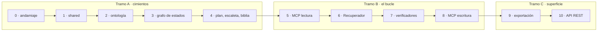

# plan-backend-v1.md — Plan de implementación del backend v1

> **Estado: propuesta.** Traduce [specs/spec1.md](spec1.md) en un orden de trabajo ejecutable. No añade requisitos: cada paso cita los RF/RNF que cierra y el criterio de §9 que lo comprueba. Si este documento y la spec discrepan, manda la spec; si la spec y `docs/` discrepan, manda `docs/`.
>
> Este plan **no es código acordado**. AGENTS.md regla 2 sigue aplicando: lo que aquí aparece como premisa y no esté confirmado, se confirma antes de escribirlo.

---

## 1. Premisas — decisiones que este plan da por tomadas

Las cuatro de la tabla son decisiones abiertas de [spec1.md](spec1.md) §10. **Ninguna está confirmada todavía**: el plan las asume para poder existir, y quien lo apruebe las aprueba con él.

**D-1 no está aquí y es deliberado.** El mecanismo de búsqueda sigue sin decidir y este plan no lo decide: la v1 implementa el caso vacío de RF-57, que es un contrato válido y no un hueco. Ver §2.

| # | Decisión | Qué se asume | Consecuencia si se cambia |
|---|---|---|---|
| **D-4** | Validación de la ontología | Pydantic v2 como fuente única. JSON Schema se **genera** desde los modelos como salida documental, no se mantiene a mano. | Rehacer `contexto/modelos.py` entero. Es el paso 2: barato si se cambia ya, caro después. |
| **D-6** | Legibilidad en español | Fórmula de **Fernández Huerta**, calculada en código propio (sílabas/palabra y palabras/frase). Sin dependencia nueva. | Solo afecta a un verificador (RF-71). Aislable. |
| **D-7** | Pruebas y tipos | `pytest` + `Hypothesis` + `mypy --strict` + `ruff`. Mutación (V-15) **declarada y no implementada** en la v1. | Atraviesa todo. Cambiarla después es reescribir la batería. |
| **D-9** | Ensamblado que no cabe ni con la ficha sola | Excepción propia con el desglose por bloque adjunto. No truncar, no subir el tope, no enviar. | Trivial: un solo punto del código. |

Y una premisa que no es decisión abierta de la spec pero que este plan introduce y hay que ratificar:

| # | Premisa | Por qué |
|---|---|---|
| **P-1** | Entorno con `uv` + `pyproject.toml` + `uv.lock`, Python 3.12. | RNF-11 (V-10) exige un fichero de dependencias comprobable contra la tabla de `architecture.md` §7. Un solo fichero declarativo hace esa comprobación inequívoca. |

**P-2 y P-3 ya no son premisas**: se llevaron a `architecture.md` y están decididas allí.

- **P-2 · la carpeta `proyecto/`** para lo transversal —crear proyecto, estado, transiciones, aprobaciones— está en el árbol de `architecture.md` §8, fuera del reparto por fases y junto a `mcp/`, con la excepción escrita.
- **P-3 · las dos superficies MCP** —una de solo lectura y otra de lectura-escritura para el Bibliotecario— están en la tabla de `architecture.md` §7 con su porqué: MCP no transporta identidad del llamante, así que un servidor único solo podría preguntársela, y eso es convención de prompt disfrazada de mecanismo. Es donde RN-1 deja de ser una promesa.

---

## 2. Lo que este plan deja fuera

Además de todo lo que [spec1.md](spec1.md) §1.2 ya excluye:

| Pieza | Motivo |
|---|---|
| Definiciones de subagente (`.claude/agents/*.md`) | No son backend. RNF-10 es explícita: `backend/` no contiene cliente LLM. Los agentes son configuración de Claude Code y merecen encargo propio. |
| Elección de modelo por agente (Haiku y demás) | Misma razón. Además contradice la columna *Modelo* de `architecture.md` §3 y el párrafo de control de coste de §10, así que es un cambio de `docs/`, no de código. |
| Índice semántico y recuperación por similitud real | `architecture.md` §11 lo pone en la **fase 2** y [spec1.md](spec1.md) §1.2 lo excluye de la v1. La v1 implementa el caso vacío de RF-57, que no es un punto de extensión pendiente sino el contrato cumplido: `capitulo/similitud.py` existe, con su firma, y devuelve la lista vacía. Nada del tramo B depende de que devuelva algo — el bloque de pasajes es el primero en caer al recortar (§6.3) —, así que adelantarlo solo añadiría dependencias y un modelo de 220 MB a cambio de nada. D-1 se resuelve cuando toque, detrás de esa interfaz. |
| Frontend | El panel es el consumidor de la API REST del paso 10. No existe hasta entonces. |
| Pruebas de mutación (V-15) | D-7: declaradas, no implementadas. Su valor aparece cuando la batería ya es densa. |

---

## 3. Los tres tramos

El orden dentro de cada tramo es el de [spec1.md](spec1.md) §12 y no se reordena: es un orden de dependencias, no un calendario. Este plan no añade ni quita pasos; solo antepone el 0, que es andamiaje y no requisitos.

**Se para entre tramos.** Cada parada revisa qué documentos de `docs/` quedaron desfasados y los actualiza en el mismo cambio (AGENTS.md regla 3).

---

## 4. Tramo A · cimientos

Lo que se juega aquí es el modelo de datos. Es el tramo cuyo error sale más caro: descubrir en el paso 6 que la biblia no se puede consultar por bloques obliga a rehacer el paso 4.

### Paso 0 · andamiaje

| | |
|---|---|
| **Produce** | `pyproject.toml`, `uv.lock`, `backend/` como paquete, configuración de `mypy --strict`, `ruff`, `pytest`, y los tres chequeos automáticos de §9 de la spec. |
| **Cierra** | RNF-06, RNF-10, RNF-11 (la maquinaria; el contenido lo cierran los pasos siguientes) |
| **Verifica** | V-6 (mypy en CI), V-9 (regla de `ruff` que prohíbe importar `anthropic`, `openai` y demás clientes de proveedor dentro de `backend/`), V-10 (comprobación del fichero de dependencias contra la tabla de `architecture.md` §7) |

Un fichero de datos se versiona aquí, no se descarga en ejecución: el BPE de `o200k_base` para `tiktoken` (RF-52c). Nombre exacto del fichero: `fb374d419588a4632f3f557e76b4b70aebbca790` — es el SHA-1 de la URL de origen, que es como `tiktoken` nombra su caché. `TIKTOKEN_CACHE_DIR` apunta al directorio que lo contiene.

V-8 (portabilidad Windows/Linux, RNF-08) no es un paso: es una regla que se aplica desde la primera línea. Rutas con `pathlib`, nunca concatenación de cadenas.

### Paso 1 · `shared/`

| | |
|---|---|
| **Produce** | `shared/db.py` (fábrica de conexión con los pragmas en un único sitio: `journal_mode=WAL`, `foreign_keys=ON`, `busy_timeout`), `shared/esquema.sql` (las 20 tablas de [spec1.md](spec1.md) §6), `shared/tipos.py` (estados del proyecto y del capítulo, severidad, hallazgo, informe), `shared/rutas.py` (disposición del directorio de proyecto de §5.3). |
| **Cierra** | La mitad de RF-01; C-2, C-4 por construcción |
| **Verifica** | Prueba de que una conexión recién abierta tiene los tres pragmas puestos. Es barata y evita el fallo que `architecture.md` §8 describe: un `foreign_keys` olvidado no da error, solo filas huérfanas. |

`shared/` no crece más que esto. La regla operativa de `architecture.md` §8 se aplica literalmente: ante la duda, duplicar dentro de la rebanada; promover cuando lo pida el tercer sitio.

### Paso 2 · ontología y validador

| | |
|---|---|
| **Produce** | `contexto/modelos.py` — las 8 dimensiones de [definitions.md](../docs/definitions.md) como modelos Pydantic v2, con los enums de §§1-8 cerrados. `contexto/validacion.py` — validación que devuelve informe, no excepción. |
| **Cierra** | RF-20 a RF-28 |
| **Verifica** | V-11: batería de instancias derivadas del YAML de [definitions.md](../docs/definitions.md) §11 — una válida de referencia, y una inválida **por cada regla**, no una genérica. |

Las reglas que no son tipos y que son la razón de D-4:

- **RF-24** · público → límites de contenido y longitud de capítulo; extensión → número de capítulos; tema → tipo de final ([definitions.md](../docs/definitions.md) §9).
- **RF-25** · nivel de contenido por público: infantil ≤1, YA ≤2, adulto ≤3, **por categoría**.
- **RF-26** · valores por defecto derivables (22/55/23, `preterito`) — y el informe declara **cuáles se rellenaron**. Rellenar en silencio es la versión amable del truncado silencioso.
- **RF-27** · `len(curva_tension) == capitulos`.

Todas son validadores de modelo, que es lo que JSON Schema no expresa sin extensiones. RF-21 pide informe con ruta de clave, valor recibido y valor esperado: es la forma nativa de un `ValidationError` de Pydantic v2.

La versión de ontología se fija como constante y se persiste con cada contexto validado (RF-28). No hay migraciones en la v1 ([spec1.md](spec1.md) §2.5).

### Paso 3 · grafo de estados

| | |
|---|---|
| **Produce** | Carpeta `proyecto/` (`architecture.md` §8): tabla de transiciones permitidas **como dato**, registro append-only, contador de intentos en la fila del capítulo, reanudación. |
| **Cierra** | RF-01 a RF-09 |
| **Verifica** | V-1 (matar el proceso en cada estado y reanudar), V-2 (propiedad: repetir cualquier paso N veces deja el mismo conjunto de filas), V-14 (no existe secuencia de llamadas que salga de `aprobacion_plan` o `aprobacion_final` sin acción humana) |

Tres invariantes que el código hace cumplir y que no pueden quedar en el prompt del orquestador:

- La transición se escribe **antes** de lanzar el paso siguiente (RF-03). No después, no a la vez.
- Una transición fuera de la tabla de `architecture.md` §3.1 se rechaza y **no modifica la fila** (RF-04).
- `aprobacion_plan` y `aprobacion_final` no tienen arista automática de salida (RF-05, RN-3). No es una comprobación: es que la arista no existe en la tabla.

La idempotencia de RF-06 se implementa como clave única `(capítulo, versión, intento)` en el esquema, no como comprobación previa a insertar. Que lo garantice la base y no el código de llamada.

Queda declarado el límite de V-18: el backend clavea por intento y cuenta hasta tres, pero no puede distinguir dos intentos hechos en dos invocaciones de dos hechos dentro de la misma. Riesgo aceptado.

### Paso 4 · persistencia de plan, escaleta y biblia

| | |
|---|---|
| **Produce** | Rebanadas `planificacion/` y `escaleta/`, y las tablas de biblia dentro de `capitulo/`. |
| **Cierra** | RF-30 a RF-36, RF-40 a RF-43, RF-80 a RF-88 |
| **Verifica** | Comprobaciones de escaleta (RF-41 reparto por actos, RF-42 cada hito obligatorio en exactamente una ficha, RF-43 Chéjov a nivel de escaleta) con casos que las infringen y casos de control que no deben disparar. |

La persistencia de `planificacion/` va entera aunque sus agentes sean Fase 2: lo que la Fase 2 aplaza son los **agentes**, no los datos. El Recuperador necesita fichas de personaje (~8k) y guía de estilo (~5k) desde el capítulo 1, y construir ese hueco después obliga a rehacer el paso 6.

**La forma de las tablas de biblia se decide pensando en el paso 6, no en este.** Cada bloque de la tabla de `architecture.md` §6.3 debe salir de una consulta parametrizada por la ficha, no de leer la biblia entera y filtrar en Python. Si al llegar al paso 6 hay que recorrer toda la biblia para armar un bloque, este paso está mal hecho.

RF-88 es la invariante que sostiene la compactación: el resumen acumulado es vista derivada, reconstruible releyendo los capítulos aprobados. Nada puede vivir **solo** ahí.

---

## 5. Tramo B · el bucle de capítulo

### Paso 5 · servidor MCP de lectura

| | |
|---|---|
| **Produce** | `mcp/` — servidor de solo lectura con las herramientas tipadas de RF-103, delegando en la lógica de las rebanadas. |
| **Cierra** | RF-100, RF-101, RF-103 |
| **Verifica** | Pruebas de contrato sobre cada herramienta: forma de entrada, forma de salida. |
| **Dependencia nueva** | SDK de MCP para Python. **Va a la tabla de `architecture.md` §7 en el mismo cambio.** |

`mcp/` no es una rebanada y no reimplementa nada: sus herramientas llaman a la lógica de `capitulo/`, `planificacion/` y compañía. Si una herramienta MCP necesita una consulta que no existe en su rebanada, la consulta se añade allí y la herramienta la llama.

### Paso 6 · Recuperador con tope de entrada

El paso con la restricción más dura y el que condiciona la forma de todo lo anterior. Cuatro módulos, y la separación entre ellos es el diseño, no una manía organizativa:

| Módulo | Contrato |
|---|---|
| `capitulo/estimador.py` | **Texto entra, entero sale.** `tiktoken` `o200k_base` × 1,35. El factor es una constante de este módulo, en un sitio único. El tope de 100.000 no se baja: el margen está aquí dentro. |
| `capitulo/recuperacion_estructurada.py` | Consultas fijas a la biblia parametrizadas por la ficha. Misma entrada → mismo resultado **byte a byte**. Resultado vacío = error que aborta con mensaje accionable. |
| `capitulo/similitud.py` | Consulta y filtros entran, lista ordenada de fragmentos sale. En la v1 **devuelve siempre la lista vacía** (RF-57), que es una respuesta válida de su contrato: no se emite el bloque ni su encabezado y no se registra recorte. La firma es la definitiva; lo que falta detrás es D-1, y es fase 2. |
| `capitulo/ensamblado.py` | Arma los bloques, cuenta, recorta, escribe el desglose. |

| | |
|---|---|
| **Cierra** | RF-50 a RF-59b |
| **Verifica** | V-3a (propiedades: determinismo byte a byte de la estructurada), V-4 (trazabilidad: de un hallazgo al fichero de prompt), V-5 (propiedades con biblias sintéticas grandes: nunca se excede el tope según el estimador, el informe de recorte es no vacío cuando recorta, y **ningún bloque emitido es prefijo de sí mismo**) |

Lo que no se puede hacer mal:

- **Se cuenta antes de enviar** (RF-52), no después. Es la razón de que el Recuperador sea código y no un agente.
- **El recorte elimina unidades completas** (RF-53a): fragmentos enteros desde la cola del ranking en el bloque de pasajes, el bloque entero en los demás. Nunca media ficha ni medio resumen. Un texto cortado a media frase es truncado silencioso con otro nombre: el Escritor lo lee como si estuviera completo.
- **Todo recorte se declara** (RF-54). Un recorte sin registro es un fallo del Recuperador, no un detalle.
- **El encabezado de subordinación es una constante del código** (RF-59a), no se redacta al vuelo. Un encabezado variable rompe el determinismo byte a byte por una tontería, y es un parámetro de calidad que se querrá medir.
- **D-9**: si tras recortar todo queda solo la ficha y aun así no cabe, excepción con el desglose adjunto. No truncar, no subir el tope, no enviar igualmente.

El prompt ensamblado y su desglose se guardan como ficheros asociados a `(capítulo, versión, intento)` (RF-58, RF-59b). Esa es la única traza que conecta un fallo de continuidad con su causa.

#### Lo que la similitud real exigirá cuando se construya (fase 2)

No se construye aquí (§2), pero tres restricciones ya están fijadas por `architecture.md` §6.3 y conviene que no se redescubran el día que se enchufe detrás de `capitulo/similitud.py`:

1. **El desempate es explícito y estable**: puntuación, luego número de capítulo, luego posición del fragmento. Sin esa regla el orden lo decide el motor y RNF-03b se cae.
2. **El filtro de capítulos anteriores se mide por número de capítulo, no por orden de escritura** (RF-59). Sin él, al regenerar el capítulo 12 se recuperan fragmentos del propio 12 y el Escritor se copia a sí mismo.
3. **Lo que se indexe se persiste, no se recalcula.** Si el mecanismo de D-1 resulta ser de embeddings, ninguna biblioteca garantiza determinismo bit a bit entre ejecuciones; persistir convierte RNF-03b en una propiedad del esquema en vez de una esperanza sobre el motor.

Consecuencia de dejarlo fuera: **V-3b no se ejercita en la v1**. No es un agujero de verificación, es que su objeto no existe todavía — la similitud vacía es trivialmente reproducible. El día que D-1 se resuelva, V-3b entra con ella.

### Paso 7 · verificadores deterministas

| | |
|---|---|
| **Produce** | Los siete verificadores de [spec1.md](spec1.md) §4.6.3, todos con la misma firma: entran capítulo y contexto, sale informe. |
| **Cierra** | RF-70 a RF-79 |
| **Verifica** | V-12 (biblia y capítulo construidos para infringir cada regla de continuidad dura, **más casos de control que no deben disparar**), V-7 (capítulo de tamaño máximo por debajo del umbral de tiempo) |

| Verificador | Severidad | Nota |
|---|---|---|
| Longitud (RF-70, RF-79) | Media | Declara desviación en palabras **y en porcentaje**. Tiene dos clientes: el editor y el Recuperador. |
| Métricas de estilo (RF-71) | Baja/Media | Legibilidad por Fernández Huerta (D-6). |
| Lista negra (RF-72) | Baja | |
| Nombres y grafías (RF-73) | Media | Contra el glosario, grafía exacta. |
| Continuidad · presencia (RF-74) | Alta | |
| Continuidad · inventario (RF-75) | Alta | |
| Continuidad · tiempo (RF-76) | Alta | Contra los `dias_viaje` de la ruta. |

**Ninguno corrige** (RN-6). No tienen escritura sobre el texto: la firma lo impide, no la disciplina.

Dos reglas de ejecución: se ejecutan siempre y antes que cualquier juez, y un fallo alto o bloqueante corta el ciclo (RF-77). Los jueces son Fase 2 y no existen aquí; el punto de extensión sí.

Queda declarado el límite de V-17: detectan las reglas escritas, no la incoherencia en general. Falsos negativos aceptados.

### Paso 8 · escritura MCP del Bibliotecario

| | |
|---|---|
| **Produce** | Segunda superficie MCP, de lectura y escritura (`architecture.md` §7), con las herramientas de RF-104. |
| **Cierra** | RF-65, RF-102, RF-104 a RF-106 |
| **Verifica** | V-13: un cliente que no es el Bibliotecario recibe error al invocar escritura. |

Dos guardas, y la segunda vive en el backend pase lo que pase con la separación de superficies:

- **RF-106** · las herramientas de escritura rechazan la llamada si el capítulo no está en `verificado` o posterior. Esto es RN-2 y no depende de quién llame: es una comprobación de estado contra la fila.
- **RF-65** · el backend rechaza cualquier escritura en la biblia que no venga de la herramienta del Bibliotecario.

RF-105 (auditoría de llamadas: agente, herramienta, argumentos, resultado) usa la tabla `llamada_mcp`. Prioridad S: si el tramo aprieta, es lo primero que se aplaza.

---

## 6. Tramo C · superficie

### Paso 9 · exportación a Markdown

| | |
|---|---|
| **Produce** | Rebanada `exportacion/`: manuscrito aprobado → Markdown con la titulación y macroestructura del contexto (prólogo, partes, epílogo, interludios) + metadatos editoriales. |
| **Cierra** | RF-90 a RF-93 |
| **Verifica** | Prueba de que exportar desde cualquier estado que no sea `exportacion` falla (RF-93). |

### Paso 10 · API REST

Va al final por la razón que da [spec1.md](spec1.md) §12: es la superficie más fácil de cambiar y la única sin consumidor hasta que exista el panel. Cada rebanada aporta su router; las rutas son las de §5.1.

Lo único que merece diseño aquí es el **modelo de error**. La spec pide distinguir tres cosas que son tres cosas distintas y que un `422` genérico confunde:

| Caso | Qué es |
|---|---|
| Transición inválida (RF-04) | El grafo no tiene esa arista. No es un error de entrada. |
| Escritura no autorizada en biblia (RF-65) | Regla de negocio. |
| Validación de entrada | Lo corriente. |

La respuesta lleva código, requisito infringido cuando aplique, y detalle accionable.

---

## 7. Documentos que hay que actualizar

AGENTS.md regla 3: cada cambio termina actualizando `docs/` y diciendo explícitamente qué se tocó y qué no aplicaba.

| Cuándo | Documento | Qué |
|---|---|---|
| Paso 0 | `architecture.md` §7 + `AGENTS.md` | `uv`, `pytest`, `Hypothesis`, `mypy`, `ruff` |
| Paso 0 | `validators.md` | Métodos en uso y los que se declaran sin adoptar (mutación) |
| Paso 2 | `spec1.md` §10 | D-4 resuelta |
| Paso 5 | `architecture.md` §7 + `AGENTS.md` | SDK de MCP |
| Paso 6 | `spec1.md` §10 | D-9 resuelta |
| Paso 7 | `spec1.md` §10 | D-6 resuelta |

`architecture.md` §7 (dos superficies MCP) y §8 (la carpeta `proyecto/`) **ya están actualizados**: eran las premisas P-2 y P-3 y se ratificaron antes de empezar, no durante los pasos 3 y 5.

`domain-knowledge.md` y `definitions.md` **no se tocan**: este plan no altera la ontología ni el pipeline de decisión. Si algún paso descubre que sí, se para y se propone el cambio de documento antes de escribir código (AGENTS.md regla 2).

---

## 8. Riesgos declarados

Los tres de [spec1.md](spec1.md) §9 marcados **U** siguen en pie sin cambios: V-16 (que el manuscrito sea bueno), V-17 (que los deterministas detecten toda incoherencia), V-18 (comportamiento del orquestador). Este plan añade dos:

| Riesgo | Mitigación |
|---|---|
| **Las dos superficies MCP no se sostienen**: si el reparto de herramientas por subagente resulta no ser configurable como supone `architecture.md` §7, RN-1 vuelve a depender de la buena voluntad del agente. | Se comprueba en el paso 5, antes de construir la escritura del paso 8. Si falla, se para y se replantea el mecanismo en `architecture.md`. Lo que no se hace es sustituirlo por un campo `agente` en la llamada. |
| **El factor de inflación de 1,35 es una estimación, no una medida.** `tiktoken` infracuenta a Claude un 15-20 % en texto corriente y más en español. El factor está puesto para que el error sea siempre por exceso, pero nadie lo ha medido contra prompts reales de este proyecto. | Vive como constante en un sitio único (RF-52b), medible y ajustable. La promesa de RNF-05 es explícitamente sobre el **tope estimado**, no sobre el real. |

---

## 9. Qué hay que responder antes de empezar

De la ronda de preguntas abierta, estas siguen sin contestar y condicionan el plan:

1. **Alcance** — ¿los tres tramos de un tirón, o parada entre ellos? (Este documento asume parada.)
2. **D-4** — Pydantic solo. Bloquea el paso 2.
3. **D-7** — pytest + Hypothesis + mypy + ruff. Bloquea el paso 0.
4. **Haiku** — qué significa exactamente. No afecta al backend, pero sí a `architecture.md` §3 y §10, y conviene resolverlo antes de que el plan lo dé por olvidado.

Cerradas ya: la similitud real queda fuera de la v1 (§2), y P-2 y P-3 están en `architecture.md` (§1).
