# plan-backend-v1.md — Plan de implementación del backend v1

> **Estado: propuesta.** Traduce [specs/spec-backend-1.md](spec-backend-1.md) en un orden de trabajo ejecutable. No añade requisitos: cada paso cita los RF/RNF que cierra y el criterio de §9 que lo comprueba. Si este documento y la spec discrepan, manda la spec; si la spec y `docs/` discrepan, manda `docs/`.
>
> Este plan **no es código acordado**. AGENTS.md regla 2 sigue aplicando: lo que aquí aparece como premisa y no esté confirmado, se confirma antes de escribirlo.
>
> **Avance (2026-09-24).** Construidos los pasos 0 a 10 con los recortes y ajustes de [spec-backend-2.md](spec-backend-2.md) (R-1 a R-6, AJ-1 a AJ-6, M-1 a M-20): planificación con un solo agente, Recuperador con partes de 20.000 tokens y respaldo del estimador, verificadores deterministas y guardarraíl, escritura MCP con sello, gates por pasada, publicación en `export/vN/` con PDF, cambio del lector y worker. Queda: el **paso S** con agentes reales; ejecutar **Lean y TLC de verdad** (sin `elan` ni Java en esta máquina, esas pruebas se saltan); y la **prueba manual de `claude -p`** con un `/regenerar` mínimo (TC-10).

---

## 1. Premisas — decisiones que este plan da por tomadas

Todas están **cerradas** en [spec-backend-1.md](spec-backend-1.md) §10 y en la tabla de `architecture.md` §7. Ninguna decisión abierta bloquea el paso 0.

| # | Decisión | Qué se hace |
|---|---|---|
| **D-2** | Cola de trabajos | Tabla en SQLite y un worker que lanza `claude -p`, un trabajo cada vez. |
| **D-4** | Validación de la ontología | Pydantic v2 como fuente única. JSON Schema se **genera** desde los modelos como salida documental, no se mantiene a mano. |
| **D-5** | Estimador de tokens | `tiktoken` `o200k_base` × 1,35, con el BPE versionado. |
| **D-6** | Legibilidad en español | Índice de **Szigriszt-Pazos** con la escala INFLESZ, en código propio (sílabas por palabra y palabras por frase). Umbral por público: infantil 65, juvenil 55, adulto 40. |
| **D-7** | Pruebas y tipos | `pytest` + `Hypothesis` + `mypy --strict` + `ruff`; sin `cosmic-ray` (R-5: V-15 es cobertura por regla). Entorno con `uv` + `pyproject.toml` + `uv.lock`, Python 3.12. |
| **D-11** | Texto no confiable | Superficie `/mcp/entrada` con identificador de un solo uso, solo para el Extractor y el Intérprete. |

Siguen abiertas, y no bloquean el arranque:

| # | Decisión | Qué bloquea |
|---|---|---|
| **D-1** | Mecanismo de búsqueda | Nada: la v1 implementa el caso vacío de RF-57, que es un contrato válido y no un hueco. Ver §2. |
| **D-3** | Observabilidad | Solo la integración de trazas. Los datos que se enviarían —tokens, versión de prompt, informes— ya se persisten. |
| **D-8** | Mecanismo de exportación a PDF | Solo RF-98, en el paso 9. |
| **D-9** | Ensamblado que no cabe ni con la ficha sola | Nada: mientras siga abierta, excepción con el desglose por bloque adjunto. No truncar, no subir el tope, no enviar. |

**P-2 y P-3 ya no son premisas**: se llevaron a `architecture.md` y están decididas allí.

- **P-2 · la carpeta `proyecto/`** para lo transversal —crear proyecto, estado, transiciones, aprobaciones— está en el árbol de `architecture.md` §8, fuera del reparto por fases y junto a `mcp/`, con la excepción escrita.
- **P-3 · las superficies MCP separadas** —lectura para quien la declara, escritura solo para el Bibliotecario y entrada solo para el Extractor y el Intérprete— están en `architecture.md` §7 y §8 con su porqué: MCP no transporta identidad del llamante, y la sesión principal carga todo lo que hay en `.mcp.json`, así que la escritura y la entrada se declaran solo en el frontmatter de sus agentes.

---

## 2. Lo que este plan deja fuera

Además de todo lo que [spec-backend-1.md](spec-backend-1.md) §1.2 ya excluye:

| Pieza | Motivo |
|---|---|
| Definiciones de subagente, skill, hooks, `.claude/settings.json` y `.mcp.json` | Son configuración de Claude Code, no backend, y tienen **su propio plan** (`specs/plan-agentes.md`), que se desarrolla en paralelo en otra sesión y es dueña de `.claude/` y `.mcp.json`. Este plan no escribe en ellos: el paso S **consume** lo que ese plan entregue —la skill mínima, el hook de validación y los cuatro agentes—. Consecuencia: V-13 queda partido; este plan cubre su lado del backend —superficies separadas y RF-106—, y el análisis de las definiciones y la prueba del hook de policy van con el plan de agentes. |
| Índice semántico y recuperación por similitud real | `architecture.md` §11 lo pone en la **fase 2** y [spec-backend-1.md](spec-backend-1.md) §1.2 lo excluye de la v1. La v1 implementa el caso vacío de RF-57, que no es un punto de extensión pendiente sino el contrato cumplido: `capitulo/similitud.py` existe, con su firma, y devuelve la lista vacía. Nada del tramo B depende de que devuelva algo — el bloque de pasajes es el primero en caer al recortar (§6.3) —, así que adelantarlo solo añadiría dependencias y un modelo de 220 MB a cambio de nada. D-1 se resuelve cuando toque, detrás de esa interfaz. |
| Frontend | La lectura web, la entrevista y la petición de cambios consumen la API REST del paso 10. Merecen plan propio. |
| Especificación TLA+ y proyecto Lean | Viven en `formal/tla/` y `formal/lean/`, fuera de `backend/`, y se desarrollan en paralelo en sesiones propias; V-25 va con TLA+. TLA+ modela la tabla de transiciones y la función de siguiente orden del paso 3, con el bloqueo; si el código cambia, cambia la especificación. El proyecto Lean fija el formato del fichero de hechos que el paso 8a genera. TLC necesita Java y Lean necesita elan, que hoy no están instalados en la máquina de desarrollo. |

---

## 3. Los tres tramos

```mermaid
flowchart LR
  subgraph A["Tramo A · cimientos"]
    P0["0 · andamiaje"] --> P1["1 · shared"]
    P1 --> P2["2 · ontología"]
    P2 --> P3["3 · grafo de estados"]
    P3 --> P4["4 · plan, escaleta, biblia"]
  end
  subgraph B["Tramo B · el bucle"]
    P5["5 · MCP lectura"] --> P6["6 · Recuperador"]
    P6 --> P7["7 · verificadores"]
    P7 --> P8["8 · MCP escritura"]
    P8 --> PS["S · esqueleto de extremo a extremo"]
  end
  subgraph C["Tramo C · publicación y superficie"]
    P8a["8a · gates de manuscrito"] --> P9["9 · versiones, lectura y PDF"]
    P9 --> P9a["9a · cambio del lector y cola"]
    P9a --> P10["10 · API REST"]
  end
  P4 --> P5
  PS --> P8a
```

El orden dentro de cada tramo es el de [spec-backend-1.md](spec-backend-1.md) §12 y no se reordena: es un orden de dependencias, no un calendario. Este plan antepone el 0, que es andamiaje y no requisitos, y añade el **S**, que no es backend sino la primera vez que todo trabaja junto. El paso 8a abre el tramo C porque los gates actúan sobre la novela entera, no sobre el bucle de capítulo.

**Se para entre tramos.** Cada parada revisa qué documentos de `docs/` quedaron desfasados y los actualiza en el mismo cambio (AGENTS.md regla 3).

---

## 4. Tramo A · cimientos

Lo que se juega aquí es el modelo de datos. Es el tramo cuyo error sale más caro: descubrir en el paso 6 que la biblia no se puede consultar por bloques obliga a rehacer el paso 4.

### Paso 0 · andamiaje

| | |
|---|---|
| **Produce** | `pyproject.toml`, `uv.lock`, `backend/` como paquete, configuración de `mypy --strict`, `ruff`, `pytest`, `Hypothesis` y `cosmic-ray`, y los tres chequeos automáticos de §9 de la spec. |
| **Cierra** | RNF-06, RNF-10, RNF-11 (la maquinaria; el contenido lo cierran los pasos siguientes) |
| **Verifica** | V-24 (toda ruta y conexión se deriva de `shared/`), V-6 (mypy en CI), V-9 (regla de `ruff` que prohíbe importar `anthropic`, `openai` y demás clientes de proveedor dentro de `backend/`), V-10 (comprobación del fichero de dependencias contra la tabla de `architecture.md` §7) |

Un fichero de datos se versiona aquí, no se descarga en ejecución: el BPE de `o200k_base` para `tiktoken` (RF-52c). Nombre exacto del fichero: `fb374d419588a4632f3f557e76b4b70aebbca790` — es el SHA-1 de la URL de origen, que es como `tiktoken` nombra su caché. `TIKTOKEN_CACHE_DIR` apunta al directorio que lo contiene. `tiktoken` comprueba además el SHA-256 del contenido (`446a9538cb6c348e3516120d7c08b09f57c36495e2acfffe59a5bf8b0cfb1a2d`) y, si no coincide, borra la copia y la descarga de nuevo. Por eso el paso 0 añade un **`.gitattributes`** que marca ese fichero como binario: en este entorno Git tiene `core.autocrlf=true`, y convertir sus saltos de línea rompería el hash. Una prueba comprueba el SHA-256 del fichero versionado y que el estimador carga sin red.

La regla de V-9 es `TID251` (`flake8-tidy-imports.banned-api`) de `ruff`, con `anthropic`, `openai` y demás clientes de proveedor prohibidos en `backend/`.

`cosmic-ray` sustituye a `mutmut` porque `mutmut` 3 no funciona en Windows sin WSL; es más lento, porque ejecuta la batería por cada mutante, y por eso se limita a dos módulos.

V-8 (portabilidad Windows/Linux, RNF-08) no es un paso: es una regla que se aplica desde la primera línea. Rutas con `pathlib`, nunca concatenación de cadenas.

### Paso 1 · `shared/`

| | |
|---|---|
| **Produce** | `shared/db.py` (fábrica de conexión con los pragmas en un único sitio: `journal_mode=WAL`, `foreign_keys=ON`, `busy_timeout`), `shared/esquema.sql` (las tablas de [spec-backend-1.md](spec-backend-1.md) §6), `shared/tipos.py` (estados del proyecto y del capítulo, severidad, hallazgo, informe), `shared/rutas.py` (disposición del directorio de proyecto de §5.3). |
| **Cierra** | La mitad de RF-01; C-2, C-4 por construcción |
| **Verifica** | Prueba de que una conexión recién abierta tiene los tres pragmas puestos. Es barata y evita el fallo que `architecture.md` §8 describe: un `foreign_keys` olvidado no da error, solo filas huérfanas. |

`shared/` no crece más que esto. La regla operativa de `architecture.md` §8 se aplica literalmente: ante la duda, duplicar dentro de la rebanada; promover cuando lo pida el tercer sitio.

### Paso 2 · ontología y validador

| | |
|---|---|
| **Produce** | `contexto/modelos.py` — las 9 dimensiones de [definitions.md](../docs/definitions.md) como modelos Pydantic v2, con los enums de §§1-9 cerrados. `contexto/validacion.py` — validación que devuelve informe, no excepción. `intake/` — persistencia de la entrevista, del texto libre como fichero no confiable, de los hechos propuestos pendientes de confirmación y del audit log de descartes. |
| **Cierra** | RF-10 a RF-13, RF-15, RF-20 a RF-28 (RF-14 se cierra en el paso 5, con `/mcp/entrada`) |
| **Verifica** | V-15 (mutación sobre el validador), V-20 (con un contexto inválido, ninguna secuencia de llamadas sale de `contexto`), V-11: batería de instancias derivadas del YAML de [definitions.md](../docs/definitions.md) §12 — una válida de referencia, y una inválida **por cada regla**, no una genérica. |

Las reglas que no son tipos y que son la razón de D-4:

- **RF-24** · edad del lector → público → límites de contenido; ocasión → tono y tipo de final; tema → tipo de final; más las coherencias de la entrevista: edad frente a fecha de nacimiento, eventos no anteriores al nacimiento, ocasión frente a final ([definitions.md](../docs/definitions.md) §10).
- **RF-25** · nivel de contenido por público: infantil ≤1, YA ≤2, adulto ≤2, **por categoría**.
- **RF-26** · valores por defecto derivables (22/55/23, `preterito`) — y el informe declara **cuáles se rellenaron**. Rellenar en silencio es la versión amable del truncado silencioso.
- **RF-27** · 10 capítulos de `[1000, 1500]` palabras y `len(curva_tension) == 10`.

Ninguna la expresa JSON Schema sin extensiones. Se implementaron como **funciones sobre el modelo ya validado**, una por regla, y no como validadores de modelo de Pydantic: un validador que lanza se para en el primer fallo, y RF-21 pide el informe entero. Los tipos y los valores permitidos sí van en los modelos, y sus errores —ruta de clave, valor recibido y valor esperado, la forma nativa de un `ValidationError`— se traducen al mismo formato de hallazgo. Cómo se concretó cada coherencia está en [definitions.md](../docs/definitions.md) §10.

Las rutas de `intake/` y `contexto/` (§5.1) llegan con la aplicación FastAPI del paso 3: sin ella no hay proyecto sobre el que montarlas. V-20 queda igual partido: el paso 2 entrega la guarda `puede_salir_de_contexto` con sus pruebas, y el paso 3 la conecta a la transición. RF-12 (preguntas pendientes, prioridad S) queda sin hacer.

La versión de ontología se fija como constante y se persiste con cada contexto validado (RF-28). No hay migraciones en la v1 ([spec-backend-1.md](spec-backend-1.md) §2.5).

### Paso 3 · grafo de estados

| | |
|---|---|
| **Produce** | Carpeta `proyecto/` (`architecture.md` §8): tabla de transiciones permitidas **como dato** —con los estados de publicación, regeneración y `detenida` de §3.1—, la **función de siguiente orden**, el **bloqueo por proyecto**, paradas activables, registro append-only, contador de intentos en la fila del capítulo, contador de ciclos de revisión en la del proyecto, reanudación y borrado de proyecto. Con sus rutas: estado, siguiente orden, registro de resultado y bloqueo. La orden se persiste al emitirse (RF-08a). |
| **Cierra** | RF-01 a RF-09b, RF-07a, RF-63, RF-64, RF-64a, RF-64b |
| **Verifica** | V-1 (matar el proceso en cada estado y reanudar), V-2 (propiedad: repetir cualquier paso N veces deja el mismo conjunto de filas), V-14 (con la parada activa, y en `publicada`, `cambio_solicitado` y `detenida`, no existe secuencia de llamadas que salga sin acción humana), V-33 (propiedades de la siguiente orden), V-34 (bloqueo) |

Tres invariantes que el código hace cumplir y que no pueden quedar en el prompt del orquestador:

- La transición se escribe **antes** de lanzar el paso siguiente (RF-03). No después, no a la vez.
- Una transición fuera de la tabla de `architecture.md` §3.1 se rechaza y **no modifica la fila** (RF-04).
- Una parada humana activa no tiene arista automática de salida (RF-05, RN-3). No es una comprobación: es que la arista no existe en la tabla. La tabla de transiciones es la misma que modela la especificación TLA+ (V-25): si una cambia, cambia la otra.

La idempotencia de RF-06 se implementa como clave única `(capítulo, versión, intento)` en el esquema, no como comprobación previa a insertar. Que lo garantice la base y no el código de llamada.

**La siguiente orden es el corazón de este paso.** Todas las reglas que antes eran protocolo de la sesión —qué toca, si se reintenta, cuándo parar— viven en esta función, que es determinista y tiene pruebas de propiedades. Es también lo que modela la especificación TLA+ (V-25), así que su estructura debe seguir la tabla de transiciones rama a rama.

Queda declarado el límite de V-18: que la sesión ejecute la orden tal como llega, incluida la regla de que una invocación es un intento. Riesgo aceptado.

### Paso 4 · persistencia de plan, escaleta y biblia

| | |
|---|---|
| **Produce** | Rebanadas `planificacion/` y `escaleta/`, y las tablas de biblia dentro de `capitulo/`. Con sus rutas: plan y escaleta (§5.1). |
| **Cierra** | RF-30 a RF-36, RF-40 a RF-43, RF-80 a RF-89 |
| **Verifica** | V-21 y V-22, y comprobaciones de escaleta (RF-41 reparto por actos, RF-42 cada hito obligatorio en exactamente una ficha, RF-43 Chéjov a nivel de escaleta) con casos que las infringen y casos de control que no deben disparar. |

La persistencia de `planificacion/` va entera aunque parte de sus agentes sean Fase 2: lo que la Fase 2 aplaza son los **agentes**, no los datos. El Recuperador necesita fichas de personaje (~8k) y guía de estilo (~5k) desde el capítulo 1, y construir ese hueco después obliga a rehacer el paso 6.

**La forma de las tablas de biblia se decide pensando en el paso 6, no en este.** Cada bloque de la tabla de `architecture.md` §6.3 debe salir de una consulta parametrizada por la ficha, no de leer la biblia entera y filtrar en Python. Si al llegar al paso 6 hay que recorrer toda la biblia para armar un bloque, este paso está mal hecho.

RF-88 es la invariante que sostiene la compactación: el resumen acumulado es vista derivada, reconstruible releyendo los capítulos aprobados. Nada puede vivir **solo** ahí.

---

## 5. Tramo B · el bucle de capítulo

### Paso 5 · servidor MCP de lectura

| | |
|---|---|
| **Produce** | `mcp/` — superficies `/mcp/lectura` (RF-103) y `/mcp/entrada` (RF-14, con la tabla de identificadores de un solo uso), hechas con FastMCP y montadas dentro del FastAPI, delegando en la lógica de las rebanadas. |
| **Verifica** | Pruebas de contrato sobre cada herramienta: forma de entrada, forma de salida; y que un identificador de entrada desconocido, usado o caducado devuelve error (parte de V-29). |
| **Cierra** | RF-14, RF-100, RF-101, RF-103 |
| **Dependencia** | El paquete `fastmcp`, ya en la tabla de `architecture.md` §7 y en `AGENTS.md` —no el FastMCP del SDK oficial `mcp`, que en la versión 2 ya no existe—. El `lifespan` de cada superficie montada se combina con el de la aplicación. |

`mcp/` no es una rebanada y no reimplementa nada: sus herramientas llaman a la lógica de `capitulo/`, `planificacion/` y compañía. Si una herramienta MCP necesita una consulta que no existe en su rebanada, la consulta se añade allí y la herramienta la llama.

### Paso 6 · Recuperador con tope de entrada

El paso con la restricción más dura y el que condiciona la forma de todo lo anterior. Cuatro módulos, y la separación entre ellos es el diseño, no una manía organizativa:

| Módulo | Contrato |
|---|---|
| `capitulo/estimador.py` | **Texto entra, entero sale.** `tiktoken` `o200k_base` × 1,35. El factor es una constante de este módulo, en un sitio único. El tope de 100.000 no se baja: el margen está aquí dentro. |
| `capitulo/recuperacion_estructurada.py` | Consultas fijas a la biblia parametrizadas por la ficha. Misma entrada → mismo resultado **byte a byte**. Resultado vacío = error que aborta con mensaje accionable. |
| `capitulo/similitud.py` | Consulta y filtros entran, lista ordenada de fragmentos sale. En la v1 **devuelve siempre la lista vacía** (RF-57), que es una respuesta válida de su contrato: no se emite el bloque ni su encabezado y no se registra recorte. La firma es la definitiva; lo que falta detrás es D-1, y es fase 2. |
| `capitulo/ensamblado.py` | Arma los bloques, cuenta, recorta, escribe el desglose. |

| | |
|---|---|
| **Cierra** | RF-50 a RF-59b. La orden de lanzar al Escritor lleva el prompt de este paso; la ruta de consulta del prompt es para auditoría |
| **Verifica** | V-23 (contrato del resultado vacío), V-3a (propiedades: determinismo byte a byte de la estructurada), V-4 (trazabilidad: de un hallazgo al fichero de prompt), V-5 (propiedades con biblias sintéticas grandes: nunca se excede el tope según el estimador, el informe de recorte es no vacío cuando recorta, y **ningún bloque emitido es prefijo de sí mismo**) |

Lo que no se puede hacer mal:

- **Se cuenta antes de enviar** (RF-52), no después. Es la razón de que el Recuperador sea código y no un agente.
- **El recorte elimina unidades completas** (RF-53a): fragmentos enteros desde la cola del ranking en el bloque de pasajes, el bloque entero en los demás. Nunca media ficha ni medio resumen. Un texto cortado a media frase es truncado silencioso con otro nombre: el Escritor lo lee como si estuviera completo.
- **Todo recorte se declara** (RF-54). Un recorte sin registro es un fallo del Recuperador, no un detalle.
- **El encabezado de subordinación es una constante del código** (RF-59a), no se redacta al vuelo. Un encabezado variable rompe el determinismo byte a byte por una tontería, y es un parámetro de calidad que se querrá medir.
- **D-9**: si tras recortar todo queda solo la ficha y aun así no cabe, excepción con el desglose adjunto. No truncar, no subir el tope, no enviar igualmente.

El prompt ensamblado y su desglose se guardan como ficheros asociados a `(capítulo, versión, intento)` (RF-58, RF-59b). Esa es la única traza que conecta un fallo de continuidad con su causa.

#### Lo que la similitud real exigirá cuando se construya (fase 2)

No se construye aquí (§2), pero tres restricciones ya están fijadas por `architecture.md` §6.3 y conviene que no se redescubran el día que se enchufe detrás de `capitulo/similitud.py`:

1. **El desempate es explícito y estable**: puntuación, luego número de capítulo, luego posición del fragmento. Sin esa regla el orden lo decide el motor y RNF-03b se cae.
2. **El filtro de capítulos anteriores se mide por número de capítulo, no por orden de escritura** (RF-59). Sin él, al regenerar el capítulo 7 se recuperan fragmentos del propio 7 y el Escritor se copia a sí mismo.
3. **Lo que se indexe se persiste, no se recalcula.** Si el mecanismo de D-1 resulta ser de embeddings, ninguna biblioteca garantiza determinismo bit a bit entre ejecuciones; persistir convierte RNF-03b en una propiedad del esquema en vez de una esperanza sobre el motor.

Consecuencia de dejarlo fuera: **V-3b no se ejercita en la v1**. No es un agujero de verificación, es que su objeto no existe todavía — la similitud vacía es trivialmente reproducible. El día que D-1 se resuelva, V-3b entra con ella.

### Paso 7 · verificadores deterministas

| | |
|---|---|
| **Produce** | Los verificadores de [spec-backend-1.md](spec-backend-1.md) §4.6.3, todos con la misma firma: entran capítulo y contexto, sale informe. Incluye el guardarraíl de tres niveles, con sus listas en SQLite y su normalización, y el **esquema de salida por agente** (RF-77a) con los modelos de los agentes que ya existan; cada paso que añade un agente añade su modelo. |
| **Cierra** | RF-60 a RF-62, RF-70 a RF-79, RF-72a, RF-73a, RF-77a. Con sus rutas: verificar e informes de capítulo |
| **Verifica** | V-12 (biblia y capítulo construidos para infringir cada regla de continuidad dura, **más casos de control que no deben disparar**), V-7 (capítulo de tamaño máximo por debajo del umbral de tiempo), V-26 (guardarraíl: un caso por nivel y uno de variante), V-28 (frases literales), V-35 (esquema de salida por agente), V-15 (mutación sobre los verificadores) |

| Verificador | Severidad | Nota |
|---|---|---|
| Longitud (RF-70, RF-79) | Media | Declara desviación en palabras **y en porcentaje**. Tiene dos clientes: el comprador y el Recuperador. |
| Métricas de estilo (RF-71) | Baja/Media | Legibilidad por Szigriszt-Pazos / INFLESZ (D-6). |
| Lista negra (RF-72) | Baja | Muletillas de estilo. |
| Palabras prohibidas (RF-72a) | Bloqueante | Tres niveles. Agotado el contador, detiene la generación. Cada coincidencia va a `auditoria`. |
| Nombres y grafías (RF-73) | Media | Contra el glosario, grafía exacta. |
| Continuidad · presencia (RF-74) | Alta | |
| Continuidad · inventario (RF-75) | Alta | |
| Continuidad · tiempo (RF-76) | Alta | Contra los `dias_viaje` de la ruta. |
| Frases literales (RF-73a) | Alta | Solo en los capítulos cuya ficha usa el hecho. |

**Ninguno corrige** (RN-6). No tienen escritura sobre el texto: la firma lo impide, no la disciplina.

Dos reglas de ejecución: se ejecutan siempre y antes que cualquier juez, y un fallo alto o bloqueante corta el ciclo (RF-77). Los jueces son subagentes: el backend no los ejecuta, persiste su informe.

Queda declarado el límite de V-17: detectan las reglas escritas, no la incoherencia en general. Falsos negativos aceptados.

### Paso 8 · escritura MCP del Bibliotecario

| | |
|---|---|
| **Produce** | Superficie `/mcp/escritura` (`architecture.md` §7), montada en el mismo FastAPI y declarada solo en la definición del Bibliotecario, con las herramientas de RF-104, incluida la que registra `hecho_uso`. |
| **Cierra** | RF-65, RF-102, RF-104 a RF-106 |
| **Verifica** | V-19 (una escritura sobre un capítulo no verificado se rechaza, y se acepta cuando lo está); el lado del backend de V-13 (la escritura solo existe en `/mcp/escritura`). |

Dos guardas, y la segunda vive en el backend pase lo que pase con la separación de superficies:

- **RF-106** · las herramientas de escritura rechazan la llamada si el capítulo no está en `verificado` o posterior. Esto es RN-2 y no depende de quién llame: es una comprobación de estado contra la fila.
- **RF-65** · el backend rechaza cualquier escritura en la biblia que no venga de la herramienta del Bibliotecario.

RF-105 (auditoría de llamadas: agente, herramienta, argumentos, resultado) usa la tabla `llamada_mcp`. Prioridad S: si el tramo aprieta, es lo primero que se aplaza.

---

### Paso S · esqueleto de extremo a extremo

| | |
|---|---|
| **Produce** | La primera novela que sale, aunque sea tosca y corta. **Consume** del plan de agentes la skill `orquestar-novela` en versión mínima (tomar el bloqueo, pedir la siguiente orden, ejecutar, registrar), el **hook de validación de capítulo** y las definiciones de **Escritor, Editor de estilo, juez de capítulo y Bibliotecario**; si al llegar aquí no están, este paso espera. Como datos de prueba, un contexto válido de **10 capítulos** con su plan y su escaleta escritos a mano. La sesión se detiene tras el capítulo 2: no es un modo especial, el proyecto queda en `capitulos` y se puede reanudar. Salida en Markdown. Sin gates de manuscrito, sin hook de policy, sin web. |
| **Cierra** | Ningún requisito nuevo: demuestra que los pasos 0 a 8 trabajan juntos con agentes reales |
| **Verifica** | Demostración (`D`): los capítulos 1 y 2 terminan aprobados por el camino completo de §5 —Escritor, Editor, deterministas, juez, Bibliotecario—, con la biblia actualizada, `hecho_uso` relleno y el prompt de cada intento en disco. Se anota el coste y el tamaño real de los prompts como primera medida |

Va aquí y no antes porque es el primer punto en que existe todo lo que necesita: sin la escritura del paso 8, el Bibliotecario no deja resumen y el capítulo 2 no se puede ensamblar. Lo que descubra —subagentes que no se comportan como se esperaba, prompts más grandes de lo estimado, un Bibliotecario que no registra el uso de los hechos— se corrige antes de construir encima los gates, las versiones y la regeneración.

**Se para después del paso S** para revisar qué documentos quedaron desfasados, como entre tramos.

## 6. Tramo C · publicación y superficie

### Paso 8a · gates de manuscrito

| | |
|---|---|
| **Produce** | Rebanadas `verificacion/` y `revision/`: cobertura contra `hecho_uso`, generación del fichero Lean de la novela y ejecución de la comprobación, persistencia del informe del juez y de las revisiones humanas con la rúbrica, umbral y tope de ciclos de revisión. Incluye el proyecto Lake mínimo de `formal/` con las tres invariantes, porque sin él RF-112 no se puede cerrar. |
| **Cierra** | RF-110 a RF-115 |
| **Requiere** | `elan` y Lean 4 instalados; hoy no lo están en la máquina de desarrollo |
| **Verifica** | V-27 (cronologías que infringen cada invariante, y casos de control), V-28 (cobertura), V-32 (umbral del juez en sus bordes) |

El fichero Lean se genera de forma determinista: misma biblia → mismo fichero, byte a byte (RF-111). El juez **puntúa y el backend decide**: el umbral es código, no una frase del prompt.

### Paso 9 · versiones, lectura y PDF

| | |
|---|---|
| **Produce** | Rebanada `exportacion/`: publicación de la versión de novela N+1 con sus punteros, lectura en disco (portada con dedicatoria, índice, capítulos, ficha de personajes y lugares con enlaces) y PDF con página de novedades. Manuscrito en Markdown con la titulación y macroestructura del contexto y metadatos editoriales. |
| **Cierra** | RF-90 a RF-98 |
| **Verifica** | Prueba de que publicar desde cualquier estado que no sea `publicacion` falla (RF-93); V-30 (propiedad: publicar nunca modifica versiones anteriores) |
| **Desbloqueado** | D-8 se cerró con TC-6: `playwright` imprime la `lectura.html`. |

### Paso 9a · cambio del lector y cola de trabajos

| | |
|---|---|
| **Produce** | Rebanada `cambio/`: petición guardada como no confiable, cambio propuesto pendiente de confirmación, confirmación, cálculo de capítulos afectados desde `hecho_uso`, tabla de trabajos y el worker que lanza `claude -p` un trabajo cada vez. |
| **Cierra** | RF-120 a RF-125 |
| **Verifica** | V-31 (la regeneración toca exactamente los capítulos que usan el hecho, más los que corrija el Revisor), V-29 (peticiones adversariales) |

El worker lanza un proceso y espera; no importa ningún cliente de proveedor, así que V-9 sigue en pie.

### Paso 10 · API REST

Va al final por la razón que da [spec-backend-1.md](spec-backend-1.md) §12: es la superficie más fácil de cambiar y la única sin consumidor hasta que exista el frontend. Las rutas que la sesión necesita ya llegaron con sus pasos; este paso completa el resto de §5.1.

Lo único que merece diseño aquí es el **modelo de error**. La spec pide distinguir tres cosas que son tres cosas distintas y que un `422` genérico confunde:

| Caso | Qué es |
|---|---|
| Transición inválida (RF-04) | El grafo no tiene esa arista. No es un error de entrada. |
| Escritura no autorizada en biblia (RF-65) | Regla de negocio. |
| Validación de entrada | Lo corriente. |

La respuesta lleva código, requisito infringido cuando aplique, y detalle accionable.

---

## 7. Documentos que hay que actualizar

AGENTS.md regla 3: cada cambio termina actualizando `docs/` y diciendo explícitamente qué se tocó y qué no aplicaba.

| Cuándo | Documento | Qué |
|---|---|---|
| Paso 6 | `spec-backend-1.md` §10 | D-9, si se decide |
| Paso 9 | `architecture.md` §7 + `AGENTS.md` + `spec-backend-1.md` §10 | D-8, el mecanismo de PDF |

Las herramientas del paso 0 —`uv`, `pytest`, `Hypothesis`, `mypy`, `ruff`; `cosmic-ray` salió con R-5— y D-4, D-6 y D-7 **ya están** en `architecture.md` §7, `AGENTS.md` y `spec-backend-1.md` §10.

`architecture.md` §7 (superficies MCP separadas) y §8 (la carpeta `proyecto/`) **ya están actualizados**: eran las premisas P-2 y P-3 y se ratificaron antes de empezar, no durante los pasos 3 y 5.

`domain-knowledge.md` y `definitions.md` **no se tocan**: este plan no altera la ontología —ya reorientada a la novela regalo— ni el pipeline de decisión. Si algún paso descubre que sí, se para y se propone el cambio de documento antes de escribir código (AGENTS.md regla 2).

---

## 8. Riesgos declarados

Los dos de [spec-backend-1.md](spec-backend-1.md) §9 marcados **U** siguen en pie: V-17 (que los deterministas detecten toda incoherencia) y V-18 (que la sesión ejecute la orden que recibe). V-16 ya no es **U**: lo sostienen el juez con rúbrica y la revisión humana. Este plan añade tres:

| Riesgo | Mitigación |
|---|---|
| **La superficie de escritura no queda aislada**: si un servidor MCP por HTTP declarado en el `mcpServers` de un subagente no funciona como en `.mcp.json`, la escritura tendría que ir a `.mcp.json` y la sesión principal la vería. | Se comprueba en el paso 5, antes de construir la escritura del paso 8. Si falla, la segunda barrera —el hook de policy con `agent_type`— pasa a ser la única, y se escribe así en `architecture.md`. Lo que no se hace es sustituirlo por un campo `agente` en la llamada. |
| **`claude -p` lanzado desde el backend no se comporta como una sesión interactiva**: permisos, subagentes o comandos propios pueden no estar disponibles en modo headless igual que en la terminal. | Se comprueba con un trabajo de prueba al empezar el paso 9a, antes de construir la rebanada `cambio/` sobre él. Si falla, se para y se replantea el mecanismo en `architecture.md` §7. |
| **El factor de inflación de 1,35 es una estimación, no una medida.** `tiktoken` infracuenta a Claude un 15-20 % en texto corriente y más en español. El factor está puesto para que el error sea siempre por exceso, pero nadie lo ha medido contra prompts reales de este proyecto. | Vive como constante en un sitio único (RF-52b), medible y ajustable. La promesa de RNF-05 es explícitamente sobre el **tope estimado**, no sobre el real. |

---

## 9. Qué hay que responder antes de empezar

Nada bloquea el paso 0. Preguntas que no afectan al backend:

1. Ninguna. La pregunta «Haiku» quedó resuelta con el reparto de modelos de `architecture.md` §3: `haiku` solo en las tareas de esquema cerrado.

Cerradas ya: la similitud real queda fuera de la v1 (§2); P-2 y P-3 están en `architecture.md` (§1); el alcance es por tramos con parada entre ellos (§3); D-2, D-4, D-6 y D-7 están resueltas (§1).
