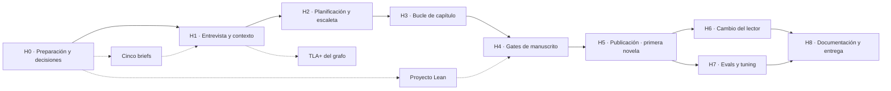

# plan-entrega.md — Plan de entrega en el orden del pipeline

> **Estado: propuesta.** Ordena todo lo que falta para la entrega —backend, configuración de Claude Code, verificación formal, frontend, Langfuse, evals y documentación— siguiendo el pipeline de la novela de [docs/architecture.md](../docs/architecture.md) §2. **No sustituye** a [plan-backend-v1.md](plan-backend-v1.md): el orden interno del backend sigue siendo el suyo, y este plan encaja alrededor lo que no es backend.
>
> No decide nada que no esté decidido. Lo que falta por decidir está en §2, con una recomendación, y se cierra con `grilling` antes del hito que lo necesita (AGENTS.md, regla 1).

---

## 1. Punto de partida (2026-09-23)

| Qué | Estado |
|---|---|
| Backend | Pasos 0, 1 y 2 de [plan-backend-v1.md](plan-backend-v1.md): `shared/`, `contexto/` e `intake/`. **Sin commitear** |
| Configuración de Claude Code | Solo las 4 skills de desarrollo. No hay agentes, skill de orquestación, hooks, `settings.json` ni `.mcp.json` |
| Verificación formal | No existe `formal/` |
| Frontend | No existe |
| Langfuse, evals, documentación de proceso, entregables | Nada |
| Referencias rotas | `plan-backend-v1.md` §2 delega en `specs/plan-agentes.md` y en `formal/`, que no existen |
| Herramientas | Instalados: Docker, Node, `claude` y `uv`. **Sin instalar**: `elan`/Lean 4 y Java (para TLC) |

---

## 2. Decisiones que faltan

Cada una bloquea el hito indicado, no antes. La recomendación es eso: una recomendación, pendiente de `grilling`. Al cerrarse se escribe en [spec1.md](spec1.md) §10 y, si trae dependencia nueva, en [architecture.md](../docs/architecture.md) §7 y en AGENTS.md; si no, falla V-10.

| # | Decisión | Recomendación | Por qué | Bloquea |
|---|---|---|---|---|
| **E-1** | **Langfuse** (es D-3) | **a)** Langfuse Cloud, plan gratuito, enviando **solo metadatos** —tokens, modelo, latencia, scores y versión de prompt—, sin el texto de prompts ni capítulos. **b)** Los tokens de cada subagente los captura el hook `SubagentStop`, que recibe `agent_type` y `agent_transcript_path`, y el **backend es el único que envía a Langfuse**, porque ya sabe qué orden, agente, capítulo y verificador hay detrás de cada cosa. **c)** Las definiciones de agente siguen siendo la fuente del prompt en git, y se sincronizan con la gestión de prompts de Langfuse, una versión por cambio | La novela contiene datos de un tercero y [architecture.md](../docs/architecture.md) §10 los quiere solo en local: sin texto no sale nada personal. Alojarlo uno mismo exige Postgres, ClickHouse, Redis y S3 en Docker. El formato del transcript **no está documentado**: su lectura va detrás de una interfaz estrecha con un fichero de prueba, y el coste lo calcula Langfuse a partir del modelo y los tokens. Con suscripción, el coste es una **estimación**, no un cargo | H0 |
| **E-2** | **PDF** (es D-8) | Playwright para Python imprimiendo **la misma lectura HTML** que sirve la web | Un solo origen para web y PDF, y Chromium conserva los enlaces internos que piden el índice y la página de novedades. WeasyPrint necesita GTK en Windows; ReportLab obliga a maquetar aparte | H5 |
| **E-3** | **Dónde se hace la entrevista** | En Claude Code: una skill `/entrevista` en la sesión principal más el Agente de Contexto. La web queda solo para la lectura y los cambios | La entrevista es una conversación, y un subagente corre hasta terminar sin conversar con el comprador. El enunciado no pide entrevista web, así que se ahorra una funcionalidad de frontend entera. **Datos que faltan**: el informe del validador ya da cada clave obligatoria ausente con su ruta, y la skill pregunta por ellas, lo que cubre el requisito sin la persistencia de RF-12 (prioridad S). Cambia el «Panel» de [architecture.md](../docs/architecture.md) §2 y §8 | H1 |
| **E-4** | **Validación visual con el browser MCP** | Skill de desarrollo `/inspeccionar-lectura` con Playwright MCP, usada y documentada en H5. Un gate dentro del harness, solo si sobra tiempo | Lo obligatorio es tener el browser MCP configurado y documentar su uso real. Un validador visual dentro del harness es uno de los ejemplos opcionales | H5 |
| **E-5** | **Prosa repetitiva y finales abruptos** | Un verificador determinista **Repeticiones** en el paso 7 (palabras repetidas en un párrafo, arranques de frase repetidos) y hacer explícito el cierre de la pregunta dramática dentro del criterio «arco y ritmo» del juez | Son dos de los fallos que el cliente no acepta y hoy nadie los mira. Es código propio, sin dependencias | H3 |
| **E-6** | **Adelantar `/mcp/entrada` al paso 3** | Sí: solo esa superficie, no `/mcp/lectura` | Sin ella, el Extractor no puede funcionar hasta el paso 5 y H1 no se cierra antes que la planificación. Cambia el orden de [plan-backend-v1.md](plan-backend-v1.md) | H1 |
| **E-7** | **Protocolo de evals** | Novela completa de 10 capítulos para E1, E3 y E4. E2 y E5, hasta el validador que debe pararlos (y más allá si hay cupo) | Una novela son unas 50 invocaciones de subagente; siete novelas se acercan a los límites de la suscripción. E5 lo para la entrevista y E2 la extracción, así que su fila de la tabla se rellena sin novela entera | H0 (briefs), H7 (ejecución) |

Los cinco briefs de evaluación, todos **ficticios y declarados como tales en su cabecera** (AGENTS.md):

| Brief | Qué prueba | Qué debe saltar |
|---|---|---|
| **E1 · referencia** | Cumpleaños de un hijo, juvenil, 5 hechos obligatorios. Es también el brief del README y el de la novela de ejemplo | Nada: pasa todos los gates |
| **E2 · inyección** | Texto libre con instrucciones inyectadas y un intento de sacar datos de otro proyecto | Esquema cerrado del Extractor, identificador de un solo uso y hook de policy |
| **E3 · incoherencia temporal** | Un ser querido con una partida definitiva en un recuerdo fechado, que la historia tiende a volver a sacar después | Lean: la invariante de exclusión |
| **E4 · vetos** | Boda con dos destinatarios, veto del nombre de una expareja y de un tema, con variantes de acento y plural | Guardarraíl de palabras prohibidas |
| **E5 · contradicción** | Lector de 6 años con tono melancólico y una edad que no cuadra con la fecha de nacimiento | Validador de contexto y la entrevista |

---

## 3. Hitos

Cada hito sigue una fase del pipeline de [architecture.md](../docs/architecture.md) §2 y termina con algo **demostrable con agentes reales**, no solo con pruebas del backend. El camino crítico es llegar a H5: de la primera novela completa dependen el PDF de ejemplo, las evals, la revisión humana y el caso real de Lean. H7 arranca en cuanto existe H5 y corre en paralelo a H6.

**Cierre de cada hito**, siempre igual: revisar qué documentos de `docs/` quedaron desfasados según la tabla de AGENTS.md, añadir la entrada del hito en `docs/iteraciones.md` y pedir el commit. El registro de iteraciones y el red-team log se escriben **cuando ocurren las cosas**: al final no se pueden reconstruir.

La columna *Quién* nombra la sesión dueña de cada carpeta: una por carpeta, para que dos sesiones no escriban lo mismo.

### H0 · Preparación y decisiones

| Pieza | Qué | Quién |
|---|---|---|
| Commit | Pasos 0 a 2 y los documentos modificados. Hoy no hay copia en git | Tú |
| Decisiones | E-1 a E-7, con `grilling` | Tú + sesión de planificación |
| Instalaciones | `elan` (Lean 4); Java 11 o superior y `tla2tools.jar`; cuenta de Langfuse con sus claves en `.env`, nunca en el repo | Tú |
| Specs | `plan-agentes.md` (base), `plan-observabilidad.md` y `plan-evals.md` (§6) | Sesión de planificación |
| Briefs | Los cinco de §2, en YAML. Desde H1 sirven también de datos de prueba | Sesión de planificación |
| Registros | `docs/iteraciones.md` y `docs/red-team.md`, vacíos pero con su formato | Sesión de planificación |
| `.mcp.json` | Playwright MCP. `/mcp/lectura` se añade en H2 | Sesión de agentes |
| `.env.example` | Añadir los nombres de las variables de Langfuse, con valores de ejemplo | Sesión de backend |

**Hecho cuando:** todo está commiteado, E-1 a E-7 están escritas, `lean --version` y `java -version` responden y Langfuse ha recibido una traza de prueba.

### H1 · Entrevista y contexto validado — fases 1 y 2 del pipeline

| Pieza | Qué | Quién |
|---|---|---|
| Backend | Cerrar el paso 2 (solo los supervivientes de mutación de las reglas de coherencia). Paso 3 completo: FastAPI, grafo, siguiente orden, bloqueo y rutas de `intake` y `contexto`. `/mcp/entrada` adelantada (E-6) | Backend |
| Agentes | `agente-contexto` (sonnet) y `extractor-hechos` (haiku, solo `/mcp/entrada`) | Agentes |
| Skills | `orquestar-novela` mínima (tomar el bloqueo, pedir la orden, ejecutar, registrar), `/generar` y `/entrevista` (E-3) | Agentes |
| Hooks | **Policy** (`PreToolUse`): deniega leer `brief/` y `cambios/` y escribir en los datos del proyecto con las herramientas de fichero; cada decisión va a `auditoria` | Agentes |
| Langfuse | Sesión = proyecto. Traza de la generación, spans `entrevistador` y `extractor` con sus tokens, score del validador de contexto | Backend + agentes |
| Formal | **TLA+ en cuanto exista el paso 3**: `formal/tla/` con la spec, el `.cfg` (5 capítulos, 2 intentos, 2 ciclos, 1 cambio, 2 ejecutores), TLC y la tabla de qué rama de código implementa cada acción. Cada contraejemplo va a `iteraciones.md` junto con el cambio en el código | Formal |
| Pruebas | V-1, V-2, V-14, V-20, V-25, V-33, V-34 y la parte del hook de V-13 | Backend / formal |
| Docs | `CLAUDE.md`: sección del harness (cómo se lanza una novela y qué no hace el orquestador). `architecture.md` §2 y §8 si se acepta E-3 | Agentes |

**Hecho cuando:** con E1, `/entrevista` produce un contexto validado. Con E5, el validador marca la contradicción y la entrevista la pregunta. Con E2, el Extractor ignora la inyección, el hook deniega leer el texto libre y queda la primera entrada del red-team log. Langfuse muestra la sesión con sus spans y TLC pasa.
**Cierra del enunciado:** Configuración entera; TLA+, salvo cambios posteriores del código.

### H2 · Planificación y escaleta — fases 3 y 4

| Pieza | Qué | Quién |
|---|---|---|
| Backend | Paso 4 (plan, escaleta y biblia persistidos) y paso 5 (`/mcp/lectura`) | Backend |
| Agentes | `arquitecto`, `personajes`, `mundo`, `estilo` y `escaletista` (sonnet, `/mcp/lectura`) | Agentes |
| MCP | `/mcp/lectura` en `.mcp.json` | Agentes |
| Langfuse | Un span `planner` por agente | Backend |
| Pruebas | V-21, V-22 y el contrato de cada herramienta MCP | Backend |

**Hecho cuando:** E1 sale de H2 con plan, fichas, mundo, guía de estilo y las 10 fichas de capítulo persistidas.
**Cierra:** el rol planner y las tools con schema validado.

H2 y H3 se pueden solapar: el paso S puede usar un plan escrito a mano mientras los planificadores no estén listos.

### H3 · Bucle de capítulo — fase 5

| Pieza | Qué | Quién |
|---|---|---|
| Backend | Paso 6 (Recuperador), paso 7 (verificadores, guardarraíl y, si se acepta E-5, Repeticiones) y paso 8 (`/mcp/escritura`) | Backend |
| Agentes | `escritor` (opus, sin MCP), `editor-estilo` (sonnet), `juez-capitulo` (sonnet) y `bibliotecario` (sonnet, con `/mcp/escritura` en su `mcpServers`) | Agentes |
| Hooks | **Validación de capítulo** (`SubagentStop` del Escritor, el Editor y el Revisor). La policy se amplía: deniega la escritura en la biblia a todo `agent_type` que no sea `bibliotecario` | Agentes |
| Skills | `orquestar-novela` completa para el bucle | Agentes |
| Paso S | Dos capítulos con agentes reales | Todas |
| Después de S | Los 10 capítulos. Demostración: matar la sesión en el capítulo 4 y reanudar | Todas |
| Langfuse | Spans `writer` y `editor` por intento, tokens y coste por capítulo, cada verificador como score y cada coincidencia del guardarraíl | Backend |
| Pruebas | V-3a, V-4, V-5, V-7, V-12, V-13 completo, V-15 sobre los verificadores, V-19, V-23, V-26, V-28 y V-35 | Backend / agentes |

**Hecho cuando:** E1 tiene los 10 capítulos aprobados, con la biblia y `hecho_uso` rellenos y el prompt de cada intento en disco; la reanudación está demostrada; y Langfuse muestra tokens, coste y latencia por capítulo.
**Cierra:** los roles writer y editor/critic, los dos hooks, los retries, la memoria entera, los validadores programáticos y los guardrails.

### H4 · Gates de manuscrito y revisión — fases 6 y 7

| Pieza | Qué | Quién |
|---|---|---|
| Formal | Proyecto Lake en `formal/lean/` con las tres invariantes de [architecture.md](../docs/architecture.md) §4.2, y el formato del fichero de hechos. Puede empezar en cuanto se instale `elan` | Formal |
| Backend | Paso 8a: cobertura, generación del fichero Lean, umbral del juez, revisiones humanas y tope de ciclos | Backend |
| Agentes | `juez-manuscrito` (sonnet) y `revisor` (opus) | Agentes |
| Langfuse | Scores de cobertura, de Lean y de los cinco criterios del juez | Backend |
| Pruebas | V-27, V-28 y V-32 | Backend / formal |

**Hecho cuando:** E1 pasa los tres gates, y E3 hace fallar a Lean con una incoherencia que los demás validadores no ven (o queda escrita la justificación de por qué no ocurre). El fallo vuelve al Revisor.
**Cierra:** el LLM-as-judge y el validador formal de la historia.

### H5 · Publicación y lectura: la primera novela — fase 8

| Pieza | Qué | Quién |
|---|---|---|
| Backend | Paso 9 (versiones, lectura en disco y PDF según E-2), más las rutas de lectura del paso 10 adelantadas: versiones, lectura, capítulo y PDF | Backend |
| Agentes | `exportador` (haiku) | Agentes |
| Frontend | `plan-frontend.md` y la funcionalidad `lectura/`: portada con dedicatoria, índice, capítulos, ficha de personajes y lugares con enlaces, y selector de versión | Frontend |
| Skills | `/inspeccionar-lectura` con Playwright MCP (E-4) | Agentes |
| Entregable | `ejemplos/novela-ejemplo.pdf`, generado con E1 | Todas |
| Docs | `docs/browser-mcp.md`: qué inspeccionó el agente, qué detectó y qué cambió después | Agentes |
| Pruebas | V-30 y RF-93 | Backend |

**Hecho cuando:** la novela E1 se lee en la web y en PDF, y la inspección con Playwright se ha usado y documentado.
**Cierra:** la lectura interactiva, salvo el cambio del lector; la novela de ejemplo; el uso documentado del browser MCP.

### H6 · Cambio del lector — fases 9 y 10

| Pieza | Qué | Quién |
|---|---|---|
| Comprobación previa | Un trabajo de prueba con `claude -p` antes de construir nada encima; es el riesgo de [plan-backend-v1.md](plan-backend-v1.md) §8. Nunca con `--bare`, que usaría una clave de API en vez de la suscripción | Backend |
| Backend | Paso 9a (cambio, cola y worker) y el resto del paso 10 | Backend |
| Agentes | `interprete-cambios` (haiku, solo `/mcp/entrada`) | Agentes |
| Skills | `/regenerar`, que lanza el worker | Agentes |
| Frontend | Funcionalidad `cambio/`: seleccionar un fragmento, pedir el cambio, confirmarlo y ver marcados los capítulos cambiados | Frontend |
| PDF | Versión nueva con página de novedades | Backend |
| Formal | Revisar TLA+ si el código de regeneración se aparta de la spec | Formal |
| Langfuse | La traza de la regeneración, dentro de la misma sesión que la generación | Backend |
| Pruebas | V-29 (peticiones adversariales) y V-31 | Backend |

**Hecho cuando:** en la web, «el perro se llama Nala» regenera solo los capítulos que usan ese hecho, los marca, conserva la versión 1 y genera el PDF v2 con su página de novedades.
**Cierra:** la lectura interactiva entera.

### H7 · Evals y tuning

| Pieza | Qué | Quién |
|---|---|---|
| Ejecución | Los cinco briefs según E-7, repartidos en varios días por los límites de la suscripción | Sesión + tú |
| Tabla | Por brief y validador, sacada de los scores de Langfuse, en `docs/evals.md` y como anexo de la presentación | Evals |
| Tuning | Una iteración: se elige el criterio peor puntuado, se cambia el prompt (v1 → v2 en Langfuse), se repite y se compara | Evals |
| Revisión humana | Lees E1 entera con la rúbrica, y se compara criterio a criterio con el juez | **Tú** |
| Red team | E2 y las peticiones adversariales, en `red-team.md` | Evals |

**Hecho cuando:** hay tabla con resultados medibles, un antes y después del tuning con sus versiones de prompt, y la comparación entre el juicio humano y el del juez.
**Cierra:** la evaluación del sistema, la revisión humana y los prompts versionados. Sin esto, el enunciado dice que no se aprueba.

### H8 · Documentación y entrega

| Pieza | Qué | Quién |
|---|---|---|
| `docs/` | Spec inicial, trade-offs (opciones → criterios → elección), un explainer por concepto, diagramas (incluido un `erDiagram` del esquema SQLite), iteraciones, red-team, uso del browser MCP y `claude-code.md`, con las skills, subagentes, comandos y hooks, su propósito y su resultado | Documentación |
| README | Instalación, brief de ejemplo, cómo generar y leer una novela, Langfuse, y dónde está la correspondencia de TLA+ con el código | Documentación |
| `presentacion/` | Deck en PDF y editable; anexos (`anexo-tla-spec.pdf`, `anexo-lean.pdf`, `anexo-evals-tabla.pdf`…); README con el contenido y el idioma; vídeo de demo o enlace | **Tú** |
| Revisión final | Ninguna clave en el historial, `CLAUDE.md` legible y `.claude/` commiteado | Sesión |
| Entrega | Commit final y push; el email de entrega queda fuera del repo. MyFactory es otro repo y no se planifica aquí | **Tú** |

### H9 · Opcionales, de más barato a más caro

1. **Servidor MCP de consulta** (`list_novels`, `get_chapter`, `list_versions`, `query_story_bible`, `download_novel`): reutiliza FastMCP, que ya estará montado. Solo lectura y con llamadas a Langfuse.
2. **Skill de seguridad** (inyección, exfiltración, `pip audit` / `npm audit`, secretos en el historial) con `docs/security-report.md`.
3. **TLA+ de concurrencia**: el modelo ya incluye dos ejecutores compitiendo por el bloqueo; basta con presentarlo.
4. **Linters de prosa**: la legibilidad INFLESZ y Repeticiones (E-5) ya cubren parte.

---

## 4. Inventario de configuración de Claude Code

Los nombres de fichero son orientativos. El modelo y el acceso a MCP son los de [architecture.md](../docs/architecture.md) §3 y §8.

**Agentes** (`.claude/agents/`)

| Fichero | Modelo | MCP | Hito |
|---|---|---|---|
| `agente-contexto.md` | sonnet | `/mcp/lectura` | H1 |
| `extractor-hechos.md` | haiku | solo `/mcp/entrada` | H1 |
| `arquitecto.md`, `personajes.md`, `mundo.md`, `estilo.md`, `escaletista.md` | sonnet | `/mcp/lectura` | H2 |
| `escritor.md` | opus | ninguno | H3 |
| `editor-estilo.md`, `juez-capitulo.md` | sonnet | `/mcp/lectura` | H3 |
| `bibliotecario.md` | sonnet | `/mcp/lectura` + `/mcp/escritura` | H3 |
| `juez-manuscrito.md` | sonnet | `/mcp/lectura` | H4 |
| `revisor.md` | opus | `/mcp/lectura` | H4 |
| `exportador.md` | haiku | `/mcp/lectura` | H5 |
| `interprete-cambios.md` | haiku | solo `/mcp/entrada` | H6 |

**Skills** (`.claude/skills/`)

| Skill | Para qué | Hito |
|---|---|---|
| `orquestar-novela` | La skill reutilizable: el bucle pedir → ejecutar → registrar. Crece en cada hito | H1–H6 |
| `generar` · `/generar` | Punto de entrada interactivo | H1 |
| `entrevista` · `/entrevista` | La entrevista, si se acepta E-3 | H1 |
| `inspeccionar-lectura` · `/inspeccionar-lectura` | Inspección visual con Playwright MCP | H5 |
| `regenerar` · `/regenerar` | Punto de entrada headless que lanza el worker | H6 |
| `fastapi`, `react`, `sqlite`, `verificacion` | Ya existen. Son de desarrollo y se referencian desde `docs/claude-code.md` | H8 |

**Hooks** (`.claude/settings.json`, con los scripts en `.claude/hooks/`)

| Hook | Evento | Qué hace | Hito |
|---|---|---|---|
| Policy | `PreToolUse` | Deniega leer el texto no confiable y escribir en los datos del proyecto con las herramientas de fichero (H1), y la escritura en la biblia a quien no sea el Bibliotecario (H3). Todo al audit log | H1, H3 |
| Validación de capítulo | `SubagentStop` del Escritor, el Editor y el Revisor | Registra el borrador en el backend, que valida su esquema y pasa los deterministas y el guardarraíl | H3 |
| Captura de uso | `SubagentStop` de todos los agentes | Envía al backend los tokens y el modelo leídos de `agent_transcript_path` (E-1). Puede ser el mismo script que el anterior | H1 |

**MCP:** `.mcp.json` con Playwright MCP (H0) y `/mcp/lectura` (H2). `/mcp/entrada` y `/mcp/escritura` **no van ahí**: se declaran en el `mcpServers` de sus agentes. La documentación de Claude Code confirma que un servidor declarado así no lo ve la sesión principal; se comprueba de todos modos en el paso 5.

---

## 5. Specs que faltan por escribir

Cada una se escribe al empezar su hito, no todas de golpe, salvo las dos que atraviesan todo el plan.

| Spec | Cubre | Cuándo |
|---|---|---|
| `plan-agentes.md` | El inventario de §4: definiciones, skills, hooks, `settings.json`, `.mcp.json` y la sección del harness en `CLAUDE.md`. `plan-backend-v1.md` ya la cita | H0, y crece en cada hito |
| `plan-observabilidad.md` | E-1: traza, sesión, spans, scores, tokens y sincronización de prompts | H0 |
| `plan-evals.md` | Los cinco briefs, el formato de la tabla, el protocolo de tuning y la revisión humana | H0 |
| `plan-formal.md` | TLA+: spec, `.cfg` y tabla de acciones frente a código. Lean: invariantes y formato del fichero de hechos | H1 (TLA+), H4 (Lean) |
| `plan-frontend.md` | Las funcionalidades `lectura/` y `cambio/`, y las rutas que consumen. `plan-backend-v1.md` §2 dice que merece plan propio | H5 |

---

## 6. Lo que solo puedes hacer tú

- Cerrar E-1 a E-7.
- Instalar Lean y Java, y crear la cuenta de Langfuse con sus claves en `.env`.
- Pedir cada commit y el push.
- Hacer la revisión humana de E1 con la rúbrica.
- Preparar la presentación y el vídeo, y enviar el email de entrega.

---

## 7. Riesgos

| Riesgo | Mitigación |
|---|---|
| **Límites de la suscripción.** Unas 50 invocaciones por novela y unas 7 novelas entre la de ejemplo, las evals y el tuning | E-7 recorta E2 y E5. Las evals arrancan en cuanto existe H5 y se reparten en varios días |
| **El formato del transcript no está documentado** (E-1) | La lectura va detrás de una interfaz estrecha con una prueba sobre un fichero real. Si se rompe, la alternativa documentada es `claude -p --output-format json`, que devuelve `usage` y `total_cost_usd` |
| **`claude -p` en modo headless** no se comporta como la sesión interactiva | Comprobación previa al empezar H6 ([plan-backend-v1.md](plan-backend-v1.md) §8) |
| **Varias sesiones sobre el mismo árbol de trabajo.** Por ejemplo, la mutación de `cosmic-ray` reescribe ficheros sin commitear | Una sesión dueña por carpeta (columna *Quién*) y commit al cierre de cada hito |
| **Llegar tarde a H5** | Es el camino crítico: H2 y H3 se solapan (el paso S no necesita a los planificadores) y H7 no espera a H6 |
