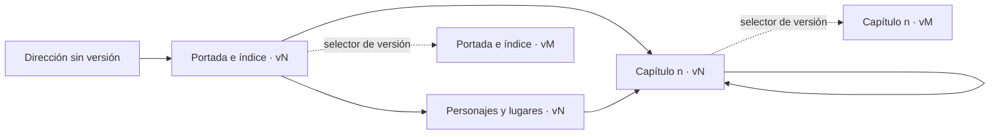
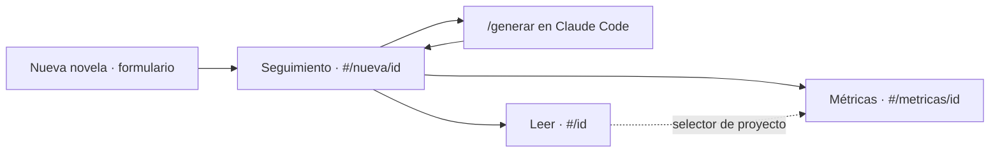
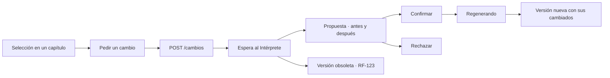

# plan-frontend.md — Lectura web, cambio del lector, métricas y nueva novela

> **Estado (2026-09-24): construido contra la API real.** Las tres ventanas —Leer (`lectura/` y `cambio/`), Métricas (`metricas/`) y Nueva novela (`nueva/`)— se decidieron el 2026-09-24 con `grilling` (§2, F-8 a F-12). Antes: decidido el 2026-09-23, con `lectura/` construida contra el fixture y `cambio/` diseñada. Cubre las funcionalidades `lectura/`, `cambio/`, `metricas/` y `nueva/` de [docs/architecture.md](../docs/architecture.md) §8 y las rutas de [spec-backend-1.md](spec-backend-1.md) §5.1 que consumen. Las decisiones F-1 a F-7 se cerraron con `grilling` y la persona aceptó todas las recomendaciones. Es el plan que [plan-entrega.md](plan-entrega.md) §5 pide para H5 y H6.
>
> La forma de `lectura.json` (§5) la propuso el frontend y **la sesión de backend la adoptó tal cual** en [spec-backend-2.md](spec-backend-2.md) §4.3 (TC-7), junto con `GET /versiones` y los estados de `GET /cambios/{c}` (§7). Cambiarla exige avisar a esa sesión antes; en el frontend, solo cambia `frontend/src/lectura/api.js`.

---

## 1. Alcance

| Funcionalidad | Qué hace | Estado |
|---|---|---|
| `lectura/` | Portada con dedicatoria, índice navegable, capítulos, ficha de personajes y lugares con enlaces a los capítulos donde aparece cada uno, selector de versión y marca de capítulos cambiados | Construida contra un fixture ficticio |
| `cambio/` | Seleccionar un fragmento, pedir el cambio, ver la propuesta, confirmarla y seguir la regeneración | Construida contra la API (§7), dentro de la ventana Leer |
| `metricas/` | Métricas de creación del proyecto elegido (F-11) | Construida contra `GET /proyectos/{id}/metricas` |
| `nueva/` | Brief de una novela nueva y seguimiento del proyecto con sus decisiones humanas (F-10) | Construida contra las rutas de `proyecto/` e `intake/` |
| `entrevista/` | — | **Fuera como conversación**: la entrevista conversada sigue siendo `/entrevista` (E-3). `nueva/` es el formulario equivalente |

---

## 2. Decisiones

| # | Decisión | Por qué |
|---|---|---|
| **F-1** | **Dependencias:** `react`, `react-dom`, `vite` y `@vitejs/plugin-react`, con **npm**. Nada más: ni router, ni librería de pruebas, ni ESLint, ni saneador | `@vitejs/plugin-react` es el plugin oficial de la plantilla de Vite (JSX y recarga en caliente). Todo lo demás se cubre con código propio de pocas líneas o con lo que ya trae Node. Cada paquete es configuración y tiempo que la entrega no tiene |
| **F-2** | **JavaScript con JSDoc**, sin TypeScript. Los tipos del contrato están como `@typedef` en `lectura/contrato.js`, y los módulos sin JSX llevan `// @ts-check` | TypeScript son tres dependencias más. Lo que protege el contrato es el validador que corre en `node:test` (§8), no el tipado. `// @ts-check` lo comprueba el editor, con los tipos de Vite que declara `jsconfig.json`; **no hay comprobación de tipos en línea de órdenes** |
| **F-3** | **El contrato lo propone el frontend** (§5) y un único módulo, `lectura/api.js`, sabe de dónde salen los datos: hoy el fixture, mañana la API | El backend aún no ha escrito la forma y el frontend es quien la consume. Cambiar de fuente es cambiar la constante `FUENTE` de ese fichero |
| **F-4** | **Un capítulo por pantalla**, con direcciones detrás de `#` (§4) y un hook propio en vez de `react-router` | Cada capítulo y cada ficha se enlazan directamente; funciona en cualquier servidor estático sin reescrituras; cambiar de capítulo remonta la vista con `key` y deja el estado limpio; y la selección de `cambio/` queda dentro de un solo capítulo |
| **F-5** | **«Cambiado» significa cambiado respecto a la versión anterior**, que es la definición de RF-96 y la de la página de novedades del PDF (RF-98) | No hace falta guardar en el navegador qué ha leído cada lector |
| **F-6** | **El HTML de los capítulos se filtra en el navegador** con una lista blanca propia, y lo filtrado se pinta como elementos de React: **no se usa `dangerouslySetInnerHTML`** | TC-7 ya escapa todo lo que queda fuera del subconjunto, pero el texto sale de un modelo que recibió datos no confiables (texto libre, peticiones del lector). Es la segunda barrera, y convertir a elementos de React es más estricto que filtrar una cadena |
| **F-7** | **`cambio/` sin fixture propio**, contra el backend real cuando exista la rebanada `cambio/` del paso 9a | Su valor está en el ida y vuelta con el Intérprete y la cola; simularlo sería construir dos veces |
| **F-8** | **Tres ventanas con una cabecera común**: el logo, las pestañas Leer · Métricas · Nueva novela y un selector de proyecto que conserva la ventana al cambiar | Lo pidió la persona. El selector necesita `GET /proyectos`, que el backend añade en `proyecto/panel.py` |
| **F-9** | **La edición vive en la lectura**, como un panel por encima de la versión: sobrevive a cambiar de capítulo o de versión, y a recargar (el cambio en curso se recuerda en `sessionStorage`). Solo se ofrece en la versión vigente | Pedir un cambio sobre una versión vieja siempre acaba `obsoleto` (RF-123) |
| **F-10** | **La web no lanza la generación.** «Nueva novela» crea el proyecto y envía el brief; el seguimiento enseña `/generar <proyecto>` para copiarlo, y cubre las decisiones humanas: hechos, plan, manuscrito final y reintentar | Generar es una sesión de Claude Code (architecture.md §8). Una ruta que encolase la generación para el worker queda como siguiente paso: toca la cola, que hoy solo regenera (TC-8) |
| **F-11** | **Métricas en tokens y tiempo, sin dinero**, en cifras destacadas y tablas con una barra de una sola serie; el valor siempre va escrito | El gasto es de suscripción. Una tabla de precios para un «equivalente en API» podría estar mal y no la mantiene nadie |
| **F-12** | **La lectura usa la API real** (`FUENTE = 'api'`); el fixture queda para las pruebas del contrato | Las ventanas nuevas no tienen fixture (F-7) |

**Diseño visual**, revisado el 2026-09-24: la paleta sale del logo (`public/logo.png`). El naranja (`#ff7a33`) es el acento —pestaña activa, botones, cinta de «cambiado», barras— y el marino (`#22333f`), la tinta y la cubierta; el texto de enlace usa un naranja más oscuro (`#b94a12`) porque el puro no llega a AA sobre blanco. La interfaz va en la sans del sistema; la novela sigue en serif. En oscuro, el logo va sobre una pastilla clara. Lo que sigue es el diseño de partida, que se conserva salvo los colores: libro de regalo encuadernado. La portada es la tela de la cubierta con el título dorado; las páginas, blanco frío con tinta azul-negra; los capítulos cambiados llevan una **cinta de marcapáginas** carmesí en el índice y en su cabecera. Una sola familia serif del sistema (Sitka en Windows, Iowan Old Style o Charter en macOS, Georgia como reserva), **sin fuentes externas**: la lectura no hace ninguna petición fuera del backend. Modo oscuro por `prefers-color-scheme`.

---

## 3. Estructura

```
frontend/
  package.json · package-lock.json · vite.config.js · jsconfig.json · index.html · .gitignore
  scripts/validar-lectura.js   · valida un lectura.json o versiones.json real contra el contrato
  src/
    main.jsx                   · monta <App /> en StrictMode
    App.jsx                    · cabecera y ventana según la dirección (F-8)
    shared/
      estilos.css              · tokens de color y tipografía, base del documento
      interfaz.css             · cabecera, pestañas, botones, formularios, tablas y tarjetas
      api.js                   · cliente HTTP común y modelo de error de TC-11
      navegacion.js · useHash.js · las tres ventanas detrás de # (§4)
      proyectos.js · Cabecera.jsx · lista de proyectos, nombres de estado, logo y selector
      useCarga.js · Estados.jsx · carga cancelable, «Cargando…» y errores
    cambio/                    · api.js, seleccion.js, PanelCambio.jsx, cambio.css (§7)
    metricas/                  · api.js, formato.js, Metricas.jsx, metricas.css
    nueva/                     · api.js, brief.js, Formulario.jsx, Seguimiento.jsx, useSondeo.js, Nueva.jsx
    lectura/
      api.js                   · el único módulo cliente de la API de lectura (F-3)
      contrato.js              · tipos JSDoc y validador del contrato (§5)
      ruta.js · useRuta.js     · direcciones con # (§4)
      sanear.js · Fragmento.jsx · lista blanca del HTML de capítulo (F-6)
      modelo.js                · derivados: versión vigente, enumeraciones, árbol de lugares, fechas
      Lectura.jsx              · dirección → proyecto → versión → pantalla
      Barra.jsx · Portada.jsx · Capitulo.jsx · Fichas.jsx
      Cinta.jsx · EnlacesACapitulos.jsx · Estados.jsx
      lectura.css
      fixture/                 · datos ficticios con la forma de §5: versiones.json, v1/, v2/
      tests/                   · node:test sobre contrato, rutas, filtro y modelo
```

El fixture es una novela ficticia de diez capítulos breves con dos versiones: la v2 cambia los capítulos 3 y 7, como si el lector hubiera pedido otro color para un objeto. Cada fichero lo declara en su clave `_aviso`.

Con cuatro funcionalidades, `shared/` recoge lo que ya piden tres sitios ([architecture.md](../docs/architecture.md) §8): el cliente HTTP, la carga, los estados, la navegación entre ventanas y la cabecera. Las direcciones internas de la lectura siguen en `lectura/`, su único consumidor. Cada funcionalidad tiene su `api.js`; el fixture solo existe para la lectura.

---

## 4. Direcciones de la web

| Dirección | Pantalla |
|---|---|
| `#/<proyecto>` | Redirige a la versión vigente |
| `#/<proyecto>/v<N>` | Portada, dedicatoria, novedades de la versión e índice |
| `#/<proyecto>/v<N>/cap/<n>` | Capítulo `n` de la versión `N`, con anterior y siguiente |
| `#/<proyecto>/v<N>/fichas` | Personajes y lugares, con enlaces a sus capítulos en la misma versión |
| `#/` | La novela publicada más reciente; sin ninguna, un aviso que enlaza a «Nueva novela» |
| `#/metricas` · `#/metricas/<proyecto>` | Métricas; sin proyecto, las del más reciente |
| `#/nueva` · `#/nueva/<proyecto>` | El formulario de una novela nueva · el seguimiento de un proyecto |

`<proyecto>` es el identificador opaco de 32 caracteres hexadecimales de [spec-backend-1.md](spec-backend-1.md) §5.3. Cambiar de versión en el selector conserva la pantalla: desde el capítulo 3 de la v1 se va al capítulo 3 de la v2. Leyendo una versión que no es la vigente, un aviso lo dice y enlaza a la vigente.



Las tres ventanas y el paso de una novela nueva a su lectura:



---

## 5. Contrato de lectura, adoptado por el backend

### 5.1 Rutas que consume

| Ruta de [spec-backend-1.md](spec-backend-1.md) §5.1 | Respuesta | Función de `lectura/api.js` |
|---|---|---|
| `GET /proyectos/{id}/versiones` | `Versiones` (§5.3) | `obtenerVersiones` |
| `GET /proyectos/{id}/versiones/{v}/lectura` | `Lectura` (§5.2); aquí `capitulos[].html` puede omitirse | `obtenerLectura` |
| `GET /proyectos/{id}/versiones/{v}/capitulos/{n}` | `{numero, titulo, html}` | `obtenerCapitulo` |
| `GET /proyectos/{id}/versiones/{v}/pdf` | El PDF de la versión (RF-98) | `urlPdf`, enlace «Descargar en PDF» |

En desarrollo, Vite reenvía `/api/*` a `http://127.0.0.1:8000/*` (`vite.config.js`), así que no hace falta CORS. Los errores siguen el modelo de TC-11, `{codigo, requisito, detalle}`: la web muestra `detalle`, y si el cuerpo no lo trae, el estado HTTP.

### 5.2 `lectura.json`, uno por versión en `export/vN/`

```json
{
  "version": 2,
  "anterior": 1,
  "cambiados": [3, 7],
  "portada": { "titulo": "…", "dedicatoria": "…" },
  "capitulos": [
    { "numero": 1, "titulo": "…", "html": "<p data-p=\"1\">…</p><p data-p=\"2\">…</p>" }
  ],
  "personajes": [
    { "id": "prot", "nombre": "…", "rol": ["protagonista"], "descripcion": "…", "capitulos": [1, 2, 5] }
  ],
  "lugares": [
    { "id": "faro", "nombre": "…", "descripcion": "…", "padre": "costa", "capitulos": [4, 9] }
  ]
}
```

| Clave | Regla |
|---|---|
| `version` | Entero ≥ 1 |
| `anterior` | `version − 1`, o `null` en la versión 1 |
| `cambiados` | Números de capítulo, ascendentes y sin repetir: la diferencia de punteros con `anterior` (RF-96). Vacío en la versión 1 |
| `portada.titulo` | Texto no vacío: el título de los metadatos editoriales (RF-91) |
| `portada.dedicatoria` | Texto o `null` (definitions §9) |
| `capitulos` | Exactamente 10, con `numero` de 1 a 10 en orden. `titulo` es `null` si la titulación es `numerado` |
| `capitulos[].html` | Solo `p`, `em`, `strong`, `blockquote`, `hr` y `br`, sin más atributo que `data-p` en cada `p`, **numerado desde 1** en orden de aparición. Es el `p<n>` con que B-14 localiza los hallazgos, y lo que `cambio/` envía para situar el fragmento |
| `personajes[]` | `id` único; `nombre` no vacío; `rol` con valores de definitions §4; `descripcion` opcional; `capitulos` ascendentes, sacados de `presentes` de cada ficha de capítulo (RF-97) |
| `lugares[]` | `id` único; `padre` `null` o el `id` de otro lugar, sin ciclos; `capitulos` de la `localizacion` de cada ficha. Un `macro` o `meso` puede tener `capitulos` vacío si solo se pisan sus hijos |

**Qué no lleva a propósito.** Las fichas no traen deseo, necesidad, herida ni defecto: destripan la trama, y definitions §4 advierte que el defecto del destinatario real no debe poder leerse como un reproche. Tampoco lleva el texto de ninguna petición del lector, que es no confiable (RF-120).

Las claves desconocidas se ignoran. Las que empiezan por `_` son anotaciones del fixture (`_aviso`, que declara los datos ficticios) y la API no las emite.

### 5.3 `Versiones`

```json
{ "versiones": [
  { "version": 1, "publicada": "2026-09-20", "cambiados": [] },
  { "version": 2, "publicada": "2026-09-22", "cambiados": [3, 7] }
] }
```

Ascendentes y consecutivas desde 1; la última es la vigente. `publicada` es fecha o fecha y hora ISO 8601. `cambiados` coincide con el del `lectura.json` de esa versión.

---

## 6. `lectura/`

| Pantalla | Contenido |
|---|---|
| **Portada** | Cubierta con el título, página de dedicatoria, aviso de novedades si la versión tiene capítulos cambiados (con enlace a cada uno), índice con la cinta en los cambiados, y enlace a personajes y lugares |
| **Capítulo** | Número y título, cinta «Cambiado en esta versión» si toca, el texto filtrado (F-6), y anterior / siguiente |
| **Personajes y lugares** | Personajes con su papel y descripción; lugares anidados según `padre`; en cada entrada, los capítulos donde aparece, enlazados en la misma versión |
| **Barra** | Título (vuelve a la portada), personajes y lugares, selector de versión y, con la API real, «Descargar en PDF» |

Estados vacíos y errores, en la voz de la interfaz: sin proyecto en la dirección, «Abre el enlace de tu novela»; capítulo inexistente, aviso y vuelta al índice; fallo de carga, el `detalle` del error y «Reintentar».

---

## 7. `cambio/` — construida



1. Al seleccionar texto dentro de un capítulo aparece «Pedir un cambio». La selección se ancla a los `data-p` de su primer y último párrafo.
2. Un formulario cita el fragmento y pide la petición. Envía `POST /proyectos/{id}/cambios` con versión, capítulo, fragmento, párrafos y petición (RF-120).
3. La web consulta `GET /cambios/{c}` (TC-12) cada pocos segundos, con cancelación al salir, hasta que el Intérprete propone.
4. Muestra el hecho con su valor anterior y el nuevo, con «Confirmar el cambio» y «Descartar». Envía `POST /cambios/{c}/confirmacion` (RF-122).
5. Tras confirmar, «Regenerando los capítulos afectados» hasta que `GET /versiones` trae una versión nueva, que ya llega con sus cambiados marcados. Si el trabajo falla (TC-9), lo dice y la versión vigente sigue siendo la anterior.

**Lo que la web necesita que el backend distinga** en `GET /cambios/{c}`, con los nombres que fije el backend: Intérprete trabajando; propuesta lista, con hecho, valor anterior y valor nuevo; petición rechazada por versión obsoleta (RF-123); confirmado y en regeneración; regeneración fallida; publicada, con el número de la versión nueva.

El texto de la petición **se envía y no se vuelve a pintar**: la web solo muestra el fragmento que el lector citó, y siempre como texto.

---

## 8. Verificación

Con el marco de [docs/validators.md](../docs/validators.md) §1:

| Criterio | Método | Tipo |
|---|---|---|
| El fixture cumple el contrato de §5, y las versiones cuadran con sus lecturas | `node:test` sobre `contrato.js` (`npm test`) | T |
| Las direcciones de §4 se leen y se escriben sin pérdida, y las inválidas se rechazan | `node:test` sobre `ruta.js` | T |
| El filtro de F-6 deja pasar solo la lista blanca: sin `script`, sin atributos de evento, sin enlaces | `node:test` sobre `sanear.js`, con entradas hostiles | T |
| La aplicación compila | `npm run build` | A |
| Las pantallas se ven bien en escritorio y móvil, en claro y oscuro | Inspección con Playwright MCP (E-4) cuando exista `.mcp.json`. Hecha ya a mano con capturas del Edge del sistema en modo headless: portada, capítulo, fichas, versión anterior y dirección inválida a 1280 px, claro y oscuro; portada y fichas a 375 px dentro de un iframe, porque Edge headless no baja de 500 px de ventana. El capítulo a 375 px queda sin ver: el iframe no llega a pintarse en headless, aunque su DOM está completo | I |
| Un `lectura.json` real cumple el contrato | `npm run validar-lectura -- <ruta>` sobre `export/vN/lectura.json`, en cuanto el paso 9 lo genere | T |
| La web funciona contra la API real | Cambiar `FUENTE` en `lectura/api.js` y recorrer las pantallas | D |

---

## 9. Comandos

```
cd frontend
npm install
npm run dev                  # http://localhost:5173/ — contra el backend de http://127.0.0.1:8000
MSM_BACKEND=http://127.0.0.1:8001 npm run dev   # contra otro backend, p. ej. mientras el de 8000 genera
npm test                     # node:test sobre contrato, rutas, filtro y modelo
npm run build
npm run validar-lectura -- ../proyectos/<id>/export/v1/lectura.json
```

---

## 10. Lo que necesita a otras sesiones

| Sesión | Qué |
|---|---|
| Backend | **Hecho:** adoptó el contrato de §5 y los estados de §7 en [spec-backend-2.md](spec-backend-2.md) §4.3. El paso 9 pasará `npm run validar-lectura` sobre cada `lectura.json` que genere |
| Backend | Recoger la pila de F-1 en [architecture.md](../docs/architecture.md) §7 y en `AGENTS.md`, y los métodos de §8 en [validators.md](../docs/validators.md). Lo hace esa sesión al cerrar su bloque; esta no edita `docs/` ni `AGENTS.md` |
| `.claude/` | `.mcp.json` con Playwright MCP, para la inspección de E-4 |
