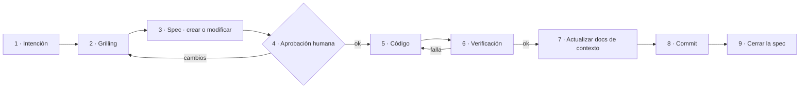

# spec-driven-development — Cómo se trabaja en este proyecto

> Estado: acordada
> Propósito: definir el ciclo por el que pasa cualquier cambio en `docs/`, `specs/` o código. Gobierna a las demás specs.

---

## 1. Principio

La spec es la fuente de verdad; el código es su implementación. Cuando ambos discrepan, el que está mal es el código — o la spec ha quedado obsoleta y hay que decirlo explícitamente, no dejar que diverjan en silencio.

De ahí salen tres reglas que valen para todo lo demás:

1. **Nada se escribe sin entenderse antes.** Todo cambio pasa por el skill `grilling` (plugin `mattpocock-skills`).
2. **Nada se implementa sin spec acordada.** El código no es el sitio donde se decide qué hay que hacer.
3. **Ningún cambio de código termina hasta que el contexto lo refleja.** Un `docs/` desactualizado es peor que no tenerlo: induce a error al siguiente que lo lea, sea persona o agente.

## 2. El ciclo

| Paso | Qué ocurre | Quién |
|---|---|---|
| 1 · Intención | Alguien quiere algo: una función, un documento, un cambio de diseño. | Persona |
| 2 · Grilling | Interrogatorio previo con el skill `grilling`. Rondas de preguntas hasta agotar el árbol de decisión; termina por escrito. | Agente pregunta, persona responde |
| 3 · Spec | Se crea una spec nueva desde [_template.md](_template.md) o se modifica la existente, recogiendo el acuerdo. Estado: `borrador`. | Agente |
| 4 · Aprobación | La persona lee la spec y la aprueba o la devuelve. Al aprobarla pasa a `acordada`. | Persona |
| 5 · Código | Se implementa **solo lo que la spec dice**. Si al implementar aparece algo que la spec no previó, se vuelve al paso 2; no se decide sobre la marcha. | Agente |
| 6 · Verificación | Se comprueba contra los criterios de aceptación de la spec, con los métodos de [docs/validators.md](../docs/validators.md) que la spec haya declarado. | Agente |
| 7 · Docs | Se actualiza el contexto afectado. Ver §3. | Agente |
| 8 · Commit | Código, spec y docs entran en el **mismo commit**. Separarlos garantiza que alguno se quede atrás. | Agente |
| 9 · Cierre | La spec pasa a `implementada`. | Agente |

El paso 5 es el único que produce código, y es el más corto. Eso es intencionado.

## 3. Qué documentos hay que actualizar tras tocar código

Después de implementar, el agente recorre esta lista y dice explícitamente cuáles tocó y cuáles no aplicaban. Un "no aplicaba" declarado vale; un silencio, no.

| Si el cambio afecta a… | Actualizar |
|---|---|
| Las claves, valores permitidos o estructura del objeto de contexto | [docs/definitions.md](../docs/definitions.md) |
| Las dimensiones del dominio o el pipeline de decisión | [docs/domain-knowledge.md](../docs/domain-knowledge.md) |
| Capas, agentes, verificadores, flujo, modelo de datos o despliegue | [docs/architecture.md](../docs/architecture.md) |
| La pila tecnológica: cualquier dependencia nueva | [docs/architecture.md](../docs/architecture.md) §7 **y** [AGENTS.md](../AGENTS.md) |
| Los métodos de verificación en uso | [docs/validators.md](../docs/validators.md) |
| Convenciones de trabajo o de nombres | [AGENTS.md](../AGENTS.md) |
| Nada de lo anterior | Nada, y se dice |

La dirección importa: **el código nunca precede a la spec, pero los docs siempre siguen al código.** La spec dice qué se va a hacer; los docs registran lo que quedó hecho.

## 4. Qué es un cambio pequeño

No todo merece una spec. Un cambio va por la vía corta —grill ligero o ninguno, sin spec, docs si aplican— cuando cumple **todo** esto:

- no añade ni cambia comportamiento observable desde fuera,
- no añade dependencias,
- no contradice ninguna spec ni ningún `docs/`,
- se explica entero en una frase.

Erratas, formato, renombrados internos y refactors sin cambio de comportamiento. Si dudas de si encaja, no encaja.

## 5. Criterios de aceptación de esta spec

- Existe `specs/` con su índice y una plantilla utilizable.
- El protocolo de interrogatorio previo lo aporta el skill `grilling`, declarado como requisito en [AGENTS.md](../AGENTS.md).
- [AGENTS.md](../AGENTS.md) obliga a ambos, de modo que cualquier agente que lea el repositorio los siga.
- La lista del §3 cubre los cuatro documentos de `docs/` existentes hoy.
