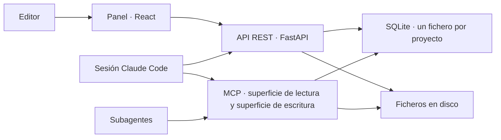

# spec1.md — SRS del backend, versión 1

> **Estado: propuesta.** Este documento recoge los requisitos del backend de `my-story-marker` para su primera versión, correspondiente a la **Fase 1 · MVP** de [docs/architecture.md](../docs/architecture.md) §11. No es una decisión tomada: todo lo marcado como *abierto* en §10 debe resolverse antes de implementar la parte que depende de ello.
>
> Documento único y autocontenido en su estructura, pero **derivado**: no redefine el dominio ni la arquitectura. Cuando una afirmación procede de `docs/`, se cita la sección de origen. Si este documento y `docs/` discrepan, manda `docs/`.

---

## 1. Introducción

### 1.1 Propósito

Especificar qué debe hacer el backend para que una sesión de Claude Code pueda llevar un brief de editor hasta un manuscrito en Markdown, con la biblia de continuidad y los informes de verificación persistidos y trazables.

El lector objetivo es quien implementa y quien revisa el alcance. Se asume lectura previa de los tres documentos de `docs/`.

### 1.2 Alcance de la versión 1

El backend v1 cubre **todo lo que no consume modelo** ([docs/architecture.md](../docs/architecture.md) §1): persistencia, estado del grafo, verificadores deterministas, recuperación y ensamblado de contexto, acceso tipado a la biblia por MCP, y una API REST para el panel del editor.

**Dentro del alcance**

| Pieza | Justificación |
|---|---|
| Esquema de validación de la ontología | Fase 1: «ontología como esquema» |
| Rebanadas `intake`, `contexto`, `planificacion`, `escaleta`, `capitulo`, `exportacion` | Fases de §2 que la Fase 1 activa |
| Verificadores deterministas (esquema, longitud, métricas de estilo, nombres, continuidad dura) | Fase 1 explícita |
| Biblia mínima y resumen acumulado | Necesarios para el bucle de capítulo |
| Máquina de estados persistida en SQLite | §3.1: sin ella no hay reanudación |
| Servidor MCP de lectura/escritura sobre la biblia | §7: el permiso de escritura del Bibliotecario es una decisión ya tomada |
| Exportación a Markdown | Fase 1 explícita |
| API REST para el panel y para las dos paradas humanas | §3.1, §10 |

**Fuera del alcance de la v1** (y por qué)

| Pieza | Fase | Motivo |
|---|---|---|
| Verificadores LLM-juez | 2 | La Fase 1 no los incluye; el backend deja el punto de extensión, no la implementación |
| Rebanadas `verificacion` (manuscrito) y `revision` | 3 y 2 | Dependen de los jueces |
| Índice semántico y búsqueda de pasajes | 2 | El mecanismo de búsqueda está **sin decidir** (§10, D-1) |
| Exportación a EPUB / DOCX / PDF | 3 | Fase 1 sale en Markdown |
| Originalidad contra corpus | 3 | Requiere corpus y búsqueda de similitud |
| Multiusuario, autenticación, autorización | 3 | Un fichero SQLite por proyecto, un solo editor |
| Control de coste por token | — | El gasto es de suscripción, no de API medida ([docs/architecture.md](../docs/architecture.md) §10) |
| Cifrado en reposo y retención configurable | 3 | Ver más abajo |

Las rebanadas fuera de alcance **no se crean vacías**: la carpeta aparece cuando hay código que poner dentro.

**Sobre el cifrado en reposo.** [docs/architecture.md](../docs/architecture.md) §10 pide prompts y salidas cifrados en reposo y retención configurable. La v1 **no lo hace**, y conviene que quede escrito en vez de quedar como un olvido: escribe capítulos, prompts y exportaciones como ficheros planos dentro del directorio del proyecto, precisamente porque C-4 los quiere legibles con `grep` y comparables con `diff`. La exclusión se sostiene mientras la ejecución sea local y de un solo editor; el día que se aborde el multiusuario de la Fase 3, esta fila y C-4 se revisan juntas, porque la tensión entre ambas es real.

**Sobre la rebanada `planificacion`.** Está entera dentro del alcance aunque [docs/architecture.md](../docs/architecture.md) §11 ponga en Fase 1 solo a Contexto, Arquitecto, Escaletista y Escritor, y deje a Personajes, Mundo y Estilo para la Fase 2. No es una contradicción: lo que la Fase 2 aplaza son los **agentes**, y lo que esta spec exige es la **persistencia** de lo que producen. El Recuperador la necesita desde el primer capítulo —fichas de personajes presentes y guía de estilo son dos bloques de la tabla de §6.3, ~8k y ~5k—, así que en la v1 esos datos existen aunque los escriba el editor a mano o un Arquitecto que asuma el hueco. Construir el hueco después obligaría a rehacer el Recuperador, que es el paso 6 del orden de §12.

### 1.3 Definiciones

Los términos del dominio (acto, hito, escaleta, presagio, biblia, arco…) están definidos en [docs/definitions.md](../docs/definitions.md) §10 y no se repiten aquí. Términos propios de este documento:

| Término | Significado en este SRS |
|---|---|
| **Proyecto** | Una novela. Se corresponde uno a uno con un fichero SQLite y un directorio en disco. |
| **Rebanada** | Carpeta de `backend/` que contiene su router, sus modelos, su lógica y su acceso a datos ([docs/architecture.md](../docs/architecture.md) §8). |
| **Paso** | Transición del grafo de estados: leer estado → lanzar subagente o ejecutar código → escribir resultado. |
| **Ejecución** | Una invocación concreta de un paso, identificada por `(capítulo, versión, intento)`. |
| **Informe** | Salida de un verificador: lista de hallazgos con severidad y localización. Nunca contiene correcciones. |
| RF / RNF / D | Requisito funcional / requisito no funcional / decisión abierta. |

### 1.4 Referencias

- [docs/domain-knowledge.md](../docs/domain-knowledge.md) — las 8 dimensiones y el pipeline de decisión.
- [docs/definitions.md](../docs/definitions.md) — diccionario de nodos, valores permitidos, instancia YAML de referencia.
- [docs/architecture.md](../docs/architecture.md) — capas, agentes, verificadores, ciclo de capítulo, modelo de datos, tecnología, organización del código, fases.
- [docs/validators.md](../docs/validators.md) — marco T/A/I/D/U, usado en §9 de este documento.
- [AGENTS.md](../AGENTS.md) — reglas de trabajo y pila decidida.

---

## 2. Descripción general

### 2.1 Perspectiva del producto

El backend **no orquesta**. Quien recorre el grafo es una sesión de Claude Code ([docs/architecture.md](../docs/architecture.md) §1, §3). El backend es el sustrato que esa sesión usa: guarda el estado, le da contexto ensamblado, ejecuta las comprobaciones baratas y sirve los datos al panel.



Consecuencia de diseño que atraviesa todo el documento: **el backend nunca llama a un modelo en la v1**. No hay cliente LLM en `backend/`. Si un requisito parece necesitarlo, o es trabajo de un subagente o está fuera de alcance.

### 2.2 Funciones principales

1. Validar el objeto de contexto contra la ontología.
2. Persistir proyecto, contexto, plan, fichas, capítulos, biblia e informes.
3. Mantener y exponer el estado del grafo, con reintentos contados en la fila del capítulo.
4. Ensamblar el prompt del Escritor por debajo del tope de 100.000 tokens de entrada.
5. Ejecutar los verificadores deterministas y devolver informes.
6. Dar a los subagentes acceso tipado a la biblia, de solo lectura salvo el Bibliotecario.
7. Exportar el manuscrito aprobado a Markdown con sus metadatos.

### 2.3 Usuarios y actores

| Actor | Qué hace contra el backend |
|---|---|
| **Editor** | Crea el proyecto, envía el brief, aprueba o rechaza en las dos paradas humanas, lee informes y capítulos. Vía panel → API REST. |
| **Sesión de Claude Code** | Lee y escribe estado, lanza pasos, pide contexto ensamblado, ejecuta verificadores. Vía API REST y MCP. |
| **Subagente** | Lee la biblia. Solo el Bibliotecario escribe. Vía MCP. |

### 2.4 Restricciones

| # | Restricción | Origen |
|---|---|---|
| C-1 | Python + FastAPI en el backend | [AGENTS.md](../AGENTS.md), §7 |
| C-2 | SQLite local, un fichero por proyecto, modo WAL, un solo escritor | §6, §7 |
| C-3 | Vertical slices: una carpeta por fase de §2, sin `routers/`, `models/` ni `services/` transversales | §8 |
| C-4 | Versiones de capítulo, exportaciones y auditoría son ficheros en disco, no blobs | §6 |
| C-5 | 100.000 tokens de **entrada** por subagente; no hay presupuesto de salida. No es la ventana del modelo, es la decisión de no usarla entera: subirlo se mide contra la calidad del capítulo, no se rellena porque quepa | [CLAUDE.md](../CLAUDE.md), §6.3 |
| C-6 | Acceso de agentes a la biblia por MCP, con permiso de escritura solo para el Bibliotecario | §7 |
| C-7 | Ninguna dependencia nueva fuera de la tabla de §7 sin decisión previa | [AGENTS.md](../AGENTS.md) |
| C-8 | Sin datos personales en el brief | §10 |

### 2.5 Supuestos y dependencias

- Se asume un único editor por proyecto y ejecución local. La concurrencia real se limita a: una sesión de Claude Code, las dos superficies MCP, un servidor FastAPI, sobre el mismo fichero.
- Se asume que la ontología de [docs/definitions.md](../docs/definitions.md) es estable durante la v1; su versionado semántico (§10) se registra pero no se ejercita con migraciones.
- Se depende de que exista un cliente MCP (la sesión de Claude Code). El backend no valida qué modelo hay al otro lado.

---

## 3. Arquitectura del backend v1

```
backend/
  intake/          · brief libre → brief normalizado
  contexto/        · brief normalizado → objeto de contexto validado
  planificacion/   · contexto → plan narrativo
  escaleta/        · plan → fichas de capítulo
  capitulo/        · el bucle de §5: recuperador, verificadores, versiones, estado
  exportacion/     · manuscrito aprobado → Markdown + metadatos
  shared/          · conexión SQLite con pragmas, esquema de la ontología, tipos comunes, rutas del proyecto
  proyecto/        · estado del grafo, transiciones, aprobaciones humanas
  mcp/             · las dos superficies MCP sobre la misma base
```

Dos notas sobre esta estructura:

**`proyecto/` y `mcp/` no son rebanadas.** Ninguna es una fase de §2 y ambas están excepcionadas por escrito en [docs/architecture.md](../docs/architecture.md) §8. `proyecto/` recoge lo que §5.1 llama transversal —crear proyecto, fila de estado, tabla de transiciones, historial, las dos aprobaciones— porque atraviesa todas las fases en vez de pertenecer a una. `mcp/` es un segundo canal de entrada a los mismos datos, igual que el router REST de cada rebanada, y sus herramientas delegan en la lógica de las rebanadas en lugar de reimplementarla.

**La similitud vive en su propio módulo dentro de `capitulo/`.** Los dos mecanismos de RF-50 conviven en la misma rebanada, pero la recuperación por similitud queda detrás de una interfaz estrecha —recibe consulta y filtros, devuelve una lista ordenada de fragmentos— para que D-1 se resuelva cambiando ese módulo y nada más lo note ([docs/architecture.md](../docs/architecture.md) §6.3). No se promueve a `shared/` mientras tenga un solo consumidor.

**`shared/` se mantiene pequeño a la fuerza.** Contiene la conexión con sus pragmas, el esquema de la ontología y los tipos comunes, y nada más. La regla operativa de §8 se aplica literalmente: ante la duda, duplicar dentro de la rebanada y promover cuando lo pida el tercer sitio.

---

## 4. Requisitos funcionales

Cada requisito tiene identificador estable, enunciado, y la sección de `docs/` de la que se deriva. Prioridad: **M** imprescindible para la v1, **S** deseable, **C** admite quedar fuera si aprieta.

### 4.1 Transversal · proyecto y estado

| ID | Requisito | Prio | Origen |
|---|---|---|---|
| RF-01 | Crear un proyecto genera su fichero SQLite, su directorio en disco y su fila de estado inicial en `intake`. | M | §6, §3.1 |
| RF-02 | El estado del proyecto se lee y se escribe como fila en SQLite; el backend no mantiene estado en memoria entre peticiones. | M | §3.1 |
| RF-03 | Cada transición se persiste **antes** de que se lance el siguiente paso. | M | §3.2 |
| RF-04 | Las transiciones permitidas son exactamente las de la tabla de §3.1; una transición no contemplada se rechaza con error y no modifica la fila. | M | §3.1 |
| RF-05 | Los estados `aprobacion_plan` y `aprobacion_final` no tienen transición automática de salida: solo salen por una acción humana explícita en la API. | M | §3.3 |
| RF-06 | Toda escritura de resultado de paso está claveada por `(capítulo, versión, intento)`; repetir un paso ya completado produce la misma fila, no una duplicada. | M | §3.2 |
| RF-07 | El contador de intentos vive en la fila del capítulo, no en la sesión, y sobrevive al reinicio. | M | §3.2 |
| RF-08 | Existe un endpoint de reanudación que devuelve, a partir del identificador de proyecto, el estado actual y qué paso toca. | M | §3.1 |
| RF-09 | Se registra un historial append-only de transiciones con marca de tiempo, estado origen, estado destino y quién la provocó. | S | §3.1, §10 |

### 4.2 Rebanada `intake`

| ID | Requisito | Prio | Origen |
|---|---|---|---|
| RF-10 | Aceptar un brief libre del editor (público, género, extensión, ideas) y almacenarlo íntegro sin transformarlo. | M | §2 |
| RF-11 | Almacenar el brief normalizado que produce el Agente de Contexto, junto al brief original, sin sustituirlo. | M | §2 |
| RF-12 | Exponer las preguntas pendientes que el agente haya dejado abiertas y permitir que el editor las responda. | S | §3 |
| RF-13 | Rechazar el brief si contiene datos personales detectables, según C-8. | C | §10 |

### 4.3 Rebanada `contexto`

| ID | Requisito | Prio | Origen |
|---|---|---|---|
| RF-20 | Mantener el esquema de validación del objeto de contexto derivado de [docs/definitions.md](../docs/definitions.md), cubriendo las 8 dimensiones. | M | §4, definitions |
| RF-21 | Validar una instancia de contexto contra ese esquema y devolver un informe con ruta de la clave, valor recibido y valor o rango esperado. | M | §4 |
| RF-22 | El fallo de esquema es **bloqueante**: el proyecto no sale de `contexto` mientras exista un hallazgo de esa severidad. | M | §4 |
| RF-23 | Validar los enums de valores permitidos de [docs/definitions.md](../docs/definitions.md) §§1-8 (modelo estructural, tono, público, tipo de final, narrador, arco, cronología, cierre de capítulo…). | M | definitions |
| RF-24 | Aplicar las dependencias del pipeline de decisión como reglas de coherencia, no solo como tipos: público → límites de contenido y longitud de capítulo; extensión → número de capítulos; tema → tipo de final. | M | definitions §9 |
| RF-25 | Comprobar la regla de nivel de contenido por público: infantil ≤1, YA ≤2, adulto ≤3, por categoría. | M | definitions §2 |
| RF-26 | Rellenar valores por defecto derivables (porcentajes de acto 22/55/23, tiempo verbal `preterito`) y marcar en el informe cuáles se rellenaron. | M | definitions §1, §6 |
| RF-27 | Comprobar que la longitud de `curva_tension` coincide con el número de capítulos. | M | definitions §3 |
| RF-28 | Persistir el contexto validado con la versión de ontología con la que se validó. | M | §10 |

### 4.4 Rebanada `planificacion`

| ID | Requisito | Prio | Origen |
|---|---|---|---|
| RF-30 | Persistir el plan estructural: modelo, reparto de hitos por capítulo, curva de tensión, pregunta dramática, tipo de final. | M | §2, §3 |
| RF-31 | Persistir fichas de personaje con deseo, necesidad, herida, defecto, voz, arco y evolución, y el grafo dirigido de relaciones. | M | definitions §4 |
| RF-32 | Persistir la biblia inicial de mundo: tipo de mundo, época, árbol de localizaciones con `padre`, ruta con `dias_viaje`, reglas con sus límites y costes. | M | definitions §5 |
| RF-33 | Persistir la guía de estilo: narrador, registro, métricas de prosa, léxico, lista negra y convención onomástica. | M | definitions §6 |
| RF-34 | Comprobar que cada localización clave está enlazada a un hito estructural. | S | definitions §5 |
| RF-35 | Exponer el plan completo al panel en una sola lectura, para la parada `aprobacion_plan`. | M | §3.1 |
| RF-36 | Registrar la decisión del editor en esa parada (aprobado / cambios, con notas) y usarla como única salida del estado. | M | §3.3 |

### 4.5 Rebanada `escaleta`

| ID | Requisito | Prio | Origen |
|---|---|---|---|
| RF-40 | Persistir N fichas de capítulo con: hito, escenas y secuelas, POV, localización, personajes presentes, tensión objetivo, palabras objetivo, cierre, y elementos a plantar y a cobrar. | M | definitions §8, §2 |
| RF-41 | Comprobar que el número de fichas coincide con el número de capítulos del contexto y que el reparto por actos respeta los porcentajes. | M | definitions §1, §3 |
| RF-42 | Comprobar que cada hito obligatorio del modelo estructural elegido aparece en exactamente una ficha. | M | definitions §1 |
| RF-43 | Comprobar que todo elemento marcado «a plantar» tiene un capítulo posterior donde se cobra — regla de Chéjov a nivel de escaleta, antes de escribir. | S | definitions §10, §4 |

### 4.6 Rebanada `capitulo` — el bucle

#### 4.6.1 Recuperador de contexto

| ID | Requisito | Prio | Origen |
|---|---|---|---|
| RF-50 | El Recuperador no llama a ningún modelo. Ensambla con **dos mecanismos de contrato distinto**: recuperación estructurada y recuperación por similitud. El criterio que los separa es el determinismo, no la técnica. | M | §5, §6.3 |
| RF-50a | **Recuperación estructurada:** misma entrada → mismo resultado, byte a byte. Sirve todos los bloques menos el de pasajes recuperados. | M | §6.3 |
| RF-50b | **Recuperación por similitud:** misma entrada **y mismo estado del índice** → mismo resultado. El desempate entre fragmentos de igual puntuación es explícito y estable: puntuación, luego número de capítulo, luego posición del fragmento. | M | §6.3 |
| RF-50c | El resultado vacío es asimétrico: en similitud es una respuesta válida —no se emite su encabezado y **no se registra como recorte**—; en estructurada es un error que aborta el ensamblado con mensaje accionable. | M | §6.3 |
| RF-51 | Ensambla el prompt por bloques, con los tamaños esperados y el orden de prioridad de la tabla de §6.3. El recorte se dispara contra el tope de 100.000, no contra la suma de la tabla. | M | §6.3 |
| RF-52 | Cuenta los tokens **antes** de enviar, no después. | M | §6.3 |
| RF-52a | La cuenta la da un **estimador conservador**, no un contador exacto: `tiktoken` con `o200k_base` multiplicado por un factor de inflación de 1,35. `tiktoken` es el tokenizador de OpenAI e infracuenta a Claude; el factor existe para que el error sea siempre por exceso. | M | §6.3, §7 |
| RF-52b | El estimador vive detrás de una interfaz estrecha —texto entra, entero sale— y el factor de inflación es una constante de ese módulo, en un sitio único. El tope de 100.000 **no se baja** para dejar margen: el margen está dentro del estimador. | M | §6.3 |
| RF-52c | El fichero BPE de `o200k_base` se versiona en el repositorio y `TIKTOKEN_CACHE_DIR` apunta a él. El estimador no descarga nada de la red en tiempo de ejecución. | M | §6.3, §7 |
| RF-53 | Si no cabe, recorta por orden de prioridad inverso (pasajes recuperados primero, ficha nunca) y **deja escrito en el informe** qué recortó y cuánto. | M | §6.3 |
| RF-53a | El recorte elimina **unidades completas, nunca bytes**: fragmentos enteros desde la cola del ranking en el bloque de pasajes, y el bloque entero en los demás. No se corta un resumen ni una ficha por la mitad. | M | §6.3 |
| RF-54 | Nunca trunca por el final en silencio. Un recorte sin registro es un fallo del Recuperador. | M | §6.3 |
| RF-55 | El bloque «resumen acumulado» se sirve compactado según §6.2: resúmenes de acto cerrado + capítulos del acto en curso. | M | §6.2 |
| RF-56 | Los presagios pendientes, el estado de los personajes presentes y el inventario vivo nunca se compactan ni se recortan por compactación. | M | §6.2 |
| RF-57 | En la v1 la recuperación por similitud devuelve **siempre el conjunto vacío** hasta que se resuelva D-1. Es una respuesta válida de su contrato (RF-50c): no se emite el bloque ni su encabezado, y no se registra recorte. No es un punto de extensión pendiente, es el caso vacío implementado. | M | §7, D-1 |
| RF-58 | El prompt ensamblado se guarda como fichero en disco, asociado a `(capítulo, versión, intento)`. | M | §6, §10 |
| RF-59 | La consulta de similitud se deriva de la ficha —hito y escenas como texto de consulta— con filtros estructurados duros: personajes presentes, localización y **solo capítulos anteriores al actual**, medidos por número de capítulo y no por orden de escritura. | M | §6.3 |
| RF-59a | El bloque de pasajes va precedido de un encabezado fijo que declara que no son estado vigente y que ante discrepancia manda la ficha; el texto es una constante del código, no se redacta al vuelo. Cada fragmento va precedido de su procedencia. | M | §6.3 |
| RF-59b | La respuesta del ensamblado incluye un desglose por bloque —identificador, tokens finales, tamaño esperado y, si hubo recorte, cuánto quedó fuera—, el total de entrada, la lista ordenada de recortes y, para el bloque de similitud, capítulo y posición de cada fragmento. Se persiste junto al prompt de RF-58. | M | §6.3, §10 |

#### 4.6.2 Versiones, estado e informes de capítulo

| ID | Requisito | Prio | Origen |
|---|---|---|---|
| RF-60 | Cada capítulo se guarda con versión, estado (`borrador`, `editado`, `verificado`, `aprobado`, `revision_humana`) y los informes que lo produjeron. | M | §6 |
| RF-61 | El texto de cada versión es un fichero en disco, legible con `grep` y comparable con `diff`; la base guarda la ruta y los metadatos. | M | §6 |
| RF-62 | Se guarda por capítulo: semilla, versión de prompt, versión de modelo y contexto exacto. | M | §10 |
| RF-63 | Tope de 3 intentos por capítulo. Agotados, el capítulo pasa a `revision_humana` con los informes adjuntos. | M | §4, §3.2 |
| RF-64 | Un capítulo en `revision_humana` no bloquea el bucle: la sesión sigue con el siguiente. | M | §3.2 |
| RF-65 | El backend rechaza cualquier escritura en la biblia que no venga de la herramienta del Bibliotecario, y cualquiera que se intente antes de que el capítulo esté verificado. | M | §1, §3.3 |

#### 4.6.3 Verificadores deterministas

Todos devuelven informe con severidad y localización. **Ninguno corrige** ([docs/architecture.md](../docs/architecture.md) §4).

| ID | Verificador | Comprueba | Severidad |
|---|---|---|---|
| RF-70 | Longitud | Palabras del capítulo dentro de `[min, max]` de la ficha y del contexto; y del manuscrito contra `palabras_objetivo ± tolerancia`. | Media |
| RF-71 | Métricas de estilo | Longitud media de frase, porcentaje de diálogo, legibilidad, contra los valores de la guía de estilo. | Baja / Media |
| RF-72 | Lista negra | Ninguna palabra o muletilla prohibida del contexto aparece en el texto. | Baja |
| RF-73 | Nombres y grafías | Todo nombre propio del capítulo existe en el glosario con esa grafía exacta. | Media |
| RF-74 | Continuidad dura · presencia | Ningún personaje actúa en un capítulo del que la biblia lo da por ausente, muerto o en otra localización. | Alta |
| RF-75 | Continuidad dura · inventario | Ningún objeto cambia de poseedor sin que exista el traspaso; ningún objeto aparece en dos manos a la vez. | Alta |
| RF-76 | Continuidad dura · tiempo | El salto temporal entre capítulos es compatible con los `dias_viaje` de la ruta; no hay tiempos de viaje imposibles. | Alta |

**El verificador de Longitud tiene dos clientes, no uno** ([docs/architecture.md](../docs/architecture.md) §6.3). El primero es el editor, que quiere capítulos parejos. El segundo es el Recuperador: los tamaños esperados de la tabla de §6.3 suponen capítulos en su longitud objetivo, y un capítulo al doble entra inflado como «capítulo anterior íntegro» en el prompt del capítulo siguiente, y como entrada del Editor, del Bibliotecario y del Revisor. La salida de hoy es la entrada de mañana, así que RF-70 es lo que mantiene cierto el supuesto de RF-51. Su severidad sigue siendo media —no corta el ciclo— pero un hallazgo suyo desatendido se paga en el capítulo siguiente, no en este.

El control de la longitud es **blando a propósito**: `palabras_objetivo` en el prompt más este verificador a posteriori, no un parámetro que corte la generación. Se acepta así porque quien orquesta es una sesión, no código ([docs/architecture.md](../docs/architecture.md) §6.3).

Y dos requisitos sobre cómo se ejecutan:

| ID | Requisito | Prio | Origen |
|---|---|---|---|
| RF-77 | Los deterministas se ejecutan **siempre** y **antes** que cualquier juez. Un fallo alto o bloqueante corta el ciclo sin llegar a los jueces. | M | §4, §5 |
| RF-78 | El informe lista hallazgos con: verificador, severidad, localización (capítulo, y offset o número de párrafo), evidencia citada, y regla infringida. | M | §4 |
| RF-79 | El informe de Longitud declara la desviación en palabras y en porcentaje sobre el objetivo de la ficha, no solo si está dentro o fuera del rango: es la señal que el Recuperador necesita para explicar un prompt inflado. | S | §6.3 |

#### 4.6.4 Biblia

| ID | Requisito | Prio | Origen |
|---|---|---|---|
| RF-80 | Persistir personajes con ficha, estado actual, evolución y qué sabe cada uno. | M | §6 |
| RF-81 | Persistir localizaciones con jerarquía y estado. | M | §6 |
| RF-82 | Persistir línea temporal: día de la historia por capítulo. | M | §6 |
| RF-83 | Persistir inventario: objeto → poseedor → capítulo. | M | §6 |
| RF-84 | Persistir presagios: plantado en → cobrado en, con los no cobrados consultables como conjunto. | M | §6 |
| RF-85 | Persistir glosario y nombres. | M | §6 |
| RF-86 | Persistir resúmenes por capítulo (presupuesto fijo ≈200 palabras) y resúmenes de acto. | M | §6.2 |
| RF-87 | Al cerrar un acto, los resúmenes de sus capítulos se destilan en un resumen de acto y dejan de enviarse individualmente, **sin borrarse**. | M | §6.2 |
| RF-88 | Todo lo que hay en el resumen acumulado es reconstruible releyendo los capítulos aprobados: el nivel 2 es vista derivada, nunca fuente de verdad. | M | §6.1 |

### 4.7 Rebanada `exportacion`

| ID | Requisito | Prio | Origen |
|---|---|---|---|
| RF-90 | Exportar el manuscrito aprobado a Markdown, respetando titulación y macroestructura del contexto (prólogo, partes, epílogo, interludios). | M | §11, definitions §3 |
| RF-91 | Persistir los metadatos editoriales que produzca el Exportador: título, sinopsis, palabras clave, serie y volumen. | M | definitions §8 |
| RF-92 | Los archivos exportados van a disco dentro del directorio del proyecto. | M | §6 |
| RF-93 | La exportación solo es posible desde `exportacion`, es decir, tras `aprobacion_final`. | M | §3.1 |

### 4.8 Servidor MCP

| ID | Requisito | Prio | Origen |
|---|---|---|---|
| RF-100 | Exponer herramientas tipadas sobre la biblia, no SQL libre. | M | §7 |
| RF-101 | Todas las herramientas de lectura están disponibles para cualquier subagente. | M | §7 |
| RF-102 | Las herramientas de escritura están restringidas al Bibliotecario; el permiso se aplica por herramienta, no por convención en el prompt. | M | §1, §7 |
| RF-103 | Lectura mínima: ficha y estado de personaje, localización, día de la historia, inventario por objeto y por poseedor, presagios pendientes, glosario, resumen acumulado compactado, capítulo por número y versión. | M | §5, §6 |
| RF-104 | Escritura mínima: registrar hechos nuevos de un capítulo aprobado, actualizar estado de personajes y objetos, cerrar presagios, escribir el resumen del capítulo. | M | §5 |
| RF-105 | Toda llamada a herramienta se registra con agente, herramienta, argumentos y resultado, para auditoría. | S | §10 |
| RF-106 | Las herramientas de escritura rechazan la llamada si el capítulo no está en estado `verificado` o posterior. | M | §1 |

---

## 5. Interfaces externas

### 5.1 API REST

Cada rebanada aporta su router. Rutas indicativas, agrupadas por rebanada; la forma exacta de los cuerpos sale de los modelos Pydantic de cada una.

| Método y ruta | Rebanada | Para qué |
|---|---|---|
| `POST /proyectos` | transversal | Crear proyecto (RF-01) |
| `GET /proyectos/{id}/estado` | transversal | Reanudación: dónde está y qué toca (RF-08) |
| `POST /proyectos/{id}/transicion` | transversal | Registrar transición (RF-03, RF-04) |
| `POST /proyectos/{id}/brief` | `intake` | Enviar brief (RF-10) |
| `PUT /proyectos/{id}/contexto` | `contexto` | Guardar contexto; dispara validación (RF-21) |
| `POST /proyectos/{id}/contexto/validar` | `contexto` | Validar sin guardar |
| `GET /proyectos/{id}/plan` | `planificacion` | Plan completo para la aprobación (RF-35) |
| `POST /proyectos/{id}/plan/aprobacion` | `planificacion` | Decisión humana (RF-36) |
| `GET/PUT /proyectos/{id}/escaleta` | `escaleta` | Fichas de capítulo (RF-40) |
| `GET /proyectos/{id}/capitulos/{n}/prompt` | `capitulo` | Prompt ensamblado por el Recuperador (RF-51) |
| `POST /proyectos/{id}/capitulos/{n}/versiones` | `capitulo` | Registrar una versión (RF-60) |
| `POST /proyectos/{id}/capitulos/{n}/verificar` | `capitulo` | Ejecutar deterministas, devolver informe (RF-77) |
| `GET /proyectos/{id}/capitulos/{n}/informes` | `capitulo` | Informes de un capítulo |
| `POST /proyectos/{id}/aprobacion-final` | transversal | Decisión humana (RF-05) |
| `POST /proyectos/{id}/exportar` | `exportacion` | Exportar a Markdown (RF-90) |

**Errores:** respuesta con código, requisito infringido cuando aplique, y detalle accionable. Una transición inválida (RF-04) y una escritura no autorizada en biblia (RF-65) se distinguen de un error de validación de entrada.

### 5.2 Interfaz MCP

Herramientas tipadas según RF-100 a RF-106, en **dos superficies** ([docs/architecture.md](../docs/architecture.md) §7): una de solo lectura, disponible para cualquier subagente, y otra de lectura-escritura que solo se le entrega al Bibliotecario en su definición. Ambas abren la misma base que la API, con los mismos pragmas. RF-106 sigue viviendo en el backend pase lo que pase con el reparto: que el capítulo esté verificado es una comprobación de estado y no depende de quién llame.

### 5.3 Ficheros en disco

```
<directorio-del-proyecto>/
  proyecto.sqlite
  capitulos/   cap-03/v2-intento1.md
  prompts/     cap-03/v2-intento1.prompt.md
  export/      manuscrito.md, metadatos.yaml
```

Nombres orientativos; la regla firme es que texto de capítulo, prompt de auditoría y exportación son ficheros, no blobs (C-4).

---

## 6. Modelo de datos

Un fichero SQLite por proyecto, en WAL. Entidades derivadas de [docs/architecture.md](../docs/architecture.md) §6.

| Tabla | Contenido | Requisitos |
|---|---|---|
| `proyecto` | Identidad, ruta del directorio, versión de ontología, estado actual | RF-01, RF-02 |
| `transicion` | Historial append-only de cambios de estado | RF-09 |
| `brief` | Brief original y brief normalizado | RF-10, RF-11 |
| `contexto` | Objeto de contexto validado + versión de ontología | RF-28 |
| `plan` | Plan estructural | RF-30 |
| `personaje` | Ficha, arco, evolución, estado actual, qué sabe | RF-31, RF-80 |
| `relacion` | Grafo dirigido origen → destino, tipo, estado inicial y final | RF-31 |
| `localizacion` | Árbol con `padre`, nivel, estado | RF-32, RF-81 |
| `ruta` | Secuencia ordenada de localizaciones con `dias_viaje` | RF-32, RF-76 |
| `regla_mundo` | Reglas con límites, costes y excepciones | RF-32 |
| `guia_estilo` | Narrador, registro, métricas, léxico, lista negra, onomástica | RF-33 |
| `ficha_capitulo` | La escaleta: una fila por capítulo | RF-40 |
| `capitulo_version` | Versión, intento, estado, ruta del fichero, semilla, versión de prompt y de modelo | RF-60, RF-62 |
| `informe` | Verificador, severidad, localización, evidencia, regla | RF-78 |
| `linea_temporal` | Día de la historia por capítulo | RF-82 |
| `inventario` | Objeto → poseedor → capítulo | RF-83 |
| `presagio` | Plantado en → cobrado en | RF-84 |
| `glosario` | Nombres y grafías canónicas | RF-85 |
| `resumen` | Por capítulo y por acto | RF-86, RF-87 |
| `cache` | Prompts repetidos | §6 |
| `llamada_mcp` | Auditoría de herramientas | RF-105 |

**Pragmas obligatorios** en `shared/`, aplicados en un único sitio: `journal_mode=WAL`, `foreign_keys=ON`, `busy_timeout`. El riesgo concreto que justifica centralizarlos está escrito en §8 de la arquitectura: un `foreign_keys` olvidado en una rebanada no da error, solo filas huérfanas.

**Escritor único.** SQLite en WAL admite un escritor a la vez. La v1 no intenta esquivarlo: las escrituras se serializan y el paralelismo coral queda fuera de alcance ([docs/architecture.md](../docs/architecture.md) §10).

---

## 7. Requisitos no funcionales

| ID | Requisito | Cómo se comprueba |
|---|---|---|
| RNF-01 | **Reanudabilidad.** Matar el proceso en cualquier punto y volver a arrancar pierde como mucho el trabajo de un subagente, nunca la posición en el grafo. | V-1 |
| RNF-02 | **Idempotencia.** Repetir un paso ya completado no duplica filas ni ficheros. | V-2 |
| RNF-03a | **Determinismo de la recuperación estructurada.** Misma entrada → mismo resultado, byte a byte. | V-3a |
| RNF-03b | **Reproducibilidad de la recuperación por similitud.** Misma entrada y mismo estado del índice → mismo resultado, desempate incluido. | V-3b |
| RNF-04 | **Trazabilidad.** Desde cualquier hallazgo de un informe se llega al prompt exacto que lo produjo. | V-4 |
| RNF-05 | **Tope de entrada.** Ningún prompt ensamblado supera los 100.000 tokens de entrada **medidos por el estimador de RF-52a**. La promesa es esa y no otra: el estimador no es exacto, es conservador por construcción, así que lo que se garantiza es que no se rebasa el tope estimado —y con ello, salvo error del factor de inflación, tampoco el real. | V-5 |
| RNF-06 | **Tipado.** El código pasa comprobación estática de tipos sin errores. | V-6 |
| RNF-07 | **Latencia.** Los verificadores deterministas de un capítulo terminan en segundos, no minutos: son la comprobación barata que corre siempre. | V-7 |
| RNF-08 | **Portabilidad.** Arranca en Windows y en Linux sin cambios de código; las rutas se manejan como rutas, no como cadenas. | V-8 |
| RNF-09 | **Aislamiento por proyecto.** Un proyecto corrupto no afecta a otro: son ficheros distintos. | Por construcción (C-2) |
| RNF-10 | **Sin cliente LLM.** `backend/` no contiene llamadas a un proveedor de modelos. `tiktoken` (RF-52a) no cuenta: es una biblioteca local de tokenización, no un cliente de un proveedor, y no hace red. | V-9 |
| RNF-11 | **Sin dependencias no acordadas.** El fichero de dependencias no contiene nada ausente de la tabla de §7 de la arquitectura. | V-10 |

---

## 8. Reglas de negocio que el backend hace cumplir

Se listan aparte porque son las que no pueden quedar en manos del prompt de un agente.

| ID | Regla | Mecanismo |
|---|---|---|
| RN-1 | Solo el Bibliotecario escribe en la biblia. | Permiso por herramienta MCP (RF-102), no confianza en el agente |
| RN-2 | Nada entra en la biblia antes de la verificación. | RF-106 |
| RN-3 | Las dos paradas humanas no se saltan. | RF-05: no existe transición automática de salida |
| RN-4 | Máximo 3 intentos por capítulo. | RF-07, RF-63: el contador está en la fila |
| RN-5 | Un recorte de contexto siempre se declara. Un bloque de similitud vacío no es un recorte. | RF-53, RF-54, RF-50c |
| RN-6 | Un verificador nunca corrige. | Los verificadores devuelven informe; no tienen escritura sobre el texto |
| RN-7 | El nivel 2 de memoria es derivado. | RF-88: la compactación nunca es el único sitio donde vive un hecho |

---

## 9. Verificación

Método de verificación por criterio, con la clasificación de [docs/validators.md](../docs/validators.md) §1. La etiqueta **U** aquí no es un hueco: es un riesgo declarado.

| ID | Criterio | Método | Tipo |
|---|---|---|---|
| V-1 | Reanudación (RNF-01) | Prueba de integración que mata el proceso en cada estado del grafo y reanuda; se comprueba que el estado leído es el esperado | T |
| V-2 | Idempotencia (RNF-02) | Prueba basada en propiedades: para cualquier paso y cualquier número de repeticiones, el conjunto de filas resultante es el mismo | T |
| V-3a | Determinismo de la recuperación estructurada (RNF-03a) | Prueba de propiedades sobre entradas generadas + comparación exacta de salida | T |
| V-3b | Reproducibilidad de la recuperación por similitud (RNF-03b) | Prueba de propiedades con el índice congelado: dos ejecuciones sobre el mismo estado coinciden, incluido el orden de los empates | T |
| V-4 | Trazabilidad (RNF-04) | Prueba de integración: dado un hallazgo, la cadena hasta el fichero de prompt se resuelve | T |
| V-5 | Presupuesto de contexto (RNF-05) | Prueba de propiedades con biblias sintéticas grandes: el ensamblado nunca excede el tope según el estimador, el informe de recorte es no vacío cuando recorta, y todo lo recortado son unidades completas —ningún bloque emitido es un prefijo de sí mismo (RF-53a) | T |
| V-6 | Tipado (RNF-06) | Comprobación estática de tipos en CI | A |
| V-7 | Latencia de deterministas (RNF-07) | Prueba con capítulo de tamaño máximo y umbral de tiempo | T |
| V-8 | Portabilidad (RNF-08) | Suite ejecutada en ambos sistemas | T |
| V-9 | Ausencia de cliente LLM (RNF-10) | Análisis estático: búsqueda de importaciones de proveedores en `backend/` | A |
| V-10 | Dependencias acordadas (RNF-11) | Comprobación en CI del fichero de dependencias contra la tabla de §7 | A |
| V-11 | Validación de ontología (RF-20 a RF-27) | Batería de instancias válidas e inválidas derivadas del ejemplo YAML de definitions §11, una por regla | T |
| V-12 | Verificadores de continuidad dura (RF-74 a RF-76) | Pruebas con biblia y capítulo construidos para infringir cada regla, y casos de control que no deben disparar | T |
| V-13 | Permisos MCP (RF-102, RN-1) | Prueba de contrato: un cliente que no es el Bibliotecario recibe error al invocar escritura | T |
| V-14 | Paradas humanas (RN-3) | Prueba de integración: no existe secuencia de llamadas que salga del estado sin la acción humana | T |
| V-15 | Cobertura real de la batería | Pruebas de mutación sobre verificadores y validador de ontología | T |
| V-16 | **Que el manuscrito sea bueno** | Ninguno en la v1. Los jueces LLM son Fase 2 y la valoración humana ciega es Fase 3. La v1 verifica que la maquinaria funciona, no que la novela valga | **U** |
| V-17 | **Que los verificadores deterministas detecten toda incoherencia real** | Detectan las reglas escritas, no la incoherencia en general. Falsos negativos aceptados y delegados a Fase 2 | **U** |
| V-18 | **Comportamiento del orquestador** | El grafo lo recorre una sesión de Claude Code: el backend puede rechazar transiciones inválidas, pero no puede garantizar que la sesión intente las correctas. Cubre también la regla de que **una invocación es un intento** ([docs/architecture.md](../docs/architecture.md) §3.2): el backend clavea por `(capítulo, versión, intento)` y cuenta hasta tres, pero no puede distinguir dos intentos hechos en dos invocaciones de dos hechos dentro de la misma. Riesgo aceptado en v1; `model checking` sobre el grafo queda como candidato de Fase 2 | **U** |

---

## 10. Decisiones abiertas

Ninguna de estas se resuelve en este documento. Están enumeradas porque hay requisitos que dependen de ellas y porque [AGENTS.md](../AGENTS.md) prohíbe introducirlas por iniciativa propia: cada una es una propuesta que hay que aceptar y llevar a la tabla de §7 de la arquitectura en el mismo cambio.

| ID | Decisión | A qué afecta | Bloquea la v1 |
|---|---|---|---|
| D-1 | Mecanismo de búsqueda dentro de SQLite: con embeddings locales o con FTS5 ([docs/architecture.md](../docs/architecture.md) §6). Es decisión de fase 2 | Implementación de la recuperación por similitud (RF-50b, RF-57, RF-59). Su contrato ya está definido en §6.3 de la arquitectura, así que la decisión se enchufa detrás de una interfaz estrecha y no arrastra al resto del Recuperador | No — el mecanismo devuelve vacío |
| D-2 | Cola de trabajos | §9 de la arquitectura; en v1 la ejecución es secuencial y en proceso | No |
| D-3 | Observabilidad y trazas | RF-105, V-18 | No |
| D-4 | Biblioteca de validación del esquema de ontología: si Pydantic basta o hace falta JSON Schema aparte | RF-20 | **Sí** |
| D-5 | ~~Contador de tokens del Recuperador~~ — **resuelta**: estimador conservador `tiktoken` `o200k_base` × 1,35, en la tabla de §7 de la arquitectura | RF-52, RF-52a a RF-52c | — |
| D-6 | Métrica de legibilidad concreta y su cálculo en español | RF-71 | Sí, para ese verificador |
| D-7 | Marco de pruebas y de comprobación estática de tipos | V-6, V-15 | **Sí** |
| D-8 | Formatos de exportación de Fase 3 y despliegue | Fuera de alcance v1 | No |
| D-9 | Qué hace el Recuperador cuando, recortadas ya todas las unidades recortables, el ensamblado sigue sin caber: solo queda la ficha del capítulo y aun así rebasa el tope | RF-53, RF-53a | No — es un caso patológico, no el camino normal |

Sobre **D-4** y **D-7**: son las dos que quedan por cerrar antes de escribir la primera línea. **D-5** ya está cerrada. Las demás admiten empezar sin ellas.

**D-9** merece una nota, porque es un hueco abierto a propósito y no un olvido. El recorte por unidades completas (RF-53a) es finito: acaba, en el peor caso, con la ficha sola. Llegar ahí no significa que el capítulo sea denso, significa que hay un dato mal formado —una guía de estilo de 60k, una ficha con veinte personajes en escena, un resumen de acto que nunca se destiló—. Hasta que la decisión se tome, el código **no puede inventarse una salida**: ni truncar, ni subir el tope, ni enviar el prompt igualmente. Que falle de forma ruidosa es el comportamiento correcto mientras tanto.

---

## 11. Trazabilidad

| Origen en `docs/` | Requisitos que se derivan |
|---|---|
| architecture §1 | RF-65, RN-1, RNF-10 |
| architecture §2 | RF-10, RF-11, estructura de rebanadas de §3 |
| architecture §3.1 | RF-02, RF-04, RF-05, RF-08, RF-35 |
| architecture §3.2 | RF-03, RF-06, RF-07, RF-63, RF-64, V-18 |
| architecture §3.3 | RF-05, RN-1, RN-3 |
| architecture §4 | RF-22, RF-70 a RF-78, RF-63 |
| architecture §5 | RF-50, RF-77, RF-103 |
| architecture §6 | RF-60, RF-61, RF-80 a RF-86, §6 completo |
| architecture §6.1 | RF-88, RN-7 |
| architecture §6.2 | RF-55, RF-56, RF-86, RF-87 |
| architecture §6.3 | RF-50 a RF-54, RF-52a a RF-52c, RF-53a, RF-57, RF-58, RF-59 a RF-59b, RF-79, RNF-03a, RNF-03b, RNF-05, D-9 |
| architecture §7 | C-1, C-2, C-6, RF-52a, RF-52c, RF-100 a RF-106, D-1 a D-3, D-5 |
| architecture §8 | C-3, §3 de este documento |
| architecture §10 | RF-09, RF-62, RF-105, C-8 |
| architecture §11 | §1.2 completo |
| definitions §1-§8 | RF-23 a RF-27, RF-31 a RF-33, RF-40 a RF-42, RF-91 |
| definitions §9 | RF-24 |
| definitions §11 | V-11 |
| validators §1-§3 | §9 completo |

---

## 12. Orden de construcción propuesto

No es un calendario, es un orden de dependencias. Cada paso deja algo comprobable.


La razón de que el Recuperador vaya antes que los verificadores: es la pieza con la restricción más dura (el tope de 100.000 tokens) y la que condiciona la forma de la biblia. Descubrir en el paso 6 que la biblia no se puede consultar por bloques obliga a rehacer el paso 4; descubrirlo en el paso 8, a rehacer también el 7.

La razón de que la API REST vaya al final: es la superficie más fácil de cambiar y la única que no tiene consumidor hasta que exista el panel.
