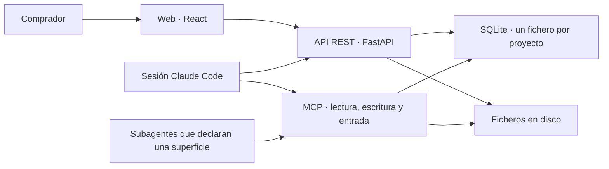

# spec1.md — SRS del backend, versión 1

> **Estado: propuesta.** Este documento recoge los requisitos del backend de `my-story-marker` para su primera versión, correspondiente a la **Fase 1 · Entrega** de [docs/architecture.md](../docs/architecture.md) §11. No es una decisión tomada: todo lo marcado como *abierto* en §10 debe resolverse antes de implementar la parte que depende de ello.
>
> Documento único y autocontenido en su estructura, pero **derivado**: no redefine el dominio ni la arquitectura. Cuando una afirmación procede de `docs/`, se cita la sección de origen. Si este documento y `docs/` discrepan, manda `docs/`.

---

## 1. Introducción

### 1.1 Propósito

Especificar qué debe hacer el backend para que una sesión de Claude Code pueda llevar la entrevista a un comprador hasta una novela publicada —lectura web y PDF, en versiones que se conservan—, con la biblia de continuidad y los informes de verificación persistidos y trazables.

El lector objetivo es quien implementa y quien revisa el alcance. Se asume lectura previa de los tres documentos de `docs/`.

### 1.2 Alcance de la versión 1

El backend v1 cubre **todo lo que no consume modelo** ([docs/architecture.md](../docs/architecture.md) §1): persistencia, estado del grafo, verificadores deterministas, recuperación y ensamblado de contexto, acceso tipado a la biblia por MCP, y una API REST para el panel del comprador.

**Dentro del alcance**

| Pieza | Justificación |
|---|---|
| Esquema de validación de la ontología | Fase 1: «ontología como esquema» |
| Rebanadas `intake`, `contexto`, `planificacion`, `escaleta`, `capitulo`, `exportacion` | Fases de §2 que la Fase 1 activa |
| Verificadores deterministas (esquema, longitud, métricas de estilo, nombres, continuidad dura) | Fase 1 explícita |
| Biblia mínima y resumen acumulado | Necesarios para el bucle de capítulo |
| Máquina de estados persistida en SQLite | §3.1: sin ella no hay reanudación |
| Servidor MCP de lectura/escritura sobre la biblia | §7: el permiso de escritura del Bibliotecario es una decisión ya tomada |
| Manuscrito en Markdown | Formato interno del manuscrito: es la fuente de la que salen la lectura web y el PDF, y el formato legible con `grep` y comparable con `diff` que pide C-4 |
| Guardarraíl de palabras prohibidas en tres niveles | Obligatorio en la entrega; es determinista y no necesita modelo |
| Gates de manuscrito: cobertura, cronología formal en Lean, umbral de la rúbrica del juez | Obligatorios en la entrega. El backend genera el fichero Lean, ejecuta la comprobación y aplica el umbral; el juez es un subagente |
| Rebanadas `verificacion` y `revision` | Las exigen los gates |
| Versiones de novela, publicación, lectura web y PDF | La novela se entrega como web con PDF exportado, y la versión anterior se conserva |
| Rebanada `cambio` y cola de trabajos | Regeneración por cambio del lector |
| API REST para el panel y para las dos paradas humanas | §3.1, §10 |

**Fuera del alcance de la v1** (y por qué)

| Pieza | Fase | Motivo |
|---|---|---|
| Ejecución de los jueces LLM | — | Son subagentes: el backend persiste su informe y aplica el umbral (RF-113), no los ejecuta |
| Verificador de contenido y líneas rojas | 2 | Ver más abajo |
| Índice semántico y búsqueda de pasajes | 2 | El mecanismo de búsqueda está **sin decidir** (§10, D-1) |
| Exportación a EPUB / DOCX | — | El producto se lee en web y se descarga en PDF |
| Originalidad contra corpus | 2 | Requiere corpus y búsqueda de similitud |
| Multiusuario, autenticación, autorización | 3 | Un fichero SQLite por proyecto, un solo comprador |
| Control de coste por token | — | El gasto es de suscripción, no de API medida ([docs/architecture.md](../docs/architecture.md) §10) |
| Cifrado en reposo y retención configurable | 3 | Ver más abajo |
| Prólogo, epílogo, partes e interludios | — | En la v1 la macroestructura es solo la titulación, con valores cerrados (`numerado`, `titulado`, `numerado_y_titulado`) |

Las rebanadas fuera de alcance **no se crean vacías**: la carpeta aparece cuando hay código que poner dentro.

**La v1 es la Fase 1 · Entrega** de [docs/architecture.md](../docs/architecture.md) §11, que desde la reorientación del producto incluye todo lo obligatorio en la entrega: gates de manuscrito, guardarraíl, versiones y regeneración por el lector.

**Sobre el verificador de contenido y líneas rojas.** [docs/architecture.md](../docs/architecture.md) §4 lo lista como **bloqueante**, con acción de regeneración obligatoria, y aun así la v1 no lo incluye. Queda escrito porque es el único verificador de esa tabla que se quedaba fuera sin decirlo. Sus dos mitades caen por motivos distintos: la de juicio es LLM-juez y ya está excluida por la fila anterior, y la de clasificación exigiría una dependencia que no está en la tabla de §7 de la arquitectura, así que introducirla sería una decisión nueva y C-7 lo prohíbe. Conviene no confundirlo con RF-25, que sí está dentro: RF-25 comprueba el **nivel de contenido declarado en el objeto de contexto**, no el texto del capítulo. Lo que sí mira el texto contra el público en la v1 es el criterio **`contenido`** del juez de capítulo, de severidad alta (B-15): el clasificador sigue fuera, pero la afirmación de que nada lo mira ya no vale.

**Sobre el cifrado en reposo.** [docs/architecture.md](../docs/architecture.md) §10 pide prompts y salidas cifrados en reposo y retención configurable. La v1 **no lo hace**, y conviene que quede escrito en vez de quedar como un olvido: escribe capítulos, prompts y exportaciones como ficheros planos dentro del directorio del proyecto, precisamente porque C-4 los quiere legibles con `grep` y comparables con `diff`. La exclusión se sostiene mientras la ejecución sea local y de un solo comprador; el día que se aborde el multiusuario de la Fase 3, esta fila y C-4 se revisan juntas, porque la tensión entre ambas es real.

**Sobre la rebanada `planificacion`.** Está entera dentro del alcance. Tras R-1 la planificación la hace un solo agente, el `planificador`, que en una salida produce plan, personajes, mundo y guía de estilo; con el `escaletista` y los demás, la novela usa 12 agentes, y en `planificacion` hay una sola orden. El Recuperador necesita su salida desde el primer capítulo: fichas de personajes presentes y guía de estilo son dos bloques de la tabla de §6.3, ~8k y ~5k.

### 1.3 Definiciones

Los términos del dominio (acto, hito, escaleta, presagio, biblia, arco…) están definidos en [docs/definitions.md](../docs/definitions.md) §11 y no se repiten aquí. Términos propios de este documento:

| Término | Significado en este SRS |
|---|---|
| **Proyecto** | Una novela. Se corresponde uno a uno con un fichero SQLite y un directorio en disco. |
| **Rebanada** | Carpeta de `backend/` que contiene su router, sus modelos, su lógica y su acceso a datos ([docs/architecture.md](../docs/architecture.md) §8). |
| **Paso** | Transición del grafo de estados: leer estado → lanzar subagente o ejecutar código → escribir resultado. |
| **Ejecución** | Una invocación concreta de un paso, identificada por `(capítulo, versión, intento)`. |
| **Informe** | Salida de un verificador: lista de hallazgos con severidad y localización. Nunca contiene correcciones. |
| RF / RNF / D | Requisito funcional / requisito no funcional / decisión abierta. |

### 1.4 Referencias

- [docs/domain-knowledge.md](../docs/domain-knowledge.md) — las 9 dimensiones, incluida Personalización, y el pipeline de decisión.
- [docs/definitions.md](../docs/definitions.md) — diccionario de nodos, valores permitidos, instancia YAML de referencia.
- [docs/architecture.md](../docs/architecture.md) — capas, agentes, verificadores, ciclo de capítulo, modelo de datos, tecnología, organización del código, fases.
- [docs/validators.md](../docs/validators.md) — marco T/A/I/D/U, usado en §9 de este documento.
- [AGENTS.md](../AGENTS.md) — reglas de trabajo y pila decidida.

---

## 2. Descripción general

### 2.1 Perspectiva del producto

**La sesión ejecuta y el backend decide.** Quien lanza los subagentes es una sesión de Claude Code ([docs/architecture.md](../docs/architecture.md) §1, §3), pero no elige qué toca: se lo pide al backend, que calcula la siguiente orden (RF-08). El backend es además el sustrato que esa sesión usa: guarda el estado, ensambla el contexto, ejecuta las comprobaciones baratas y sirve los datos a la web.



Consecuencia de diseño que atraviesa todo el documento: **el backend nunca llama a un modelo en la v1**. No hay cliente LLM en `backend/`. Si un requisito parece necesitarlo, o es trabajo de un subagente o está fuera de alcance.

### 2.2 Funciones principales

1. Validar el objeto de contexto contra la ontología.
2. Persistir proyecto, contexto, plan, fichas, capítulos, biblia e informes.
3. Mantener el estado del grafo, decidir la siguiente orden con los contadores y topes persistidos, y garantizar con un bloqueo que solo un ejecutor trabaja en cada proyecto.
4. Ensamblar el prompt del Escritor por debajo del tope de 100.000 tokens de entrada.
5. Ejecutar los verificadores deterministas y devolver informes.
6. Dar acceso tipado a la biblia a los subagentes que declaran `/mcp/lectura` —no al Escritor, que trabaja con el prompt del Recuperador—, escritura solo al Bibliotecario, y el texto no confiable solo al Extractor y al Intérprete.
7. Publicar versiones de la novela —lectura web y PDF— que no se modifican nunca, y regenerar los capítulos afectados por un cambio del lector.

### 2.3 Usuarios y actores

| Actor | Qué hace contra el backend |
|---|---|
| **Comprador** | Crea el proyecto, responde a la entrevista, confirma hechos y cambios, aprueba en las paradas si las activa, lee la novela y pide cambios. Vía web → API REST. |
| **Sesión de Claude Code** | Toma el bloqueo, pide la siguiente orden, lanza el subagente que indica y registra el resultado. No escribe transiciones. Vía API REST. |
| **Subagente** | Lee la biblia si declara `/mcp/lectura`; solo el Bibliotecario escribe; solo el Extractor y el Intérprete leen el texto no confiable. Vía MCP. |

### 2.4 Restricciones

| # | Restricción | Origen |
|---|---|---|
| C-1 | Python + FastAPI en el backend | [AGENTS.md](../AGENTS.md), §7 |
| C-2 | SQLite local, un fichero por proyecto, modo WAL, un solo escritor | §6, §7 |
| C-3 | Vertical slices: una carpeta por fase de §2, sin `routers/`, `models/` ni `services/` transversales | §8 |
| C-4 | Versiones de capítulo, exportaciones y auditoría son ficheros en disco, no blobs | §6 |
| C-5 | 100.000 tokens de **entrada** por subagente; no hay presupuesto de salida. No es la ventana del modelo, es la decisión de no usarla entera: subirlo se mide contra la calidad del capítulo, no se rellena porque quepa | [CLAUDE.md](../CLAUDE.md), §6.3 |
| C-6 | Acceso de agentes a la biblia por MCP, con permiso de escritura solo para el Bibliotecario | §7 |
| C-7 | Ninguna dependencia nueva fuera de la tabla de §7 sin decisión previa | [AGENTS.md](../AGENTS.md) |
| C-8 | Minimización de datos personales: solo los campos de [docs/definitions.md](../docs/definitions.md) §9; documento de identidad, teléfono, email, dirección exacta, datos bancarios y de salud se descartan siempre | §10 |

### 2.5 Supuestos y dependencias

- Se asume un único comprador por proyecto y ejecución local. La concurrencia real se limita a: una sesión de Claude Code y un servidor FastAPI —que sirve también las tres superficies MCP y el worker de la cola—, sobre el mismo fichero.
- Se asume que la ontología de [docs/definitions.md](../docs/definitions.md) es estable durante la v1; su versionado semántico (§10) se registra pero no se ejercita con migraciones.
- Se depende de que exista un cliente MCP (la sesión de Claude Code). El backend no valida qué modelo hay al otro lado.

---

## 3. Arquitectura del backend v1

```
backend/
  intake/          · brief libre → brief normalizado
  contexto/        · brief normalizado → objeto de contexto validado
  planificacion/   · contexto → plan narrativo
  escaleta/        · plan → fichas de capítulo
  capitulo/        · el bucle de §5: recuperador, verificadores, versiones, estado
  verificacion/    · gates de manuscrito: cobertura, cronología formal, umbral del juez
  revision/        · informe de fallos → capítulos a corregir
  exportacion/     · publicación de versión: lectura web, PDF, manuscrito Markdown y metadatos
  shared/          · conexión SQLite con pragmas, esquema de la ontología, tipos comunes, rutas del proyecto
  proyecto/        · estado del grafo, transiciones, siguiente orden, bloqueo, aprobaciones humanas
  mcp/             · las tres superficies MCP, montadas en el FastAPI
  cambio/          · petición del lector → cambio de hecho confirmado → trabajo
```

Dos notas sobre esta estructura:

**`proyecto/` y `mcp/` no son rebanadas.** Ninguna es una fase de §2 y ambas están excepcionadas por escrito en [docs/architecture.md](../docs/architecture.md) §8. `proyecto/` recoge lo que §5.1 llama transversal —crear proyecto, fila de estado, tabla de transiciones, historial, las dos aprobaciones— porque atraviesa todas las fases en vez de pertenecer a una. `mcp/` es un segundo canal de entrada a los mismos datos, igual que el router REST de cada rebanada, y sus herramientas delegan en la lógica de las rebanadas en lugar de reimplementarla.

**La similitud vive en su propio módulo dentro de `capitulo/`.** Los dos mecanismos de RF-50 conviven en la misma rebanada, pero la recuperación por similitud queda detrás de una interfaz estrecha —recibe consulta y filtros, devuelve una lista ordenada de fragmentos— para que D-1 se resuelva cambiando ese módulo y nada más lo note ([docs/architecture.md](../docs/architecture.md) §6.3). No se promueve a `shared/` mientras tenga un solo consumidor.

**`shared/` se mantiene pequeño a la fuerza.** Contiene la conexión con sus pragmas, el esquema de la ontología y los tipos comunes, y nada más. La regla operativa de §8 se aplica literalmente: ante la duda, duplicar dentro de la rebanada y promover cuando lo pida el tercer sitio.

---

## 4. Requisitos funcionales

Cada requisito tiene identificador estable, enunciado, y la sección de `docs/` de la que se deriva. Prioridad: **M** imprescindible para la v1, **S** deseable, **C** admite quedar fuera si aprieta.

### 4.1 Transversal · proyecto y estado

| ID | Requisito | Prio | Origen |
|---|---|---|---|
| RF-01 | Crear un proyecto genera su fichero SQLite, su directorio en disco y su fila de estado inicial en `intake`. | M | §6, §3.1 |
| RF-02 | El estado del proyecto se lee y se escribe como fila en SQLite; el backend no mantiene estado en memoria entre peticiones. | M | §3.1 |
| RF-03 | La posición en el grafo se persiste **antes** de que se lance el siguiente paso: la orden queda registrada como vigente antes de devolverse a la sesión. La transición la escribe el backend al registrar el resultado de esa orden; la sesión no escribe transiciones. | M | §3.2 |
| RF-04 | Las transiciones permitidas son exactamente las de la tabla de §3.1; una transición no contemplada se rechaza con error y no modifica la fila. | M | §3.1 |
| RF-05 | Las paradas `aprobacion_plan` y `aprobacion_final` se activan por proyecto y están **inactivas por defecto**. Cuando están activas no tienen transición automática de salida: solo salen por una acción humana explícita en la API. | M | §3.3 |
| RF-05a | `publicada`, `cambio_solicitado` y `detenida` solo salen por acción humana, **salvo** dos aristas escritas: el Intérprete que agota su tope y el worker que falla devuelven `cambio_solicitado` a `publicada` con el cambio fallido (Q6, R-4). | M | §3.1, §3.3 |
| RF-06 | Toda escritura de resultado de paso está claveada por `(capítulo, versión, intento)` o por la orden que la produjo; registrar de nuevo el mismo resultado para la misma orden devuelve la fila existente, no una duplicada. | M | §3.2 |
| RF-07 | El contador de intentos vive en la fila del capítulo, no en la sesión, y sobrevive al reinicio. | M | §3.2 |
| RF-07a | Toda orden lleva su número de intento, con tope 3 para cualquier agente. Agotado en una orden que no es de capítulo: `detenida` en la generación inicial; `publicada` con el cambio fallido en una regeneración. | M | §3.1, §3.2 |
| RF-08 | El backend calcula la **siguiente orden** de un proyecto: qué subagente lanzar, con qué entrada —prompt ensamblado o identificadores— y dónde registrar el resultado; o `esperar_humano`, `publicada`, `detenida` o `error` con una causa —`no_cabe` (D-9, con el desglose del Recuperador), `inconsistencia`, `lean_no_disponible`, `pdf_no_disponible`, `cronologia_invalida`, `contexto_incoherente`, `revision_sin_capitulos`—, que no cambia el estado ni gasta intento (AJ-5). Reintentos, topes, paradas y `detenida` se deciden aquí con los contadores persistidos, no en la sesión. | M | §3.1 |
| RF-08a | La elección de la orden es una función determinista del estado persistido. La orden **se persiste al emitirse**, con los identificadores de un solo uso y el fichero de prompt que necesite; pedir la siguiente orden mientras hay una vigente devuelve esa misma orden. Nunca indica una transición que la tabla de RF-04 no permita ni un intento por encima de los topes. Al registrar: un resultado para la orden vigente se valida y avanza el grafo; el mismo resultado otra vez es idempotente (RF-06); un resultado para otra orden se rechaza. | M | §3.1, §3.4 |
| RF-09 | Se registra un historial append-only de transiciones con marca de tiempo, estado origen, estado destino y quién la provocó. | S | §3.1, §10 |
| RF-09a | Borrar un proyecto elimina su fichero SQLite y su directorio en disco enteros. No hay retención automática. | M | §10 |
| RF-09b | Bloqueo por proyecto en su fila: se toma al empezar a ejecutar, se renueva mientras se trabaja, se suelta al acabar y caduca si nadie lo renueva. Con el bloqueo tomado por otro ejecutor, la siguiente orden se deniega: el trabajo del worker sigue en la cola y la sesión interactiva recibe un error explicativo. | M | §3.2 |

### 4.2 Rebanada `intake`

| ID | Requisito | Prio | Origen |
|---|---|---|---|
| RF-10 | Aceptar las respuestas de la entrevista y el texto libre del comprador, y almacenarlos íntegros sin transformarlos. | M | §2 |
| RF-11 | Almacenar el brief normalizado que produce el Agente de Contexto, junto al brief original, sin sustituirlo. | M | §2 |
| RF-12 | Exponer las preguntas pendientes que el agente haya dejado abiertas y permitir que el comprador las responda. | S | §3 |
| RF-13 | Descartar, sin rechazar el brief, los datos excluidos por C-8 que aparezcan en las respuestas o en los hechos extraídos, y registrar cada descarte en el audit log con el tipo de dato y **sin el valor**. | M | §10 |
| RF-14 | El texto libre se guarda como fichero aparte, marcado como no confiable. Solo se entrega por la superficie `/mcp/entrada`, declarada únicamente en las definiciones del Extractor y del Intérprete, a cambio de un identificador opaco de un solo uso que el backend emite al iniciar la extracción. El identificador es `<proyecto>.<secreto>`: lo que no se deriva del proyecto es el secreto, y el prefijo solo sirve para que la petición identifique su proyecto sin recorrer los demás (V-24). Se consume al canjearlo, caduca y se renueva al volver a sellar la orden (AJ-4); un identificador desconocido, usado o caducado devuelve error. El orquestador no recibe nunca el texto. | M | §1, §3, §8 |
| RF-15 | Los hechos extraídos del texto libre quedan en estado `pendiente` hasta que el comprador los confirma; solo los confirmados entran en el contexto. Validar contra el esquema de la §9 todo hecho propuesto, y rechazar el que no encaje. | M | §3, definitions §9 |

### 4.3 Rebanada `contexto`

| ID | Requisito | Prio | Origen |
|---|---|---|---|
| RF-20 | Mantener el esquema de validación del objeto de contexto derivado de [docs/definitions.md](../docs/definitions.md), cubriendo las 9 dimensiones, incluida Personalización. | M | §4, definitions |
| RF-21 | Validar una instancia de contexto contra ese esquema y devolver un informe con ruta de la clave, valor recibido y valor o rango esperado. | M | §4 |
| RF-22 | El fallo de esquema es **bloqueante**: el proyecto no sale de `contexto` mientras exista un hallazgo de esa severidad. | M | §4 |
| RF-23 | Validar los enums de valores permitidos de [docs/definitions.md](../docs/definitions.md) §§1-9 (modelo estructural, subgénero, tono, público, misión, tipo de final, narrador, arco, cronología, cierre de capítulo, ocasión, relación, papel del destinatario, tipo y prioridad de hecho…). | M | definitions |
| RF-24 | Aplicar las dependencias del pipeline de decisión como reglas de coherencia, no solo como tipos: edad del lector → público → límites de contenido; ocasión → tono y tipo de final; tema → tipo de final. Y las coherencias de la entrevista: edad declarada frente a fecha de nacimiento, ningún evento anterior al nacimiento del destinatario, ocasión frente a tipo de final. | M | definitions §10 |
| RF-25 | Comprobar la regla de nivel de contenido por público: infantil ≤1, YA ≤2, adulto ≤2, por categoría: el tope es 2 para cualquier público. | M | definitions §2 |
| RF-26 | Rellenar valores por defecto derivables (porcentajes de acto 22/55/23, tiempo verbal `preterito`) y marcar en el informe cuáles se rellenaron. | M | definitions §1, §6 |
| RF-27 | Comprobar que el número de capítulos es 10, que la longitud de capítulo es `[1000, 1500]` y que `curva_tension` tiene 10 valores. | M | definitions §3 |
| RF-28 | Persistir el contexto validado con la versión de ontología con la que se validó. | M | §10 |

### 4.4 Rebanada `planificacion`

La salida la produce un solo agente, el `planificador`, en una orden (R-1); sus partes se validan contra los modelos del contexto extendidos (B-4).

| ID | Requisito | Prio | Origen |
|---|---|---|---|
| RF-30 | Persistir el plan estructural: modelo, reparto de hitos por capítulo, curva de tensión, pregunta dramática, tipo de final. | M | §2, §3 |
| RF-31 | Persistir fichas de personaje con deseo, necesidad, herida, defecto, voz, arco y evolución, y el grafo dirigido de relaciones. | M | definitions §4 |
| RF-32 | Persistir la biblia inicial de mundo: tipo de mundo, época, árbol de localizaciones con `padre`, ruta con `dias_viaje`, reglas con sus límites y costes. | M | definitions §5 |
| RF-33 | Persistir la guía de estilo: narrador, registro, métricas de prosa, léxico, lista negra y convención onomástica. | M | definitions §6 |
| RF-34 | Comprobar que cada localización clave está enlazada a un hito estructural. | S | definitions §5 |
| RF-35 | Exponer el plan completo al panel en una sola lectura, para la parada `aprobacion_plan`. | M | §3.1 |
| RF-36 | Registrar la decisión del comprador en esa parada (aprobado / cambios, con notas) y usarla como única salida del estado. | M | §3.3 |

### 4.5 Rebanada `escaleta`

| ID | Requisito | Prio | Origen |
|---|---|---|---|
| RF-40 | Persistir las 10 fichas de capítulo con: hito, escenas y secuelas, POV, localización, personajes presentes, tensión objetivo, palabras objetivo, cierre, elementos a plantar y a cobrar, y hechos aportados que usa. | M | definitions §8, §2 |
| RF-41 | Comprobar que el número de fichas coincide con el número de capítulos del contexto y que el reparto por actos respeta los porcentajes. | M | definitions §1, §3 |
| RF-42 | Comprobar que cada hito obligatorio del modelo estructural elegido aparece en exactamente una ficha. | M | definitions §1 |
| RF-43 | Comprobar que todo elemento marcado «a plantar» tiene un capítulo posterior donde se cobra — regla de Chéjov a nivel de escaleta, antes de escribir. | S | definitions §11, §4 |

### 4.6 Rebanada `capitulo` — el bucle

#### 4.6.1 Recuperador de contexto

| ID | Requisito | Prio | Origen |
|---|---|---|---|
| RF-50 | El Recuperador no llama a ningún modelo. Ensambla con **dos mecanismos de contrato distinto**: recuperación estructurada y recuperación por similitud. El criterio que los separa es el determinismo, no la técnica. | M | §5, §6.3 |
| RF-50a | **Recuperación estructurada:** misma entrada → mismo resultado, byte a byte. Sirve todos los bloques menos el de pasajes recuperados. | M | §6.3 |
| RF-50b | **Recuperación por similitud:** misma entrada **y mismo estado del índice** → mismo resultado. El desempate entre fragmentos de igual puntuación es explícito y estable: puntuación, luego número de capítulo, luego posición del fragmento. | M | §6.3 |
| RF-50c | El resultado vacío es asimétrico: en similitud es una respuesta válida —no se emite su encabezado y **no se registra como recorte**—; en estructurada, un bloque obligatorio vacío (ficha, guía, fichas de presentes, localización) es un error que aborta el ensamblado con mensaje accionable, y uno opcional vacío (presagios e inventario, resumen, capítulo anterior, reglas) se emite con la línea fija «Ninguno.», que no es recorte (B-8). El bloque «Informe del intento anterior» (prioridad 2, ~1k) se recorta entero. | M | §6.3 |
| RF-51 | Ensambla el prompt por bloques, con los tamaños esperados y el orden de prioridad de la tabla de §6.3. El recorte se dispara contra el tope de 100.000, no contra la suma de la tabla. | M | §6.3 |
| RF-52 | Cuenta los tokens **antes** de enviar, no después. | M | §6.3 |
| RF-52a | La cuenta la da un **estimador conservador**, no un contador exacto: `tiktoken` con `o200k_base` multiplicado por un factor de inflación de 1,35. `tiktoken` es el tokenizador de OpenAI e infracuenta a Claude; el factor existe para que el error sea siempre por exceso. Si su extensión nativa no carga, un BPE en Python puro sobre el mismo fichero, con el mismo factor (M-10). | M | §6.3, §7 |
| RF-52b | El estimador vive detrás de una interfaz estrecha —texto entra, entero sale— y el factor de inflación es una constante de ese módulo, en un sitio único. El tope de 100.000 **no se baja** para dejar margen: el margen está dentro del estimador. | M | §6.3 |
| RF-52c | El fichero BPE de `o200k_base` se versiona en el repositorio y `TIKTOKEN_CACHE_DIR` apunta a él. El estimador no descarga nada de la red en tiempo de ejecución. | M | §6.3, §7 |
| RF-53 | Si no cabe, recorta por orden de prioridad inverso (pasajes recuperados primero, ficha nunca) y **deja escrito en el informe** qué recortó y cuánto. | M | §6.3 |
| RF-53a | El recorte elimina **unidades completas, nunca bytes**: fragmentos enteros desde la cola del ranking en el bloque de pasajes, y el bloque entero en los demás. No se corta un resumen ni una ficha por la mitad. | M | §6.3 |
| RF-54 | Nunca trunca por el final en silencio. Un recorte sin registro es un fallo del Recuperador. | M | §6.3 |
| RF-55 | El bloque «resumen acumulado» se sirve compactado según §6.2: resúmenes de acto cerrado + capítulos del acto en curso. | M | §6.2 |
| RF-56 | Los presagios pendientes, el estado de los personajes presentes y el inventario vivo nunca se compactan ni se recortan por compactación. | M | §6.2 |
| RF-57 | En la v1 la recuperación por similitud devuelve **siempre el conjunto vacío** hasta que se resuelva D-1. Es una respuesta válida de su contrato (RF-50c): no se emite el bloque ni su encabezado, y no se registra recorte. No es un punto de extensión pendiente, es el caso vacío implementado. | M | §7, D-1 |
| RF-58 | El prompt ensamblado se guarda como fichero en disco, asociado a `(capítulo, versión, intento)`. | M | §6, §10 |
| RF-59 | La consulta de similitud se deriva de la ficha —hito y escenas como texto de consulta— con filtros estructurados duros: personajes presentes, localización y **solo capítulos anteriores al actual**, medidos por número de capítulo y no por orden de escritura. | M | §6.3 |
| RF-59a | El bloque de pasajes va precedido de un encabezado fijo que declara que no son estado vigente y que ante discrepancia manda la ficha; el texto es una constante del código, no se redacta al vuelo. Cada fragmento va precedido de su procedencia. | M | §6.3 |
| RF-59b | La respuesta del ensamblado incluye un desglose por bloque —identificador, tokens finales, tamaño esperado y, si hubo recorte, cuánto quedó fuera—, el total de entrada, la lista ordenada de recortes y, para el bloque de similitud, capítulo y posición de cada fragmento. Se persiste junto al prompt de RF-58. | M | §6.3, §10 |

#### 4.6.2 Versiones, estado e informes de capítulo

| ID | Requisito | Prio | Origen |
|---|---|---|---|
| RF-60 | Cada capítulo se guarda con versión, estado (`borrador`, `editado`, `verificado`, `aprobado`, `revision_humana`) y los informes que lo produjeron. | M | §6 |
| RF-61 | El texto de cada versión es un fichero en disco, legible con `grep` y comparable con `diff`; la base guarda la ruta y los metadatos. | M | §6 |
| RF-62 | Se guarda por capítulo: semilla, versión de prompt, versión de modelo y contexto exacto. | M | §10 |
| RF-63 | Tope de 3 intentos por capítulo. Agotados, el capítulo pasa a `revision_humana` con los informes adjuntos. | M | §4, §3.2 |
| RF-64 | Un capítulo en `revision_humana` no bloquea el bucle: la siguiente orden pasa al capítulo siguiente. Pero la versión no se publica: al acabar el bucle, el proyecto pasa a `detenida` —o, en una regeneración, vuelve a `publicada` con el cambio fallido—. | M | §3.2 |
| RF-64a | Tope de 3 ciclos entre `verificacion_manuscrito` y `revision`. Agotado: `detenida` en la generación inicial; `publicada` con la versión anterior vigente y el cambio fallido en una regeneración. El contador vive en la fila del proyecto. | M | §3.2 |
| RF-64b | Desde `detenida`, la acción humana «reintentar» reabre los capítulos en `revision_humana` con su contador a cero, pone a cero el contador de ciclos de revisión del proyecto y vuelve a la fase de la que vino (`detenida_desde`); desde `verificacion_manuscrito`, a `capitulos` (Q6). Queda registrada en el historial. | M | §3.1 |
| RF-65 | El backend rechaza cualquier escritura en la biblia que no venga de la herramienta del Bibliotecario, y cualquiera que se intente antes de que el capítulo esté verificado. | M | §1, §3.3 |

#### 4.6.3 Verificadores deterministas

Todos devuelven informe con severidad y localización. **Ninguno corrige** ([docs/architecture.md](../docs/architecture.md) §4).

| ID | Verificador | Comprueba | Severidad |
|---|---|---|---|
| RF-70 | Longitud | Palabras del capítulo dentro de `[min, max]` de la ficha y del contexto; y del manuscrito contra `palabras_objetivo ± tolerancia`. | Media |
| RF-71 | Métricas de estilo | Longitud media de frase, porcentaje de diálogo, legibilidad, contra los valores de la guía de estilo. | Baja / Media |
| RF-72 | Lista negra | Ninguna palabra o muletilla prohibida del contexto aparece en el texto. | Baja |
| RF-72a | Palabras prohibidas | Ninguna palabra de las tres listas de SQLite —global, por público, por novela— aparece en el texto, tras normalizar mayúsculas, acentos, plurales simples y variantes sencillas. Consume el contador de intentos de RF-63; si se agota, **la generación se detiene y se informa**, por excepción a RF-64: en la generación inicial el proyecto pasa a `detenida`; en una regeneración vuelve a `publicada` con la versión anterior vigente y el cambio fallido. Cada coincidencia se registra en `auditoria`. | Bloqueante |
| RF-73 | Nombres y grafías | Todo nombre propio del capítulo existe en el glosario con esa grafía exacta. | Media |
| RF-73a | Frases literales | Todo hecho `frase` que la ficha asigna al capítulo aparece en él literalmente. | Alta |
| RF-74 | Continuidad dura · presencia | **Solo antes de escribir** (R-2): ningún personaje de `presentes` de la ficha está excluido a fecha N−1 en la biblia (los eventos del contexto cuentan como capítulo 0). Quien sale solo en un recuerdo va en `mencionados` y no se bloquea. Sobre la prosa no hay regla: la cubren el juez de capítulo y Lean. | Alta |
| RF-75 | Continuidad dura · inventario | **Solo antes de escribir** (R-2): los traspasos de la ficha parten del poseedor que da la biblia a fecha N−1. La regla sobre el texto no se construye. | Alta |
| RF-76 | Continuidad dura · tiempo | El salto temporal entre capítulos es compatible con los `dias_viaje` de la ruta; no hay tiempos de viaje imposibles. | Alta |

**El verificador de Longitud tiene dos clientes, no uno** ([docs/architecture.md](../docs/architecture.md) §6.3). El primero es el comprador, que quiere capítulos parejos. El segundo es el Recuperador: los tamaños esperados de la tabla de §6.3 suponen capítulos en su longitud objetivo, y un capítulo al doble entra inflado como «capítulo anterior íntegro» en el prompt del capítulo siguiente, y como entrada del Editor, del Bibliotecario y del Revisor. La salida de hoy es la entrada de mañana, así que RF-70 es lo que mantiene cierto el supuesto de RF-51. Su severidad sigue siendo media —no corta el ciclo— pero un hallazgo suyo desatendido se paga en el capítulo siguiente, no en este.

El control de la longitud es **blando a propósito**: `palabras_objetivo` en el prompt más este verificador a posteriori, no un parámetro que corte la generación. Se acepta así porque quien orquesta es una sesión, no código ([docs/architecture.md](../docs/architecture.md) §6.3).

Y dos requisitos sobre cómo se ejecutan:

| ID | Requisito | Prio | Origen |
|---|---|---|---|
| RF-77a | **Esquema de salida por agente:** todo resultado de un subagente se valida al registrarse contra el modelo Pydantic de salida de ese agente —el del Escritor es un sobre con título y texto del capítulo—. Si no encaja, no se persiste y cuenta como intento fallido. Es el primer determinista que se ejecuta. | M | §4 |
| RF-77 | Los deterministas se ejecutan **siempre** y **antes** que cualquier juez. Un fallo alto o bloqueante corta el ciclo sin llegar a los jueces. | M | §4, §5 |
| RF-78 | El informe lista hallazgos con: verificador, severidad, localización (capítulo, y offset o número de párrafo), evidencia citada, y regla infringida. | M | §4 |
| RF-79 | El informe de Longitud declara la desviación en palabras y en porcentaje sobre el objetivo de la ficha, no solo si está dentro o fuera del rango: es la señal que el Recuperador necesita para explicar un prompt inflado. | S | §6.3 |

#### 4.6.4 Biblia

| ID | Requisito | Prio | Origen |
|---|---|---|---|
| RF-80 | Persistir personajes con ficha, estado actual, evolución y qué sabe cada uno. | M | §6 |
| RF-81 | Persistir localizaciones con jerarquía y estado. | M | §6 |
| RF-82 | Persistir la cronología como eventos: momento, lugar, personajes presentes y capítulo en que se narra. Los hechos `evento` del comprador entran aquí. | M | §6, definitions §9 |
| RF-83 | Persistir inventario: objeto → poseedor → capítulo. | M | §6 |
| RF-84 | Persistir presagios: plantado en → cobrado en, con los no cobrados consultables como conjunto. | M | §6 |
| RF-85 | Persistir glosario y nombres. | M | §6 |
| RF-86 | Persistir resúmenes por capítulo (presupuesto fijo ≈200 palabras) y resúmenes de acto. | M | §6.2 |
| RF-87 | Al cerrar un acto, los resúmenes de sus capítulos se destilan en un resumen de acto y dejan de enviarse individualmente, **sin borrarse**. | M | §6.2 |
| RF-88 | Todo lo que hay en el resumen acumulado es reconstruible releyendo los capítulos aprobados: el nivel 2 es vista derivada, nunca fuente de verdad. | M | §6.1 |
| RF-89 | Persistir la personalización (destinatario, ocasión, relación, hechos aportados con tipo y prioridad, vetos, dedicatoria) y, por cada hecho, los capítulos y versiones que lo usan. | M | §6, definitions §9 |

### 4.7 Rebanada `exportacion`

| ID | Requisito | Prio | Origen |
|---|---|---|---|
| RF-90 | Exportar el manuscrito aprobado a Markdown, respetando la titulación del contexto (`numerado`, `titulado`, `numerado_y_titulado`; un valor desconocido se trata como el último). Prólogo, partes, epílogo e interludios, fuera de la v1. | M | §11, definitions §3 |
| RF-91 | Persistir los metadatos editoriales que produzca el Exportador: título, sinopsis, palabras clave, serie y volumen. | M | definitions §8 |
| RF-92 | Los archivos exportados van a disco dentro del directorio del proyecto. | M | §6 |
| RF-93 | La publicación solo es posible desde `publicacion`: con los tres gates en verde y, si la parada está activa, tras `aprobacion_final`. | M | §3.1 |
| RF-94 | Publicar crea una versión de novela N+1 que apunta a una versión concreta de cada uno de los 10 capítulos y al cambio que la originó; los capítulos sin cambios copian el puntero de la N. | M | §6 |
| RF-95 | Una versión publicada **no se modifica nunca**: ni sus punteros ni sus ficheros. | M | §6 |
| RF-96 | Los capítulos cambiados de una versión son la diferencia de punteros con la anterior. | M | §6 |
| RF-97 | Cada versión deja en disco su lectura: portada con dedicatoria, índice, capítulos, y ficha de personajes y lugares generada desde la biblia con enlaces a los capítulos donde aparece cada uno —a partir de los personajes presentes y la localización de cada ficha de capítulo—. | M | §6, §8 |
| RF-98 | Cada versión deja en disco su PDF; si tiene capítulos cambiados, el PDF empieza por una página de novedades con enlaces internos a cada uno. | M | §6 |

### 4.8 Servidor MCP

| ID | Requisito | Prio | Origen |
|---|---|---|---|
| RF-100 | Exponer herramientas tipadas sobre la biblia, no SQL libre. | M | §7 |
| RF-101 | Las herramientas de lectura están disponibles para los subagentes que declaran `/mcp/lectura` en su definición. El Escritor no la declara —trabaja solo con el prompt del Recuperador— y el Extractor y el Intérprete solo declaran `/mcp/entrada`. | M | §7, §8 |
| RF-102 | Las herramientas de escritura se sirven en una superficie aparte, `/mcp/escritura`, declarada solo en la definición del Bibliotecario, y el hook de policy las deniega a toda llamada cuyo `agent_type` no sea `bibliotecario`. El permiso es configuración y mecanismo, no convención en el prompt. | M | §1, §7, §8 |
| RF-103 | Lectura mínima: ficha y estado de personaje, localización, día de la historia, inventario por objeto y por poseedor, presagios pendientes, glosario, resumen acumulado compactado, capítulo por número y versión. | M | §5, §6 |
| RF-104 | Escritura mínima: registrar hechos nuevos de un capítulo aprobado, actualizar estado de personajes y objetos, cerrar presagios, escribir el resumen del capítulo y **registrar qué hechos aportados usa el capítulo** (`hecho_uso`). | M | §5, definitions §9 |
| RF-105 | Toda llamada a herramienta se registra con agente, herramienta, argumentos y resultado, para auditoría. | S | §10 |
| RF-106 | Las herramientas de escritura rechazan la llamada si el capítulo no está en estado `verificado` o posterior. | M | §1 |

### 4.9 Rebanadas `verificacion` y `revision` — gates de manuscrito

Se ejecutan sobre la novela completa en `verificacion_manuscrito`. Ninguna versión se publica sin pasar los tres gates ([docs/architecture.md](../docs/architecture.md) §4).

| ID | Requisito | Prio | Origen |
|---|---|---|---|
| RF-110 | **Cobertura:** todo hecho `obligatorio` aparece en al menos un capítulo aprobado, comprobado contra `hecho_uso`. Un hecho sin uso es hallazgo bloqueante con el id del hecho. | M | §4, definitions §9 |
| RF-111 | Generar desde la biblia un fichero Lean por novela con los eventos (momento, lugar, personajes presentes, exclusión por muerte o partida) y las fechas de nacimiento, en el directorio del proyecto. Misma biblia → mismo fichero, byte a byte. | M | §4.2 |
| RF-112 | Comprobar sobre ese fichero, con el proyecto Lake de `formal/`, tres invariantes: lugar único por personaje y momento, nadie aparece tras un evento que lo excluye, nadie aparece en un evento fechado antes de nacer (TC-2; la v1 no compara edades explícitas). La ejecución es automática; un fallo es bloqueante y el informe nombra los eventos implicados. | M | §4.2 |
| RF-113 | Persistir el informe del juez de manuscrito: puntuación de 1 a 5 y justificación por cada uno de los cinco criterios de la rúbrica. El backend aplica el umbral —≥3 en todos y **suma ≥ 18** (TC-5)—; el juez puntúa, no decide. Los criterios son un enum cerrado: `continuidad`, `personajes`, `arco_ritmo`, `tono`, `personalizacion`. | M | §4.1 |
| RF-114 | Persistir revisiones humanas con la misma rúbrica y el mismo formato que el juez, asociadas a la misma versión de la novela, para compararlas. | M | §4.1 |
| RF-115 | Todo fallo de un gate va al Revisor dirigido con el informe; tras la revisión, la novela vuelve siempre a `verificacion_manuscrito`. | M | §3.1, §4 |

### 4.10 Rebanada `cambio` — el lector pide un cambio

| ID | Requisito | Prio | Origen |
|---|---|---|---|
| RF-120 | Aceptar una petición del lector: versión de novela, capítulo, fragmento seleccionado y texto de la petición. El texto se guarda como **no confiable** y se entrega al Intérprete de cambios por `/mcp/entrada`, con el mismo mecanismo de identificador de un solo uso que RF-14. El orquestador no lo recibe. | M | §3, §8 |
| RF-121 | Persistir el cambio que propone el Intérprete —hecho afectado, valor anterior y valor nuevo, o hecho nuevo con el capítulo del fragmento como destino— en estado `pendiente`, validado contra el esquema de `definitions.md` §9. Un cambio fuera del esquema se rechaza. | M | §3, definitions §9 |
| RF-122 | Al confirmar el comprador: actualizar el hecho, conservar en el cambio el valor anterior, calcular los capítulos afectados desde `hecho_uso` y encolar un trabajo. Al rechazar: volver a `publicada` sin tocar nada. | M | §3.1 |
| RF-123 | Una petición hecha sobre una versión que ya no es la vigente se rechaza con aviso al procesarla. | M | §3.1 |
| RF-124 | La cola de trabajos es una tabla en SQLite. Un worker del backend procesa **un trabajo cada vez** lanzando `claude -p` con el comando de regeneración y el identificador del trabajo; el worker no llama a ningún modelo. | M | §7 |
| RF-125 | La regeneración rehace los capítulos afectados en orden ascendente; el Recuperador usa como contexto las versiones más recientes de los capítulos anteriores dentro de la versión de novela en curso. | M | §3.2 |

---

## 5. Interfaces externas

### 5.1 API REST

Cada rebanada aporta su router. Rutas indicativas, agrupadas por rebanada; la forma exacta de los cuerpos sale de los modelos Pydantic de cada una.

| Método y ruta | Rebanada | Para qué |
|---|---|---|
| `POST /proyectos` | transversal | Crear proyecto (RF-01) |
| `GET /proyectos/{id}/estado` | transversal | Estado actual y reanudación (RF-02) |
| `POST /proyectos/{id}/siguiente` | transversal | Siguiente orden, con su `sello` `<proyecto>:<orden>:<generación>` (AJ-4); idempotente mientras la orden siga vigente (RF-08, RF-08a) |
| `POST /proyectos/{id}/bloqueo` · `DELETE …/bloqueo` | transversal | Tomar, renovar y soltar el bloqueo (RF-09b) |
| `POST /proyectos/{id}/resultado` | transversal | Cuerpo `{orden: sello, salida_cruda, metadatos?}`. El backend extrae el Markdown o el bloque JSON, valida el esquema, persiste y escribe la transición (RF-03, RF-08a, RF-77a). Una salida fuera de esquema responde 200 y cuenta como intento; un sello viejo es `sello_invalido` |
| `POST /proyectos/{id}/auditoria` | transversal | Decisión del hook de policy `{decision, herramienta, agente, motivo}`, sin texto libre |
| `POST /proyectos/{id}/brief` | `intake` | Enviar brief (RF-10) |
| `GET /proyectos/{id}/hechos` · `POST …/hechos/confirmacion` | `intake` | Hechos extraídos y su confirmación (RF-15) |
| `POST /proyectos/{id}/contexto/validar` | `contexto` | Validar sin guardar; el contexto se guarda como resultado del Agente de Contexto |
| `GET /proyectos/{id}/plan` | `planificacion` | Plan completo para la aprobación (RF-35) |
| `POST /proyectos/{id}/plan/aprobacion` | transversal | Decisión humana `{decision, notas?}` (RF-36) |
| `GET /proyectos/{id}/escaleta` | `escaleta` | Fichas de capítulo (RF-40) |
| `POST /proyectos/{id}/aprobacion-final` | transversal | Decisión humana `{decision, notas?, capitulos?}` (RF-05). Con «cambios», `capitulos` (1..10) dice qué capítulos pasan por Revisor → deterministas → Bibliotecario, y sin él pasan todos; las notas llegan al Revisor en `entrada.notas` (M-25). En una regeneración encola otro trabajo |
| `POST · GET /proyectos/{id}/manuscrito/juez` | `revision` | Registrar y leer la revisión humana con la rúbrica del juez (RF-114); no cambia estado ni gates. El informe del juez llega por `/resultado` |
| `POST /proyectos/{id}/reintentar` | transversal | Reintentar desde `detenida` (RF-64b) |
| `GET /proyectos/{id}/versiones` | `exportacion` | `{versiones: [{version, publicada, cambiados[]}]}` (RF-96) |
| `GET /proyectos/{id}/versiones/{v}/lectura` | `exportacion` | `lectura.json` de la versión (RF-97) |
| `GET /proyectos/{id}/versiones/{v}/capitulos/{n}` | `exportacion` | Capítulo de una versión |
| `GET /proyectos/{id}/versiones/{v}/manuscrito` | `exportacion` | Manuscrito Markdown de la versión (RF-90) |
| `GET /proyectos/{id}/versiones/{v}/pdf` | `exportacion` | PDF de una versión (RF-98) |
| `POST /proyectos/{id}/cambios` | `cambio` | Petición del lector (RF-120) |
| `GET /proyectos/{id}/cambios/{c}` | `cambio` | Estado del cambio: `interpretando`, `propuesto`, `obsoleto`, `rechazado`, `regenerando`, `fallido`, `publicado` |
| `POST /proyectos/{id}/cambios/{c}/confirmacion` | `cambio` | Confirmar o rechazar el cambio propuesto (RF-122) |

Retiradas (decisiones-backend §3, puntos 5 y 6): `POST /capitulos/{n}/versiones` —toda salida entra por `/resultado`—, `POST /publicar` —se publica al registrar el resultado del Exportador— y `POST /exportar` —el Markdown se escribe al publicar—. Las rutas de capítulo para el Recuperador y los deterministas (`/capitulos/{n}/prompt`, `/verificar`, `/informes`) y `POST /manuscrito/verificar` no existen: el ensamblado y los gates los ejecuta el backend al calcular la siguiente orden, y el prompt y los informes se leen por `/mcp/lectura`.

**Errores:** respuesta con código, requisito infringido cuando aplique, y detalle accionable. Una transición inválida (RF-04) y una escritura no autorizada en biblia (RF-65) se distinguen de un error de validación de entrada. El catálogo de códigos es un `StrEnum` único (TC-11); entre ellos, `herramienta_no_disponible` (503: falta Lean o Chromium dentro de un manejador; no registra ni gasta intento) y `cambio_inexistente` (404).

### 5.2 Interfaz MCP

Herramientas tipadas según RF-100 a RF-106 y RF-14, servidas con FastMCP **dentro del mismo proceso de FastAPI**, en **tres superficies** ([docs/architecture.md](../docs/architecture.md) §7, §8): `/mcp/lectura`, declarada en `.mcp.json`; `/mcp/escritura`, declarada solo en la definición del Bibliotecario, para que la sesión principal no la cargue; y `/mcp/entrada`, declarada solo en las del Extractor y el Intérprete, que canjea un identificador de un solo uso por el texto no confiable. Todas usan la misma conexión y los mismos pragmas que la API. RF-106 sigue viviendo en el backend pase lo que pase con el reparto: que el capítulo esté verificado es una comprobación de estado y no depende de quién llame.

Las URLs llevan barra final (`http://127.0.0.1:8000/mcp/lectura/`, `…/mcp/escritura/`, `…/mcp/entrada/`). Cada llamada queda en `llamada_mcp` como `<superficie>.<herramienta>`, sin el sello y, de los campos de texto, solo el tamaño.

- **`/mcp/lectura`** recibe `proyecto` como argumento (vale también el sello entero): `leer_contexto` (sin el texto libre), `leer_plan`, `leer_guia_estilo`, `leer_ficha`, `leer_personajes`, `leer_localizacion`, `leer_dia`, `leer_inventario`, `leer_presagios_pendientes`, `leer_glosario`, `leer_resumen_acumulado`, `leer_reglas_mundo`, `leer_capitulo` (por número, versión, intento y etapa) y `leer_informe`. Las que dependen del tiempo leen «a fecha de» un capítulo (`antes_de`, de 1 a 11; 11 es la novela entera).
- **`/mcp/escritura`** recibe el `sello` de la orden vigente, que tiene que ser del Bibliotecario, y de él saca el proyecto y el capítulo; no hay argumento `capitulo` (B-16, M-12): `actualizar_estado_personaje`, `registrar_saber`, `actualizar_estado_localizacion`, `registrar_traspaso`, `registrar_evento`, `plantar_presagio`, `cobrar_presagio`, `abrir_presagio`, `registrar_termino`, `registrar_uso_de_hecho`, `escribir_resumen_capitulo` (resumen, `dia_fin` y `localizacion_fin` a la vez) y `escribir_resumen_acto`.

### 5.3 Ficheros en disco

```
<directorio-del-proyecto>/
  proyecto.sqlite
  capitulos/   cap-03/v2-intento1.md
  prompts/     cap-03/v2-intento1.prompt.md · .prompt.parte-N.md · .desglose.json
  verificacion/ pasada-2/cronologia.lean
  export/      v1/ manuscrito.md · metadatos.json · lectura.html · lectura.json · novela.pdf · cronologia.lean
  brief/       texto_libre.txt
  cambios/     peticion-7.txt
```

Los nombres los fija `shared/rutas.py`, único sitio donde se construyen rutas de datos (V-24). `brief/` y `cambios/` guardan el texto libre y las peticiones del lector, ambos no confiables. La regla firme es que texto de capítulo, prompt de auditoría y exportación son ficheros, no blobs (C-4).

Cada directorio de proyecto se llama como el identificador opaco del proyecto y cuelga de la raíz que fija la variable de entorno `MSM_PROYECTOS` —por defecto, `proyectos/` en la raíz del repositorio, ignorado por Git—. La base no guarda la ruta de su directorio: es el que la contiene, y guardarla solo serviría para que quedara desfasada al mover el proyecto.

---

## 6. Modelo de datos

Un fichero SQLite por proyecto, en WAL. Entidades derivadas de [docs/architecture.md](../docs/architecture.md) §6.

| Tabla | Contenido | Requisitos |
|---|---|---|
| `proyecto` | Identidad, versión de ontología, estado actual, paradas activas, ciclos de revisión, bloqueo con su titular y caducidad | RF-01, RF-02, RF-05, RF-09b, RF-64a |
| `version_novela` | Número, cambio que la originó, fecha | RF-94 |
| `version_novela_capitulo` | Versión de novela → versión de capítulo | RF-94, RF-96 |
| `cambio_lector` | Versión, capítulo y párrafos del fragmento, ruta de la petición (el texto no va a la base), hecho, valores anterior y nuevo o hecho nuevo, estado y motivo | RF-120 a RF-123 |
| `cambio_capitulo` | Capítulos que reabre un cambio, con su versión nueva | RF-122, V-31 |
| `trabajo` | Cola de regeneraciones con su estado y `detalle` (causa del fallo, sin la salida del proceso) | RF-124 |
| `gate_resultado` | Un resultado por gate y pasada de verificación, con su detalle (`capitulos` siempre) | RF-110 a RF-113, AJ-3 |
| `lista_guardarrail` | Hash de cada lista del guardarraíl copiada a la base | RF-72a |
| `transicion` | Historial append-only de cambios de estado | RF-09 |
| `brief` | Respuestas de la entrevista, ruta del texto libre y brief normalizado | RF-10, RF-11, RF-14 |
| `hecho_propuesto` | Hechos extraídos del texto libre y su estado de confirmación | RF-15 |
| `auditoria` | Decisiones de política: descartes de datos personales (tipo, sin valor), coincidencias del guardarraíl y cada decisión del hook de policy | RF-13, RF-72a, V-13 |
| `identificador_entrada` | Identificadores de un solo uso: texto al que dan acceso, emisión, consumo y caducidad | RF-14, RF-120 |
| `decision_humana` | Aprobaciones, confirmaciones y reintentos: estado, decisión y notas | RF-05, RF-15, RF-36, RF-64b, RF-122 |
| `palabra_prohibida` | Listas del guardarraíl con su nivel: global, por público, por novela | RF-72a |
| `informe_juez` | Puntuación y justificación por criterio, del juez y de las revisiones humanas | RF-113, RF-114 |
| `contexto` | Objeto de contexto validado + versión de ontología | RF-28 |
| `plan` | Plan estructural | RF-30 |
| `personaje` | Ficha, arco, evolución, fecha de nacimiento si se conoce | RF-31, RF-80, RF-111 |
| `personaje_estado` · `personaje_sabe` | Estado y conocimiento por capítulo desde el que valen (capítulo 0 = planificación, B-2) | RF-80 |
| `localizacion_estado` | Estado de cada localización por capítulo | RF-81 |
| `objeto` | Objetos con su poseedor inicial | RF-83 |
| `relacion` | Grafo dirigido origen → destino, tipo, estado inicial y final | RF-31 |
| `localizacion` | Árbol con `padre`, nivel, estado | RF-32, RF-81 |
| `ruta` | Secuencia ordenada de localizaciones con `dias_viaje` | RF-32, RF-76 |
| `regla_mundo` | Reglas con límites, costes y excepciones | RF-32 |
| `guia_estilo` | Narrador, registro, métricas, léxico, lista negra, onomástica | RF-33 |
| `ficha_capitulo` · `ficha_capitulo_hito` | La escaleta: una fila por capítulo, y sus hitos (puede haber varios, B-3) | RF-40, RF-42 |
| `capitulo` | Una fila por capítulo: estado actual —`pendiente` hasta el primer borrador— y contador de intentos | RF-07, RF-60, RF-63 |
| `capitulo_version` | Versión, intento, estado, ruta del fichero, semilla, versión de prompt y de modelo | RF-60, RF-62 |
| `informe` | Uno por versión de capítulo y verificador: severidad mayor, hallazgos y métricas | RF-78 |
| `evento` | Recuerdo (`momento`) o día de la historia (`dia`, `franja` opcional), exactamente uno; lugar, capítulo (NULL = contexto, capítulo 0) y a quién excluye (muerte o partida) | RF-82, RF-111 |
| `evento_personaje` | Personajes presentes en cada evento | RF-82 |
| `personalizacion` | Destinatario, ocasión, relación, vetos, dedicatoria | RF-89 |
| `hecho` | Hechos aportados con tipo y prioridad | RF-89 |
| `hecho_uso` | Hecho → capítulo → versión | RF-89 |
| `inventario` | Objeto → poseedor → capítulo | RF-83 |
| `presagio` · `presagio_estado` | Presagios de la escaleta y su estado por capítulo (`previsto`, `plantado`, `cobrado`) | RF-84 |
| `glosario` | Nombres y grafías canónicas | RF-85 |
| `resumen` | Por capítulo y por acto, con la versión que lo escribió | RF-86, RF-87 |
| `cache` | Prompts repetidos | §6 |
| `llamada_mcp` | Auditoría de herramientas | RF-105 |

**Pragmas obligatorios** en `shared/`, aplicados en un único sitio: `journal_mode=WAL`, `foreign_keys=ON`, `busy_timeout`. El riesgo concreto que justifica centralizarlos está escrito en §8 de la arquitectura: un `foreign_keys` olvidado en una rebanada no da error, solo filas huérfanas.

**Escritor único.** SQLite en WAL admite un escritor a la vez. La v1 no intenta esquivarlo: las escrituras se serializan y el paralelismo coral queda fuera de alcance ([docs/architecture.md](../docs/architecture.md) §10).

---

## 7. Requisitos no funcionales

| ID | Requisito | Cómo se comprueba |
|---|---|---|
| RNF-01 | **Reanudabilidad.** Matar el proceso en cualquier punto y volver a arrancar pierde como mucho el trabajo de un subagente, nunca la posición en el grafo. | V-1 |
| RNF-02 | **Idempotencia.** Repetir un paso ya completado no duplica filas ni ficheros. | V-2 |
| RNF-03a | **Determinismo de la recuperación estructurada.** Misma entrada → mismo resultado, byte a byte. | V-3a |
| RNF-03b | **Reproducibilidad de la recuperación por similitud.** Misma entrada y mismo estado del índice → mismo resultado, desempate incluido. | V-3b |
| RNF-04 | **Trazabilidad.** Desde cualquier hallazgo de un informe se llega al prompt exacto que lo produjo. | V-4 |
| RNF-05 | **Tope de entrada.** Ningún prompt ensamblado supera los 100.000 tokens de entrada **medidos por el estimador de RF-52a**. La promesa es esa y no otra: el estimador no es exacto, es conservador por construcción, así que lo que se garantiza es que no se rebasa el tope estimado —y con ello, salvo error del factor de inflación, tampoco el real. | V-5 |
| RNF-06 | **Tipado.** El código pasa comprobación estática de tipos sin errores. | V-6 |
| RNF-07 | **Latencia.** Los verificadores deterministas de un capítulo terminan en segundos, no minutos: son la comprobación barata que corre siempre. | V-7 |
| RNF-08 | **Portabilidad.** Arranca en Windows y en Linux sin cambios de código; las rutas se manejan como rutas, no como cadenas. | V-8 |
| RNF-09 | **Aislamiento por proyecto.** Un proyecto corrupto no afecta a otro: son ficheros distintos. | V-24 |
| RNF-10 | **Sin cliente LLM.** `backend/` no contiene llamadas a un proveedor de modelos. `tiktoken` (RF-52a) no cuenta: es una biblioteca local de tokenización, no un cliente de un proveedor, y no hace red. Lanzar `claude -p` desde el worker (RF-124) tampoco: es un proceso, no un cliente. | V-9 |
| RNF-11 | **Sin dependencias no acordadas.** El fichero de dependencias no contiene nada ausente de la tabla de §7 de la arquitectura. | V-10 |

---

## 8. Reglas de negocio que el backend hace cumplir

Se listan aparte porque son las que no pueden quedar en manos del prompt de un agente.

| ID | Regla | Mecanismo |
|---|---|---|
| RN-1 | Solo el Bibliotecario escribe en la biblia. | Permiso por herramienta MCP (RF-102), no confianza en el agente |
| RN-2 | Nada entra en la biblia antes de la verificación. | RF-106 |
| RN-3 | Una parada humana activa no se salta. | RF-05, RF-05a: no existe transición automática de salida |
| RN-8 | Nunca se publica una versión con un capítulo que no ha pasado todos los verificadores. | RF-64, RF-93 |
| RN-9 | La versión anterior se conserva siempre. | RF-95 |
| RN-4 | Máximo 3 intentos por capítulo. | RF-07, RF-63: el contador está en la fila |
| RN-5 | Un recorte de contexto siempre se declara. Un bloque de similitud vacío no es un recorte. | RF-53, RF-54, RF-50c |
| RN-6 | Un verificador nunca corrige. | Los verificadores devuelven informe; no tienen escritura sobre el texto |
| RN-7 | El nivel 2 de memoria es derivado. | RF-88: la compactación nunca es el único sitio donde vive un hecho |

---

## 9. Verificación

Método de verificación por criterio, con la clasificación de [docs/validators.md](../docs/validators.md) §1. La etiqueta **U** aquí no es un hueco: es un riesgo declarado.

Los identificadores van en orden de incorporación y no de importancia: los dos `U` que quedan son V-17 y V-18 —V-16 lo fue y dejó de serlo— y quedan en medio de la tabla porque V-19 en adelante se añadieron después. Un `V-n` no se reutiliza ni se renumera, porque `docs/validators.md` los cita uno a uno.

| ID | Criterio | Método | Tipo |
|---|---|---|---|
| V-1 | Reanudación (RNF-01) | Prueba de integración que mata el proceso en cada estado del grafo y reanuda; se comprueba que el estado leído es el esperado | T |
| V-2 | Idempotencia (RNF-02) | Prueba basada en propiedades: para cualquier paso y cualquier número de repeticiones, el conjunto de filas resultante es el mismo | T |
| V-3a | Determinismo de la recuperación estructurada (RNF-03a) | Prueba de propiedades sobre entradas generadas + comparación exacta de salida | T |
| V-3b | Reproducibilidad de la recuperación por similitud (RNF-03b) | Prueba de propiedades con el índice congelado: dos ejecuciones sobre el mismo estado coinciden, incluido el orden de los empates | T |
| V-4 | Trazabilidad (RNF-04) | Prueba de integración: dado un hallazgo, la cadena hasta el fichero de prompt se resuelve | T |
| V-5 | Presupuesto de contexto (RNF-05) | Prueba de propiedades con biblias sintéticas grandes: el ensamblado nunca excede el tope según el estimador, el informe de recorte es no vacío cuando recorta, y todo lo recortado son unidades completas —ningún bloque emitido es un prefijo de sí mismo (RF-53a) | T |
| V-6 | Tipado (RNF-06) | Comprobación estática de tipos en CI | A |
| V-7 | Latencia de deterministas (RNF-07) | Prueba con capítulo de tamaño máximo y umbral de tiempo | T |
| V-8 | Portabilidad (RNF-08) | Suite ejecutada en ambos sistemas | T |
| V-9 | Ausencia de cliente LLM (RNF-10) | Análisis estático: búsqueda de importaciones de proveedores en `backend/` | A |
| V-10 | Dependencias acordadas (RNF-11) | Comprobación en CI del fichero de dependencias contra la tabla de §7 | A |
| V-11 | Validación de ontología (RF-20 a RF-27) | Batería de instancias válidas e inválidas derivadas del ejemplo YAML de definitions §12, una por regla | T |
| V-12 | Verificadores de continuidad dura (RF-74 a RF-76) | Pruebas con ficha y biblia construidas para infringir cada comprobación previa a la escritura (R-2), y casos de control que no deben disparar | T |
| V-13 | Permisos MCP (RF-14, RF-101, RF-102, RN-1) | Dos partes: análisis estático de las definiciones de agente —solo `bibliotecario.md` declara `/mcp/escritura`, solo el Extractor y el Intérprete declaran `/mcp/entrada` y ninguna otra, el Escritor no declara MCP— y prueba del hook de policy: una llamada de escritura con un `agent_type` distinto de `bibliotecario`, o sin él, se deniega y queda en `auditoria` | A + T |
| V-14 | Paradas humanas (RN-3) | Prueba de integración: con la parada activa, y en `publicada`, `cambio_solicitado` y `detenida`, no existe secuencia de llamadas que salga del estado sin la acción humana | T |
| V-15 | Cobertura real de la batería | Cobertura por regla (R-5): cada regla del validador de ontología y de cada verificador tiene al menos una prueba que la dispara y otra de control que no | T |
| V-16 | Que el manuscrito sea bueno | Juez de manuscrito con la rúbrica de cinco criterios, calibrado con la revisión humana de al menos una novela con la misma rúbrica (RF-113, RF-114) | I |
| V-17 | **Que los verificadores deterministas detecten toda incoherencia real** | Detectan las reglas escritas, no la incoherencia en general. Los falsos negativos se aceptan y los acotan los jueces y la cronología formal de Lean. Tras R-2 ninguna regla determinista mira la continuidad de la prosa; los pronombres y la presencia en el texto quedan para el juez de capítulo y Lean | **U** |
| V-18 | **La sesión ejecuta la orden que recibe** | El backend decide el siguiente paso (RF-08) y esa decisión se verifica con V-25 y V-33. Lo que queda sin verificar es solo que la sesión ejecute la orden tal como llega, incluida la regla de que **una invocación es un intento** ([docs/architecture.md](../docs/architecture.md) §3.2): el backend no puede distinguir dos intentos hechos en dos invocaciones de dos hechos dentro de la misma | **U** |
| V-19 | Nada entra en la biblia antes de verificar (RN-2, RF-106) | Prueba de integración: una escritura sobre un capítulo que no está en `verificado` o posterior se rechaza, y la misma escritura se acepta cuando sí lo está. **No la cubre V-13**: aquella comprueba *quién* llama, esta *cuándo* se puede llamar, y [docs/architecture.md](../docs/architecture.md) §7 deja dicho que la segunda vive en el backend con independencia del reparto de superficies | T |
| V-20 | Bloqueo por esquema inválido (RF-22) | Prueba de integración sobre el grafo: con un contexto que infringe una regla del esquema, ninguna secuencia de llamadas mueve el proyecto fuera del estado `contexto`. **No la cubre V-11**: aquella comprueba que el validador *detecta* la infracción, esta que el hallazgo *bloquea* la transición | T |
| V-21 | Coherencia de la escaleta (RF-41, RF-42) | Batería de escaletas válidas e inválidas: número de fichas frente al número de capítulos del contexto, reparto por actos frente a los porcentajes, y cada hito obligatorio del modelo estructural en **exactamente una** ficha —con casos de hito ausente y de hito duplicado, porque las dos direcciones fallan distinto | T |
| V-22 | La memoria de proyecto es derivada (RF-87, RF-88, RN-7) | Prueba basada en propiedades: para cualquier proyecto con actos cerrados, todo hecho presente en el resumen acumulado sigue siendo reconstruible desde los capítulos aprobados y desde los resúmenes por capítulo, que la compactación no borra | T |
| V-23 | Contrato del resultado vacío (RF-50c, RF-57, RN-5) | Pruebas por rama: la similitud vacía no emite encabezado, no registra recorte y el ensamblado continúa; la estructurada vacía aborta el ensamblado con mensaje accionable | T |
| V-25 | Diseño del grafo de estados | Especificación TLA+ de la función de siguiente orden y de la tabla de transiciones, verificada con TLC sobre un modelo de 5 capítulos, 2 intentos, 2 ciclos de revisión, 1 cambio del lector y dos ejecutores con bloqueo, con caídas y reanudación, y la configuración en el repositorio. Las invariantes de seguridad y la liveness de [docs/architecture.md](../docs/architecture.md) §3.4 | A |
| V-26 | Guardarraíl (RF-72a) | Pruebas con al menos un caso por cada nivel y un caso de variante (acento o plural), más casos de control que no deben disparar | T |
| V-27 | Cronología formal (RF-111, RF-112) | Cronologías construidas para infringir cada invariante, y casos de control; y al menos un caso real en que Lean detecta una incoherencia que los demás verificadores no detectaron, o la justificación de por qué no se encontró | T |
| V-28 | Cobertura y frases literales (RF-110, RF-73a) | Pruebas con hechos obligatorios sin uso y frases ausentes, y casos de control | T |
| V-29 | Resistencia a inyección del Extractor y del Intérprete (RF-14, RF-15, RF-120, RF-121) | Red teaming: briefs y peticiones adversariales con resultado esperado, registrados en un red-team log. Incluye como caso obligatorio la exfiltración: una instrucción inyectada que intenta obtener el texto o los datos de otro proyecto, y la prueba de que un identificador ajeno, usado o caducado devuelve error | T |
| V-32 | Umbral del juez de manuscrito (RF-113) | Pruebas con informes de juez construidos en los bordes del umbral —un criterio a 2, suma 17 y suma 18— y casos de control | T |
| V-33 | Siguiente orden (RF-03, RF-07a, RF-08, RF-08a) | Prueba basada en propiedades: para cualquier estado generado, la orden respeta la tabla de transiciones y nunca supera los topes; pedirla dos veces devuelve la misma orden persistida; registrar el mismo resultado dos veces es idempotente y un resultado para otra orden se rechaza | T |
| V-34 | Bloqueo por proyecto (RF-09b) | Prueba de integración: con el bloqueo tomado, un segundo ejecutor no recibe orden; al caducar, puede tomarlo | T |
| V-35 | Esquema de salida por agente (RF-77a) | Por agente, salidas válidas y salidas mal formadas; ninguna mal formada se persiste y cada una cuenta como intento | T |
| V-30 | La versión anterior se conserva (RF-95, RN-9) | Prueba basada en propiedades: para cualquier secuencia de publicaciones, las filas y ficheros de toda versión anterior son idénticos antes y después | T |
| V-31 | Alcance de una regeneración (RF-122, RF-125) | Prueba de integración: los capítulos regenerados son los que `hecho_uso` asocia al hecho, más los que corrija el Revisor, y ninguno más | T |
| V-24 | Aislamiento por proyecto (RNF-09) | Análisis estático: toda ruta de fichero y toda conexión de `backend/` se derivan de la disposición de directorio de `shared/`, y ninguna se construye hacia un proyecto distinto del que la petición identifica | A |

---

## 10. Decisiones abiertas

Ninguna de estas se resuelve en este documento. Están enumeradas porque hay requisitos que dependen de ellas y porque [AGENTS.md](../AGENTS.md) prohíbe introducirlas por iniciativa propia: cada una es una propuesta que hay que aceptar y llevar a la tabla de §7 de la arquitectura en el mismo cambio.

| ID | Decisión | A qué afecta | Bloquea la v1 |
|---|---|---|---|
| D-1 | Mecanismo de búsqueda dentro de SQLite: con embeddings locales o con FTS5 ([docs/architecture.md](../docs/architecture.md) §6). Es decisión de fase 2 | Implementación de la recuperación por similitud (RF-50b, RF-57, RF-59). Su contrato ya está definido en §6.3 de la arquitectura, así que la decisión se enchufa detrás de una interfaz estrecha y no arrastra al resto del Recuperador | No — el mecanismo devuelve vacío |
| D-2 | ~~Cola de trabajos~~ — **resuelta**: tabla en SQLite y worker que lanza `claude -p`, un trabajo cada vez ([docs/architecture.md](../docs/architecture.md) §7) | RF-124 | — |
| D-3 | Observabilidad y trazas | RF-105, V-18 | No |
| D-4 | ~~Validación de la ontología~~ — **resuelta**: Pydantic v2 como fuente única; el JSON Schema se genera desde los modelos, no se mantiene a mano | RF-20 | — |
| D-5 | ~~Contador de tokens del Recuperador~~ — **resuelta**: estimador conservador `tiktoken` `o200k_base` × 1,35, en la tabla de §7 de la arquitectura | RF-52, RF-52a a RF-52c | — |
| D-6 | ~~Legibilidad en español~~ — **resuelta**: índice de perspicuidad de Szigriszt-Pazos con la escala INFLESZ, en código propio. Umbral mínimo por público: infantil 65, juvenil 55, adulto 40 | RF-71 | — |
| D-7 | ~~Pruebas y tipos~~ — **resuelta**: `pytest` + `Hypothesis`, `mypy --strict`, `ruff`; entorno con `uv` y Python 3.12. Sin pruebas de mutación: V-15 es cobertura por regla (R-5) | V-6, V-15 y todos los criterios `T` | — |
| D-8 | ~~Mecanismo de exportación a PDF~~ — **resuelta**: `playwright` para Python imprime la misma `lectura.html` con su Chromium, plan B `channel="msedge"`; `pypdf` en desarrollo (TC-6, [docs/architecture.md](../docs/architecture.md) §7) | RF-98 | — |
| D-10 | Despliegue | Fuera de alcance: la ejecución es local | No |
| D-11 | ~~Cómo llega el texto no confiable al Extractor y al Intérprete~~ — **resuelta**: superficie `/mcp/entrada` declarada solo en esos dos agentes, con una herramienta de solo lectura que canjea un identificador opaco de un solo uso (RF-14, RF-120) | RF-14, RF-120 | — |
| D-9 | Qué hace el Recuperador cuando, recortadas ya todas las unidades recortables, el ensamblado sigue sin caber: solo queda la ficha del capítulo y aun así rebasa el tope | RF-53, RF-53a | No — es un caso patológico, no el camino normal |

Ninguna decisión abierta bloquea ya la primera línea: **D-2, D-4, D-5, D-6, D-7, D-8 y D-11 están cerradas**. **D-3** (observabilidad) bloquea solo la integración de trazas.

**D-9** merece una nota, porque es un hueco abierto a propósito y no un olvido. El recorte por unidades completas (RF-53a) es finito: acaba, en el peor caso, con la ficha sola. Llegar ahí no significa que el capítulo sea denso, significa que hay un dato mal formado —una guía de estilo de 60k, una ficha con veinte personajes en escena, un resumen de acto que nunca se destiló—. Hasta que la decisión se tome, el código **no puede inventarse una salida**: ni truncar, ni subir el tope, ni enviar el prompt igualmente. Que falle de forma ruidosa es el comportamiento correcto mientras tanto.

---

## 11. Trazabilidad

| Origen en `docs/` | Requisitos que se derivan |
|---|---|
| architecture §1 | RF-65, RN-1, RNF-10 |
| architecture §2 | RF-10, RF-11, RF-12, RF-15, RF-120 a RF-124, estructura de rebanadas de §3 |
| architecture §3.1 | RF-01, RF-02, RF-04, RF-05, RF-05a, RF-08, RF-08a, V-33, RF-35, RF-64b, RF-93, RF-122, RF-123 |
| architecture §3.2 | RF-03, RF-06, RF-07, RF-07a, RF-09b, RF-63, RF-64, RF-64a, RF-125, V-18, V-34 |
| architecture §3.4 | RF-08a, V-25 |
| architecture §6 (versiones) | RF-90, RF-92, RF-94 a RF-98, V-30 |
| architecture §3.3 | RF-05, RN-1, RN-3 |
| architecture §4 | RF-22, RF-70 a RF-78, RF-77a, RF-63, V-35 |
| architecture §5 | RF-50, RF-77, RF-103 |
| architecture §6 | RF-60, RF-61, RF-80 a RF-86, RF-89, §6 completo |
| architecture §6.1 | RF-88, RN-7 |
| architecture §6.2 | RF-55, RF-56, RF-86, RF-87 |
| architecture §6.3 | RF-50 a RF-54, RF-52a a RF-52c, RF-53a, RF-57, RF-58, RF-59 a RF-59b, RF-79, RNF-03a, RNF-03b, RNF-05, D-9 |
| architecture §7 | C-1, C-2, C-6, RF-52a, RF-52c, RF-100 a RF-106, D-1 a D-3, D-5 |
| architecture §8 (agentes) | RF-14, RF-101, RF-102, RF-120, V-13, D-11 |
| architecture §8 | C-3, §3 de este documento |
| architecture §10 | RF-09, RF-09a, RF-13, RF-62, RF-105, C-8 |
| architecture §4.1-§4.3 | RF-72a, RF-73a, RF-110 a RF-115, V-16, V-26 a V-28, V-32 |
| architecture §11 | §1.2 completo |
| definitions §1-§9 | RF-20, RF-21, RF-23 a RF-28, RF-30, RF-31 a RF-34, RF-36, RF-40 a RF-43, RF-82, RF-89, RF-91 |
| definitions §10 | RF-24 |
| definitions §12 | V-11 |
| validators §1-§3 | §9 completo |

---

## 12. Orden de construcción propuesto

No es un calendario, es un orden de dependencias. Cada paso deja algo comprobable.


La razón de que el Recuperador vaya antes que los verificadores: es la pieza con la restricción más dura (el tope de 100.000 tokens) y la que condiciona la forma de la biblia. Descubrir en el paso 6 que la biblia no se puede consultar por bloques obliga a rehacer el paso 4; descubrirlo en el paso 8, a rehacer también el 7.

El **paso S** no es backend: es la primera vez que todo lo anterior trabaja junto con agentes reales —la skill mínima, el hook de validación, Escritor, Editor de estilo, juez de capítulo y Bibliotecario— sobre un contexto válido de 10 capítulos escrito a mano, del que se generan los dos primeros. Va aquí porque es el primer punto en que existe todo lo que necesita, incluida la escritura del Bibliotecario, y antes que nada de lo que se apoye en ello. Sirve para descubrir pronto los problemas de integración y tener una primera medida de coste y calidad.

La razón de que la API REST vaya al final: es la superficie más fácil de cambiar y la única que no tiene consumidor hasta que exista el panel. Las rutas que la sesión necesita —siguiente orden, bloqueo, prompt, registro de versiones— llegan antes, con el paso que las usa.
